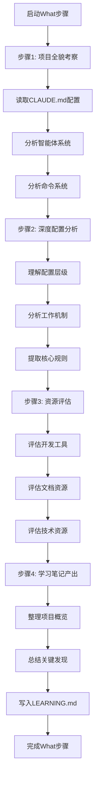

# ASDW学习系统 - What (是什么)

## 📋 指令概述

**ASDW学习系统 - What步骤**是学习流程的第一步，通过全面考察项目现状、深度分析配置体系和系统化评估资源工具，建立完整的项目认知基础，为后续的原因分析和方法制定奠定基础。

### 核心特性
- **全面感知**: 项目全貌的系统化考察
- **深度分析**: CLAUDE.md配置体系的深度理解
- **资源评估**: 工具和资源状况的全面评估
- **目标识别**: 学习目标和技能差距的准确识别

### 应用场景
- 新项目学习和理解
- 系统架构分析和评估
- 技术栈掌握和深化
- 知识体系构建

## 🔄 执行逻辑

### 日期文件夹管理
```yaml
自动创建逻辑:
  1. 获取当前日期 (格式: YYYY-MM-DD, 如: 2025-10-18)
  2. 检查 learning/{今日日期}/ 目录是否存在
  3. 不存在则自动创建
  4. 将学习成果保存到 A_WHAT.md

历史学习检测:
  1. 扫描 learning/ 下的所有日期文件夹
  2. 查找最近7天的 A_WHAT.md 文件
  3. 提取学习主题关键词
  4. 如果发现相同或相似主题，提示用户:
     "⚠️ 检测到 {日期} 已学习过类似主题: {主题名}"
     "是否继续学习? (建议查看历史记录避免重复)"
  5. 用户确认后继续执行

避免重复策略:
  - 每次学习前先检查最近7天的学习记录
  - 显示相关主题的学习日期和文件路径
  - 提供查看历史记录的快捷方式
```

## 🎯 核心功能(四步流程)

### 1. 项目全貌考察
**目标**: 建立对项目的完整认知和全局理解

**研究范围**:
```yaml
核心配置:
  - CLAUDE.md (项目级配置)
  - .claude/CLAUDE.md (用户级配置)
  - .claude/agents/ (智能体系统)
  - .claude/commands/ (命令系统)

项目资源:
  - reports/ (报告和文档)
  - modules/ (Python模块)
  - api/ (API应用)
  - library/ (资源库)

技术架构:
  - 系统架构设计
  - 技术栈组成
  - 工具链配置
  - 集成机制
```

### 2. CLAUDE.md深度分析
**目标**: 深入理解项目的配置体系和工作机制

**分析维度**:
```yaml
配置层级:
  - 机器级配置 (全局设置)
  - 用户级配置 (跨项目设置)
  - 项目级配置 (项目特定设置)

智能体系统:
  - E系列 (AIGC设计智能体)
  - R系列 (Figma协作智能体)
  - Q系列 (智能排版智能体)
  - F系列 (系统工程智能体)

命令系统:
  - Context (上下文管理)
  - Execution (执行控制)
  - Learning (学习系统)
  - Status (状态管理)
  - GitHub (版本控制)
  - System (系统管理)
```

### 3. 资源和工具评估
**目标**: 评估可用资源和工具的状况

**评估维度**:
```yaml
开发工具:
  - 工具链完整性
  - 配置正确性
  - 集成质量
  - 自动化程度

文档资源:
  - 文档完整性
  - 文档准确性
  - 文档可访问性
  - 维护状况

技术资源:
  - API可用性
  - 模块完整性
  - 库资源丰富度
  - 外部依赖状况
```

### 4. 学习笔记产出
**目标**: 将考察结果整理为结构化的学习笔记

**输出位置**: `learning/{今日日期}/A_WHAT.md`
- 格式示例: `learning/2025-10-18/A_WHAT.md`
- 自动创建日期子文件夹
- 避免不同日期的学习内容混淆

**内容结构**:
```markdown
# 📚 学习系统记录

## 🎯 WHAT - 现状考察与目标识别

### 📊 项目概览
[项目整体情况描述]

### 🧠 记忆管理器分析
[CLAUDE.md配置体系分析]

### 📋 报告清单
[reports目录内容分析]

### 🔧 资源评估
[工具和资源状况评估]

### 💡 研究洞察
[关键发现和洞察总结]

## 🔍 WHY - 原因分析
[由S步骤填充]

## 🛠️ HOW - 方法与策略
[由D步骤填充]

## ✨ INTEGRATION - 融会贯通
[由W步骤填充]
```

## 🔧 使用方法

### 不及物动词型（无需参数）

```bash
/A
```

**执行效果**:
- 自动考察项目全貌
- 分析CLAUDE.md配置体系
- 评估资源和工具状况
- 生成结构化学习笔记

## 📊 执行流程



## 🔍 意图解析逻辑

### 研究范围识别
```yaml
自动识别:
  - 项目根目录结构
  - CLAUDE.md文件位置
  - 智能体和命令配置
  - 报告和文档资源

优先级排序:
  1. CLAUDE.md配置体系
  2. 智能体和命令系统
  3. 项目文档和报告
  4. 代码模块和API
```

### 分析深度控制
```yaml
深度分析对象:
  - CLAUDE.md配置文件
  - 智能体配置文件
  - 命令配置文件

概览分析对象:
  - 项目目录结构
  - 文档和报告
  - 代码模块

快速扫描对象:
  - 输入输出目录
  - 临时文件
```

## 🎨 实现细节

### 现状考察方法
```yaml
项目结构分析:
  工具: Glob, Read
  方法: 递归扫描目录结构
  重点: .claude/, reports/, modules/

配置解析:
  工具: Read
  方法: 深度读取配置文件
  重点: YAML front matter, 指令定义

系统理解:
  工具: Read, Grep
  方法: 关联分析和模式识别
  重点: 智能体协作, 命令链路
```

### 评估维度定义
```yaml
技术状态评估:
  - 技术栈成熟度
  - 架构合理性
  - 代码质量水平
  - 性能表现状况

团队状态评估:
  - 技能分布情况
  - 知识分享机制
  - 协作效率水平
  - 学习文化氛围

工具状态评估:
  - 开发工具链完整性
  - 环境配置正确性
  - 自动化程度
  - 工具集成质量

文档状态评估:
  - 文档完整性
  - 文档准确性
  - 文档可访问性
  - 文档维护状况
```

## ⚙️ 配置项

### 系统配置
```yaml
配置版本: v2.0.0
更新时间: 2025-09-30
步骤位置: 第一步 - 现状考察
输出文档: LEARNING.md
```

### 研究范围
```yaml
核心研究对象:
  - CLAUDE.md
  - .claude/CLAUDE.md
  - .claude/agents/
  - .claude/commands/
  - reports/

扩展研究对象:
  - modules/
  - api/
  - library/
  - PRPs/
```

### 输出要求
```yaml
格式: Markdown
位置: learning/{今日日期}/A_WHAT.md
结构: 固定标题化结构
更新方式: 新建或追加到当日文件
日期格式: YYYY-MM-DD (如: 2025-10-18)
```

## 📝 示例场景

### 场景1：新项目学习

**操作**:
```bash
/A
```

**执行过程**:
```
📊 开始项目全貌考察...
   读取 CLAUDE.md...
   分析智能体系统 (37个智能体)...
   分析命令系统 (20个命令)...

🧠 深度分析配置体系...
   配置层级: 3层 (机器级/用户级/项目级)
   智能体分类: 4个系列 (E/R/Q/F)
   命令分类: 6个类别 (Context/Execution/Learning/Status/GitHub/System)

🔧 评估资源和工具...
   开发工具: Git, Python, FastAPI
   文档完整性: 高 (README, CLAUDE.md, reports/)
   技术资源: MCP集成, API模块, 云存储

💡 关键发现:
   - 完整的智能体生态系统
   - 标准化的命令体系
   - 丰富的文档和报告
   - 良好的模块化架构

✅ 学习笔记已生成: LEARNING.md
```

**输出示例** (LEARNING.md):
```markdown
# 📚 学习系统记录

## 🎯 WHAT - 现状考察与目标识别

### 📊 项目概览
本项目是一个基于Claude Code的餐饮数智化平面设计系统，包含：
- 37个专业智能体 (E/R/Q/F四个系列)
- 20个标准化命令 (6大类别)
- 完整的文档和报告体系
- 模块化的API和云存储集成

### 🧠 记忆管理器分析
**配置层级**: 三层架构 (机器级/用户级/项目级)
**智能体系统**:
  - E系列: 9个AIGC设计智能体
  - R系列: 10个Figma协作智能体
  - Q系列: 5个智能排版智能体
  - F系列: 10个系统工程智能体

**命令系统**: 6大类别20个命令
  - Context: 上下文管理 (C/V/X/Z)
  - Execution: 执行控制 (E/F/Q/R)
  - Learning: 学习系统 (A/D/S/W)
  - Status: 状态管理 (B/M/N)
  - GitHub: 版本控制 (G/H/Y)
  - System: 系统管理 (I/O/P/U)

### 📋 报告清单
reports/目录包含7个子类别:
  - analysis/: 数据分析报告
  - deployment/: 部署相关报告
  - design/: 设计文档和规范
  - summary/: 项目总结报告
  - (其他类别...)

### 🔧 资源评估
**开发工具**: Git, Python 3.x, FastAPI, GitHub CLI
**集成服务**: MCP (Context7, Chart, Supabase, COS, GitHub, Chrome)
**模块资源**: 云存储模块, Figma REST API模块
**文档质量**: 高 (完整的README和技术文档)

### 💡 研究洞察
1. **系统化设计**: 智能体和命令系统高度标准化
2. **模块化架构**: 清晰的目录结构和职责分离
3. **文档完善**: 丰富的配置文档和使用指南
4. **生态完整**: 从AIGC生成到Figma协作到智能排版的完整链路
```

### 场景2：系统架构分析

**焦点**: 深度理解智能体系统架构

**执行过程**:
```
🔍 深度分析智能体系统...

E系列 (AIGC设计):
  - E1: 文生图
  - E2: 图生图
  - E3: 图片识别
  - E4-E9: 专业处理 (修复/控制/融合/一致性/迭代/超分)
  - EE: 队长智能体

R系列 (Figma协作):
  - R0: 数据分析
  - R1-R9: 文件/导出/替换/编排/项目/组件/变量/通信/集成
  - RR: 队长智能体

Q系列 (智能排版):
  - Q1-Q5: 菜单/海报/文档/布局/字体
  - QQ: 队长智能体

F系列 (系统工程):
  - F0-F9: 智能体创建/上下文/学习/测试/文档/钩子/模块/API/MCP/OpenAI

📊 架构特点:
  - 队长模式: 每个系列有队长智能体负责调度
  - 职责清晰: 每个智能体专注特定任务
  - 协作机制: 通过队长实现跨智能体协作
  - 可扩展性: 模块化设计易于扩展
```

## 🔍 错误处理

### 常见错误类型

#### 1. CLAUDE.md文件缺失
```yaml
症状: 无法读取CLAUDE.md文件
原因: 文件不存在或路径错误
处理:
  - 检查文件是否存在于项目根目录
  - 确认文件名大小写正确
  - 如果缺失，引导用户创建
```

#### 2. 研究范围过大
```yaml
症状: 分析时间过长或内容过多
原因: 项目规模大或文件过多
处理:
  - 优先分析核心配置文件
  - 对大型目录进行采样分析
  - 提供进度反馈
```

#### 3. 配置格式错误
```yaml
症状: 无法解析YAML配置
原因: 配置文件格式错误
处理:
  - 报告具体的格式错误位置
  - 提供修复建议
  - 继续分析其他可用配置
```

## 📈 性能优化

### 分析效率优化
```yaml
批量读取:
  - 并行读取多个配置文件
  - 使用Glob批量匹配文件
  - 缓存已读取的文件内容

智能采样:
  - 大型目录采样分析
  - 优先分析重要文件
  - 跳过临时和生成文件

渐进式输出:
  - 实时显示分析进度
  - 分段输出发现结果
  - 避免长时间无响应
```

## 🎯 成功标准

### 操作成功标准
```yaml
必达标准:
  ✅ 项目全貌清晰掌握
  ✅ CLAUDE.md深度理解
  ✅ reports目录内容全面分析
  ✅ 智能体和命令系统充分把握
  ✅ 学习笔记完整产出

质量标准:
  ✅ 分析全面系统
  ✅ 发现准确深入
  ✅ 结构清晰规范
  ✅ 洞察有价值
```

### 验证方法
```yaml
完整性检查:
  - 学习目标是否明确具体
  - 技能差距是否准确识别
  - 资源评估是否全面充分
  - 现状分析是否客观真实

准确性验证:
  - 评估结果的准确性
  - 资源可用性的确认
  - 目标可达性的评估
  - 时间安排的合理性
```

## 🔗 相关资源

### 相关指令
- `/S` - ASDW学习系统 - Why (为什么)
- `/D` - ASDW学习系统 - How (怎么办)
- `/W` - ASDW学习系统 - 融会贯通

### 学习系统流程
```yaml
完整流程:
  1. /A - What: 现状考察与目标识别
  2. /S - Why: 原因分析与问题定位
  3. /D - How: 方法制定与策略规划
  4. /W - Integration: 知识整合与方案落地

步骤依赖:
  - S依赖A: 基于现状分析原因
  - D依赖A+S: 基于现状和原因制定方法
  - W依赖A+S+D: 整合所有学习成果
```

## ⚠️ 注意事项

### 使用限制
```yaml
适用场景:
  ✅ 新项目学习和理解
  ✅ 系统架构分析和评估
  ✅ 技术栈掌握和深化
  ✅ 知识体系构建

不适用场景:
  ❌ 简单功能的快速查询
  ❌ 单个文件的详细分析
  ❌ 代码级别的深度审查
```

### 最佳实践
```yaml
执行前:
  - 确保项目结构完整
  - 确认CLAUDE.md文件存在
  - 预留足够分析时间

执行中:
  - 全面感知项目现状
  - 深度分析技术架构和配置体系
  - 系统化评估资源和工具状况
  - 客观准确地识别学习目标和差距

执行后:
  - 验证LEARNING.md生成成功
  - 检查内容完整性和准确性
  - 为后续S步骤准备基础数据
```

### 重要提醒
```yaml
关键原则:
  - 全面性: 不遗漏重要配置和资源
  - 准确性: 客观真实反映项目现状
  - 深度性: 深入理解配置体系和工作机制
  - 系统性: 建立完整的项目认知框架

常见陷阱:
  - 分析过于表面，缺乏深度
  - 遗漏关键配置文件
  - 评估不够客观，带有偏见
  - 学习笔记结构混乱
```

---

**配置版本**: v2.0.0
**更新时间**: 2025-09-30
**目标文档**: LEARNING.md
**维护原则**: 全面感知、深度分析、系统评估