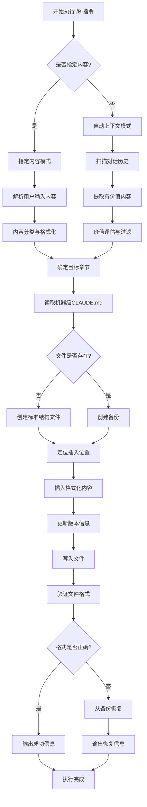

# 机器级CLAUDE.md更新指令 (/B)

## 📋 指令概述

**机器级CLAUDE.md更新指令**是一个专门用于管理和维护机器级Claude配置文件的自动化工具。它负责在全局配置文件（`C:\Users\花小生\.claude\CLAUDE.md`）中记录跨所有框架和项目通用的Claude Code使用规则、开发方法论和通用经验积累。

### 核心特性
- **智能内容分析**: 自动识别内容类型并分类到适当章节
- **自动上下文提取**: 从对话中智能提取关键配置和经验
- **备份保护**: 更新前自动创建备份，确保数据安全
- **格式标准化**: 统一内容格式，保持文档一致性

### 应用场景
- 记录跨项目通用的开发规范和最佳实践
- 管理全局工具配置和API密钥
- 积累技术经验和问题解决方案
- 维护个人开发环境的标准化配置
- 自动同步全局配置到项目级规则

## 🎯 核心功能

### 功能1: 智能内容分析与分类
**目标**: 自动识别用户输入内容的类型和主题，并确定最适合的存放章节

**内容分类逻辑**:
```yaml
配置类内容:
  - 环境变量配置
  - API密钥管理
  - 工具链配置
  - 开发环境设置
  目标章节: "1. 全局配置管理"

规范类内容:
  - 代码风格规范
  - 文档编写标准
  - 版本管理策略
  - 命名约定规则
  目标章节: "2. 跨项目开发规范"

经验类内容:
  - 架构设计模式
  - 性能优化技巧
  - 错误处理策略
  - 调试方法论
  目标章节: "3. 最佳实践库"

工具类内容:
  - IDE配置方案
  - 插件推荐清单
  - 自动化脚本
  - 开发工具链
  目标章节: "4. 工具和插件配置"

学习类内容:
  - 技术学习笔记
  - 问题解决记录
  - 项目经验总结
  - 技能树规划
  目标章节: "5. 学习和经验记录"
```

**分类算法**:
```python
from typing import Dict, List, Optional
from enum import Enum
import re

class ContentCategory(Enum):
    """内容分类枚举"""
    CONFIG = "配置类"
    STANDARD = "规范类"
    PRACTICE = "经验类"
    TOOL = "工具类"
    LEARNING = "学习类"

class ContentClassifier:
    """内容分类器"""

    def __init__(self):
        self.keywords = {
            ContentCategory.CONFIG: [
                "环境变量", "API", "密钥", "配置", "设置",
                "环境", "凭证", "token", "key"
            ],
            ContentCategory.STANDARD: [
                "规范", "标准", "约定", "风格", "格式",
                "命名", "编码", "文档", "注释"
            ],
            ContentCategory.PRACTICE: [
                "最佳实践", "模式", "设计", "优化", "性能",
                "架构", "策略", "方法论", "经验"
            ],
            ContentCategory.TOOL: [
                "工具", "插件", "IDE", "编辑器", "扩展",
                "自动化", "脚本", "辅助"
            ],
            ContentCategory.LEARNING: [
                "学习", "笔记", "总结", "记录", "问题",
                "解决", "调试", "排查"
            ]
        }

    def classify(self, content: str) -> ContentCategory:
        """
        分类内容到最匹配的类别。

        Args:
            content: 待分类的内容文本

        Returns:
            ContentCategory: 内容类别
        """
        scores = {category: 0 for category in ContentCategory}

        # 计算每个类别的匹配分数
        content_lower = content.lower()
        for category, keywords in self.keywords.items():
            for keyword in keywords:
                if keyword in content_lower:
                    scores[category] += 1

        # 返回得分最高的类别
        max_category = max(scores, key=scores.get)

        # 如果没有明确匹配，默认归类为学习类
        if scores[max_category] == 0:
            return ContentCategory.LEARNING

        return max_category

    def get_target_section(self, category: ContentCategory) -> Dict[str, str]:
        """
        获取目标章节信息。

        Args:
            category: 内容类别

        Returns:
            Dict: 包含章节编号、标题和路径的字典
        """
        section_map = {
            ContentCategory.CONFIG: {
                "number": "1",
                "title": "全局配置管理",
                "path": "1. 全局配置管理"
            },
            ContentCategory.STANDARD: {
                "number": "2",
                "title": "跨项目开发规范",
                "path": "2. 跨项目开发规范"
            },
            ContentCategory.PRACTICE: {
                "number": "3",
                "title": "最佳实践库",
                "path": "3. 最佳实践库"
            },
            ContentCategory.TOOL: {
                "number": "4",
                "title": "工具和插件配置",
                "path": "4. 工具和插件配置"
            },
            ContentCategory.LEARNING: {
                "number": "5",
                "title": "学习和经验记录",
                "path": "5. 学习和经验记录"
            }
        }
        return section_map[category]
```

### 功能2: 自动上下文分析与提取
**目标**: 从当前对话中自动识别和提取值得记录的配置、规范和经验

**上下文分析流程**:
```yaml
步骤1 - 对话扫描:
  - 扫描最近N条对话消息（默认N=50）
  - 识别技术讨论和问题解决过程
  - 标记关键配置和决策点

步骤2 - 内容提取:
  - 提取技术解决方案和实现细节
  - 识别配置参数和环境设置
  - 收集工具使用方法和技巧
  - 记录错误处理和调试经验

步骤3 - 价值评估:
  - 评估内容的可复用性
  - 判断是否具有跨项目通用性
  - 确定内容的重要性级别

步骤4 - 格式化输出:
  - 将提取内容转换为标准Markdown格式
  - 添加必要的上下文说明
  - 生成结构化的记录条目
```

**提取算法实现**:
```python
from typing import List, Dict, Any, Optional
from dataclasses import dataclass
from datetime import datetime

@dataclass
class ExtractedContent:
    """提取的内容数据结构"""
    category: ContentCategory
    title: str
    content: str
    context: str
    importance: int  # 1-5, 5最重要
    timestamp: datetime
    tags: List[str]

class ContextAnalyzer:
    """上下文分析器"""

    def __init__(self, conversation_history: List[Dict[str, str]]):
        self.history = conversation_history
        self.classifier = ContentClassifier()

    def extract_valuable_content(
        self,
        min_importance: int = 3
    ) -> List[ExtractedContent]:
        """
        从对话历史中提取有价值的内容。

        Args:
            min_importance: 最小重要性阈值（1-5）

        Returns:
            List[ExtractedContent]: 提取的内容列表
        """
        extracted = []

        # 扫描对话历史
        for i, message in enumerate(self.history):
            # 识别关键消息
            if self._is_valuable_message(message):
                content = self._extract_from_message(message, i)
                if content and content.importance >= min_importance:
                    extracted.append(content)

        return extracted

    def _is_valuable_message(self, message: Dict[str, str]) -> bool:
        """
        判断消息是否包含有价值的内容。

        Args:
            message: 对话消息

        Returns:
            bool: 是否有价值
        """
        valuable_indicators = [
            # 技术实现相关
            "实现", "配置", "设置", "方案", "方法",
            # 问题解决相关
            "解决", "修复", "处理", "调试",
            # 最佳实践相关
            "最佳实践", "建议", "推荐", "规范",
            # 工具使用相关
            "使用", "工具", "插件", "命令"
        ]

        content = message.get('content', '').lower()
        return any(indicator in content for indicator in valuable_indicators)

    def _extract_from_message(
        self,
        message: Dict[str, str],
        index: int
    ) -> Optional[ExtractedContent]:
        """
        从单条消息中提取内容。

        Args:
            message: 对话消息
            index: 消息在历史中的索引

        Returns:
            Optional[ExtractedContent]: 提取的内容，如果无有效内容则返回None
        """
        content_text = message.get('content', '')

        # 分类内容
        category = self.classifier.classify(content_text)

        # 提取标题（使用第一句话或关键词）
        title = self._extract_title(content_text)

        # 获取上下文（前后消息）
        context = self._get_context(index)

        # 评估重要性
        importance = self._evaluate_importance(content_text, context)

        # 提取标签
        tags = self._extract_tags(content_text)

        if not title or len(content_text.strip()) < 20:
            return None

        return ExtractedContent(
            category=category,
            title=title,
            content=content_text,
            context=context,
            importance=importance,
            timestamp=datetime.now(),
            tags=tags
        )

    def _extract_title(self, content: str) -> str:
        """从内容中提取标题"""
        # 使用第一句话作为标题
        lines = content.strip().split('\n')
        first_line = lines[0].strip()

        # 限制标题长度
        if len(first_line) > 60:
            first_line = first_line[:57] + "..."

        return first_line

    def _get_context(self, index: int, window: int = 2) -> str:
        """获取消息的上下文"""
        start = max(0, index - window)
        end = min(len(self.history), index + window + 1)

        context_messages = self.history[start:end]
        return "\n".join([
            f"{msg.get('role', 'unknown')}: {msg.get('content', '')[:100]}"
            for msg in context_messages
        ])

    def _evaluate_importance(self, content: str, context: str) -> int:
        """评估内容重要性（1-5）"""
        score = 3  # 基础分数

        # 高价值指标
        high_value_keywords = [
            "关键", "重要", "必须", "核心", "critical", "important"
        ]
        if any(kw in content.lower() for kw in high_value_keywords):
            score += 1

        # 实现细节指标
        if "代码" in content or "```" in content:
            score += 1

        # 问题解决指标
        if "解决" in content and "问题" in content:
            score += 1

        return min(5, score)  # 最高5分

    def _extract_tags(self, content: str) -> List[str]:
        """提取内容标签"""
        tags = []

        # 技术栈标签
        tech_keywords = [
            "python", "fastapi", "figma", "api", "docker",
            "git", "bash", "yaml", "json"
        ]
        for tech in tech_keywords:
            if tech in content.lower():
                tags.append(tech)

        # 类型标签
        if "配置" in content:
            tags.append("配置")
        if "规范" in content:
            tags.append("规范")
        if "最佳实践" in content:
            tags.append("最佳实践")

        return tags[:5]  # 最多5个标签
```


## 🔧 使用方法

### 方式1: 指定内容更新（及物动词型）
**语法**: `/B <具体内容>`

**功能**: 直接指定要添加到机器级CLAUDE.md的内容

**示例场景**:

```markdown
示例1 - 添加API配置规范:
/B API密钥管理：使用环境变量存储敏感信息，避免硬编码。推荐使用python-dotenv加载.env文件

示例2 - 记录代码审查规范:
/B 代码审查规范：每个PR必须至少有一个reviewer批准才能合并。重要功能需要架构师review

示例3 - 添加虚拟环境最佳实践:
/B Python项目虚拟环境管理：统一使用venv模块创建虚拟环境，目录命名为.venv，并添加到.gitignore

示例4 - 记录工具配置:
/B VSCode配置：开启format on save，使用black作为默认formatter，配置pylint为linter
```

**执行流程**:
```yaml
1. 内容分析: 识别内容类型（配置/规范/经验/工具）
2. 章节定位: 确定目标章节（如"1. 全局配置管理"）
3. 格式优化: 转换为标准Markdown格式
4. 内容插入: 添加到目标章节，保持结构清晰
```

### 方式2: 自动上下文分析（不及物动词型）
**语法**: `/B`

**功能**: 自动分析当前对话上下文，提取关键信息并更新到机器级CLAUDE.md

**自动提取内容类型**:
```yaml
技术解决方案:
  - 问题诊断方法
  - 解决方案实现
  - 关键代码片段
  - 技术选型依据

开发规范:
  - 编码风格约定
  - 文档编写标准
  - 版本管理策略
  - 命名规则

工具配置:
  - IDE配置方案
  - 插件推荐
  - 命令行工具
  - 自动化脚本

调试经验:
  - 常见错误处理
  - 调试技巧
  - 性能优化方法
  - 故障排查流程
```

**执行流程**:
```yaml
1. 上下文扫描: 分析最近50条对话消息
2. 价值评估: 识别可复用的配置和经验（重要性≥3）
3. 内容提取: 提取关键信息并格式化
4. 智能分类: 自动归类到适当章节
5. 批量更新: 将所有提取内容添加到文件
```

**使用场景**:
```markdown
场景1 - 技术讨论后自动记录:
用户: 我们刚才讨论了FastAPI的配置优化方法
助手: [分析对话，提取配置方法]
用户: /B
助手: ✅ 已自动提取3条配置优化经验，更新到机器级CLAUDE.md

场景2 - 问题解决后自动沉淀:
用户: 终于解决了Docker网络问题
助手: [记录解决方案]
用户: /B
助手: ✅ 已记录Docker网络配置最佳实践到机器级CLAUDE.md
```

## 📊 执行流程



## 🔍 意图解析逻辑

### 内容类型识别
```yaml
配置类内容识别:
  关键词:
    - "环境变量", "API", "密钥", "配置"
    - "设置", "参数", "凭证", "token"
  特征:
    - 包含具体的配置项名称
    - 涉及系统环境和工具链
    - 包含key-value对
  目标章节: "1. 全局配置管理"

规范类内容识别:
  关键词:
    - "规范", "标准", "约定", "风格"
    - "格式", "命名", "编码", "文档"
  特征:
    - 定义应该遵循的规则
    - 包含"必须"、"应该"等约束性词汇
    - 定义团队协作标准
  目标章节: "2. 跨项目开发规范"

经验类内容识别:
  关键词:
    - "最佳实践", "模式", "设计", "优化"
    - "性能", "架构", "策略", "方法论"
  特征:
    - 包含实现方法和技巧
    - 描述问题解决过程
    - 提供具体示例和代码
  目标章节: "3. 最佳实践库"

工具类内容识别:
  关键词:
    - "工具", "插件", "IDE", "编辑器"
    - "扩展", "自动化", "脚本"
  特征:
    - 涉及开发工具配置
    - 包含工具使用方法
    - 提供工具推荐
  目标章节: "4. 工具和插件配置"

学习类内容识别:
  关键词:
    - "学习", "笔记", "总结", "记录"
    - "问题", "解决", "调试"
  特征:
    - 记录学习过程
    - 问题排查经验
    - 技术探索笔记
  目标章节: "5. 学习和经验记录"
```

### 插入位置策略
```yaml
新内容插入规则:
  章节内为空:
    - 直接在章节标题下插入
    - 作为第一个条目

  章节内有内容:
    - 按时间顺序插入（最新在最前）
    - 如有子章节，插入到相关子章节
    - 保持条目间的空行

  相似内容存在:
    - 检测是否有重复或相似内容
    - 如果相似度>80%，合并而非重复插入
    - 如果是补充信息，追加到原有内容

  内容组织:
    - 同类内容分组
    - 使用二级或三级标题组织
    - 保持文档结构清晰
```

### 自动上下文提取策略
```yaml
对话扫描范围:
  - 扫描最近50条消息（可配置）
  - 包含用户消息和助手回复
  - 识别完整的对话主题

价值评估标准:
  高价值内容（重要性5）:
    - 包含完整的问题解决方案
    - 涉及关键配置和架构决策
    - 包含可复用的代码实现

  中等价值内容（重要性3-4）:
    - 记录具体的技术实现
    - 包含工具使用技巧
    - 描述开发规范

  低价值内容（重要性1-2）:
    - 一般性讨论
    - 临时性问题
    - 不具备复用价值

提取阈值:
  - 默认只提取重要性≥3的内容
  - 用户可通过参数调整阈值
  - 每次最多提取10条内容

格式化规则:
  - 自动生成描述性标题
  - 添加必要的上下文说明
  - 转换为标准Markdown格式
  - 提取代码片段并添加语言标识
```

## 🎨 实现细节

### 机器级CLAUDE.md标准结构
```markdown
---
name: Claude Global Configuration
description: Machine-level Claude AI assistant configuration
version: 1.0
last_updated: YYYY-MM-DD
---

# 1. 全局配置管理

## 1.1 开发环境配置
```yaml
环境变量管理:
  - 使用.env文件存储敏感配置
  - 通过python-dotenv加载环境变量
  - 不同环境使用不同的.env文件
```

## 1.2 工具链配置
```yaml
Python工具链:
  - 包管理: pip + requirements.txt
  - 虚拟环境: venv (.venv目录)
  - 格式化: black
  - 类型检查: mypy
```

## 1.3 API密钥管理
```yaml
密钥存储规范:
  - 使用环境变量，避免硬编码
  - 密钥文件添加到.gitignore
  - 定期轮换重要API密钥
```

# 2. 跨项目开发规范

## 2.1 代码规范
```yaml
Python代码规范:
  - 遵循PEP 8标准
  - 强制使用类型提示
  - 函数必须有docstring
  - 使用black自动格式化
```

## 2.2 文档规范
```yaml
文档编写标准:
  - README使用标准模板
  - 代码注释使用Google风格
  - API文档自动生成
  - 及时更新变更日志
```

## 2.3 版本管理规范
```yaml
Git工作流:
  - 主分支: main
  - 功能分支: feature/*
  - 修复分支: fix/*
  - 提交信息遵循约定式提交
```

# 3. 最佳实践库

## 3.1 架构设计模式
```yaml
常用设计模式:
  - 工厂模式: 对象创建
  - 策略模式: 算法封装
  - 观察者模式: 事件驱动
  - 依赖注入: 解耦合
```

## 3.2 性能优化经验
```yaml
优化技巧:
  - 使用异步I/O（asyncio）
  - 数据库连接池
  - 缓存热点数据
  - 批量处理操作
```

## 3.3 错误处理策略
```yaml
错误处理原则:
  - 使用自定义异常类
  - 记录详细的错误日志
  - 优雅降级处理
  - 提供用户友好的错误信息
```

# 4. 工具和插件配置

## 4.1 IDE配置
```yaml
VSCode配置:
  - 自动保存: enabled
  - 格式化: format on save
  - Linter: pylint + flake8
  - 主题: One Dark Pro
```

## 4.2 扩展插件
```yaml
推荐插件:
  - Python: 官方Python扩展
  - Pylance: 智能提示
  - GitLens: Git增强
  - Docker: 容器管理
```

## 4.3 自动化工具
```yaml
自动化脚本:
  - pre-commit hooks
  - 自动测试脚本
  - 部署脚本
  - 代码生成工具
```

# 5. 学习和经验记录

## 5.1 技术学习笔记
```yaml
学习路径:
  - 记录学习计划
  - 保存学习笔记
  - 整理学习资源
  - 定期复习总结
```

## 5.2 问题解决记录
```yaml
问题记录格式:
  - 问题描述
  - 问题原因
  - 解决方案
  - 防止措施
```

## 5.3 项目经验总结
```yaml
项目复盘:
  - 技术选型回顾
  - 架构设计评估
  - 性能优化总结
  - 经验教训提炼
```
```

### 文件操作与备份
```python
import shutil
from datetime import datetime
from pathlib import Path
from typing import Optional

class FileManager:
    """文件管理器"""

    def __init__(self, file_path: Path):
        self.file_path = file_path
        self.backup_dir = file_path.parent / "backups"

    def create_backup(self) -> Optional[Path]:
        """
        创建文件备份。

        Returns:
            Optional[Path]: 备份文件路径，失败返回None
        """
        if not self.file_path.exists():
            return None

        # 创建备份目录
        self.backup_dir.mkdir(exist_ok=True)

        # 生成备份文件名（包含时间戳）
        timestamp = datetime.now().strftime("%Y%m%d_%H%M%S")
        backup_name = f"{self.file_path.stem}_{timestamp}{self.file_path.suffix}"
        backup_path = self.backup_dir / backup_name

        # 复制文件
        try:
            shutil.copy2(self.file_path, backup_path)
            return backup_path
        except Exception as e:
            print(f"备份失败: {e}")
            return None

    def restore_from_backup(self, backup_path: Path) -> bool:
        """
        从备份恢复文件。

        Args:
            backup_path: 备份文件路径

        Returns:
            bool: 是否成功恢复
        """
        try:
            shutil.copy2(backup_path, self.file_path)
            return True
        except Exception as e:
            print(f"恢复失败: {e}")
            return False

    def list_backups(self) -> List[Path]:
        """
        列出所有备份文件。

        Returns:
            List[Path]: 备份文件列表（按时间倒序）
        """
        if not self.backup_dir.exists():
            return []

        backups = list(self.backup_dir.glob(f"{self.file_path.stem}_*{self.file_path.suffix}"))
        return sorted(backups, key=lambda p: p.stat().st_mtime, reverse=True)

    def clean_old_backups(self, keep_count: int = 10) -> int:
        """
        清理旧备份，保留最新的N个。

        Args:
            keep_count: 保留的备份数量

        Returns:
            int: 删除的备份数量
        """
        backups = self.list_backups()
        if len(backups) <= keep_count:
            return 0

        # 删除多余的备份
        deleted = 0
        for backup in backups[keep_count:]:
            try:
                backup.unlink()
                deleted += 1
            except Exception as e:
                print(f"删除备份失败 {backup}: {e}")

        return deleted
```

### 内容验证与格式化
```python
import re
from typing import Dict, List, Tuple

class ContentValidator:
    """内容验证器"""

    def validate_markdown(self, content: str) -> Tuple[bool, List[str]]:
        """
        验证Markdown格式。

        Args:
            content: Markdown内容

        Returns:
            Tuple[bool, List[str]]: (是否有效, 错误列表)
        """
        errors = []

        # 检查标题层级
        if not self._check_heading_hierarchy(content):
            errors.append("标题层级不连续")

        # 检查代码块闭合
        if not self._check_code_blocks(content):
            errors.append("代码块未正确闭合")

        # 检查列表格式
        if not self._check_list_format(content):
            errors.append("列表格式不规范")

        return len(errors) == 0, errors

    def _check_heading_hierarchy(self, content: str) -> bool:
        """检查标题层级是否连续"""
        headings = re.findall(r'^(#{1,6})\s', content, re.MULTILINE)

        for i in range(1, len(headings)):
            prev_level = len(headings[i-1])
            curr_level = len(headings[i])

            # 层级不应该跳跃超过1
            if curr_level - prev_level > 1:
                return False

        return True

    def _check_code_blocks(self, content: str) -> bool:
        """检查代码块是否正确闭合"""
        # 统计反引号对
        code_blocks = re.findall(r'```', content)
        return len(code_blocks) % 2 == 0

    def _check_list_format(self, content: str) -> bool:
        """检查列表格式"""
        # 检查列表项是否有正确的缩进
        list_items = re.findall(r'^(\s*)([-*+]|\d+\.)\s', content, re.MULTILINE)

        # 简单检查：缩进应该是2或4的倍数
        for indent, marker in list_items:
            if len(indent) % 2 != 0:
                return False

        return True

class ContentFormatter:
    """内容格式化器"""

    def format_content(self, content: str, category: ContentCategory) -> str:
        """
        格式化内容。

        Args:
            content: 原始内容
            category: 内容类别

        Returns:
            str: 格式化后的内容
        """
        # 添加日期标记
        formatted = f"🕐 {datetime.now().strftime('%Y-%m-%d')} "

        # 根据类别添加标识符
        category_markers = {
            ContentCategory.CONFIG: "⚙️ 配置",
            ContentCategory.STANDARD: "📏 规范",
            ContentCategory.PRACTICE: "💡 最佳实践",
            ContentCategory.TOOL: "🔧 工具",
            ContentCategory.LEARNING: "📚 学习"
        }

        formatted += f"{category_markers[category]}: "

        # 提取或生成标题
        title = self._extract_title(content)
        formatted += f"{title}\n"

        # 格式化内容主体
        body = self._format_body(content)
        formatted += body

        return formatted

    def _extract_title(self, content: str) -> str:
        """提取或生成标题"""
        lines = content.strip().split('\n')
        first_line = lines[0].strip()

        # 如果第一行是标题，去掉#号
        if first_line.startswith('#'):
            return first_line.lstrip('#').strip()

        # 否则使用第一句话
        first_sentence = first_line.split('。')[0].split('.')[0]
        return first_sentence[:60]  # 限制长度

    def _format_body(self, content: str) -> str:
        """格式化内容主体"""
        # 移除第一行（已用作标题）
        lines = content.strip().split('\n')[1:]
        body = '\n'.join(lines)

        # 确保代码块有语言标识
        body = self._add_code_language(body)

        # 规范化列表格式
        body = self._normalize_lists(body)

        return body

    def _add_code_language(self, content: str) -> str:
        """为代码块添加语言标识"""
        # 查找没有语言标识的代码块
        pattern = r'```\n'
        replacement = '```python\n'  # 默认使用python

        return re.sub(pattern, replacement, content)

    def _normalize_lists(self, content: str) -> str:
        """规范化列表格式"""
        # 统一使用 - 作为无序列表标记
        content = re.sub(r'^(\s*)[*+]\s', r'\1- ', content, flags=re.MULTILINE)

        return content
```

## ⚙️ 配置项

### 系统配置
```yaml
配置版本: v2.0.0
更新时间: 2025-09-30

文件路径:
  机器级CLAUDE.md:
    Windows: C:\Users\[用户名]\.claude\CLAUDE.md
    Unix/Linux: ~/.claude/CLAUDE.md

文件编码: UTF-8
备份策略:
  启用自动备份: true
  保留备份数量: 10
  备份目录: .claude/backups/
```

### 内容提取配置
```yaml
上下文分析:
  扫描范围: 50  # 最近N条消息
  重要性阈值: 3  # 1-5，只提取≥阈值的内容
  最大提取数量: 10  # 每次最多提取N条

内容分类:
  关键词匹配: true
  使用机器学习: false  # 未来功能
  人工确认: false  # 自动模式下不需要

格式化选项:
  自动添加标题: true
  添加时间戳: true
  添加类别标识: true
  规范化代码块: true
```


## 📝 示例场景

### 场景1: 添加API配置规范
**操作**:
```
/B API密钥管理最佳实践：
1. 使用环境变量存储所有敏感信息
2. 通过python-dotenv加载.env文件
3. 不同环境使用不同的配置文件（.env.dev, .env.prod）
4. .env文件必须添加到.gitignore
5. 提供.env.example作为模板
```

**执行过程**:
```yaml
步骤1 - 内容分析:
  - 识别为"配置类"内容
  - 包含API、环境变量等关键词
  - 提供了具体的实践建议

步骤2 - 章节定位:
  - 目标章节: "1. 全局配置管理"
  - 子章节: "1.3 API密钥管理"

步骤3 - 格式化:
  - 添加日期标记: 🕐 2025-09-30
  - 添加类别标识: ⚙️ 配置
  - 规范化列表格式

步骤4 - 内容插入:
  - 插入到"1.3 API密钥管理"子章节
  - 保持与现有内容的一致性

步骤5 - 自动同步:
  - 读取更新后的机器级CLAUDE.md
  - 同步到项目MACHINE.md
  - 验证同步结果
```

**执行结果**:
```
✅ 内容已添加到机器级CLAUDE.md
   章节: 1. 全局配置管理 > 1.3 API密钥管理
   条目: API密钥管理最佳实践

✅ 已自动同步到项目MACHINE.md
   源文件: C:\Users\花小生\.claude\CLAUDE.md
   目标文件: .augment\rules\MACHINE.md
   同步时间: 2025-09-30 14:30:25
```

### 场景2: 自动提取对话经验
**对话内容**:
```
用户: FastAPI的依赖注入系统应该怎么设计？
助手: [详细讲解依赖注入的最佳实践]
用户: 明白了，那数据库连接应该如何管理？
助手: [解释数据库连接池和会话管理]
用户: /B
```

**执行过程**:
```yaml
步骤1 - 上下文扫描:
  - 扫描最近对话（约10条消息）
  - 识别关键主题: FastAPI依赖注入、数据库连接

步骤2 - 内容提取:
  提取内容1:
    标题: FastAPI依赖注入最佳实践
    类别: 最佳实践类
    重要性: 4/5
    内容: [依赖注入设计方法]

  提取内容2:
    标题: FastAPI数据库连接池管理
    类别: 配置类
    重要性: 4/5
    内容: [连接池配置和会话管理]

步骤3 - 格式化与分类:
  - 内容1 → "3. 最佳实践库 > 3.1 架构设计模式"
  - 内容2 → "1. 全局配置管理 > 1.1 开发环境配置"

步骤4 - 批量更新:
  - 将两条内容分别插入对应章节
  - 保持格式一致性
```

**执行结果**:
```
✅ 自动提取并记录了2条经验:

1️⃣ FastAPI依赖注入最佳实践
   章节: 3. 最佳实践库 > 3.1 架构设计模式
   重要性: ⭐⭐⭐⭐

2️⃣ FastAPI数据库连接池管理
   章节: 1. 全局配置管理 > 1.1 开发环境配置
   重要性: ⭐⭐⭐⭐
```

### 场景3: 记录工具配置
**操作**:
```
/B VSCode Python开发环境配置：
- 安装Python官方扩展
- 配置pylint和flake8作为linter
- 设置black为默认formatter
- 启用format on save
- 配置测试发现: pytest
```

**执行结果**:
```
✅ 内容已添加到机器级CLAUDE.md
   章节: 4. 工具和插件配置 > 4.1 IDE配置
   条目: VSCode Python开发环境配置
```

### 场景4: 问题解决记录
**操作**:
```
/B Docker网络问题排查经验：
问题: 容器间无法通信
原因: 使用了默认bridge网络，容器名称解析失败
解决方案:
1. 创建自定义网络: docker network create app-network
2. 启动容器时指定网络: --network app-network
3. 使用容器名称而非IP进行通信
4. 在docker-compose.yml中定义网络
```

**执行结果**:
```
✅ 内容已添加到机器级CLAUDE.md
   章节: 5. 学习和经验记录 > 5.2 问题解决记录
   条目: Docker网络问题排查经验
```

## 🔍 错误处理

### 错误类型1: 文件不存在
```yaml
症状: 机器级CLAUDE.md文件不存在
原因: 首次使用，文件尚未创建
处理:
  1. 自动创建标准结构的新文件
  2. 添加YAML front matter
  3. 创建5个主要章节
  4. 写入用户指定的内容
```

**自动创建的文件结构**:
```markdown
---
name: Claude Global Configuration
description: Machine-level Claude AI assistant configuration
version: 1.0
last_updated: 2025-09-30
---

# 1. 全局配置管理
## 1.1 开发环境配置
## 1.2 工具链配置
## 1.3 API密钥管理

# 2. 跨项目开发规范
## 2.1 代码规范
## 2.2 文档规范
## 2.3 版本管理规范

# 3. 最佳实践库
## 3.1 架构设计模式
## 3.2 性能优化经验
## 3.3 错误处理策略

# 4. 工具和插件配置
## 4.1 IDE配置
## 4.2 扩展插件
## 4.3 自动化工具

# 5. 学习和经验记录
## 5.1 技术学习笔记
## 5.2 问题解决记录
## 5.3 项目经验总结
```

### 错误类型2: 权限不足
```yaml
症状: 无法写入机器级CLAUDE.md
原因: 文件权限设置为只读，或目录权限不足
处理:
  1. 检查文件和目录权限
  2. 尝试使用管理员权限
  3. 如果仍失败，提示用户手动修改权限
  4. 提供详细的权限设置指南
```

**错误消息示例**:
```
❌ 无法写入机器级CLAUDE.md
   原因: 权限不足（只读文件）

📝 解决方案:
1. Windows系统:
   - 右键点击文件 → 属性
   - 取消勾选"只读"属性
   - 点击"应用"

2. Unix/Linux系统:
   - chmod 644 ~/.claude/CLAUDE.md

🔍 如果问题持续，请检查:
   - 目录权限: ~/.claude/ 需要写入权限
   - 文件所有者: 确保你是文件所有者
   - 磁盘空间: 确保有足够的可用空间
```

### 错误类型3: 格式错误
```yaml
症状: 更新后的文件格式不正确
原因:
  - Markdown语法错误
  - YAML front matter格式错误
  - 标题层级不连续
处理:
  1. 运行格式验证
  2. 识别具体错误位置
  3. 自动修复常见格式问题
  4. 如无法自动修复，从备份恢复
  5. 提供详细的错误报告
```

**自动修复示例**:
```python
def auto_fix_common_issues(content: str) -> Tuple[str, List[str]]:
    """
    自动修复常见格式问题。

    Args:
        content: 原始内容

    Returns:
        Tuple[str, List[str]]: (修复后的内容, 修复说明列表)
    """
    fixes = []
    fixed_content = content

    # 修复1: 确保代码块闭合
    code_blocks = re.findall(r'```', fixed_content)
    if len(code_blocks) % 2 != 0:
        fixed_content += '\n```\n'
        fixes.append("添加缺失的代码块结束标记")

    # 修复2: 规范化列表标记
    fixed_content = re.sub(
        r'^(\s*)[*+]\s',
        r'\1- ',
        fixed_content,
        flags=re.MULTILINE
    )
    fixes.append("统一列表标记为 -")

    # 修复3: 移除多余的空行
    fixed_content = re.sub(r'\n{4,}', '\n\n\n', fixed_content)
    fixes.append("移除多余的空行")

    # 修复4: 确保标题前后有空行
    fixed_content = re.sub(
        r'([^\n])\n(#{1,6}\s)',
        r'\1\n\n\2',
        fixed_content
    )
    fixes.append("确保标题前有空行")

    return fixed_content, fixes
```

### 错误类型4: 内容冲突
```yaml
症状: 尝试添加的内容与现有内容相似或重复
原因: 相同或相似的经验已经记录
处理:
  1. 计算内容相似度
  2. 如果相似度>80%，提示用户
  3. 提供选项: 合并/跳过/强制添加
  4. 智能合并相似内容
```

**相似度检测**:
```python
from difflib import SequenceMatcher

def calculate_similarity(text1: str, text2: str) -> float:
    """
    计算两段文本的相似度。

    Args:
        text1: 第一段文本
        text2: 第二段文本

    Returns:
        float: 相似度（0.0-1.0）
    """
    return SequenceMatcher(None, text1.lower(), text2.lower()).ratio()

def check_duplicate(
    new_content: str,
    existing_contents: List[str],
    threshold: float = 0.8
) -> Tuple[bool, Optional[int]]:
    """
    检查内容是否重复。

    Args:
        new_content: 新内容
        existing_contents: 现有内容列表
        threshold: 相似度阈值

    Returns:
        Tuple[bool, Optional[int]]: (是否重复, 重复内容的索引)
    """
    for i, existing in enumerate(existing_contents):
        similarity = calculate_similarity(new_content, existing)
        if similarity >= threshold:
            return True, i

    return False, None
```

## 📈 性能优化

### 文件读写优化
```yaml
缓存策略:
  - 缓存最近读取的文件内容
  - 缓存过期时间: 60秒
  - 文件修改时自动失效缓存

批量操作:
  - 合并多次小写入为一次大写入
  - 批量处理多条提取内容

增量更新:
  - 只更新变更的章节
  - 避免重写整个文件
```

**缓存实现**:
```python
from functools import lru_cache
from pathlib import Path
from typing import Optional
import time

class CachedFileReader:
    """带缓存的文件读取器"""

    def __init__(self, cache_timeout: int = 60):
        self.cache_timeout = cache_timeout
        self._cache: Dict[str, Tuple[str, float]] = {}

    def read(self, file_path: Path) -> Optional[str]:
        """
        读取文件（带缓存）。

        Args:
            file_path: 文件路径

        Returns:
            Optional[str]: 文件内容
        """
        file_key = str(file_path)

        # 检查缓存
        if file_key in self._cache:
            content, cache_time = self._cache[file_key]

            # 检查文件是否被修改
            if not self._is_file_modified(file_path, cache_time):
                # 缓存仍然有效
                if time.time() - cache_time < self.cache_timeout:
                    return content

        # 读取文件
        try:
            content = file_path.read_text(encoding='utf-8')
            self._cache[file_key] = (content, time.time())
            return content
        except Exception as e:
            print(f"读取文件失败: {e}")
            return None

    def _is_file_modified(self, file_path: Path, cache_time: float) -> bool:
        """检查文件是否在缓存后被修改"""
        try:
            mtime = file_path.stat().st_mtime
            return mtime > cache_time
        except:
            return True

    def invalidate(self, file_path: Path):
        """使指定文件的缓存失效"""
        file_key = str(file_path)
        if file_key in self._cache:
            del self._cache[file_key]

    def clear(self):
        """清空所有缓存"""
        self._cache.clear()
```

### 上下文分析优化
```yaml
并行处理:
  - 并行扫描多个对话分支
  - 并行执行内容分类

智能过滤:
  - 早期过滤低价值内容
  - 避免处理无关消息

增量分析:
  - 只分析新增的对话
  - 缓存已分析的内容
```

### 同步操作优化
```yaml
异步I/O:
  - 使用asyncio进行异步文件操作
  - 避免阻塞主线程

批量同步:
  - 合并多次更新的同步操作
  - 减少文件写入次数

条件同步:
  - 仅在内容实际变更时同步
  - 跳过无变化的同步
```

**异步同步实现**:
```python
import asyncio
import aiofiles
from pathlib import Path

class AsyncSynchronizer:
    """异步同步器"""

    async def sync_async(
        self,
        source_path: Path,
        target_path: Path
    ) -> Dict[str, Any]:
        """
        异步执行同步操作。

        Args:
            source_path: 源文件路径
            target_path: 目标文件路径

        Returns:
            Dict: 同步结果
        """
        try:
            # 异步读取源文件
            async with aiofiles.open(source_path, 'r', encoding='utf-8') as f:
                source_content = await f.read()

            # 检查是否需要同步
            if await self._should_sync(target_path, source_content):
                # 异步写入目标文件
                target_path.parent.mkdir(parents=True, exist_ok=True)
                async with aiofiles.open(target_path, 'w', encoding='utf-8') as f:
                    await f.write(source_content)

                return {
                    "success": True,
                    "action": "synced",
                    "size": len(source_content)
                }
            else:
                return {
                    "success": True,
                    "action": "skipped",
                    "reason": "content unchanged"
                }

        except Exception as e:
            return {
                "success": False,
                "error": str(e)
            }

    async def _should_sync(
        self,
        target_path: Path,
        source_content: str
    ) -> bool:
        """检查是否需要同步"""
        if not target_path.exists():
            return True

        try:
            async with aiofiles.open(target_path, 'r', encoding='utf-8') as f:
                target_content = await f.read()

            # 比较内容（忽略front matter）
            source_body = self._remove_front_matter(source_content)
            target_body = self._remove_front_matter(target_content)

            return source_body != target_body

        except:
            return True
```

## 🎯 成功标准

### 操作成功标准
```yaml
内容更新成功:
  ✅ 内容已正确分类
  ✅ 内容已写入目标章节
  ✅ 文件格式验证通过
  ✅ 版本信息已更新
  ✅ 备份已创建

同步成功:
  ✅ 内容已同步到项目MACHINE.md
  ✅ 目标文件格式正确
  ✅ 两个文件内容一致
  ✅ 同步时间已记录
```

### 质量标准
```yaml
内容质量:
  ✅ 格式规范统一
  ✅ 信息完整准确
  ✅ 分类合理清晰
  ✅ 便于后续查找

文件质量:
  ✅ Markdown格式正确
  ✅ 标题层级合理
  ✅ 代码块正确标识
  ✅ 链接有效可用

同步质量:
  ✅ 两文件内容一致
  ✅ 同步及时准确
  ✅ 无数据丢失
  ✅ 格式保持完整
```

## 🔗 相关资源

### 相关指令
- `/M` - 项目级CLAUDE.md更新指令
- `/N` - 用户级CLAUDE.md更新指令
- `/Z` - 操作经验记录
- `/X` - 错误修复记录

### 配置文件结构参考
```
C:\Users\花小生\.claude\
├── CLAUDE.md           # 机器级配置（本指令管理）
├── backups/            # 备份目录
│   ├── CLAUDE_20250930_143025.md
│   ├── CLAUDE_20250930_150512.md
│   └── ...
└── settings.json       # Claude Code配置

项目目录\
├── .claude\
│   └── CLAUDE.md       # 用户级配置
└── CLAUDE.md           # 项目级配置
```

### 文档格式参考
```markdown
# 标准条目格式

🕐 2025-09-30 ⚙️ 配置: API密钥管理最佳实践

**场景**: 所有涉及API调用的项目

**实践**:
1. 使用环境变量存储API密钥
2. 通过python-dotenv加载配置
3. 不同环境使用不同的.env文件
4. 将.env添加到.gitignore

**示例**:
```python
from dotenv import load_dotenv
import os

load_dotenv()
api_key = os.getenv('API_KEY')
```

**注意事项**:
- 定期轮换重要密钥
- 使用密钥管理服务（如AWS Secrets Manager）
- 监控密钥使用情况
```

## ⚠️ 注意事项

### 使用限制
```yaml
文件系统限制:
  - 确保有足够的磁盘空间（建议>100MB）
  - 避免在文件被占用时执行更新
  - 定期清理旧备份（默认保留10个）

权限要求:
  - 机器级CLAUDE.md需要读写权限
  - 项目MACHINE.md需要写入权限
  - 备份目录需要创建权限

并发控制:
  - 避免同时在多个项目中执行/B
  - 确保一次只有一个进程修改文件
```

### 最佳实践
```yaml
内容组织:
  - 使用描述性标题便于查找
  - 避免重复添加相似内容
  - 定期整理和归类相关内容
  - 及时删除过时的配置

质量控制:
  - 添加内容前先搜索是否已存在
  - 保持内容的时效性和准确性
  - 定期review和更新旧内容
  - 使用标签和分类便于管理

安全注意:
  - 不要记录敏感的密钥和密码
  - 涉及敏感信息时使用环境变量引用
  - 定期检查是否有敏感信息泄露
  - 备份文件也要注意安全性
```

### 维护建议
```yaml
定期维护:
  每周:
    - 检查新增内容的合理性
    - 清理重复或过时的条目

  每月:
    - 整理和归类内容
    - 更新过时的最佳实践
    - 清理过期的备份文件

  每季度:
    - 全面review文档结构
    - 优化章节组织
    - 更新配置版本

版本管理:
  - 重大结构调整时更新主版本号
  - 内容更新时更新次版本号
  - 修复错误时更新修订号
  - 在front matter中记录版本历史
```

---

**配置版本**: v3.0.0
**更新时间**: 2025-10-06
**更新内容**: 明确机器级范围，聚焦跨所有框架和项目的全局Claude Code使用规则和通用方法论
**维护原则**: 跨项目通用配置的集中管理