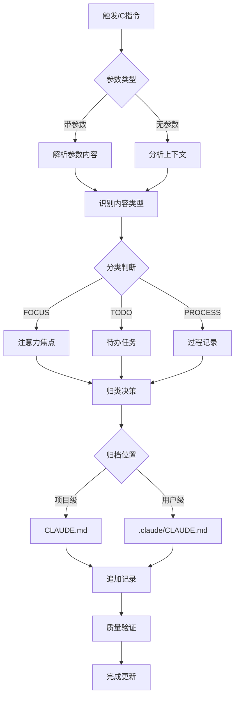

# /C - 注意力控制

## 📋 指令概述

**注意力控制系统**是一个基于文档化结构的有机生长记忆管理工具，通过FOCUS/TODO/PROCESS三大核心模块，实现注意力的结构化管理和持续演进。系统采用时间线驱动的追加式更新模式，确保记忆的完整性和可追溯性。

**核心特性**:
- 📝 有机生长的文档结构
- ⏰ 时间线驱动的记忆演进
- 🎯 三大核心模块: FOCUS/TODO/PROCESS
- 🧠 智能归类决策机制
- 📊 多维度质量评估体系

## 🎯 核心功能(三步流程)

### 1. 信息捕获与分类
- **内容识别**: 自动识别对话中的关键信息点
- **分类判断**: 根据内容性质分类为FOCUS/TODO/PROCESS
- **优先级评估**: 分析信息的重要性和紧急程度
- **时间戳标记**: 为每条记录添加精确时间戳

### 2. 结构化存储
- **多行参数格式**: 采用结构化的多行参数模板
- **视觉符号增强**: 使用标准化emoji符号提升可读性
- **元数据完整**: 包含类型、优先级、状态等完整元数据
- **有机生长模式**: 新内容追加到相应部分，保持时间顺序

### 3. 智能归类决策
- **项目级归档**: 团队共同焦点和流程归入项目级CLAUDE.md
- **用户级归档**: 个人工作流和待办归入用户级.claude/CLAUDE.md
- **自动判断**: 基于内容范围和影响面自动选择归档位置

## 🔧 使用方法

### 及物动词型（带参数）

```markdown
/C
🕐 2025-09-30 15:30 🎯 当前焦点: 优化20个指令文档结构
📊 优先级: HIGH
⏱️ 预期时长: 2-3小时
✅ 成功标准: 所有文件遵循13节标准模板
🔍 关键要点: 保持内容不变，仅组织结构
🚫 避免干扰: 避免内容删减和功能改动
```

或

```markdown
/C
🕐 2025-09-30 16:00 🔄 📋 任务: 完成Context类命令优化
🏷️ 类型: DOC
📊 优先级: HIGH
🎯 预期结果: C.md, V.md, X.md, Z.md符合标准
🔗 依赖条件: 已完成O.md标准模板
📈 进展状态: C.md已完成，进行中
```

### 不及物动词型（自动分析）

```markdown
/C
```

直接使用`/C`时，系统自动分析前后三轮对话上下文，提取关键信息并智能归类。

## 📊 执行流程



## 🔍 意图解析逻辑

### 内容类型识别规则

| 关键词 | 内容类型 | 归档位置 |
|--------|---------|---------|
| 当前焦点、注意力、关注 | FOCUS | 根据范围判断 |
| 任务、待办、TODO | TODO | 根据范围判断 |
| 过程、经验、流程 | PROCESS | 根据范围判断 |
| 团队、项目、共同 | 任意类型 | 项目级 |
| 个人、我的、学习 | 任意类型 | 用户级 |

### 智能归类决策树

```yaml
判断流程:
  1. 内容范围分析:
     - 团队共同关注 → 项目级
     - 个人专属内容 → 用户级

  2. 影响面评估:
     - 影响项目进度 → 项目级
     - 仅影响个人 → 用户级

  3. 可复用性判断:
     - 跨项目通用 → 用户级
     - 项目特定 → 项目级
```

## 🎨 实现细节

### 有机生长记忆结构

#### 文档模板设计
```markdown
# 总体说明
此文档作为[目标简述] - [背景说明] - [预期成果]

# 🎯 FOCUS
[注意力焦点记录，按时间顺序追加]

# 📋 TODO
[待办任务记录，按时间顺序追加]

# ⚙️ PROCESS
[过程记录和经验总结，按时间顺序追加]
```

#### 核心部分定义

**FOCUS部分** (🎯 当前注意力焦点)
```yaml
标题: # 🎯 FOCUS
目的: 当前注意力焦点和核心关注点
多行支持: 是
内容模板:
  - 🕐 [时间戳] 🎯 当前焦点: [具体内容]
  - 📊 优先级: [HIGH/MEDIUM/LOW]
  - ⏱️ 预期时长: [时间]
  - ✅ 成功标准: [标准]
  - 🔍 关键要点: [要点]
  - 🚫 避免干扰: [干扰因素]
更新频率: 每次会话开始或焦点转移时更新
生长模式: 新焦点追加到末尾，形成注意力演进轨迹
```

**TODO部分** (📋 待办任务和行动计划)
```yaml
标题: # 📋 TODO
目的: 待办任务和行动计划
多行支持: 是
内容模板:
  - 🕐 [时间戳] [状态符号] 📋 任务: [任务描述]
  - 🏷️ 类型: [DEV/DOC/CONFIG/TEST/REVIEW/DEPLOY]
  - 📊 优先级: [HIGH/MEDIUM/LOW]
  - 🎯 预期结果: [预期结果]
  - 🔗 依赖条件: [依赖条件]
  - 📈 进展状态: [详细状态]
  - ⚠️ 风险因素: [风险评估]
状态符号: ⭕未开始 🔄进行中 ✅已完成 ❌已取消 🚫被阻塞 ⏸️暂停
更新频率: 任务创建、状态变更、完成时更新
生长模式: 新任务追加，完成任务保留并标记状态
```

**PROCESS部分** (⚙️ 过程记录和经验总结)
```yaml
标题: # ⚙️ PROCESS
目的: 过程记录和经验总结
多行支持: 是
内容模板:
  - 🕐 [时间戳] ⚙️ 过程: [过程名称]
  - 🏷️ 类型: [DEVELOP/DEBUG/OPTIMIZE/LEARN/REVIEW]
  - 📝 关键步骤: [步骤1] → [步骤2] → [步骤3]
  - 💡 核心经验: [关键经验和洞察]
  - 📊 执行效果: [效果评估和数据]
  - 🔧 改进建议: [具体改进方向]
  - 🎯 应用场景: [适用情况]
  - ⚠️ 注意事项: [重要提醒]
更新频率: 重要过程完成或经验获得时更新
生长模式: 新过程追加，形成经验积累和方法演进
```

### 多行参数支持标准

**核心原则**:
- 多行优先: 优先采用多行结构，避免单行信息压缩
- 参数分离: 每个参数独占一行，提升可读性和可维护性
- 视觉增强: 使用丰富符号增强信息的直观性和识别度
- 结构化生长: 支持参数的渐进式添加和有机扩展

**实施标准**:
- 行结构原则: 一个参数一行，避免信息挤压
- 格式规范: [符号] [参数名]: [参数值]
- 参数组织: 相关参数逻辑分组，按重要性和逻辑顺序排列
- 扩展能力: 支持随时添加新参数和嵌套结构

### 视觉符号系统

**符号分类**:
```yaml
时间相关:
  - 🕐 时钟, 📅 日历, ⏰ 截止时间, ⏱️ 持续时间

状态指示:
  - ⭕ 未开始, 🔄 进行中, ✅ 已完成
  - ❌ 已取消, 🚫 被阻塞, ⏸️ 暂停

优先级:
  - 🔴 关键, 🟠 高, 🟡 中, 🟢 低
  - ⚡ 紧急, ⭐ 重要

内容类型:
  - 🎯 焦点, 📋 任务, ⚙️ 过程
  - 📚 学习, 💡 洞察

行动指示:
  - 🎯 目标, 🔗 依赖, 📈 进展
  - ⚠️ 风险, 🔧 改进
```

### 时间线管理

**时间戳格式**:
```yaml
标准格式: YYYY-MM-DD HH:MM
时区: 本地时间
精度: 分钟级精度
示例: 2025-09-30 15:30
```

**时序组织原则**:
- 所有记录按时间顺序组织
- 新内容追加到相应部分的末尾
- 保持清晰的演进轨迹
- 便于回溯和分析

## ⚙️ 配置项

### 目标文档配置

```yaml
目标文档: {target_path} (由智能体在运行时动态决定)
文档格式: Markdown
编码: UTF-8
结构: 有机生长的追加式文档
```

### 自动触发机制

**触发事件**:
```yaml
对话结束: 自动分析对话内容，提取关键信息并生成记忆
任务完成: 记录任务执行过程和结果，提炼经验要点
问题解决: 记录问题原因、解决方案和预防措施
学习里程碑: 记录学习内容、应用场景和掌握程度
决策制定: 记录决策背景、选择理由和预期结果
```

**自动化工作流**:
1. 内容分析: 分析对话或任务内容，识别关键信息点
2. 记忆提取: 提取符合记忆标准的内容，应用统一格式
3. 质量检查: 进行质量评估，确保记忆的有效性
4. 分类归档: 按照分类体系进行归类和标签化
5. 存储更新: 使用工具更新到CLAUDE.md
6. 结果验证: 验证文档更新结果，确保内容格式和结构正确

### MANUS注意力控制技巧

**核心原则**:
- 认知负载管理: 避免信息过载
- 焦点掩码技术: 突出关键信息
- 过程追踪: 记录思维路径
- 上下文锚定: 建立稳定的参考点
- 注意力复述: 强化记忆固化

**实施策略**:
1. 建立标准化的文档格式确保结构一致性
2. 通过FOCUS/TODO/PROCESS分类体系组织不同类型的内容
3. 利用多行参数结构持续优化记忆质量
4. 建立自动触发机制确保文档的及时更新

## 📝 示例场景

### 场景1: 记录当前焦点

**输入**:
```markdown
/C
🕐 2025-09-30 15:30 🎯 当前焦点: 完成20个指令文档的标准化重构
📊 优先级: HIGH
⏱️ 预期时长: 2-3小时
✅ 成功标准: 所有文件遵循13节标准模板，内容完整无误
🔍 关键要点: 保持原有内容，仅优化组织结构和格式
🚫 避免干扰: 避免功能性改动和内容删减
```

**效果**: 系统自动判断为团队共同焦点，归档到项目级CLAUDE.md的FOCUS部分

### 场景2: 记录个人任务

**输入**:
```markdown
/C
🕐 2025-09-30 16:00 ⭕ 📋 任务: 学习Mermaid流程图语法
🏷️ 类型: LEARN
📊 优先级: MEDIUM
🎯 预期结果: 能够绘制复杂的执行流程图
🔗 依赖条件: 已完成Markdown基础学习
📈 进展状态: 未开始
```

**效果**: 系统判断为个人学习任务，归档到用户级.claude/CLAUDE.md的TODO部分

### 场景3: 记录过程经验

**输入**:
```markdown
/C
🕐 2025-09-30 17:00 ⚙️ 过程: 大规模文档重构标准流程
🏷️ 类型: OPTIMIZE
📝 关键步骤: 读取所有文件 → 创建任务追踪 → 按类别批量处理 → 质量验证
💡 核心经验: 批量处理前必须先全量读取，建立完整认知
📊 执行效果: 成功重构20个文件，保持内容完整性
🔧 改进建议: 可以开发自动化脚本辅助批量重构
🎯 应用场景: 任何需要大规模文档标准化的场景
⚠️ 注意事项: 必须保持原有内容不变，仅优化结构
```

**效果**: 系统判断为可复用流程，归档到用户级.claude/CLAUDE.md的PROCESS部分

### 场景4: 自动上下文分析

**输入**:
```markdown
/C
```

**效果**: 系统自动分析前后三轮对话，提取关键决策点和经验，自动归类到合适位置

## 🔍 错误处理

### 常见错误场景

| 错误类型 | 描述 | 解决方案 |
|---------|------|---------|
| 参数格式错误 | 多行参数格式不符合标准 | 提示标准格式，引导用户修正 |
| 归类歧义 | 无法判断项目级还是用户级 | 向用户询问归档偏好 |
| 文档不存在 | 目标CLAUDE.md文件不存在 | 自动创建标准结构的新文档 |
| 时间戳缺失 | 记录缺少时间戳 | 自动补充当前时间 |
| 内容冲突 | 新记录与历史记录冲突 | 保留两者，添加时间线标记 |

### 错误恢复策略

```yaml
格式错误:
  - 检测: 正则表达式验证参数格式
  - 处理: 提示标准格式示例
  - 恢复: 引导用户按标准格式重新输入

归类歧义:
  - 检测: 内容范围分析不确定
  - 处理: 列出归类依据，询问用户偏好
  - 恢复: 根据用户选择执行归档

文档异常:
  - 检测: 文件不存在或格式损坏
  - 处理: 备份现有内容，创建标准文档
  - 恢复: 将备份内容迁移到新文档
```

## 📈 性能优化

### 处理效率优化

```yaml
批量处理:
  - 策略: 多条记录合并写入
  - 效果: 减少文件I/O次数
  - 适用: 自动上下文分析场景

增量更新:
  - 策略: 仅追加新内容，不重写整个文件
  - 效果: 提升大文件处理速度
  - 适用: 所有写入场景

缓存机制:
  - 策略: 缓存文档结构和历史记录
  - 效果: 减少重复读取和解析
  - 适用: 频繁更新场景
```

### 存储优化

```yaml
文档大小控制:
  - 阈值: 单个文档不超过10000行
  - 策略: 超过阈值时自动归档历史记录
  - 位置: 创建archive/目录存放历史

索引建立:
  - 方式: 为FOCUS/TODO/PROCESS建立索引
  - 效果: 加速搜索和检索
  - 更新: 每次追加时增量更新索引
```

## 🎯 成功标准

### 功能完整性

- ✅ 支持FOCUS/TODO/PROCESS三类内容记录
- ✅ 支持及物动词型和不及物动词型两种用法
- ✅ 智能判断项目级和用户级归档位置
- ✅ 自动追加记录，保持时间线连贯性
- ✅ 完整的多行参数和视觉符号系统

### 质量指标

```yaml
完整性: >= 8/10 (记忆内容的完整性)
精确性: >= 8/10 (记忆表达的精确性)
实用性: >= 8/10 (记忆的实用性)
可检索性: >= 8/10 (记忆的可检索性)
进化潜力: >= 8/10 (记忆的进化潜力)

质量阈值:
  优秀: 总分 >= 40分，单项 >= 8分
  良好: 总分 >= 30分，单项 >= 6分
  可接受: 总分 >= 20分，单项 >= 4分
  需改进: 总分 < 20分或任一单项 < 4分
```

### 用户体验

- ✅ 使用简单，无需复杂配置
- ✅ 格式清晰，易于阅读和理解
- ✅ 自动化程度高，减少手动操作
- ✅ 智能归类，减少决策负担
- ✅ 支持渐进式学习和使用

## 🔗 相关资源

### 相关指令

- `/X` - 错误修复记录: 专注于错误诊断和恢复流程
- `/Z` - 操作经验记录: 专注于技术洞察和最佳实践
- `/V` - 上下文压缩: 处理CLAUDE.md的内容优化和压缩
- `/Q` - 上下文感知: 获取项目整体上下文

### 配合使用

```yaml
工作流建议:
  1. 使用/Q获取项目全貌
  2. 使用/C记录当前焦点和待办
  3. 使用/X记录错误和修复过程
  4. 使用/Z记录经验和洞察
  5. 使用/V定期压缩和优化CLAUDE.md
```

### 系统集成

- **TodoWrite工具**: 任务追踪和进度管理
- **项目级CLAUDE.md**: 团队共享的上下文记忆
- **用户级.claude/CLAUDE.md**: 个人专属的经验库
- **学习系统**: A/D/S/W学习指令的输入源

## ⚠️ 注意事项

### 使用建议

1. **及时记录**: 重要信息发生时立即记录，避免信息丢失
2. **完整保留**: 保留完整的上下文和状态信息
3. **学习导向**: 明确记录的学习价值和预防意义
4. **模式识别**: 从单个记录中识别通用模式
5. **持续改进**: 基于记录内容持续优化系统

### 质量保证

- 验证记录的完整性和准确性
- 确保MANUS原理的正确应用
- 评估记录的学习价值和实用性
- 维护记录间的关联关系
- 定期审查和优化记录质量

### 最佳实践

```yaml
记录时机:
  - 重要决策制定完成后
  - 问题解决方案确定后
  - 新技术或方法学习后
  - 项目里程碑达成后
  - 错误纠正和经验总结后

记录原则:
  - 客观: 记录事实，避免主观臆断
  - 完整: 包含完整上下文和关键细节
  - 简洁: 突出核心信息，避免冗余
  - 结构: 遵循标准格式，便于检索
  - 时效: 及时记录，保持新鲜度
```

---

**配置版本**: v2.1.0
**更新时间**: 2025-10-22
**目标文档**: {target_path} (由智能体动态决定)
**维护原则**: 有机生长、持续演进、价值导向、规范化