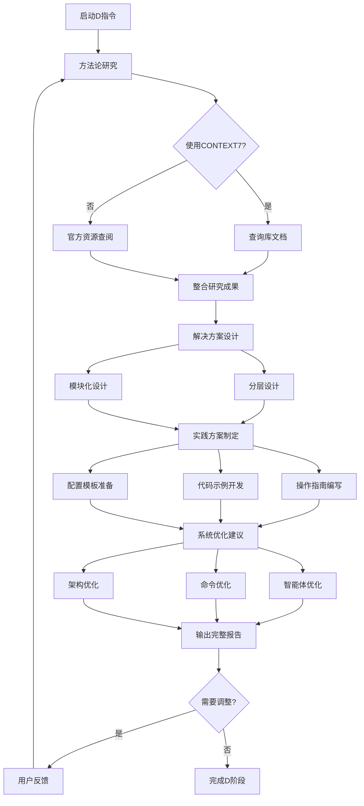

# ASDW学习系统 - How (如何做)

## 📋 指令概述

**ASDW学习系统 - How**是学习闭环的第三步,专注于"如何做"的实践层面。在完成"是什么"(What)的现状考察和"为什么"(Why)的根因分析后,本阶段将理论理解转化为可执行的解决方案和优化策略。

### 核心特性
- **方法论研究**: 深入学习相关技术、工具和最佳实践
- **策略制定**: 制定具体可行的优化方案和实施路径
- **资源整合**: 利用CONTEXT7 MCP等工具获取最新知识
- **实践指导**: 输出可直接执行的操作指南和代码示例

### 应用场景
- 技术难题的解决方案研究
- 系统架构的优化策略制定
- 新技术栈的学习和应用
- 最佳实践的探索和实施

## 🔄 执行逻辑

### 日期文件夹管理
```yaml
自动创建逻辑:
  1. 获取当前日期 (格式: YYYY-MM-DD)
  2. 检查 learning/{今日日期}/ 目录是否存在
  3. 不存在则自动创建
  4. 将学习成果保存到 D_HOW.md

前置依赖检查:
  - 检查当日 A_WHAT.md 和 S_WHY.md 是否存在
  - 如不存在，提示: "⚠️ 请先完成 /A 和 /S 指令 (WHAT和WHY步骤)"
  - 读取 S_WHY.md 中的根本原因作为方法研究的基础

历史学习检测:
  1. 检查当日是否已存在 D_HOW.md
  2. 如果存在，提示用户追加或覆盖
  3. 查找最近7天的 D_HOW.md 文件
  4. 对比解决方案是否重复
  5. 显示历史方案记录供参考

避免重复策略:
  - 基于 AS 阶段的分析结果制定方案
  - 自动继承前两阶段的上下文
  - 检测相似问题的历史解决方案
  - 提供历史方案的改进建议
```

## 🎯 核心功能(四步流程)

### 1. 方法论研究
**目标**: 深入学习解决问题所需的技术、工具和最佳实践

**研究范围**:
```yaml
技术文档学习:
  - 官方文档和API参考
  - 技术规范和设计文档
  - 开源项目和代码示例
  - 社区最佳实践和经验分享

工具和框架研究:
  - 核心功能和特性
  - 架构设计和实现原理
  - 配置方法和使用技巧
  - 常见问题和解决方案

设计模式探索:
  - 通用设计模式和原则
  - 领域特定的模式和实践
  - 反模式和常见陷阱
  - 重构和优化策略
```

**学习方法**:
```yaml
CONTEXT7 MCP集成:
  - 使用mcp__context7__resolve-library-id查询库信息
  - 使用mcp__context7__get-library-docs获取最新文档
  - 支持topic参数精准定位知识点
  - 自动获取代码示例和最佳实践

官方资源查阅:
  - 官方文档网站
  - GitHub仓库和Issues
  - 官方博客和更新日志
  - 视频教程和演示

社区资源利用:
  - Stack Overflow和技术论坛
  - 技术博客和经验分享
  - 开源项目和代码库
  - 在线课程和教程
```

### 2. 解决方案设计
**目标**: 基于方法论研究,设计具体可行的解决方案

**设计维度**:
```yaml
技术方案:
  - 技术选型和架构设计
  - 核心算法和数据结构
  - 接口设计和交互流程
  - 性能优化和资源管理

实施策略:
  - 分阶段实施计划
  - 里程碑和验收标准
  - 风险评估和应对措施
  - 回滚策略和降级方案

资源规划:
  - 开发资源和时间估算
  - 依赖项和外部资源
  - 测试环境和工具
  - 文档和培训需求
```

**设计方法**:
```yaml
分层设计:
  基础设施层:
    - 环境配置和依赖管理
    - 数据存储和缓存策略
    - 日志监控和错误处理

  业务逻辑层:
    - 核心功能实现
    - 数据处理流程
    - 业务规则和验证

  接口层:
    - API设计和文档
    - 用户界面和交互
    - 集成接口和协议

模块化设计:
  - 功能模块划分
  - 接口定义和契约
  - 依赖关系管理
  - 可测试性和可维护性
```

### 3. 实践方案制定
**目标**: 将解决方案转化为可执行的具体步骤和代码

**输出内容**:
```yaml
操作指南:
  - 详细的步骤说明
  - 每步的输入输出
  - 检查点和验证方法
  - 常见问题和解决方法

代码示例:
  - 核心功能实现代码
  - 配置文件和脚本
  - 单元测试和集成测试
  - 部署脚本和自动化工具

配置模板:
  - 环境配置文件
  - 服务配置模板
  - CI/CD流程配置
  - 监控和告警配置
```

**实践策略**:
```yaml
迭代开发:
  第一阶段 - MVP:
    - 核心功能实现
    - 基本功能验证
    - 快速原型迭代

  第二阶段 - 完善:
    - 功能扩展和优化
    - 错误处理和边界情况
    - 性能优化和重构

  第三阶段 - 稳定:
    - 全面测试和验证
    - 文档完善和培训
    - 生产环境部署

质量保障:
  - 代码审查和规范检查
  - 单元测试和集成测试
  - 性能测试和压力测试
  - 安全审计和漏洞扫描
```

### 4. 系统优化建议输出
**目标**: 针对项目现状,提出具体的系统优化建议

**优化维度**:
```yaml
智能体系统优化:
  E系列(AIGC):
    - 提示词优化和模板改进
    - 图像生成参数调优
    - 多模态融合策略
    - 质量评估和筛选机制

  R系列(Figma):
    - API调用优化和批处理
    - 错误处理和重试策略
    - 缓存机制和性能优化
    - 并发控制和资源管理

  Q系列(排版):
    - 布局算法优化
    - 响应式设计策略
    - 字体排印规则
    - 模板化和参数化

命令系统优化:
  执行效率:
    - 命令执行流程优化
    - 参数验证和错误处理
    - 日志记录和监控
    - 性能瓶颈识别和优化

  用户体验:
    - 交互流程简化
    - 提示信息优化
    - 错误信息改进
    - 文档和示例完善

架构优化:
  模块化改进:
    - 功能模块重组
    - 接口标准化
    - 依赖关系优化
    - 代码复用和抽象

  性能优化:
    - 并发处理能力
    - 资源使用效率
    - 缓存策略优化
    - 异步处理机制

  可维护性提升:
    - 代码质量改进
    - 文档完善
    - 测试覆盖率提升
    - 监控和告警机制
```

**输出格式**:
```yaml
优化建议列表:
  优化项1:
    类别: [智能体/命令/架构]
    优先级: [高/中/低]
    当前问题: 问题描述
    优化方案: 具体方案
    预期收益: 效果说明
    实施难度: [简单/中等/复杂]
    实施步骤: 详细步骤
    验证方法: 如何验证效果
```

## 🔧 使用方法

### 基础用法

直接调用指令:
```bash
/D
```

触发后自动执行四步流程,输出包含:
- 方法论研究报告
- 解决方案设计文档
- 实践方案和代码示例
- 系统优化建议清单

### 指定焦点用法

针对特定问题域:
```bash
/D [技术领域]
```

示例:
```bash
/D Figma API优化
/D AIGC图像生成
/D 智能排版算法
```

### 配合ASDW流程

完整学习闭环:
```bash
/A  # 了解现状和目标
/S  # 分析根本原因
/D  # 制定解决方案
/W  # 整合实施优化
```

或使用连招:
```bash
/ASD  # 前三步连续执行
```

## 📊 执行流程



## 🔍 意图解析逻辑

### 输入理解
```yaml
隐式调用识别:
  - 用户询问"怎么做"、"如何实现"
  - 请求"解决方案"、"实施方案"
  - 寻求"最佳实践"、"优化方法"
  - 需要"代码示例"、"配置模板"

显式调用识别:
  - 直接使用 /D 指令
  - ASDW流程的第三步
  - /ASD 连招中的D步骤

焦点识别:
  - 从用户描述中提取技术关键词
  - 识别问题域和优化目标
  - 确定优先级和约束条件
```

### 上下文关联
```yaml
关联A阶段成果:
  - 项目现状和架构信息
  - 目标需求和期望效果
  - 资源和约束条件

关联S阶段成果:
  - 问题根因和影响因素
  - 内外因分析结果
  - 改进优先级排序

整合分析:
  - 问题→原因→方案的完整链路
  - 现状→目标→路径的清晰规划
  - 理论→实践→验证的闭环设计
```

## 🎨 实现细节

### CONTEXT7 MCP集成

#### 库信息查询
```yaml
步骤1 - 解析库名称:
  输入: 用户提供的技术名称
  处理: 标准化库名(如"FastAPI" → "fastapi")
  工具: mcp__context7__resolve-library-id

步骤2 - 获取库文档:
  输入: Context7兼容的库ID
  参数:
    - context7CompatibleLibraryID: 库标识符
    - topic: 可选,聚焦特定主题
    - tokens: 文档长度(默认10000)
  工具: mcp__context7__get-library-docs

步骤3 - 文档整合:
  处理: 提取关键信息和示例
  输出: 结构化的技术文档摘要
```

#### 示例流程
```yaml
场景: 学习FastAPI异步处理

1. 查询库信息:
   mcp__context7__resolve-library-id(libraryName: "FastAPI")
   → 返回: "tiangolo/fastapi"

2. 获取文档:
   mcp__context7__get-library-docs(
     context7CompatibleLibraryID: "tiangolo/fastapi",
     topic: "async",
     tokens: 15000
   )
   → 返回: 异步处理相关文档和示例

3. 整合应用:
   - 提取核心概念和API
   - 收集代码示例
   - 总结最佳实践
   - 识别常见陷阱
```

### 解决方案设计流程

#### 技术选型决策树
```yaml
决策流程:
  问题分析:
    - 识别核心需求和约束
    - 评估现有技术栈
    - 确定优化目标

  方案评估:
    - 列举可行技术方案
    - 评估各方案优劣
    - 考虑实施成本和风险

  方案选择:
    - 权衡收益和成本
    - 考虑团队能力
    - 确定最优方案

评估维度:
  - 技术成熟度和稳定性
  - 性能和可扩展性
  - 开发效率和维护成本
  - 社区支持和文档质量
  - 与现有系统的兼容性
```

#### 架构设计模式
```yaml
分层架构:
  表现层:
    - 用户界面和交互
    - 数据展示和格式化
    - 输入验证和错误提示

  业务层:
    - 业务逻辑和规则
    - 数据处理和转换
    - 工作流和状态管理

  数据层:
    - 数据存储和检索
    - 缓存和索引
    - 事务和一致性

模块化设计:
  - 高内聚低耦合
  - 清晰的接口定义
  - 依赖注入和控制反转
  - 可测试和可替换
```

### 实践方案生成

#### 代码示例结构
```python
# 示例: Figma批量处理优化方案

# 1. 核心功能实现
async def batch_process_nodes(
    file_key: str,
    node_ids: List[str],
    processor: Callable[[dict], dict],
    concurrency: int = 5
) -> List[dict]:
    """
    批量处理Figma节点,支持并发控制。

    Args:
        file_key: Figma文件标识符
        node_ids: 节点ID列表
        processor: 节点处理函数
        concurrency: 并发数量

    Returns:
        处理结果列表
    """
    # 创建信号量控制并发
    semaphore = asyncio.Semaphore(concurrency)

    async def process_with_limit(node_id: str) -> dict:
        async with semaphore:
            node = await fetch_node(file_key, node_id)
            return processor(node)

    # 并发处理所有节点
    tasks = [process_with_limit(nid) for nid in node_ids]
    return await asyncio.gather(*tasks, return_exceptions=True)

# 2. 错误处理和重试
async def fetch_node_with_retry(
    file_key: str,
    node_id: str,
    max_retries: int = 3,
    backoff: float = 1.0
) -> dict:
    """
    带重试机制的节点获取。

    Args:
        file_key: Figma文件标识符
        node_id: 节点ID
        max_retries: 最大重试次数
        backoff: 退避时间(秒)

    Returns:
        节点数据
    """
    for attempt in range(max_retries):
        try:
            return await fetch_node(file_key, node_id)
        except Exception as e:
            if attempt == max_retries - 1:
                raise
            wait_time = backoff * (2 ** attempt)
            await asyncio.sleep(wait_time)

# 3. 性能优化 - 批量获取
async def fetch_nodes_batch(
    file_key: str,
    node_ids: List[str],
    batch_size: int = 50
) -> Dict[str, dict]:
    """
    批量获取节点,减少API调用次数。

    Args:
        file_key: Figma文件标识符
        node_ids: 节点ID列表
        batch_size: 批次大小

    Returns:
        节点ID到节点数据的映射
    """
    results = {}
    for i in range(0, len(node_ids), batch_size):
        batch = node_ids[i:i+batch_size]
        # Figma API支持一次获取多个节点
        response = await fetch_nodes(file_key, batch)
        results.update(response)
    return results
```

#### 配置模板
```yaml
# config/figma_optimization.yaml

# API配置
api:
  base_url: "https://api.figma.com/v1"
  timeout: 30
  retry:
    max_attempts: 3
    backoff_factor: 1.5
    max_backoff: 10

# 并发控制
concurrency:
  max_workers: 10
  batch_size: 50
  rate_limit:
    requests_per_second: 10
    burst: 20

# 缓存配置
cache:
  enabled: true
  ttl: 3600
  max_size: 1000
  storage: "redis"

# 性能监控
monitoring:
  enabled: true
  metrics:
    - request_count
    - request_duration
    - error_rate
    - cache_hit_rate
  log_level: "INFO"
```

## ⚙️ 配置项

### 系统配置
```yaml
配置版本: v2.0.0
更新时间: 2025-09-30

默认设置:
  研究深度: 详细 (可选: 简要/详细/深入)
  文档长度: 10000 tokens
  代码示例: 完整 (可选: 简化/完整/详尽)
  优化建议: 全面 (可选: 核心/全面/扩展)
```

### CONTEXT7配置
```yaml
默认参数:
  tokens: 10000
  topic: null  # 不限定主题

推荐设置:
  快速学习: tokens=5000, topic指定
  深度研究: tokens=15000, topic=null
  特定功能: tokens=8000, topic=功能名
```

### 输出配置
```yaml
报告格式:
  - Markdown格式
  - 结构化章节
  - 代码高亮
  - 流程图和示意图

输出位置:
  学习笔记: learning/{今日日期}/D_HOW.md (如: learning/2025-10-18/D_HOW.md)
  优化建议: reports/improvement/
  代码示例: library/examples/
  配置模板: library/templates/
```

## 📝 示例场景

### 场景1: Figma批量处理性能优化

**用户请求**:
```
我们的Figma批量替换功能在处理大文件时很慢,如何优化?
```

**执行流程**:

#### 1. 方法论研究
```yaml
技术研究:
  - 使用CONTEXT7查询Figma API文档
  - 研究批量请求和并发控制
  - 学习异步处理和错误重试

资源收集:
  - Figma API rate limits文档
  - Python asyncio最佳实践
  - 批处理设计模式
```

#### 2. 解决方案设计
```yaml
技术方案:
  - 使用asyncio实现异步并发
  - 批量获取节点减少API调用
  - 实现智能重试和错误处理
  - 添加缓存机制减少重复请求

实施策略:
  阶段1: 基础异步改造
  阶段2: 批量处理优化
  阶段3: 缓存和监控
```

#### 3. 实践方案制定
```python
# 核心优化代码(见"实现细节"部分)

# 使用示例
async def optimize_batch_replacement():
    file_key = "your-file-key"
    replacements = [...] # 替换配置

    # 1. 批量获取节点
    node_ids = [r['node_id'] for r in replacements]
    nodes = await fetch_nodes_batch(file_key, node_ids)

    # 2. 并发处理节点
    async def process_replacement(replacement):
        node = nodes[replacement['node_id']]
        return await apply_replacement(node, replacement)

    results = await batch_process_nodes(
        file_key,
        node_ids,
        process_replacement,
        concurrency=10
    )

    return results
```

#### 4. 系统优化建议
```yaml
优化建议1:
  类别: R系列智能体
  优先级: 高
  当前问题: 顺序处理导致性能瓶颈
  优化方案: 实现异步并发处理
  预期收益: 性能提升5-10倍
  实施难度: 中等
  实施步骤:
    1. 重构batch_replace_service.py为异步
    2. 添加并发控制和限流
    3. 实现批量API调用
    4. 添加性能监控
  验证方法: 对比处理100个节点的耗时

优化建议2:
  类别: R系列智能体
  优先级: 中
  当前问题: 频繁的API调用和重复请求
  优化方案: 添加多级缓存机制
  预期收益: 减少30-50% API调用
  实施难度: 简单
  实施步骤:
    1. 添加内存缓存(LRU)
    2. 配置Redis缓存(可选)
    3. 实现缓存失效策略
    4. 添加缓存命中率监控
  验证方法: 监控缓存命中率和API调用次数
```

### 场景2: AIGC图像生成质量提升

**用户请求**:
```
E1智能体生成的餐饮图片质量不稳定,如何提升?
```

**执行流程**:

#### 1. 方法论研究
```yaml
技术研究:
  - 使用CONTEXT7查询Stable Diffusion文档
  - 研究提示词工程和参数调优
  - 学习图像质量评估方法

最佳实践:
  - 提示词结构化模板
  - 负面提示词优化
  - 参数组合实验
  - 多样本生成和筛选
```

#### 2. 解决方案设计
```yaml
技术方案:
  - 建立餐饮领域提示词模板库
  - 实现多模型对比和选择
  - 添加图像质量自动评估
  - 构建反馈优化循环

实施策略:
  阶段1: 提示词模板优化
  阶段2: 质量评估系统
  阶段3: 自动优化循环
```

#### 3. 实践方案制定
```python
# 提示词模板系统
class PromptTemplate:
    """餐饮AIGC提示词模板"""

    BASE_TEMPLATE = """
    {dish_description},
    {style_keywords},
    {quality_keywords},
    {technical_keywords}
    """

    NEGATIVE_TEMPLATE = """
    {common_issues},
    {quality_issues},
    {style_conflicts}
    """

    QUALITY_KEYWORDS = [
        "high quality", "detailed", "professional",
        "8K resolution", "RAW photo", "masterpiece"
    ]

    RESTAURANT_STYLES = {
        "chinese": ["Chinese cuisine", "traditional", "elegant"],
        "western": ["Western cuisine", "modern", "minimalist"],
        "japanese": ["Japanese cuisine", "zen", "natural"]
    }

    def generate(
        self,
        dish: str,
        style: str = "chinese",
        quality: str = "high"
    ) -> Dict[str, str]:
        """生成优化的提示词"""
        return {
            "prompt": self._build_prompt(dish, style, quality),
            "negative_prompt": self._build_negative_prompt()
        }

# 质量评估系统
class ImageQualityAssessor:
    """图像质量自动评估"""

    def __init__(self):
        self.metrics = [
            "sharpness",
            "composition",
            "color_balance",
            "aesthetic_score"
        ]

    async def assess(self, image_url: str) -> Dict[str, float]:
        """评估图像质量"""
        # 调用图像分析API
        scores = await self._analyze_image(image_url)

        # 计算综合得分
        overall = self._calculate_overall(scores)

        return {
            **scores,
            "overall": overall,
            "pass": overall >= 0.7
        }

# 自动优化循环
async def generate_with_quality_control(
    prompt: str,
    min_quality: float = 0.7,
    max_attempts: int = 3
) -> Dict[str, Any]:
    """带质量控制的生成"""

    assessor = ImageQualityAssessor()

    for attempt in range(max_attempts):
        # 生成图像
        image = await generate_image(prompt)

        # 质量评估
        quality = await assessor.assess(image['url'])

        if quality['pass']:
            return {
                "image": image,
                "quality": quality,
                "attempts": attempt + 1
            }

        # 优化提示词重试
        prompt = optimize_prompt(prompt, quality)

    raise Exception("未能生成符合质量要求的图像")
```

#### 4. 系统优化建议
```yaml
优化建议1:
  类别: E系列智能体
  优先级: 高
  当前问题: 提示词质量不稳定
  优化方案: 建立提示词模板库和优化系统
  预期收益: 质量稳定性提升50%
  实施难度: 中等
  实施步骤:
    1. 收集高质量提示词样本
    2. 构建分类模板库
    3. 实现模板自动选择
    4. 添加用户自定义模板
  验证方法: 对比100次生成的质量分布

优化建议2:
  类别: E系列智能体
  优先级: 高
  当前问题: 缺乏质量反馈机制
  优化方案: 添加自动质量评估和优化循环
  预期收益: 首次成功率提升30%
  实施难度: 复杂
  实施步骤:
    1. 集成图像质量评估API
    2. 实现多维度质量评分
    3. 构建提示词优化策略
    4. 添加学习和改进机制
  验证方法: 统计多次尝试的平均成功率
```

### 场景3: 智能排版算法优化

**用户请求**:
```
Q系列智能体的自适应布局效果不理想,如何改进?
```

**执行流程**:

#### 1. 方法论研究
```yaml
算法研究:
  - 响应式布局算法
  - 约束求解和优化
  - 布局美学评估
  - 自适应缩放策略

设计模式:
  - 策略模式(多布局算法)
  - 工厂模式(布局生成器)
  - 观察者模式(尺寸变化响应)
```

#### 2. 解决方案设计
```yaml
技术方案:
  - 实现多种布局算法
  - 添加约束求解器
  - 构建美学评分系统
  - 支持手动微调

算法选型:
  - Flexbox布局算法
  - Grid网格布局
  - 约束布局求解
  - 黄金分割和比例
```

#### 3. 实践方案制定
```python
# 布局算法框架
class LayoutAlgorithm(ABC):
    """布局算法抽象基类"""

    @abstractmethod
    def calculate_layout(
        self,
        elements: List[Element],
        constraints: Constraints
    ) -> Layout:
        """计算布局"""
        pass

    @abstractmethod
    def evaluate_quality(self, layout: Layout) -> float:
        """评估布局质量"""
        pass

# Flexbox布局实现
class FlexboxLayout(LayoutAlgorithm):
    """Flexbox风格的响应式布局"""

    def calculate_layout(
        self,
        elements: List[Element],
        constraints: Constraints
    ) -> Layout:
        """实现Flexbox布局算法"""

        # 1. 计算主轴和交叉轴
        main_axis = constraints.direction
        cross_axis = self._get_cross_axis(main_axis)

        # 2. 分配空间
        spaces = self._distribute_space(
            elements,
            constraints.available_space
        )

        # 3. 对齐和定位
        layout = Layout()
        for elem, space in zip(elements, spaces):
            position = self._calculate_position(
                elem, space, constraints.align
            )
            layout.add(elem, position, space)

        return layout

    def evaluate_quality(self, layout: Layout) -> float:
        """评估布局质量"""
        scores = {
            "balance": self._evaluate_balance(layout),
            "spacing": self._evaluate_spacing(layout),
            "alignment": self._evaluate_alignment(layout),
            "proportion": self._evaluate_proportion(layout)
        }
        return sum(scores.values()) / len(scores)

# 布局优化器
class LayoutOptimizer:
    """多算法布局优化"""

    def __init__(self):
        self.algorithms = [
            FlexboxLayout(),
            GridLayout(),
            ConstraintLayout()
        ]

    def optimize(
        self,
        elements: List[Element],
        constraints: Constraints
    ) -> Layout:
        """选择最优布局"""

        # 尝试所有算法
        candidates = []
        for algo in self.algorithms:
            layout = algo.calculate_layout(elements, constraints)
            quality = algo.evaluate_quality(layout)
            candidates.append((layout, quality, algo))

        # 选择质量最高的
        best_layout, best_quality, best_algo = max(
            candidates,
            key=lambda x: x[1]
        )

        return best_layout
```

#### 4. 系统优化建议
```yaml
优化建议1:
  类别: Q系列智能体
  优先级: 高
  当前问题: 单一布局算法适应性差
  优化方案: 实现多算法自动选择机制
  预期收益: 适应性提升60%
  实施难度: 复杂
  实施步骤:
    1. 实现3种主流布局算法
    2. 构建质量评估体系
    3. 实现自动选择逻辑
    4. 添加用户偏好配置
  验证方法: 对比不同场景的布局效果

优化建议2:
  类别: Q系列智能体
  优先级: 中
  当前问题: 缺乏美学评估标准
  优化方案: 建立多维度布局质量评分系统
  预期收益: 美学质量提升40%
  实施难度: 中等
  实施步骤:
    1. 定义美学评估维度(平衡/间距/对齐/比例)
    2. 实现量化评分算法
    3. 收集优质案例建立基准
    4. 支持用户反馈学习
  验证方法: 用户满意度调查和A/B测试
```

## 🔍 错误处理

### 常见错误类型

#### 1. CONTEXT7查询失败
```yaml
症状: 无法解析库ID或获取文档
原因:
  - 库名称不正确或不存在
  - 网络连接问题
  - API限流或超时

处理策略:
  - 尝试不同的库名称变体
  - 回退到官方文档查询
  - 使用WebSearch工具搜索
  - 提示用户提供文档链接
```

#### 2. 方案设计不可行
```yaml
症状: 设计的方案无法实施
原因:
  - 技术栈不兼容
  - 资源或时间不足
  - 依赖项缺失
  - 性能或成本约束

处理策略:
  - 重新评估约束条件
  - 简化方案或分阶段实施
  - 寻找替代技术方案
  - 与用户确认优先级调整
```

#### 3. 代码示例无法运行
```yaml
症状: 提供的代码示例有错误
原因:
  - 语法错误或类型错误
  - 依赖版本不匹配
  - 环境配置问题
  - 示例不完整

处理策略:
  - 验证代码语法和类型
  - 明确依赖版本要求
  - 提供完整的运行环境说明
  - 添加错误处理和降级方案
```

#### 4. 优化建议过于笼统
```yaml
症状: 建议缺乏可操作性
原因:
  - 对现状了解不足
  - 技术细节缺失
  - 实施步骤不清晰

处理策略:
  - 重新执行A阶段补充现状信息
  - 细化每个优化建议的步骤
  - 提供具体的代码和配置示例
  - 添加验证方法和成功标准
```

### 错误恢复策略
```yaml
信息补充:
  - 需要时回到A阶段补充现状
  - 需要时回到S阶段深化原因分析
  - 与用户确认关键假设和约束

方案调整:
  - 根据反馈调整技术选型
  - 简化或细化实施步骤
  - 添加备选方案和降级策略

迭代优化:
  - 采用MVP方式先验证核心功能
  - 根据验证结果调整方案
  - 持续收集反馈和优化
```

## 📈 性能优化

### 研究效率优化
```yaml
并行研究:
  - 同时查询多个资源
  - 使用CONTEXT7快速获取核心文档
  - WebSearch辅助补充信息

知识复用:
  - 建立技术方案模板库
  - 积累常用代码片段
  - 记录优化模式和反模式

聚焦关键:
  - 优先研究核心技术点
  - 跳过非关键细节
  - 根据问题域选择研究深度
```

### 方案输出优化
```yaml
结构化输出:
  - 使用统一的文档模板
  - 代码示例完整可运行
  - 配置文件即拿即用

分层输出:
  - 摘要: 核心方案和关键建议
  - 详细: 完整设计和实施步骤
  - 附录: 代码示例和配置模板

渐进式输出:
  - 先输出核心方案供用户确认
  - 再补充详细内容
  - 根据反馈调整输出重点
```

### 质量保障
```yaml
方案验证:
  - 技术可行性检查
  - 资源和时间评估
  - 风险识别和应对

代码质量:
  - 遵循语言最佳实践
  - 添加类型提示和文档
  - 包含错误处理
  - 提供测试用例

文档质量:
  - 清晰的结构和层次
  - 完整的步骤说明
  - 丰富的示例和图表
  - 可操作的验证方法
```

## 🎯 成功标准

### 方法论研究成功标准
```yaml
必达标准:
  ✅ 理解核心技术和原理
  ✅ 掌握关键API和用法
  ✅ 识别最佳实践和陷阱
  ✅ 收集足够的示例和参考

质量标准:
  ✅ 信息准确和最新
  ✅ 覆盖主要使用场景
  ✅ 包含性能和安全考虑
  ✅ 来源可靠(官方文档优先)
```

### 解决方案设计成功标准
```yaml
必达标准:
  ✅ 方案明确可行
  ✅ 技术选型合理
  ✅ 架构设计清晰
  ✅ 实施路径可操作

质量标准:
  ✅ 考虑可扩展性和可维护性
  ✅ 包含错误处理和降级方案
  ✅ 评估性能和资源影响
  ✅ 提供多种方案对比
```

### 实践方案成功标准
```yaml
必达标准:
  ✅ 步骤详细可执行
  ✅ 代码完整可运行
  ✅ 配置清晰可用
  ✅ 包含验证方法

质量标准:
  ✅ 代码符合最佳实践
  ✅ 包含测试和文档
  ✅ 考虑边界情况
  ✅ 提供排错指南
```

### 优化建议成功标准
```yaml
必达标准:
  ✅ 覆盖主要优化点
  ✅ 优先级明确
  ✅ 预期收益清晰
  ✅ 实施步骤详细

质量标准:
  ✅ 建议具体可落地
  ✅ 包含验证方法
  ✅ 考虑实施成本
  ✅ 提供成功案例
```

## 🔗 相关资源

### 相关指令
- `/A` - ASDW学习系统 - What (现状考察)
- `/S` - ASDW学习系统 - Why (根因分析)
- `/W` - ASDW学习系统 - 融会贯通 (整合实施)
- `/ASD` - 连招: 完整学习链路(What→Why→How)
- `/ASDW` - 连招: 完整ASDW闭环

### MCP工具
```yaml
CONTEXT7:
  - mcp__context7__resolve-library-id
  - mcp__context7__get-library-docs

WebSearch:
  - WebSearch (技术资料搜索)
  - WebFetch (文档获取)

GitHub:
  - GitHub MCP (代码参考查询)
```

### 输出文件
```yaml
学习笔记:
  - learning/{今日日期}/D_HOW.md (如: learning/2025-10-18/D_HOW.md)

优化方案:
  - reports/improvement/[topic]_optimization.md

代码示例:
  - library/examples/[topic]_examples.py

配置模板:
  - library/templates/[topic]_template.yaml
```

### 外部资源参考
```yaml
技术文档:
  - 官方文档网站
  - GitHub仓库和Wiki
  - API参考文档

学习资源:
  - 在线教程和课程
  - 技术博客和文章
  - 视频教程和演示

社区资源:
  - Stack Overflow
  - Reddit技术社区
  - Discord/Slack技术群
```

## ⚠️ 注意事项

### 使用限制
```yaml
适用场景:
  ✅ 技术难题解决
  ✅ 系统优化设计
  ✅ 最佳实践学习
  ✅ 架构重构规划

不适用场景:
  ❌ 业务需求分析(应先执行/A)
  ❌ 问题根因诊断(应先执行/S)
  ❌ 简单问题快速解答
  ❌ 无具体目标的探索
```

### 最佳实践
```yaml
执行前:
  - 确保已完成A阶段(现状清晰)
  - 确保已完成S阶段(原因明确)
  - 明确优化目标和约束条件
  - 准备必要的技术背景信息

执行中:
  - 充分利用CONTEXT7获取最新文档
  - 多方案对比选择最优解
  - 代码示例验证可行性
  - 及时与用户确认关键决策

执行后:
  - 验证方案的可行性和完整性
  - 确保所有输出文件正确生成
  - 与用户确认是否需要调整
  - 考虑是否需要执行/W进行整合实施
```

### 重要提醒
```yaml
关键原则:
  - 方案必须可执行,不能纸上谈兵
  - 代码示例必须完整可运行
  - 优化建议必须具体可落地
  - 实施步骤必须详细可操作

常见陷阱:
  - 过度设计,方案过于复杂
  - 脱离现状,不考虑约束条件
  - 缺乏验证,方案无法落地
  - 忽视风险,没有应对措施

质量保障:
  - 技术选型基于充分研究
  - 方案设计考虑可扩展性
  - 代码符合语言最佳实践
  - 文档完整清晰易理解
```

### 与其他阶段的协同
```yaml
与A阶段:
  - 基于A阶段的现状信息设计方案
  - 确保方案符合项目架构和约束
  - 优化建议针对A阶段识别的问题

与S阶段:
  - 针对S阶段分析的根本原因设计方案
  - 确保方案真正解决深层次问题
  - 优化策略与根因分析结果对应

与W阶段:
  - 为W阶段的整合实施做准备
  - 输出的方案和代码可直接被W阶段使用
  - 优化建议为W阶段提供明确的实施目标
```

---

**配置版本**: v2.0.0
**更新时间**: 2025-09-30
**核心定位**: ASDW学习系统的方法论研究和实践方案制定阶段,将理论理解转化为可执行的优化策略