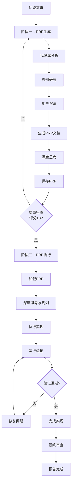

# PRP生成与执行引擎

## 📋 指令概述

**PRP生成与执行引擎**是一个端到端的自动化工作流系统，通过系统化的研究、规划和执行流程，确保功能实现的质量和效率。该引擎结合了深度代码库分析、外部研究和严格的验证门控机制，实现"一次性实现成功"的目标。

### 核心特性
- **研究驱动**: 基于代码库分析和外部研究生成高质量PRP
- **全流程管理**: 从需求分析到最终验证的完整生命周期
- **质量门控**: 多层验证机制确保实现质量
- **迭代优化**: 支持持续改进和自我验证

### 应用场景
- 新功能开发的系统化规划和实现
- 复杂重构任务的分步执行
- 需要严格质量验证的关键功能
- 团队协作中的实现标准化

## 🎯 核心功能(两阶段流程)

### 阶段一：PRP生成（研究与规划）

#### 1. 代码库深度分析
**目标**: 识别现有模式和最佳实践
```yaml
分析维度:
  - 相似功能和实现模式
  - 需要参考的关键文件
  - 现有约定和编码规范
  - 测试模式和验证方法
```

#### 2. 外部研究与知识整合
**目标**: 获取行业最佳实践和技术方案
```yaml
研究来源:
  - 官方文档（包含具体URL和章节）
  - 开源实现（GitHub/StackOverflow）
  - 技术博客和最佳实践
  - 常见陷阱和解决方案
```

#### 3. 用户澄清与需求确认
**目标**: 明确具体需求和集成要求
```yaml
澄清内容:
  - 需要镜像的特定模式及位置
  - 系统集成要求和依赖关系
  - 性能和质量标准
  - 验证和测试策略
```

#### 4. PRP文档生成
**目标**: 创建全面的实现规划文档

**关键上下文包含**:
```markdown
- **文档引用**: URL + 具体章节
- **代码示例**: 代码库中的真实片段
- **技术陷阱**: 库的特殊性、版本问题
- **实现模式**: 需要遵循的现有方法
```

**实现蓝图结构**:
```markdown
1. 伪代码展示实现方法
2. 参考真实文件中的模式
3. 错误处理策略
4. 按完成顺序列出任务清单
```

**验证门控定义** (必须可执行):
```powershell
# Python项目示例（Windows原生）
PowerShell(ruff check --fix)
PowerShell(mypy .)
PowerShell(uv run pytest tests/ -v)
```

#### 5. 深度思考与方法规划
**关键**: 在编写代码前对PRP进行深度思考并规划实现方法

#### 6. PRP文档保存
**保存路径**: `PRPs/{feature-name}.md`

#### 7. 质量检查清单
```yaml
检查项:
  - [ ] 包含所有必要上下文
  - [ ] 验证门控可由AI执行
  - [ ] 参考现有模式
  - [ ] 清晰的实现路径
  - [ ] 记录错误处理策略
```

**PRP质量评分**: 按1-10分评估（使用Claude Code一次性实现成功的信心等级）

### 阶段二：PRP执行（实现与验证）

#### 1. PRP加载与理解
```yaml
加载流程:
  - 读取生成的PRP文件
  - 理解所有上下文和要求
  - 遵循PRP中的所有指示
  - 必要时扩展研究
  - 确保拥有完全实现所需的所有上下文
```

#### 2. 深度思考与计划分解
```yaml
规划策略:
  - 在执行前进行深度思考
  - 创建解决所有要求的综合计划
  - 使用TodoWrite工具分解复杂任务
  - 识别要遵循的实现模式
```

#### 3. 执行实现计划
```yaml
实现流程:
  - 按PRP定义的任务序列执行
  - 实现所有代码功能
  - 遵循既定的实现模式
  - 持续参考PRP文档
```

#### 4. 验证与修复
```yaml
验证循环:
  - 运行PRP中的每个验证命令
  - 识别并修复所有失败
  - 重新运行直到全部通过
  - 记录验证结果
```

#### 5. 完成与审查
```yaml
最终检查:
  - 确保所有检查清单项目完成
  - 运行最终验证套件
  - 再次阅读PRP确认完整性
  - 报告完成状态
```

#### 6. 持续参考机制
**原则**: 可以随时重新参考PRP文档确保实现正确性

## 🔧 使用方法

### 及物动词型（附带参数）

启动端到端PRP流程，需要功能需求作为输入：

```bash
/E <功能需求的详细描述>
```

**示例**:
```bash
/E 实现一个新的用户认证API，支持邮箱密码和OAuth2.0
/E 重构现有的缓存模块，引入Redis作为新的缓存后端
```

### 不及物动词型（默认目标）

直接使用默认目标执行：

```bash
/E
```

**行为**: 默认以当前 `PRPs/PRP.md` 文件内容作为执行目标，直接进入PRP执行阶段。

## 📊 执行流程



## 🔍 意图解析逻辑

### 输入分析策略
```yaml
解析维度:
  语义分析:
    - 提取核心功能需求
    - 识别技术栈和依赖
    - 确定实现范围

  复杂度评估:
    - 估算实现难度
    - 识别潜在风险点
    - 确定研究深度

  上下文关联:
    - 关联现有代码库
    - 识别相似模式
    - 确定参考文件
```

### 执行路径决策
```yaml
决策树:
  简单功能:
    - 快速代码库搜索
    - 简化PRP模板
    - 加速执行流程

  复杂功能:
    - 深度研究分析
    - 完整PRP生成
    - 严格质量门控

  重构任务:
    - 全面影响分析
    - 分步实施计划
    - 增量验证策略
```

## 🎨 实现细节

### PRP模板结构
基于 `PRPs/templates/prp_base.md` 生成，包含：

```markdown
# 功能名称

## 1. 功能概述
- 目标描述
- 应用场景
- 核心价值

## 2. 上下文与参考
- 文档链接
- 代码示例
- 技术陷阱
- 实现模式

## 3. 实现蓝图
- 伪代码设计
- 文件引用
- 错误处理
- 任务清单

## 4. 验证门控
- 语法检查命令
- 类型检查命令
- 单元测试命令
- 集成测试命令

## 5. 质量标准
- 完成标准
- 性能要求
- 代码规范
```

### 验证门控机制
```yaml
多层验证体系:
  语法层:
    - 代码格式检查 (ruff check --fix)
    - 类型检查 (mypy .)

  功能层:
    - 单元测试 (pytest tests/ -v)
    - 集成测试 (pytest tests/integration/ -v)

  质量层:
    - 覆盖率检查 (pytest --cov)
    - 性能测试 (pytest tests/performance/)
```

### 研究成果整合
```yaml
整合策略:
  代码库模式:
    - 提取关键代码片段
    - 记录文件路径和行号
    - 标注使用场景

  外部资源:
    - 记录完整URL
    - 标注相关章节
    - 总结关键要点

  技术陷阱:
    - 记录已知问题
    - 提供解决方案
    - 标注版本依赖
```

## ⚙️ 配置项

### 系统配置
```yaml
配置版本: v2.0.0
更新时间: 2025-09-30
模板路径: PRPs/templates/prp_base.md
输出路径: PRPs/{feature-name}.md
```

### 质量标准
```yaml
PRP质量要求:
  最低评分: 8/10
  必需章节: 完整
  验证门控: 可执行

实现质量要求:
  代码规范: PEP8/项目规范
  测试覆盖: ≥80%
  文档完整: 100%
```

### 维护原则
- **质量优先**: 确保一次性实现成功
- **效率导向**: 通过充分研究减少迭代
- **自动化**: 所有验证门控可自动执行

## 📝 示例场景

### 场景1：新API开发

**输入**:
```bash
/E 实现一个RESTful API用于用户管理，支持CRUD操作和JWT认证
```

**执行流程**:
1. **代码库分析**: 搜索现有API实现模式
2. **外部研究**: 查找FastAPI最佳实践和JWT集成方案
3. **PRP生成**: 创建包含完整实现计划的PRP文档
4. **深度思考**: 规划API端点、数据模型、认证流程
5. **执行实现**: 按PRP逐步实现所有功能
6. **验证**: 运行单元测试、集成测试、API测试
7. **完成**: 确认所有功能正常工作

### 场景2：模块重构

**输入**:
```bash
/E 重构缓存模块，替换内存缓存为Redis，保持API兼容性
```

**执行流程**:
1. **代码库分析**: 分析现有缓存模块的使用情况
2. **外部研究**: 研究Redis最佳实践和迁移策略
3. **PRP生成**: 制定分步重构计划和回滚策略
4. **深度思考**: 设计Redis连接管理和错误处理
5. **执行实现**: 增量替换，保持向后兼容
6. **验证**: 运行所有依赖缓存的测试用例
7. **完成**: 确认性能提升和功能一致性

### 场景3：复杂功能集成

**输入**:
```bash
/E 集成第三方支付系统，支持支付宝、微信支付和银联
```

**执行流程**:
1. **代码库分析**: 检查现有支付相关代码
2. **外部研究**: 研究各支付平台SDK和最佳实践
3. **用户澄清**: 确认支付流程、回调处理、安全要求
4. **PRP生成**: 创建包含三个支付渠道的完整实现计划
5. **深度思考**: 设计统一的支付抽象层和错误处理
6. **执行实现**: 逐个实现支付渠道，统一接口
7. **验证**: 沙箱环境测试所有支付流程
8. **完成**: 确认所有支付渠道正常工作

## 🔍 错误处理

### 常见错误类型

#### 1. PRP生成阶段错误
```yaml
症状: PRP质量评分低于8分
原因:
  - 代码库研究不充分
  - 外部研究深度不够
  - 缺少关键上下文
  - 验证门控定义不清
处理:
  - 重新进行代码库分析
  - 扩展外部研究范围
  - 补充缺失的上下文
  - 明确验证命令
```

#### 2. PRP执行阶段错误
```yaml
症状: 验证门控无法通过
原因:
  - 实现偏离PRP计划
  - 代码质量问题
  - 测试用例失败
  - 集成问题
处理:
  - 重新阅读PRP文档
  - 参考PRP中的错误模式
  - 修复具体问题
  - 增量验证修复效果
```

#### 3. 环境配置错误
```yaml
症状: 验证命令无法执行
原因:
  - 工具未安装
  - 路径配置错误
  - 依赖缺失
处理:
  - 检查工具安装状态
  - 验证路径配置
  - 安装缺失依赖
  - 更新验证命令
```

### 错误恢复策略

```yaml
自动恢复机制:
  验证失败:
    - 自动记录失败原因
    - 参考PRP中的错误模式
    - 应用标准修复策略
    - 重新运行验证

  实现偏差:
    - 对比PRP原始计划
    - 识别偏差点
    - 回退到正确路径
    - 继续执行

  质量不达标:
    - 运行代码质量检查
    - 自动应用修复工具
    - 重新验证质量
    - 达标后继续
```

### 调试支持

```yaml
调试工具:
  - PRP文档持续参考
  - 详细的错误日志
  - 中间状态检查点
  - 回滚机制支持
```

## 📈 性能优化

### 研究效率优化
```yaml
并行研究:
  - 代码库分析和外部研究并行进行
  - 使用多个搜索引擎同时查询
  - 预加载常用文档和资源

缓存机制:
  - 缓存常见模式和最佳实践
  - 复用类似功能的研究成果
  - 建立项目级知识库
```

### 执行效率优化
```yaml
增量验证:
  - 在实现过程中持续运行验证
  - 避免大批量修改后集中验证
  - 快速定位和修复问题

并行任务:
  - 独立模块并行实现
  - 测试用例并行执行
  - 文档和代码同步更新
```

### 资源利用优化
```yaml
内存管理:
  - 流式处理大文件
  - 及时释放不需要的资源
  - 控制并发任务数量

磁盘优化:
  - 临时文件及时清理
  - PRP文档结构化存储
  - 验证结果增量保存
```

## 🎯 成功标准

### 阶段一成功标准
```yaml
PRP质量要求:
  ✅ 评分≥8/10
  ✅ 所有必需章节完整
  ✅ 验证门控明确且可执行
  ✅ 上下文引用准确完整
  ✅ 实现蓝图清晰可行
```

### 阶段二成功标准
```yaml
实现质量要求:
  ✅ 所有验证门控通过
  ✅ 功能完整实现
  ✅ 代码符合规范
  ✅ 测试覆盖充分
  ✅ 文档同步更新
```

### 总体成功标准
```yaml
项目交付要求:
  ✅ 功能完全实现并通过验证
  ✅ 实现一次性成功（无需重大返工）
  ✅ 代码质量达标
  ✅ 文档完整准确
  ✅ 可维护性良好
```

## 🔗 相关资源

### 内部资源
- **PRP模板**: `PRPs/templates/prp_base.md`
- **示例PRP**: `PRPs/EXAMPLE_multi_agent_prp.md`
- **项目规范**: `CLAUDE.md`

### 外部参考
- **Claude Code文档**: [官方文档链接]
- **最佳实践指南**: [项目Wiki]
- **常见问题解答**: [FAQ文档]

### 相关指令
- `/F` - 快速创建PRP（仅生成，不执行）
- `/R` - 并行任务执行（多方案探索）
- `/Q` - 项目上下文感知（研究辅助）

## ⚠️ 注意事项

### 使用限制
```yaml
适用场景:
  ✅ 新功能开发
  ✅ 复杂重构
  ✅ 系统集成
  ❌ 简单修复（使用直接编辑）
  ❌ 紧急热修复（跳过PRP生成）
```

### 最佳实践
```yaml
执行前:
  - 确保Git仓库状态清洁
  - 阅读相关文档和规范
  - 明确功能需求和边界

执行中:
  - 持续参考PRP文档
  - 频繁运行验证门控
  - 及时记录遇到的问题

执行后:
  - 完整运行所有验证
  - 更新相关文档
  - 总结经验教训
```

### 重要提醒
```yaml
关键原则:
  - 目标是一次性实现成功
  - 充分研究优于快速开始
  - 质量门控不可跳过
  - PRP是实现的唯一指南

常见陷阱:
  - 跳过代码库分析
  - 外部研究不充分
  - 忽视验证门控
  - 实现偏离PRP计划
```

---

**配置版本**: v2.1.0
**更新时间**: 2025-10-22
**维护原则**: 质量、效率、自动化、规范化