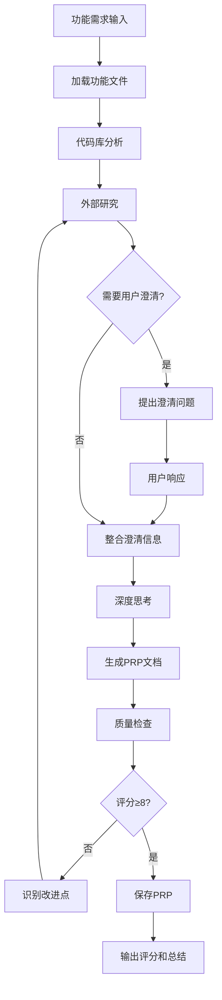

# PRP快速创建

## 📋 指令概述

**PRP快速创建**是一个专注于规划阶段的轻量级指令，通过深度研究和分析快速生成高质量的PRP（Plan-Research-Plan）文档。与`/E`指令的完整工作流不同，该指令仅完成研究和规划工作，不进行实际的代码实现，适合需要先制定详细计划、后续再执行的场景。

### 核心特性
- **研究驱动**: 深度代码库分析和外部研究
- **专注规划**: 仅生成PRP文档，不执行实现
- **高质量标准**: 确保生成的PRP评分≥8/10
- **可执行验证**: 验证门控必须可由AI自动执行

### 应用场景
- 需要先规划、后执行的复杂功能
- 需要团队审查和讨论的重要功能
- 需要明确实施路径的大型重构
- 作为多个实现方案的规划基础

## 🎯 核心功能(七步流程)

### 1. 功能文件加载
**目标**: 理解功能需求和上下文

```yaml
加载内容:
  - 读取功能需求文件: $ARGUMENTS
  - 理解需要创建的内容
  - 分析提供的示例和参考
  - 识别其他关键考虑因素
```

**关键原则**: AI代理只能获取你附加到PRP的上下文和训练数据，因此必须将研究发现完整地包含或引用在PRP中。

### 2. 代码库深度分析
**目标**: 识别现有模式和可复用经验

```yaml
分析维度:
  相似功能搜索:
    - 搜索代码库中相似的功能或模式
    - 识别可以借鉴的实现方式
    - 记录成功的技术方案

  文件引用识别:
    - 确定需要在PRP中引用的关键文件
    - 提取相关代码片段作为示例
    - 记录文件路径和具体行号

  约定规范提取:
    - 注意现有的编码约定和规范
    - 识别需要遵循的项目标准
    - 记录特定的技术要求

  测试模式分析:
    - 检查现有的测试模式和框架
    - 确定验证方法和测试策略
    - 识别需要的测试工具
```

### 3. 外部研究与知识整合
**目标**: 获取行业最佳实践和解决方案

```yaml
研究来源:
  官方文档:
    - 查找库的官方文档
    - 记录具体的URL和章节
    - 提取关键API和使用方法

  实现示例:
    - 搜索GitHub上的参考实现
    - 查找StackOverflow的解决方案
    - 阅读技术博客的实践经验

  最佳实践:
    - 识别行业公认的最佳实践
    - 记录常见的实现模式
    - 总结经验和教训

  常见陷阱:
    - 识别库的特殊性和限制
    - 注意版本兼容性问题
    - 记录已知的技术陷阱
```

**重要提醒**: AI代理具有Web搜索能力，因此在PRP中传递URL到文档和示例非常重要。

### 4. 用户澄清（如需要）
**目标**: 明确模糊需求和集成细节

```yaml
澄清问题:
  特定模式:
    - 需要镜像哪些特定模式？
    - 这些模式在哪里可以找到？
    - 如何适配到当前功能？

  集成要求:
    - 需要与哪些系统集成？
    - 集成点的具体要求是什么？
    - 相关文档在哪里？

  技术约束:
    - 是否有性能要求？
    - 是否有兼容性限制？
    - 是否有安全考虑？
```

### 5. PRP文档生成
**目标**: 基于prp_base.md模板生成完整PRP

使用 `PRPs/templates/prp_base.md` 作为模板，生成包含以下关键内容的PRP：

#### 关键上下文包含
```yaml
文档引用:
  - 提供完整的URL
  - 标注具体的章节或页面
  - 说明相关性和用途

代码示例:
  - 从代码库中提取真实片段
  - 标注文件路径和行号
  - 说明参考目的

技术陷阱:
  - 记录库的特殊性和限制
  - 注意版本兼容性问题
  - 提供规避方法

实现模式:
  - 描述需要遵循的现有方法
  - 提供参考实现
  - 说明选择原因
```

#### 实现蓝图结构
```yaml
蓝图内容:
  伪代码设计:
    - 从高层伪代码开始
    - 展示整体实现方法
    - 清晰的逻辑流程

  文件引用:
    - 参考真实文件中的模式
    - 提供具体的代码位置
    - 说明如何借鉴

  错误处理:
    - 包含错误处理策略
    - 定义异常情况
    - 提供恢复机制

  任务清单:
    - 按完成顺序列出任务
    - 任务粒度适中
    - 依赖关系明确
```

#### 验证门控定义
**关键要求**: 必须可由AI自动执行

```bash
# Python项目示例
# 语法和风格检查
ruff check --fix && mypy .

# 单元测试
uv run pytest tests/ -v
```

**验证门控原则**:
- 所有命令必须可以在CI/CD环境中自动执行
- 不依赖人工干预或手动步骤
- 失败时提供清晰的错误信息
- 覆盖语法、类型、功能等多个层面

### 6. 深度思考与方法规划

**⚠️ 关键步骤**: 在研究和探索代码库完成后、开始编写PRP之前

```yaml
深度思考内容:
  整体架构:
    - 思考整体实现架构
    - 识别关键技术挑战
    - 规划解决方案

  实施路径:
    - 确定实施的最佳路径
    - 识别潜在风险点
    - 规划应对策略

  质量保证:
    - 思考如何确保质量
    - 规划验证策略
    - 定义成功标准
```

**目的**: 确保生成的PRP是经过深思熟虑的，而不是机械地填充模板。

### 7. PRP保存与质量评估
**目标**: 输出高质量PRP文档

```yaml
保存位置:
  - 路径: PRPs/{feature-name}.md
  - 格式: Markdown
  - 编码: UTF-8

质量检查清单:
  - [ ] 包含所有必要上下文
  - [ ] 验证门控可由AI执行
  - [ ] 参考现有模式
  - [ ] 清晰的实现路径
  - [ ] 错误处理已记录

评分标准:
  - 评分范围: 1-10分
  - 评分依据: 使用Claude Code一次性实现成功的信心等级
  - 目标评分: ≥8/10
  - 低分处理: 重新研究和规划
```

## 🔧 使用方法

### 及物动词型（附带参数）

提供功能文件路径或功能需求描述：

```bash
/F <功能文件路径或功能需求描述>
```

**示例**:
```bash
/F 实现一个新的用户认证API，支持邮箱密码和OAuth2.0
/F PRPs/features/cache-refactoring.md
/F 重构现有的缓存模块，引入Redis作为新的缓存后端
```

### 不及物动词型（默认目标）

直接使用，系统会提示输入功能需求：

```bash
/F
```

## 📊 执行流程



## 🔍 意图解析逻辑

### 输入类型识别
```yaml
输入分析:
  文件路径识别:
    - 检测是否为有效文件路径
    - 读取文件内容作为需求
    - 提取功能名称

  需求描述识别:
    - 解析自然语言需求
    - 提取核心功能点
    - 生成功能名称

  参数缺失处理:
    - 提示用户输入功能需求
    - 提供输入格式示例
    - 引导完整需求描述
```

### 研究深度决策
```yaml
研究策略:
  简单功能:
    - 快速代码库搜索
    - 基础外部研究
    - 简化PRP模板

  中等复杂度:
    - 深度代码库分析
    - 充分外部研究
    - 标准PRP模板

  高复杂度:
    - 全面代码库探索
    - 深入外部研究
    - 详细PRP模板
    - 多方案对比
```

## 🎨 实现细节

### PRP模板结构
基于 `PRPs/templates/prp_base.md` 生成，包含：

```markdown
---
name: 功能名称
description: 功能简要描述
version: 1.0.0
---

# 功能名称

## 📋 功能概述
- 目标和价值
- 应用场景
- 核心功能点

## 🔍 上下文与参考
### 文档引用
- [文档标题](URL) - 章节说明

### 代码示例
```python
# 文件路径: path/to/file.py
# 代码示例
```

### 技术陷阱
- 陷阱描述和规避方法

### 实现模式
- 需要遵循的模式和原因

## 🎯 实现蓝图
### 伪代码设计
```python
# 高层实现逻辑
```

### 文件结构
- 需要创建/修改的文件

### 错误处理策略
- 异常情况和处理方式

### 任务清单
- [ ] 任务1
- [ ] 任务2
- [ ] 任务3

## ✅ 验证门控
```bash
# 语法/风格检查
ruff check --fix && mypy .

# 单元测试
uv run pytest tests/ -v
```

## 📈 质量标准
- 完成标准
- 性能要求
- 代码规范
```

### 研究成果整合策略
```yaml
代码库研究成果:
  模式提取:
    - 识别可复用的设计模式
    - 提取关键代码片段
    - 记录文件位置和用途

  约定识别:
    - 识别编码规范
    - 记录命名约定
    - 注意项目特定要求

外部研究成果:
  文档整合:
    - 记录完整URL
    - 标注相关章节
    - 总结关键要点

  示例分析:
    - 评估示例质量
    - 提取可用代码
    - 标注适配要点

  陷阱识别:
    - 记录已知问题
    - 提供解决方案
    - 注意版本依赖
```

### 质量评分体系
```yaml
评分维度:
  上下文完整性 (30%):
    - 代码库引用充分
    - 外部资源丰富
    - 技术陷阱清晰

  实现路径清晰度 (30%):
    - 蓝图逻辑清晰
    - 任务分解合理
    - 依赖关系明确

  验证可执行性 (20%):
    - 验证命令准确
    - 可自动执行
    - 覆盖全面

  错误处理完整性 (20%):
    - 异常情况考虑周全
    - 处理策略明确
    - 恢复机制可行
```

## ⚙️ 配置项

### 系统配置
```yaml
配置版本: v2.0.0
更新时间: 2025-09-30
模板路径: PRPs/templates/prp_base.md
输出路径: PRPs/{feature-name}.md
```

### 质量标准
```yaml
PRP质量要求:
  最低评分: 8/10
  必需章节: 完整
  验证门控: 可执行
  上下文引用: 准确完整

研究深度要求:
  代码库分析: 充分
  外部研究: 深入
  用户澄清: 必要时进行
```

### 维护原则
- **质量优先**: 确保PRP为高质量规划文档
- **研究驱动**: 基于充分研究生成内容
- **可执行性**: 验证门控必须可自动执行

## 📝 示例场景

### 场景1：API功能规划

**输入**:
```bash
/F 实现一个RESTful API用于订单管理，支持创建、查询、更新和取消订单
```

**执行过程**:
1. **代码库分析**: 搜索现有API实现模式，找到用户管理API作为参考
2. **外部研究**: 查找FastAPI最佳实践、订单管理业务逻辑
3. **PRP生成**: 创建包含API端点设计、数据模型、验证规则的完整PRP
4. **质量评估**: 评分9/10，上下文完整，实现路径清晰

**输出**: `PRPs/order-management-api.md`

### 场景2：重构任务规划

**输入**:
```bash
/F 重构日志系统，统一使用结构化日志，替换现有的print语句
```

**执行过程**:
1. **代码库分析**: 扫描所有print语句的位置和上下文
2. **外部研究**: 研究Python结构化日志最佳实践（structlog、loguru）
3. **用户澄清**: 询问日志级别标准、日志存储位置、性能要求
4. **PRP生成**: 制定分步重构计划，包括日志配置、迁移脚本、测试策略
5. **质量评估**: 评分8/10，考虑周全，风险可控

**输出**: `PRPs/logging-refactoring.md`

### 场景3：集成功能规划

**输入**:
```bash
/F 集成Stripe支付网关，支持创建支付意图、处理Webhook回调
```

**执行过程**:
1. **代码库分析**: 检查现有支付相关代码（如果有）
2. **外部研究**:
   - Stripe官方文档
   - Python SDK使用示例
   - Webhook安全最佳实践
3. **用户澄清**: 确认支付流程、货币类型、回调URL配置
4. **PRP生成**: 创建包含Stripe集成、Webhook处理、错误恢复的完整计划
5. **质量评估**: 评分9/10，技术方案成熟，验证充分

**输出**: `PRPs/stripe-integration.md`

## 🔍 错误处理

### 常见错误类型

#### 1. 输入参数错误
```yaml
症状: 无法理解功能需求
原因:
  - 功能描述过于简单
  - 文件路径不存在
  - 需求表述不清晰
处理:
  - 提示用户提供更详细描述
  - 验证文件路径有效性
  - 提供输入格式示例
```

#### 2. 研究不充分
```yaml
症状: PRP质量评分低于8分
原因:
  - 代码库搜索范围不足
  - 外部研究深度不够
  - 缺少关键参考资料
处理:
  - 扩大代码库搜索范围
  - 增加外部研究来源
  - 寻求用户提供额外资料
  - 重新生成PRP
```

#### 3. 验证门控不可执行
```yaml
症状: 验证命令定义不明确
原因:
  - 命令格式错误
  - 依赖工具未说明
  - 参数配置缺失
处理:
  - 修正命令格式
  - 明确工具依赖
  - 提供配置说明
  - 测试命令可执行性
```

### 错误恢复策略
```yaml
自动重试机制:
  低评分处理:
    - 识别评分低的原因
    - 补充缺失的研究
    - 重新生成PRP
    - 再次评估质量

  用户反馈整合:
    - 接收用户修改建议
    - 更新PRP内容
    - 重新评分
    - 确认满足要求
```

## 📈 性能优化

### 研究效率优化
```yaml
并行研究:
  - 代码库分析和外部研究并行进行
  - 使用多个搜索引擎同时查询
  - 预加载常用文档和资源

缓存机制:
  - 缓存常见模式和最佳实践
  - 复用相似功能的研究成果
  - 建立项目级知识库
```

### 生成效率优化
```yaml
模板复用:
  - 使用标准化的PRP模板
  - 预定义常见章节结构
  - 自动填充基础信息

增量生成:
  - 分章节逐步生成
  - 及时保存中间结果
  - 支持断点续传
```

## 🎯 成功标准

### PRP质量标准
```yaml
必达标准:
  ✅ 评分≥8/10
  ✅ 所有必需章节完整
  ✅ 上下文引用准确完整
  ✅ 验证门控明确且可执行
  ✅ 实现蓝图清晰可行

优秀标准:
  ✅ 评分≥9/10
  ✅ 包含多个参考实现
  ✅ 技术陷阱识别全面
  ✅ 错误处理策略完善
  ✅ 任务分解合理细致
```

### 可用性标准
```yaml
可用性要求:
  ✅ AI可基于PRP独立实现功能
  ✅ 验证门控可自动执行
  ✅ 实现路径无歧义
  ✅ 技术决策有充分依据
  ✅ 可作为团队讨论基础
```

## 🔗 相关资源

### 内部资源
- **PRP模板**: `PRPs/templates/prp_base.md`
- **示例PRP**: `PRPs/EXAMPLE_multi_agent_prp.md`
- **项目规范**: `CLAUDE.md`

### 相关指令
- `/E` - PRP生成与执行（完整工作流）
- `/Q` - 项目上下文感知（研究辅助）
- `/R` - 并行任务执行（基于PRP）

### 工作流集成
```yaml
典型工作流:
  1. /F - 生成PRP
  2. 团队审查PRP
  3. 修改和完善PRP
  4. /E - 执行PRP实现
  5. 验证和交付

或:
  1. /F - 生成PRP
  2. /R - 并行探索多种实现
  3. 选择最佳实现
  4. 合并和优化
```

## ⚠️ 注意事项

### 使用限制
```yaml
适用场景:
  ✅ 需要详细规划的复杂功能
  ✅ 需要团队审查的重要功能
  ✅ 需要多方案对比的功能
  ✅ 作为知识库的规划文档

不适用场景:
  ❌ 简单功能（直接实现更快）
  ❌ 紧急修复（跳过规划阶段）
  ❌ 已有清晰实现路径（无需额外规划）
```

### 最佳实践
```yaml
规划前:
  - 明确功能需求和边界
  - 准备相关参考资料
  - 了解现有代码库结构

规划中:
  - 充分研究代码库和外部资源
  - 必要时与用户澄清需求
  - 深度思考实现路径

规划后:
  - 审查PRP质量和完整性
  - 与团队讨论和完善
  - 作为实现的唯一指南
```

### 重要提醒
```yaml
关键原则:
  - 研究充分优于快速生成
  - 质量评分不达标必须重新规划
  - 验证门控必须可自动执行
  - PRP是后续实现的唯一依据

常见陷阱:
  - 研究深度不足导致低评分
  - 验证门控定义模糊
  - 缺少关键上下文引用
  - 实现蓝图不够清晰
```

---

**配置版本**: v2.0.0
**更新时间**: 2025-09-30
**维护原则**: 研究驱动、质量优先、可执行性