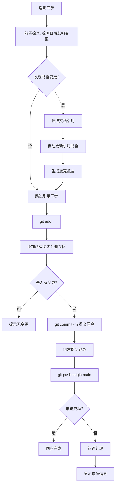

# GitHub同步推送

## 📋 指令概述

**GitHub同步推送**是一个简化的Git操作工具，通过一键命令完成本地项目到GitHub仓库的完整同步。自动执行添加、提交和推送操作，确保GitHub远程仓库与本地项目保持一致。

### 核心特性
- **智能前置检查**: 自动检测目录结构变更并同步文档引用
- **一键同步**: 单个命令完成全部Git操作
- **引用路径同步**: 自动更新所有文档中的路径引用
- **自动提交**: 使用时间戳生成提交信息
- **快速推送**: 直接推送到远程main分支
- **完整报告**: 生成详细的变更和同步报告

### 应用场景
- 智能体文件重命名后的自动引用同步
- 目录结构重组后的批量引用更新
- 项目开发阶段的快速同步
- 文档更新后的即时推送
- 配置修改后的版本保存
- 日常开发中的增量备份

## 🎯 核心功能(四步流程)

### 0. 前置检查：目录结构变更与引用同步
**目标**: 检测目录结构变更并自动同步文档引用

#### 0.1 检测目录结构变更

```bash
# 检测文件移动和重命名
git diff --name-status HEAD --diff-filter=R

# 检测新增和删除的文件（可能影响目录结构）
git diff --name-status HEAD --diff-filter=AD

# 检测暂存区中的重命名
git diff --cached --name-status --diff-filter=R
```

**检测内容**:
- 文件/目录重命名 (R = Renamed)
- 文件/目录移动（路径变化）
- 目录新增/删除 (A/D)
- 智能体文件位置调整
- Commands命令文件迁移

#### 0.2 扫描文档引用

**扫描范围**:
```yaml
目标文档:
  配置文档:
    - CLAUDE.md (项目级)
    - .claude/CLAUDE.md (系统级)
    - ~/.claude/CLAUDE.md (机器级)

  项目文档:
    - README.md
    - OVERVIEW.md
    - PRPs/*.md
    - reports/*.md

  智能体与命令:
    - .claude/agents/**/*.md
    - .claude/commands/*.md
    - .claude/skills/**/SKILL.md

引用类型识别:
  相对路径: .claude/agents/system/F1-*.md
  绝对路径: /Users/.../ZTL/.claude/agents/
  Markdown链接: [文本](.claude/agents/...)
  文件引用: @.claude/commands/G.md
  代码块路径: `.claude/agents/system/F1-*.md`
```

**扫描命令**:
```bash
# 扫描Markdown文件中的路径引用
grep -r --include="*.md" "旧路径" .

# 扫描特定模式的引用
grep -r --include="*.md" -E '\[.*\]\(.*\.claude.*\)' .
```

#### 0.3 自动同步引用路径

**同步策略**:
```yaml
检测到变更:
  步骤1 - 构建映射表:
    - 旧路径 → 新路径
    - 记录所有重命名/移动的文件

  步骤2 - 扫描引用:
    - 在所有文档中搜索旧路径
    - 识别引用类型和位置
    - 记录需要更新的文件

  步骤3 - 批量更新:
    - 使用Edit工具替换旧路径为新路径
    - 保持引用格式不变（相对/绝对路径）
    - 更新Markdown链接文本（如需要）

  步骤4 - 生成报告:
    - 列出所有更新的文件
    - 统计引用更新数量
    - 记录到execution log
```

**更新示例**:
```yaml
场景1 - 智能体重命名:
  检测: .claude/agents/system/test-engineer.md
        → .claude/agents/system/F12-测试工程师.md

  扫描引用:
    - .claude/CLAUDE.md: 3处引用
    - CLAUDE.md: 1处引用
    - README.md: 2处引用

  自动更新:
    ✅ 更新 .claude/CLAUDE.md (3处)
    ✅ 更新 CLAUDE.md (1处)
    ✅ 更新 README.md (2处)
    📊 总计: 3个文件, 6处引用

场景2 - 命令文件创建:
  检测: 新增 .claude/commands/T.md

  扫描引用:
    - 无旧路径引用需要更新

  自动更新:
    ℹ️ 新文件，无需路径同步

场景3 - 目录重组:
  检测: .claude/agents/创意组/ → .claude/agents/creative/

  扫描引用:
    - CLAUDE.md: 15处引用
    - .claude/CLAUDE.md: 8处引用
    - OVERVIEW.md: 5处引用

  自动更新:
    ✅ 批量替换所有引用
    📊 总计: 3个文件, 28处引用
```

#### 0.4 执行输出

**前置检查报告格式**:
```
━━━━━━━━━━━━━━━━━━━━━━━━━━━━━━━━━
📋 目录结构变更检测报告
━━━━━━━━━━━━━━━━━━━━━━━━━━━━━━━━━

🔍 检测到的变更:
  [R] .claude/agents/system/test-engineer.md
   → .claude/agents/system/F12-测试工程师.md

  [A] .claude/commands/T.md (新增)

━━━━━━━━━━━━━━━━━━━━━━━━━━━━━━━━━
🔗 引用路径扫描结果
━━━━━━━━━━━━━━━━━━━━━━━━━━━━━━━━━

需要更新的文档:
  📄 .claude/CLAUDE.md
     - 第47行: test-engineer → F12-测试工程师
     - 第128行: test-engineer → F12-测试工程师
     - 第201行: test-engineer → F12-测试工程师

  📄 CLAUDE.md
     - 第89行: test-engineer → F12-测试工程师

━━━━━━━━━━━━━━━━━━━━━━━━━━━━━━━━━
✅ 自动同步完成
━━━━━━━━━━━━━━━━━━━━━━━━━━━━━━━━━

更新统计:
  ✅ 更新文件: 2个
  ✅ 更新引用: 4处
  ⏱️ 耗时: 0.3秒

继续执行Git同步推送...
```

### 1. 添加所有变更
**目标**: 将所有本地修改添加到暂存区（包括前置检查的更新）

```bash
git add .
```

**作用**:
- 添加新文件
- 添加修改的文件
- 添加删除的文件
- 添加引用同步后的文档更新
- 递归处理所有子目录

### 2. 提交变更
**目标**: 创建包含时间戳的提交

```bash
git commit -m "项目同步更新 - $(date '+%Y-%m-%d %H:%M')"
```

**提交信息格式**:
```
项目同步更新 - 2025-09-30 14:30
```

**特点**:
- 自动生成时间戳
- 统一的提交信息格式
- 便于追踪同步历史

### 3. 推送到远程
**目标**: 将提交推送到GitHub

```bash
git push origin main
```

**推送目标**:
- 远程仓库: origin
- 目标分支: main
- 推送方式: 快进(fast-forward)

## 🔧 使用方法

### 不及物动词型（默认行为）

直接使用，无需参数：

```bash
/G
```

**执行效果**: 自动完成 前置检查(变更检测+引用同步) → add → commit → push 四步操作

## 📊 执行流程



## 🔍 意图解析逻辑

### 执行前检查
```yaml
前置检查 - 目录结构变更检测:
  变更类型识别:
    - 检测文件/目录重命名 (git diff --diff-filter=R)
    - 检测文件/目录移动（路径变化）
    - 检测新增/删除目录 (git diff --diff-filter=AD)
    - 识别暂存区变更 (git diff --cached)

  引用扫描范围:
    配置文档:
      - CLAUDE.md (项目级)
      - .claude/CLAUDE.md (系统级)
      - ~/.claude/CLAUDE.md (机器级)
    项目文档:
      - README.md, OVERVIEW.md
      - PRPs/*.md, reports/*.md
    智能体系统:
      - .claude/agents/**/*.md
      - .claude/commands/*.md
      - .claude/skills/**/SKILL.md

  自动同步机制:
    - 构建旧路径→新路径映射表
    - 使用Grep工具扫描引用
    - 使用Edit工具批量更新
    - 生成变更同步报告

状态检查:
  Git仓库验证:
    - 确认当前目录是Git仓库
    - 检查远程仓库配置
    - 验证分支状态

  变更检查:
    - 检测是否有未提交的变更
    - 识别新增、修改、删除的文件
    - 确认暂存区状态
    - 验证引用同步完成状态
```

### 分支处理
```yaml
分支策略:
  默认分支:
    - 推送到main分支
    - 适用于主开发分支

  分支切换:
    - 如果当前不在main分支
    - 自动检测当前分支
    - 推送到对应的远程分支
```

## 🎨 实现细节

### Git命令执行
```yaml
命令序列:
  步骤1 - 添加变更:
    命令: git add .
    作用域: 当前目录及所有子目录
    忽略: .gitignore中定义的文件

  步骤2 - 创建提交:
    命令: git commit
    信息: 自动生成（包含时间戳）
    签名: 使用Git配置的用户信息

  步骤3 - 推送远程:
    命令: git push origin main
    传输: SSH或HTTPS协议
    认证: 使用配置的凭据
```

### 时间戳生成
```yaml
格式定义:
  日期格式: YYYY-MM-DD
  时间格式: HH:MM
  完整示例: 2025-09-30 14:30

生成方式:
  - Windows: PowerShell Get-Date
  - Linux/Mac: date命令
  - 格式化: '+%Y-%m-%d %H:%M'
```

## ⚙️ 配置项

### 系统配置
```yaml
配置版本: v5.0.0
更新时间: 2025-10-22
目标分支: main
提交信息模板: "项目同步更新 - {timestamp}"
认证方式: Git凭据 (SSH/HTTPS)
前置检查: 启用 (自动检测目录变更+引用同步)
```

### 执行环境
```yaml
必需条件:
  - Git已安装并配置 (>= 2.20)
  - 当前目录是Git仓库
  - 远程仓库已配置(origin)
  - 有推送权限

认证配置:
  - SSH密钥认证 (推荐)
  - HTTPS + Git凭据管理
  - GitHub Personal Access Token

可选配置:
  - Git别名配置
  - 自定义提交模板
```

## 📝 示例场景

### 场景1：智能体文件重命名后同步

**操作**:
```bash
# 将test-engineer.md重命名为F12-测试工程师.md
# 然后执行
/G
```

**执行结果**:
```
━━━━━━━━━━━━━━━━━━━━━━━━━━━━━━━━━
📋 目录结构变更检测报告
━━━━━━━━━━━━━━━━━━━━━━━━━━━━━━━━━

🔍 检测到的变更:
  [R] .claude/agents/system/test-engineer.md
   → .claude/agents/system/F12-测试工程师.md

━━━━━━━━━━━━━━━━━━━━━━━━━━━━━━━━━
🔗 引用路径扫描结果
━━━━━━━━━━━━━━━━━━━━━━━━━━━━━━━━━

需要更新的文档:
  📄 .claude/CLAUDE.md (3处引用)
  📄 CLAUDE.md (1处引用)

━━━━━━━━━━━━━━━━━━━━━━━━━━━━━━━━━
✅ 自动同步完成
━━━━━━━━━━━━━━━━━━━━━━━━━━━━━━━━━

更新统计:
  ✅ 更新文件: 2个
  ✅ 更新引用: 4处
  ⏱️ 耗时: 0.3秒

继续执行Git同步推送...

✅ 添加变更: 3 个文件 (1 重命名, 2 引用更新)
✅ 创建提交: "项目同步更新 - 2025-10-22 14:30"
✅ 推送完成: main分支已更新
```

### 场景2：文档更新后同步（无路径变更）

**操作**:
```bash
# 修改了README.md和CLAUDE.md的内容
/G
```

**执行结果**:
```
━━━━━━━━━━━━━━━━━━━━━━━━━━━━━━━━━
📋 目录结构变更检测报告
━━━━━━━━━━━━━━━━━━━━━━━━━━━━━━━━━

🔍 检测结果: 无目录结构变更
ℹ️ 跳过引用路径扫描

继续执行Git同步推送...

✅ 添加变更: 2 个文件
✅ 创建提交: "项目同步更新 - 2025-10-22 15:45"
✅ 推送完成: 更新已同步到GitHub
```

### 场景3：目录重组后同步

**操作**:
```bash
# 将.claude/agents/创意组/重命名为.claude/agents/creative/
/G
```

**执行结果**:
```
━━━━━━━━━━━━━━━━━━━━━━━━━━━━━━━━━
📋 目录结构变更检测报告
━━━━━━━━━━━━━━━━━━━━━━━━━━━━━━━━━

🔍 检测到的变更:
  [R] .claude/agents/创意组/*.md
   → .claude/agents/creative/*.md

━━━━━━━━━━━━━━━━━━━━━━━━━━━━━━━━━
🔗 引用路径扫描结果
━━━━━━━━━━━━━━━━━━━━━━━━━━━━━━━━━

需要更新的文档:
  📄 CLAUDE.md (15处引用)
  📄 .claude/CLAUDE.md (8处引用)
  📄 OVERVIEW.md (5处引用)

━━━━━━━━━━━━━━━━━━━━━━━━━━━━━━━━━
✅ 自动同步完成
━━━━━━━━━━━━━━━━━━━━━━━━━━━━━━━━━

更新统计:
  ✅ 更新文件: 3个
  ✅ 更新引用: 28处
  ⏱️ 耗时: 0.8秒

继续执行Git同步推送...

✅ 添加变更: 15 个文件 (9 重命名, 3 引用更新, 3 其他)
✅ 创建提交: "项目同步更新 - 2025-10-22 16:20"
✅ 推送完成: 配置已备份
```

## 🔍 错误处理

### 常见错误类型

#### 1. 无变更可提交
```yaml
症状: git commit 提示 "nothing to commit"
原因: 所有文件都已提交，无新变更
处理: 提示用户无需同步，跳过提交和推送
```

#### 2. 推送被拒绝
```yaml
症状: git push 失败，提示 "rejected"
原因:
  - 远程有新提交未拉取
  - 本地分支落后于远程
  - 非快进(non-fast-forward)推送
处理:
  - 提示先执行 git pull
  - 或使用 git push --force-with-lease (谨慎)
```

#### 3. 认证失败
```yaml
症状: git push 提示权限错误
原因:
  - SSH密钥未配置
  - HTTPS凭据过期
  - 无仓库写入权限
处理:
  - 检查Git凭据配置
  - 验证GitHub访问权限
  - 重新配置认证信息
```

### 错误恢复策略
```yaml
自动恢复:
  无变更情况:
    - 友好提示用户
    - 不执行后续操作
    - 正常退出

冲突处理:
  远程冲突:
    - 建议执行 git pull --rebase
    - 手动解决冲突
    - 重新执行同步

手动介入:
  认证失败:
    - 提供配置指南链接
    - 引导用户检查设置
    - 建议联系管理员
```

## 📈 性能优化

### 推送效率优化
```yaml
增量推送:
  - Git自动计算差异
  - 仅传输变更对象
  - 压缩传输数据

网络优化:
  - 使用SSH协议（更快）
  - 启用Git传输压缩
  - 配置代理（如需要）
```

### 大文件处理
```yaml
最佳实践:
  - 使用.gitignore排除大文件
  - 考虑Git LFS存储大文件
  - 避免提交构建产物

警告阈值:
  - 单文件 > 50MB: 警告
  - 单次提交 > 100MB: 建议优化
```

## 🎯 成功标准

### 操作成功标准
```yaml
必达标准:
  ✅ 所有变更已添加
  ✅ 提交成功创建
  ✅ 推送到远程完成
  ✅ 远程仓库已更新
```

### 数据一致性
```yaml
一致性验证:
  ✅ 本地提交与远程一致
  ✅ 文件哈希值匹配
  ✅ 分支指针正确更新
```

## 🔗 相关资源

### 相关指令
- `/H` - GitHub仓库创建与同步
- `/Y` - GitHub Issue修复流程

### Git操作参考
```bash
# 查看状态
git status

# 查看提交历史
git log --oneline -10

# 查看远程仓库
git remote -v

# 强制推送（谨慎使用）
git push --force-with-lease
```

## ⚠️ 注意事项

### 使用限制
```yaml
适用场景:
  ✅ 日常开发同步
  ✅ 文档更新推送
  ✅ 配置变更备份
  ✅ 快速迭代开发

不适用场景:
  ❌ 需要详细提交信息的场景
  ❌ 多人协作需要精细控制
  ❌ 需要提交前Code Review
  ❌ 敏感数据提交（需仔细检查）
```

### 最佳实践
```yaml
执行前:
  - 检查.gitignore配置
  - 确认无敏感信息
  - 验证远程仓库地址

执行后:
  - 验证推送成功
  - 检查GitHub网页确认
  - 必要时通知团队成员

安全提醒:
  - 不要提交密钥和密码
  - 检查.env等配置文件
  - 使用.gitignore保护敏感数据
```

### 重要提醒
```yaml
关键原则:
  - 推送前确认无敏感数据
  - 提交信息虽简单但有时间戳
  - 适合个人项目或小团队
  - 大型团队建议使用详细提交信息

常见陷阱:
  - 忘记检查.gitignore
  - 提交了node_modules等大目录
  - 推送到错误的分支
  - 覆盖了他人的提交
```

---

**配置版本**: v5.1.0
**更新时间**: 2025-10-22
**核心升级**: 规范化front matter配置，新增allowed-tools和argument-hint字段
**维护原则**: 智能检测、自动同步、快速推送、规范化
**兼容性**: 使用标准Git命令，无需GitHub CLI