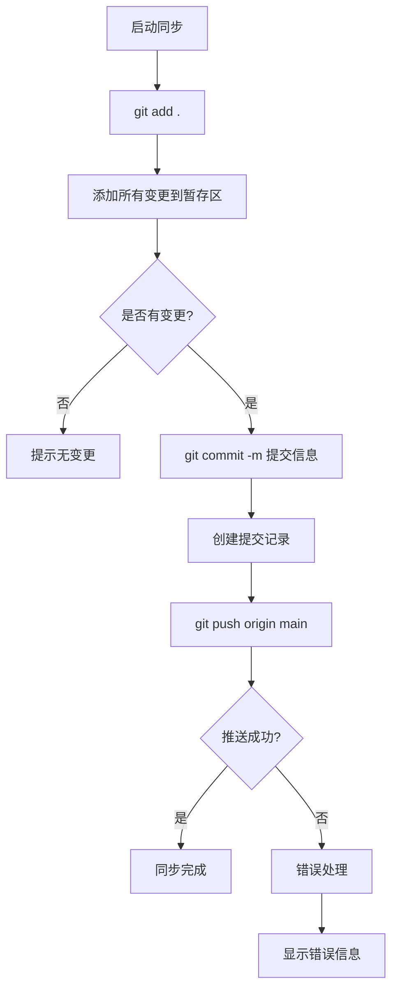

# GitHub同步推送

## 📋 指令概述

**GitHub同步推送**是一个简化的Git操作工具，通过一键命令完成本地项目到GitHub仓库的完整同步。自动执行添加、提交和推送操作，确保GitHub远程仓库与本地项目保持一致。

### 核心特性
- **一键同步**: 单个命令完成全部Git操作
- **自动提交**: 使用时间戳生成提交信息
- **快速推送**: 直接推送到远程main分支
- **简化流程**: 无需手动执行多个Git命令

### 应用场景
- 项目开发阶段的快速同步
- 文档更新后的即时推送
- 配置修改后的版本保存
- 日常开发中的增量备份

## 🎯 核心功能(三步流程)

### 1. 添加所有变更
**目标**: 将所有本地修改添加到暂存区

```bash
git add .
```

**作用**:
- 添加新文件
- 添加修改的文件
- 添加删除的文件
- 递归处理所有子目录

### 2. 提交变更
**目标**: 创建包含时间戳的提交

```bash
git commit -m "项目同步更新 - $(date '+%Y-%m-%d %H:%M')"
```

**提交信息格式**:
```
项目同步更新 - 2025-09-30 14:30
```

**特点**:
- 自动生成时间戳
- 统一的提交信息格式
- 便于追踪同步历史

### 3. 推送到远程
**目标**: 将提交推送到GitHub

```bash
git push origin main
```

**推送目标**:
- 远程仓库: origin
- 目标分支: main
- 推送方式: 快进(fast-forward)

## 🔧 使用方法

### 不及物动词型（默认行为）

直接使用，无需参数：

```bash
/G
```

**执行效果**: 自动完成 add → commit → push 三步操作

## 📊 执行流程



## 🔍 意图解析逻辑

### 执行前检查
```yaml
状态检查:
  Git仓库验证:
    - 确认当前目录是Git仓库
    - 检查远程仓库配置
    - 验证分支状态

  变更检查:
    - 检测是否有未提交的变更
    - 识别新增、修改、删除的文件
    - 确认暂存区状态
```

### 分支处理
```yaml
分支策略:
  默认分支:
    - 推送到main分支
    - 适用于主开发分支

  分支切换:
    - 如果当前不在main分支
    - 自动检测当前分支
    - 推送到对应的远程分支
```

## 🎨 实现细节

### Git命令执行
```yaml
命令序列:
  步骤1 - 添加变更:
    命令: git add .
    作用域: 当前目录及所有子目录
    忽略: .gitignore中定义的文件

  步骤2 - 创建提交:
    命令: git commit
    信息: 自动生成（包含时间戳）
    签名: 使用Git配置的用户信息

  步骤3 - 推送远程:
    命令: git push origin main
    传输: SSH或HTTPS协议
    认证: 使用配置的凭据
```

### 时间戳生成
```yaml
格式定义:
  日期格式: YYYY-MM-DD
  时间格式: HH:MM
  完整示例: 2025-09-30 14:30

生成方式:
  - Windows: PowerShell Get-Date
  - Linux/Mac: date命令
  - 格式化: '+%Y-%m-%d %H:%M'
```

## ⚙️ 配置项

### 系统配置
```yaml
配置版本: v3.0.0
更新时间: 2025-09-30
目标分支: main
提交信息模板: "项目同步更新 - {timestamp}"
```

### 执行环境
```yaml
必需条件:
  - Git已安装并配置
  - 当前目录是Git仓库
  - 远程仓库已配置(origin)
  - 有推送权限

可选配置:
  - SSH密钥认证
  - HTTPS凭据缓存
  - Git别名配置
```

## 📝 示例场景

### 场景1：文档更新后同步

**操作**:
```bash
# 修改了README.md和CLAUDE.md
/G
```

**执行结果**:
```
✅ 添加变更: 2 个文件
✅ 创建提交: "项目同步更新 - 2025-09-30 14:30"
✅ 推送完成: main分支已更新
```

### 场景2：代码修改后备份

**操作**:
```bash
# 完成一个功能开发
/G
```

**执行结果**:
```
✅ 添加变更: 5 个文件 (3 修改, 2 新增)
✅ 创建提交: "项目同步更新 - 2025-09-30 15:45"
✅ 推送完成: 更新已同步到GitHub
```

### 场景3：配置调整后保存

**操作**:
```bash
# 修改了.claude/settings.json
/G
```

**执行结果**:
```
✅ 添加变更: 1 个文件
✅ 创建提交: "项目同步更新 - 2025-09-30 16:20"
✅ 推送完成: 配置已备份
```

## 🔍 错误处理

### 常见错误类型

#### 1. 无变更可提交
```yaml
症状: git commit 提示 "nothing to commit"
原因: 所有文件都已提交，无新变更
处理: 提示用户无需同步，跳过提交和推送
```

#### 2. 推送被拒绝
```yaml
症状: git push 失败，提示 "rejected"
原因:
  - 远程有新提交未拉取
  - 本地分支落后于远程
  - 非快进(non-fast-forward)推送
处理:
  - 提示先执行 git pull
  - 或使用 git push --force-with-lease (谨慎)
```

#### 3. 认证失败
```yaml
症状: git push 提示权限错误
原因:
  - SSH密钥未配置
  - HTTPS凭据过期
  - 无仓库写入权限
处理:
  - 检查Git凭据配置
  - 验证GitHub访问权限
  - 重新配置认证信息
```

### 错误恢复策略
```yaml
自动恢复:
  无变更情况:
    - 友好提示用户
    - 不执行后续操作
    - 正常退出

冲突处理:
  远程冲突:
    - 建议执行 git pull --rebase
    - 手动解决冲突
    - 重新执行同步

手动介入:
  认证失败:
    - 提供配置指南链接
    - 引导用户检查设置
    - 建议联系管理员
```

## 📈 性能优化

### 推送效率优化
```yaml
增量推送:
  - Git自动计算差异
  - 仅传输变更对象
  - 压缩传输数据

网络优化:
  - 使用SSH协议（更快）
  - 启用Git传输压缩
  - 配置代理（如需要）
```

### 大文件处理
```yaml
最佳实践:
  - 使用.gitignore排除大文件
  - 考虑Git LFS存储大文件
  - 避免提交构建产物

警告阈值:
  - 单文件 > 50MB: 警告
  - 单次提交 > 100MB: 建议优化
```

## 🎯 成功标准

### 操作成功标准
```yaml
必达标准:
  ✅ 所有变更已添加
  ✅ 提交成功创建
  ✅ 推送到远程完成
  ✅ 远程仓库已更新
```

### 数据一致性
```yaml
一致性验证:
  ✅ 本地提交与远程一致
  ✅ 文件哈希值匹配
  ✅ 分支指针正确更新
```

## 🔗 相关资源

### 相关指令
- `/H` - GitHub仓库创建与同步
- `/Y` - GitHub Issue修复流程

### Git操作参考
```bash
# 查看状态
git status

# 查看提交历史
git log --oneline -10

# 查看远程仓库
git remote -v

# 强制推送（谨慎使用）
git push --force-with-lease
```

## ⚠️ 注意事项

### 使用限制
```yaml
适用场景:
  ✅ 日常开发同步
  ✅ 文档更新推送
  ✅ 配置变更备份
  ✅ 快速迭代开发

不适用场景:
  ❌ 需要详细提交信息的场景
  ❌ 多人协作需要精细控制
  ❌ 需要提交前Code Review
  ❌ 敏感数据提交（需仔细检查）
```

### 最佳实践
```yaml
执行前:
  - 检查.gitignore配置
  - 确认无敏感信息
  - 验证远程仓库地址

执行后:
  - 验证推送成功
  - 检查GitHub网页确认
  - 必要时通知团队成员

安全提醒:
  - 不要提交密钥和密码
  - 检查.env等配置文件
  - 使用.gitignore保护敏感数据
```

### 重要提醒
```yaml
关键原则:
  - 推送前确认无敏感数据
  - 提交信息虽简单但有时间戳
  - 适合个人项目或小团队
  - 大型团队建议使用详细提交信息

常见陷阱:
  - 忘记检查.gitignore
  - 提交了node_modules等大目录
  - 推送到错误的分支
  - 覆盖了他人的提交
```

---

**配置版本**: v3.0.0
**更新时间**: 2025-09-30
**维护原则**: 简化流程、快速同步