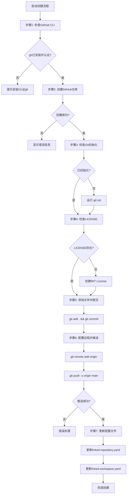

# GitHub仓库创建与同步

## 📋 指令概述

**GitHub仓库创建与同步**是一个自动化的仓库初始化工具，通过单个命令完成从本地项目到GitHub远程仓库的完整创建和同步流程。自动处理仓库创建、Git初始化、远程配置和首次推送，确保项目快速上线。

### 核心特性
- **一键创建**: 自动创建GitHub远程仓库
- **智能初始化**: 自动配置Git和远程连接
- **灵活配置**: 支持公开/私有仓库选择
- **完整同步**: 首次推送所有本地内容

### 应用场景
- 新项目快速上线GitHub
- 本地项目迁移到远程
- 团队协作仓库初始化
- 开源项目发布准备

## 🎯 核心功能(七步流程)

### 1. GitHub CLI状态检查
**目标**: 确保GitHub CLI (gh) 已安装并正确认证

**检查内容**:
- 验证gh工具已安装
- 确认GitHub认证状态 (`gh auth status`)
- 检查仓库创建权限

### 2. 仓库创建
**目标**: 在GitHub创建新的远程仓库

```bash
gh repo create [仓库名] --public --source=. --remote=origin
```

**创建选项**:
- 仓库名称: 默认使用当前工作区目录名
- 可见性: --public (公开仓库) 或 --private (私有仓库)
- 源目录: --source=. (当前目录)
- 远程名称: --remote=origin (自动配置remote)

### 3. Git初始化
**目标**: 初始化本地Git仓库（如果尚未初始化）

```bash
git init
```

**初始化检查**:
- 检查当前目录是否为Git仓库
- 如果不是，则运行 `git init`
- 创建.git目录
- 设置默认分支（main）

### 4. LICENSE文件创建
**目标**: 创建标准的MIT License文件（如果不存在）

**检查逻辑**:
- 检查项目根目录是否已存在LICENSE文件
- 如果不存在，创建标准MIT License文件

**LICENSE模板**:
```
MIT License

Copyright (c) [year] [fullname]

Permission is hereby granted, free of charge, to any person obtaining a copy
of this software and associated documentation files (the "Software"), to deal
in the Software without restriction, including without limitation the rights
to use, copy, modify, merge, publish, distribute, sublicense, and/or sell
copies of the Software, and to permit persons to whom the Software is
furnished to do so, subject to the following conditions:

The above copyright notice and this permission notice shall be included in all
copies or substantial portions of the Software.

THE SOFTWARE IS PROVIDED "AS IS", WITHOUT WARRANTY OF ANY KIND, EXPRESS OR
IMPLIED, INCLUDING BUT NOT LIMITED TO THE WARRANTIES OF MERCHANTABILITY,
FITNESS FOR A PARTICULAR PURPOSE AND NONINFRINGEMENT. IN NO EVENT SHALL THE
AUTHORS OR COPYRIGHT HOLDERS BE LIABLE FOR ANY CLAIM, DAMAGES OR OTHER
LIABILITY, WHETHER IN AN ACTION OF CONTRACT, TORT OR OTHERWISE, ARISING FROM,
OUT OF OR IN CONNECTION WITH THE SOFTWARE OR THE USE OR OTHER DEALINGS IN THE
SOFTWARE.
```

### 5. 初始提交
**目标**: 添加所有文件并创建初始提交

```bash
git add .
git commit -m "Initial commit"
```

**提交内容**:
- 所有新文件（包括新创建的LICENSE）
- 所有修改的文件
- 遵循.gitignore规则

### 6. 远程同步
**目标**: 与远程仓库建立连接并推送

```bash
# 添加远程仓库
git remote add origin [仓库URL]

# 推送到远程main分支
git push -u origin main
```

**同步操作**:
- 添加GitHub仓库为远程origin
- 推送到main分支
- 设置本地main分支跟踪远程main分支

### 7. 配置文件更新
**目标**: 更新本地链接仓库和工作区配置

**更新链接仓库配置** (`.claude/configs/linked-repository.yaml`):
- 读取现有配置文件
- 检查现有仓库条目数量
- 添加新仓库条目（格式：`repository-{x}: https://github.com/username/repo-name.git`）
- 如果文件不存在，创建并添加第一个条目

**更新链接工作区配置** (`.claude/configs/linked-workspace.yaml`):
- 读取现有配置文件
- 检查现有工作区条目数量
- 添加新工作区条目（格式：`workspace-{x}: /absolute/path/to/workspace`）
- 如果文件不存在，创建并添加第一个条目

## 🔧 使用方法

### 不及物动词型（默认行为）

直接使用，无需参数：

```bash
/H
```

**执行效果**:
- 使用当前工作区目录名作为仓库名
- 创建私有仓库
- 自动完成所有7个步骤

## 📊 执行流程



## 🔍 意图解析逻辑

### 参数变量识别
```yaml
工作区目录名:
  获取方式: 自动获取当前工作区目录名称
  用途: 作为GitHub仓库名称
  示例: MyAwesomeProject → 仓库名为 MyAwesomeProject
```

### 自动化决策
```yaml
Git初始化决策:
  检查: 当前目录是否为Git仓库
  是: 跳过初始化
  否: 执行 git init

LICENSE决策:
  检查: 项目根目录是否存在LICENSE文件
  是: 跳过创建
  否: 创建MIT License文件

配置文件更新:
  linked-repository.yaml:
    - 读取现有条目数量
    - 生成下一个序号
    - 添加新仓库条目

  linked-workspace.yaml:
    - 读取现有条目数量
    - 生成下一个序号
    - 添加新工作区条目
```

## 🎨 实现细节

### GitHub仓库创建
```yaml
命令: gh repo create
参数:
  - 仓库名: 当前工作区目录名
  - 可见性: --public (公开) 或 --private (私有)
  - 源目录: --source=. (当前目录)
  - 远程配置: --remote=origin (自动添加remote)

执行示例:
  gh repo create MyAwesomeProject --public --source=. --remote=origin
```

### Git配置
```yaml
初始化:
  命令: git init
  条件: 仅当当前目录不是Git仓库时执行
  说明: gh repo create使用--source=.时会自动初始化

远程配置:
  添加远程: gh repo create会自动配置origin
  推送并跟踪: git push -u origin main
  说明: 使用--remote=origin参数自动添加remote
```

### 配置文件格式
```yaml
linked-repository.yaml格式:
  repository-0: https://github.com/username/repo1.git
  repository-1: https://github.com/username/repo2.git
  repository-{x}: https://github.com/username/new-repo.git

linked-workspace.yaml格式:
  workspace-0: /path/to/workspace1
  workspace-1: /path/to/workspace2
  workspace-{x}: /path/to/new-workspace
```

## ⚙️ 配置项

### 系统配置
```yaml
配置版本: v3.0.0
更新时间: 2025-10-21
默认仓库类型: public
默认分支: main
LICENSE类型: MIT
```

### 必需环境
```yaml
必需工具:
  - Git (>= 2.20)
  - GitHub CLI (gh) (>= 2.0)
  - Claude Code v2.0+

必需配置:
  - Git用户信息配置 (git config user.name/email)
  - GitHub CLI认证 (gh auth login)
  - 仓库创建权限
```

### 配置文件路径
```yaml
仓库配置: .claude/configs/linked-repository.yaml
工作区配置: .claude/configs/linked-workspace.yaml
```

## 📝 示例场景

### 场景1：新项目快速上线

**前提条件**:
- 当前工作区: `d:\@ZEN-VOID\Round-0\MyAwesomeProject`
- GitHub用户名: `CoderPro`

**操作**:
```bash
/H
```

**执行结果**:
```
✅ GitHub CLI已就绪 (gh v2.40.1)
✅ 认证状态: 已登录为 CoderPro
✅ 创建公开仓库: https://github.com/CoderPro/MyAwesomeProject
✅ Git初始化完成
✅ 远程origin自动配置
✅ 创建LICENSE文件
✅ 添加所有文件
✅ 初始提交: "Initial commit: MyAwesomeProject v1.0"
✅ 推送到GitHub: main分支
✅ 更新linked-repository.yaml:
    repository-1: https://github.com/CoderPro/MyAwesomeProject.git
✅ 更新linked-workspace.yaml:
    workspace-1: d:\@ZEN-VOID\Round-0\MyAwesomeProject
🎉 项目已成功上线GitHub!
```

### 场景2：已有Git仓库的项目

**前提条件**:
- 本地已有Git仓库
- 需要推送到新的GitHub仓库

**操作**:
```bash
/H
```

**执行结果**:
```
✅ GitHub CLI已就绪
✅ 认证状态: 已登录
✅ 创建公开仓库: https://github.com/CoderPro/ExistingProject
⚠️ 检测到已有Git仓库，跳过初始化
✅ LICENSE文件已存在，跳过创建
✅ 添加所有文件（包括新修改）
✅ 初始提交: "Initial commit: ExistingProject migration"
✅ 远程origin自动配置
✅ 推送所有提交历史到GitHub
✅ 更新配置文件
🎉 项目迁移完成!
```

### 场景3：多个仓库管理

**配置文件示例**:

**linked-repository.yaml**:
```yaml
repository-0: https://github.com/CoderPro/ExistingProject.git
repository-1: https://github.com/CoderPro/MyAwesomeProject.git
repository-2: https://github.com/CoderPro/NewProject.git
```

**linked-workspace.yaml**:
```yaml
workspace-0: d:\@ZEN-VOID\Round-0\ExistingProject
workspace-1: d:\@ZEN-VOID\Round-0\MyAwesomeProject
workspace-2: d:\@ZEN-VOID\Round-0\NewProject
```

## 🔍 错误处理

### 常见错误类型

#### 1. GitHub CLI未安装或未认证
```yaml
症状: 提示 "gh: command not found" 或 "not logged in"
原因: GitHub CLI未安装或未完成认证
处理:
  - macOS: brew install gh
  - Windows: winget install GitHub.cli
  - Linux: 参考官方文档
  - 认证: gh auth login
```

#### 2. 仓库名称冲突
```yaml
症状: gh repo create 提示 "repository already exists"
原因: GitHub账号下已有同名仓库
处理:
  - 提示用户仓库已存在
  - 建议修改本地目录名
  - 或手动指定不同的仓库名
```

#### 3. Git配置缺失
```yaml
症状: git commit 提示 "Please tell me who you are"
原因: 未配置Git用户信息
处理:
  - 引导配置用户信息:
    git config --global user.name "Your Name"
    git config --global user.email "your@email.com"
```

#### 4. 推送权限错误
```yaml
症状: git push 提示 "Permission denied"
原因: 认证失败或权限不足
处理:
  - 检查GitHub认证状态: gh auth status
  - 重新认证: gh auth login
  - 验证仓库访问权限
```

#### 5. 配置文件错误
```yaml
症状: 配置文件读取或写入失败
原因: 文件格式错误或权限问题
处理:
  - 验证YAML格式正确性
  - 检查目录和文件权限
  - 必要时重新创建配置文件
```

### 错误恢复策略
```yaml
自动恢复:
  GitHub仓库创建失败:
    - 停止后续操作
    - 保留本地Git配置
    - 提供详细错误信息

  推送失败:
    - 保留本地提交
    - 保留远程配置
    - 提供手动推送指南

回滚机制:
  部分步骤失败:
    - 不自动删除已创建的远程仓库
    - 保留本地所有配置
    - 提供手动完成剩余步骤的指令
```

## 📈 性能优化

### 批量文件处理
```yaml
.gitignore配置:
  推荐排除:
    - node_modules/
    - .env
    - *.log
    - build/
    - dist/

首次推送优化:
  - Git自动压缩传输
  - 显示推送进度
  - 支持大文件传输（需Git LFS）
```

### 配置文件管理
```yaml
YAML读写优化:
  - 使用高效的YAML解析器
  - 保留原有格式和注释
  - 增量更新而非完全重写
```

## 🎯 成功标准

### 操作成功标准
```yaml
必达标准:
  ✅ GitHub仓库创建成功
  ✅ 本地Git初始化完成（或已跳过）
  ✅ LICENSE文件存在
  ✅ 初始提交成功
  ✅ 远程配置正确
  ✅ 首次推送成功
  ✅ linked-repository.yaml已更新
  ✅ linked-workspace.yaml已更新
```

### 验证方法
```yaml
本地验证:
  - git status: 工作区干净
  - git remote -v: 远程配置正确
  - git branch -vv: 分支跟踪正确
  - 检查LICENSE文件存在

远程验证:
  - 访问GitHub仓库URL
  - 确认文件已上传
  - 检查LICENSE文件
  - 验证提交历史

配置验证:
  - 检查linked-repository.yaml内容正确
  - 检查linked-workspace.yaml内容正确
  - 验证配置文件格式
```

## 🔗 相关资源

### 相关指令
- `/G` - GitHub仓库同步推送
- `/Y` - GitHub Issue修复流程

### GitHub CLI参考
```bash
# 查看仓库列表
gh repo list

# 查看仓库信息
gh repo view [仓库名]

# 克隆仓库
gh repo clone [仓库名]

# 检查认证状态
gh auth status

# 重新认证
gh auth login
```

### Git命令参考
```bash
# 查看远程仓库
git remote -v

# 查看分支跟踪
git branch -vv

# 查看提交历史
git log --oneline

# 查看仓库状态
git status
```

## ⚠️ 注意事项

### 使用限制
```yaml
适用场景:
  ✅ 新项目初始化
  ✅ 本地项目首次推送
  ✅ 私有仓库创建
  ✅ 单人项目管理

不适用场景:
  ❌ 现有远程仓库管理
  ❌ 公开仓库创建（默认私有）
  ❌ 复杂的仓库配置
  ❌ 团队协作权限配置
```

### 最佳实践
```yaml
执行前:
  - 确认GitHub CLI已安装并认证 (gh auth status)
  - 检查Git用户信息配置 (git config --list)
  - 准备好.gitignore文件
  - 确认目录名称符合GitHub规范

执行后:
  - 验证仓库创建成功
  - 检查LICENSE文件正确性
  - 验证配置文件更新
  - 访问GitHub确认推送成功

安全提醒:
  - 不要推送敏感信息
  - 配置正确的.gitignore
  - 私有仓库注意访问控制
  - LICENSE信息准确填写
```

### 重要提醒
```yaml
关键原则:
  - 仓库名称基于目录名，确保命名规范
  - 默认创建私有仓库，保护代码安全
  - 自动创建MIT License，注意版权信息
  - 配置文件自动更新，便于项目管理

常见陷阱:
  - 目录名不符合GitHub命名规范
  - 忘记配置.gitignore导致推送敏感文件
  - LICENSE年份和作者信息需要手动修改
  - 多个工作区可能导致配置文件过大
```

---

**配置版本**: v3.0.0
**更新时间**: 2025-10-21
**维护原则**: 自动化、一致性、准确性
**主要变更**: 从GitHub MCP迁移到GitHub CLI (gh)