# 根目录README更新指令

## 📋 指令概述

**根目录README更新指令（/I）**是一个全自动化的项目文档生成工具，通过深度分析项目结构、智能提取项目信息、集成chart-mcp数据可视化，生成GitHub专业主页级别的README.md文档。

### 核心特性
- **前置更新**: 自动更新trees目录快照，确保目录结构信息最新
- **深度分析**: 增强的ProjectAnalyzer进行全方位项目洞察
- **智能生成**: 95%以上自动化信息提取和内容生成
- **数据可视化**: 集成chart-mcp生成专业图表
- **模板优化**: 改进的README结构，层次更清晰

### 版本亮点 (v3.0.0)
- ✨ 全新的ProjectAnalyzer类，提供7维度项目分析
- ✨ 改进的README模板结构
- ✨ 自动集成trees/目录最新快照
- ✨ 增强的数据可视化支持
- ✨ 更准确的技术栈检测

## 🎯 核心功能

### 1. 前置树快照更新

在生成README前，自动更新trees/目录快照：

```python
class TreeSnapshotManager:
    """Trees目录快照管理器"""

    def update_before_readme(self):
        """README生成前更新快照"""
        # 1. 生成3种格式快照
        self._generate_dirs_list()        # dirs_*.txt
        self._generate_full_tree()        # tree_full_*.txt
        self._generate_structured_doc()   # tree_structure_*.md

        # 2. 更新trees/README.md统计
        self._update_trees_readme()

        # 3. 清理旧快照(保留最新10个)
        self._cleanup_old_snapshots(keep=10)
```

### 2. 深度项目分析

增强的ProjectAnalyzer提供7维度分析：

```python
class ProjectAnalyzer:
    """项目智能分析器（增强版）"""

    def analyze_comprehensively(self) -> ProjectProfile:
        """全面分析项目"""
        return {
            "basic_info": self._extract_basic_info(),
            "tech_stack": self._detect_tech_stack(),
            "architecture": self._analyze_architecture(),
            "features": self._extract_features(),
            "agents_system": self._analyze_agents(),
            "commands_system": self._analyze_commands(),
            "statistics": self._calculate_statistics()
        }

    def _extract_basic_info(self) -> Dict:
        """提取基本信息"""
        return {
            "name": self._get_project_name(),
            "description": self._get_description(),
            "version": self._get_version(),
            "license": self._detect_license(),
            "authors": self._detect_authors()
        }

    def _analyze_architecture(self) -> Dict:
        """分析项目架构"""
        return {
            "pattern": self._detect_architecture_pattern(),
            "layers": self._analyze_layers(),
            "modules": self._analyze_modules(),
            "dependencies": self._analyze_dependencies()
        }

    def _calculate_statistics(self) -> Dict:
        """计算项目统计数据"""
        return {
            "total_files": self._count_files(),
            "total_lines": self._count_lines(),
            "languages_distribution": self._analyze_languages(),
            "code_quality_score": self._calculate_quality_score()
        }
```

### 3. 改进的README结构

新的README模板采用更清晰的层次结构：

```markdown
# [项目名称]

[徽章系统 - 状态、技术栈、平台]

## 📖 项目简介
[一句话描述 + 核心价值主张]

## ✨ 核心特性
[3-5个亮点特性]

## 🏗️ 技术架构

### 技术栈
[技术栈表格 + 可视化图表]

### 架构模式
[架构图 + 说明]

## 📁 项目结构
[基于trees/最新快照的目录树]

## 🚀 快速开始

### 环境要求
### 安装步骤
### 使用指南

## 🤖 智能体系统
[如果存在.claude/agents]

## 📜 命令系统
[如果存在.claude/commands]

## 📊 项目统计
[数据可视化图表]

## 🛣️ 开发路线图
[如果存在TODO或ROADMAP]

## 📦 版本历史
[版本记录]

## 📄 许可证
[许可证信息]

## 👥 贡献者
[贡献者列表]

---
**⭐ 如果这个项目对您有帮助，请给我们一个Star！**
```

### 4. 增强的技术栈检测

```python
class TechStackDetector:
    """技术栈检测器（增强版）"""

    def detect_all(self) -> Dict[str, List[str]]:
        """检测所有技术栈"""
        return {
            "languages": self._detect_languages(),
            "frameworks": self._detect_frameworks(),
            "tools": self._detect_tools(),
            "platforms": self._detect_platforms(),
            "databases": self._detect_databases(),
            "cloud_services": self._detect_cloud_services()
        }

    def _detect_databases(self) -> List[str]:
        """检测数据库"""
        databases = set()

        # 检测PostgreSQL
        if self._check_dependency("psycopg2") or \
           self._check_dependency("asyncpg"):
            databases.add("PostgreSQL")

        # 检测MongoDB
        if self._check_dependency("pymongo"):
            databases.add("MongoDB")

        # 检测Redis
        if self._check_dependency("redis"):
            databases.add("Redis")

        return sorted(list(databases))

    def _detect_cloud_services(self) -> List[str]:
        """检测云服务"""
        services = set()

        # 检测Supabase
        if self._check_dependency("supabase"):
            services.add("Supabase")

        # 检测AWS
        if self._check_dependency("boto3"):
            services.add("AWS")

        return sorted(list(services))
```

### 5. 数据可视化增强

```python
class ChartGenerator:
    """图表生成器（增强版）"""

    def generate_all_charts(
        self,
        tech_stack: Dict,
        statistics: Dict,
        agents: List,
        commands: List
    ) -> Dict[str, str]:
        """生成所有图表"""
        return {
            "tech_stack_pie": self._generate_tech_stack_chart(tech_stack),
            "language_distribution": self._generate_language_chart(statistics),
            "agents_distribution": self._generate_agents_chart(agents),
            "commands_distribution": self._generate_commands_chart(commands),
            "code_quality_radar": self._generate_quality_radar(statistics)
        }

    def _generate_quality_radar(self, statistics: Dict) -> str:
        """生成代码质量雷达图"""
        data = [
            {"name": "代码覆盖率", "value": statistics.get("coverage", 0)},
            {"name": "文档完整度", "value": statistics.get("doc_coverage", 0)},
            {"name": "代码规范性", "value": statistics.get("code_style", 0)},
            {"name": "测试完整度", "value": statistics.get("test_coverage", 0)},
            {"name": "性能指标", "value": statistics.get("performance", 0)}
        ]

        return self._call_chart_mcp("radar", data, "代码质量评估")
```

## 🔧 使用方法

### 标准调用

```bash
/I
```

**执行流程**:
1. 🌲 更新trees目录快照（3个文件）
2. 🔍 深度分析项目（7个维度）
3. 📊 生成数据可视化（5种图表）
4. 📝 生成README.md（完整结构）
5. 💾 备份旧README（如果存在）

### 执行效果

```yaml
执行结果:
  前置操作:
    ✅ 更新trees/dirs_20251020.txt
    ✅ 更新trees/tree_full_20251020.txt
    ✅ 更新trees/tree_structure_20251020.md
    ✅ 更新trees/README.md统计信息
    ✅ 清理旧快照（保留最新10个）

  项目分析:
    ✅ 基本信息: 项目名称、描述、版本、许可证
    ✅ 技术栈: 6个类别，共25项技术
    ✅ 架构模式: 检测到三层架构
    ✅ 功能特性: 提取到12个核心特性
    ✅ 智能体系统: 58个智能体，9个组织单元
    ✅ 命令系统: 26个命令，4个类别
    ✅ 项目统计: 文件数、代码行数、质量分数

  README生成:
    ✅ 徽章系统（15个徽章）
    ✅ 项目简介（200字）
    ✅ 核心特性（5个亮点）
    ✅ 技术架构（表格+图表）
    ✅ 项目结构（基于trees快照）
    ✅ 快速开始（环境+安装+使用）
    ✅ 智能体系统（58个智能体）
    ✅ 命令系统（26个命令）
    ✅ 项目统计（5种图表）
    ✅ 版本历史（v3.0.0）

  文件操作:
    ✅ 备份README.md → README.md.backup.20251020
    ✅ 写入README.md（25KB）
```

## 📊 执行流程

```mermaid
graph TD
    A[启动/I指令] --> B[阶段1: 前置更新]
    B --> B1[更新trees/快照]
    B1 --> B2[生成3种格式文件]
    B2 --> B3[更新统计信息]
    B3 --> B4[清理旧快照]

    B4 --> C[阶段2: 深度分析]
    C --> C1[提取基本信息]
    C1 --> C2[检测技术栈]
    C2 --> C3[分析架构模式]
    C3 --> C4[提取功能特性]
    C4 --> C5[分析智能体系统]
    C5 --> C6[分析命令系统]
    C6 --> C7[计算项目统计]

    C7 --> D[阶段3: 内容生成]
    D --> D1[生成徽章系统]
    D1 --> D2[生成项目简介]
    D2 --> D3[生成核心特性]
    D3 --> D4[生成技术架构]
    D4 --> D5[生成项目结构]
    D5 --> D6[生成快速开始]
    D6 --> D7[生成系统文档]
    D7 --> D8[生成项目统计]

    D8 --> E[阶段4: 数据可视化]
    E --> E1[技术栈分布图]
    E1 --> E2[语言分布图]
    E2 --> E3[智能体分布图]
    E3 --> E4[命令分布图]
    E4 --> E5[质量雷达图]

    E5 --> F[阶段5: 文件操作]
    F --> F1[备份现有README]
    F1 --> F2[写入新README]
    F2 --> F3[验证格式正确]
    F3 --> G[完成]
```



## 🎨 实现细节

### ProjectAnalyzer类

```python
from pathlib import Path
from typing import Dict, List
import re
import json

class ProjectAnalyzer:
    """项目智能分析器"""

    def __init__(self, project_root: Path):
        self.project_root = project_root
        self.claude_md = project_root / "CLAUDE.md"
        self.package_json = project_root / "package.json"
        self.pyproject_toml = project_root / "pyproject.toml"
        self.requirements = project_root / "requirements.txt"

    def _get_project_name(self) -> str:
        """获取项目名称"""
        # 优先从CLAUDE.md提取
        if self.claude_md.exists():
            content = self.claude_md.read_text(encoding='utf-8')
            match = re.search(r'^#\s+(.+)', content, re.MULTILINE)
            if match:
                return match.group(1).strip()

        # 从package.json提取
        if self.package_json.exists():
            data = json.loads(self.package_json.read_text())
            if "name" in data:
                return data["name"]

        # 使用目录名
        return self.project_root.name

    def _detect_architecture_pattern(self) -> str:
        """检测架构模式"""
        # 检测三层架构
        if (self.project_root / ".claude" / "commands").exists() and \
           (self.project_root / "scripts" / "configs").exists():
            return "三层架构"

        # 检测MVC
        if (self.project_root / "models").exists() and \
           (self.project_root / "views").exists() and \
           (self.project_root / "controllers").exists():
            return "MVC架构"

        # 检测微服务
        if (self.project_root / "services").exists() and \
           len(list((self.project_root / "services").iterdir())) > 3:
            return "微服务架构"

        return "单体架构"
```

### READMEGenerator类

```python
class READMEGenerator:
    """README生成器"""

    def __init__(
        self,
        project_profile: Dict,
        tech_stack: Dict,
        charts: Dict
    ):
        self.profile = project_profile
        self.tech_stack = tech_stack
        self.charts = charts

    def generate(self) -> str:
        """生成完整README"""
        sections = []

        # 标题和徽章
        sections.append(self._generate_header())
        sections.append(self._generate_badges())
        sections.append("")

        # 项目简介
        sections.append(self._generate_introduction())
        sections.append("")

        # 核心特性
        sections.append(self._generate_features())
        sections.append("")

        # 技术架构
        sections.append(self._generate_tech_architecture())
        sections.append("")

        # 项目结构
        sections.append(self._generate_project_structure())
        sections.append("")

        # 快速开始
        sections.append(self._generate_quick_start())
        sections.append("")

        # 系统文档（智能体+命令）
        if self.profile.get("agents_system"):
            sections.append(self._generate_agents_section())
            sections.append("")

        if self.profile.get("commands_system"):
            sections.append(self._generate_commands_section())
            sections.append("")

        # 项目统计
        sections.append(self._generate_statistics())
        sections.append("")

        # 版本历史
        sections.append(self._generate_version_history())
        sections.append("")

        # 结尾
        sections.append(self._generate_footer())

        return "\n".join(sections)

    def _generate_header(self) -> str:
        """生成标题"""
        name = self.profile["basic_info"]["name"]
        return f"# {name}"

    def _generate_introduction(self) -> str:
        """生成项目简介"""
        intro = []
        intro.append("## 📖 项目简介")
        intro.append("")
        intro.append(self.profile["basic_info"]["description"])
        intro.append("")
        intro.append("**核心价值**: " + self.profile.get("core_value", ""))
        return "\n".join(intro)
```

## 🎯 成功标准

```yaml
操作成功:
  ✅ trees/目录快照已更新（3个文件）
  ✅ 项目分析完成（7个维度）
  ✅ README.md生成成功
  ✅ 数据图表嵌入成功（5种）
  ✅ 格式验证通过
  ✅ 旧文件已备份

质量标准:
  ✅ 信息准确率 > 95%
  ✅ 目录树与实际一致（基于最新快照）
  ✅ 技术栈检测准确
  ✅ 图表数据正确
  ✅ Markdown格式规范
  ✅ 所有链接有效

用户体验:
  ✅ 执行时间 < 15秒
  ✅ 自动化程度 > 95%
  ✅ 错误提示清晰
  ✅ 备份机制完善
```

## 🔗 相关资源

### 相关指令
- `/U` - trees目录快照管理（新/U功能）
- `/O` - 项目详细文档生成（新/O功能）
- `/Q` - 上下文感知（项目信息来源）
- `/M` - 项目级配置更新

### 依赖工具
- **chart-mcp**: 数据可视化生成
- **shields.io**: 徽章生成服务
- **trees/**: 目录结构快照源

### 文件路径
```yaml
主要文件:
  - README.md (更新目标)
  - trees/ (快照来源，自动更新)
  - CLAUDE.md (项目信息来源)
  - .claude/agents/ (智能体信息)
  - .claude/commands/ (命令信息)

生成文件:
  - README.md.backup.{timestamp} (自动备份)
```

## ⚠️ 注意事项

### 执行前
- ✅ 确保在项目根目录执行
- ✅ 确保trees/目录可写
- ✅ 检查磁盘空间充足

### 执行中
- 🔄 自动更新trees/快照（无需手动）
- 🔄 自动分析项目结构
- 🔄 自动生成数据图表

### 执行后
- ✔️ 检查README.md内容准确性
- ✔️ 验证徽章显示正常
- ✔️ 测试快速开始指南可用
- ✔️ 确认trees/快照已更新
- ⚠️ 再次执行将覆盖手动修改

### 重要提醒
- 📌 每次执行自动更新trees/快照
- 📌 完全重写README.md
- 📌 手动修改会被覆盖
- 📌 自动备份保障安全
- 📌 基于最新快照生成目录树

---

**配置版本**: v3.0.0
**更新时间**: 2025-10-20
**维护原则**: 深度分析、智能生成、数据驱动
**更新内容**:
- 全新ProjectAnalyzer类，7维度项目分析
- 改进README模板结构
- 增强技术栈检测（新增数据库、云服务）
- 优化数据可视化（5种图表）
- 自动集成trees/最新快照
- 提升内容质量和准确度