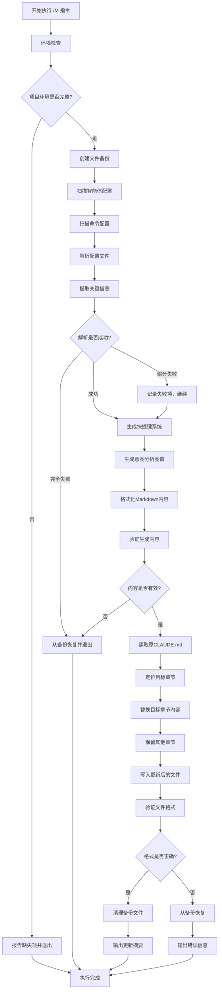

# 项目级CLAUDE.md更新指令 (/M)

## 📋 指令概述

**项目级CLAUDE.md更新指令**是一个智能化的配置同步工具，通过自动扫描项目专属智能体（E/R系列）、项目命令（数字命名）和项目目录结构，动态生成和更新项目级CLAUDE.md文档中的项目快捷键系统、意图分析图谱和开发物料管理规范，确保文档与实际配置保持完全同步。

### 核心特性
- **智能配置扫描**: 自动扫描.claude/agents/和.claude/commands/目录
- **目录结构扫描**: 自动扫描项目目录结构（PRPs/, api/, scripts/, output/, input/等）
- **Plugins信息同步**: 自动扫描项目级plugins配置（如果存在）并同步到项目级CLAUDE.md
- **动态内容生成**: 基于实际配置动态生成快捷键表格、意图映射和物料管理规范
- **精准章节更新**: 更新项目级CLAUDE.md的三个目标章节
- **备份保护机制**: 更新前自动创建备份，确保数据安全
- **格式标准化**: 统一文档格式，保持专业性和可读性

### 应用场景
- 添加新智能体或命令后同步文档
- 修改智能体功能描述后更新说明
- 添加或修改项目目录结构后更新规范
- 重构快捷键系统后统一文档
- 定期维护确保文档时效性
- 团队协作确保配置一致性

## 🎯 核心功能

### 功能1: 项目目录结构扫描
**目标**: 自动扫描项目目录结构，提取项目专属的开发物料组织信息

**扫描范围**:
```yaml
项目专属目录:
  路径: 项目根目录
  扫描对象:
    - PRPs/: 项目需求规划物料
    - api/: API应用程序和服务
    - scripts/: Python自动化脚本
    - output/: AIGC生成的影视成品物料
    - reports/: 项目报告和分析文档
    - input/: 输入资源物料(原始素材、参考资料)
    - docs/: 项目文档
    - initial/: 初始化配置和模板
    - logs/: 日志文件
    - project/: 项目相关文件
    - trees/: 目录树文件
    - backups/: 备份文件
  扫描深度: 2级子目录
  提取信息:
    - 目录存在性
    - 子目录列表
    - 文件数量统计

  说明:
    - library/: 已由上级company系统统一管理，不在本项目范围内
```

### 功能2: 智能配置扫描与解析
**目标**: 自动扫描项目配置文件，提取智能体和命令的关键信息

**扫描范围**:
```yaml
智能体目录:
  路径: .claude/agents/
  文件类型: *.md
  扫描内容:
    - 文件名（对应快捷键）
    - 文档标题（功能名称）
    - 功能描述（从文档提取）
    - 适用场景（从文档提取）
    - 关键词（用于意图映射）

命令目录:
  路径: .claude/commands/
  子目录:
    - context/: 上下文管理命令
    - execution/: 执行控制命令
    - github/: GitHub集成命令
    - learning/: 学习管理命令
    - status/: 状态管理命令
    - system/: 系统管理命令
    - tasks/: 任务流水线命令
  扫描内容: 同智能体目录
```

**扫描实现**:
```python
from pathlib import Path
from typing import List, Dict, Optional
import re

class ConfigScanner:
    """配置扫描器"""

    def __init__(self, project_root: Path):
        self.project_root = project_root
        self.agents_dir = project_root / ".claude" / "agents"
        self.commands_dir = project_root / ".claude" / "commands"

    def scan_all(self) -> Dict[str, List[Dict]]:
        """
        扫描所有配置文件。

        Returns:
            Dict: 包含智能体和命令配置的字典
        """
        return {
            "agents": self.scan_agents(),
            "commands": self.scan_commands()
        }

    def scan_agents(self) -> List[Dict]:
        """
        扫描智能体配置。

        Returns:
            List[Dict]: 智能体配置列表
        """
        agents = []

        if not self.agents_dir.exists():
            return agents

        # 扫描所有.md文件
        for file_path in sorted(self.agents_dir.glob("*.md")):
            agent_info = self._parse_agent_file(file_path)
            if agent_info:
                agents.append(agent_info)

        return agents

    def scan_commands(self) -> Dict[str, List[Dict]]:
        """
        扫描命令配置（按类别分组）。

        Returns:
            Dict[str, List[Dict]]: 命令配置字典，按类别分组
        """
        commands = {}

        if not self.commands_dir.exists():
            return commands

        # 扫描所有子目录
        for category_dir in self.commands_dir.iterdir():
            if not category_dir.is_dir():
                continue

            category_name = category_dir.name
            commands[category_name] = []

            # 扫描该类别下的所有命令文件
            for file_path in sorted(category_dir.glob("*.md")):
                cmd_info = self._parse_command_file(file_path, category_name)
                if cmd_info:
                    commands[category_name].append(cmd_info)

        return commands

    def _parse_agent_file(self, file_path: Path) -> Optional[Dict]:
        """
        解析智能体文件。

        Args:
            file_path: 智能体文件路径

        Returns:
            Optional[Dict]: 智能体信息，解析失败返回None
        """
        try:
            content = file_path.read_text(encoding='utf-8')

            # 提取快捷键（从文件名）
            shortcut = f"/{file_path.stem}"

            # 提取标题（第一个一级标题）
            title_match = re.search(r'^#\s+(.+?)$', content, re.MULTILINE)
            title = title_match.group(1) if title_match else file_path.stem

            # 提取功能描述（从"功能定位"或"指令概述"章节）
            description = self._extract_description(content)

            # 提取系列分类（E/R/Q/F系列）
            series = self._classify_series(file_path.stem)

            # 提取关键词
            keywords = self._extract_keywords(content)

            return {
                "shortcut": shortcut,
                "filename": file_path.name,
                "title": title,
                "description": description,
                "series": series,
                "keywords": keywords,
                "path": str(file_path.relative_to(self.project_root))
            }

        except Exception as e:
            print(f"解析文件失败 {file_path}: {e}")
            return None

    def _parse_command_file(
        self,
        file_path: Path,
        category: str
    ) -> Optional[Dict]:
        """
        解析命令文件。

        Args:
            file_path: 命令文件路径
            category: 命令类别

        Returns:
            Optional[Dict]: 命令信息，解析失败返回None
        """
        try:
            content = file_path.read_text(encoding='utf-8')

            # 提取快捷键（从文件名）
            shortcut = f"/{file_path.stem}"

            # 提取标题
            title_match = re.search(r'^#\s+(.+?)$', content, re.MULTILINE)
            title = title_match.group(1) if title_match else file_path.stem

            # 提取功能描述
            description = self._extract_description(content)

            # 提取关键词
            keywords = self._extract_keywords(content)

            return {
                "shortcut": shortcut,
                "filename": file_path.name,
                "title": title,
                "description": description,
                "category": category,
                "keywords": keywords,
                "path": str(file_path.relative_to(self.project_root))
            }

        except Exception as e:
            print(f"解析文件失败 {file_path}: {e}")
            return None

    def _extract_description(self, content: str) -> str:
        """
        从文档中提取功能描述。

        Args:
            content: 文档内容

        Returns:
            str: 功能描述
        """
        # 尝试从"功能定位"章节提取
        pattern1 = r'##\s+🎯\s+功能定位\s*\n\*\*(.+?)\*\*'
        match1 = re.search(pattern1, content, re.DOTALL)
        if match1:
            desc = match1.group(1).strip()
            # 只取第一句话
            return desc.split('。')[0].split('.')[0][:100]

        # 尝试从"指令概述"章节提取
        pattern2 = r'##\s+📋\s+指令概述\s*\n\*\*(.+?)\*\*'
        match2 = re.search(pattern2, content, re.DOTALL)
        if match2:
            desc = match2.group(1).strip()
            return desc.split('。')[0].split('.')[0][:100]

        # 尝试从第一段提取
        lines = content.split('\n')
        for line in lines[1:]:  # 跳过标题行
            line = line.strip()
            if line and not line.startswith('#') and not line.startswith('---'):
                return line[:100]

        return "功能描述提取失败"

    def _classify_series(self, filename: str) -> str:
        """
        根据文件名分类系列。

        Args:
            filename: 文件名（不含扩展名）

        Returns:
            str: 系列分类
        """
        if filename.startswith('E'):
            return 'E系列'
        elif filename.startswith('R'):
            return 'R系列'
        elif filename.startswith('Q'):
            return 'Q系列'
        elif filename.startswith('F'):
            return 'F系列'
        else:
            return '其他'

    def _extract_keywords(self, content: str, limit: int = 10) -> List[str]:
        """
        从内容中提取关键词。

        Args:
            content: 文档内容
            limit: 最大关键词数量

        Returns:
            List[str]: 关键词列表
        """
        keywords = []

        # 常见关键动词
        verbs = [
            '生成', '设计', '创建', '修改', '优化', '分析',
            '管理', '导出', '替换', '处理', '识别', '增强'
        ]

        # 常见关键名词
        nouns = [
            '图片', '菜单', '海报', '模板', 'Figma', '文件',
            '数据', '配置', '规范', '经验', '问题', '学习'
        ]

        content_lower = content.lower()

        # 提取动词
        for verb in verbs:
            if verb in content:
                keywords.append(verb)

        # 提取名词
        for noun in nouns:
            if noun in content:
                keywords.append(noun)

        # 去重并限制数量
        return list(dict.fromkeys(keywords))[:limit]
```

### 功能3: 开发物料管理规范生成
**目标**: 基于目录扫描结果生成项目专属的开发物料管理规范

**生成规则**:
```yaml
规范章节:
  章节标题: "# 1.1. 开发物料管理规范"
  生成内容:
    - 核心原则
    - 指定存放目录（7个项目专属目录）
    - 文件命名规范
    - 目录检查机制
    - 最佳实践指导
    - 规范版本信息

目录描述生成:
  PRPs/: "项目需求规划物料"
  api/: "API应用程序和服务"
  scripts/: "Python自动化脚本"
  output/: "AIGC生成的影视成品物料"
  reports/: "项目报告和分析文档"
  input/: "输入资源物料(原始素材、参考资料)"
  docs/: "项目文档"
  initial/: "初始化配置和模板"
  logs/: "日志文件"
  project/: "项目相关文件"
  trees/: "目录树文件"
  backups/: "备份文件"

  说明: library/已由上级company系统统一管理

版本信息:
  - 自动更新版本号
  - 记录最后更新时间
  - 记录更新内容说明
```

### 功能4: 快捷键系统动态生成
**目标**: 基于扫描结果生成标准化的快捷键系统文档

**生成规则**:
```yaml
系列分类:
  E系列 - AIGC设计智能体:
    - E1-E9: 专项智能体（文生图、图生图等）
    - EE: E系列队长（总调度）

  R系列 - Figma协作智能体:
    - R0-R9: 专项智能体（文件管理、批量处理等）
    - RR: R系列队长（总调度）

  Q系列 - 智能排版智能体:
    - Q1-Q5: 专项智能体（菜单排版、海报合成等）
    - QQ: Q系列队长（总调度）

  F系列 - 系统与元智能体:
    - F0-F9: 系统工具（智能体创建、上下文管理等）

  通用命令:
    - Context: C, V, X, Z
    - Execution: E, F, Q, R
    - GitHub: G, H, Y
    - Learning: A, D, S, W
    - Status: B, M, N
    - System: I, O, P, U
    - Tasks: 1-9

表格格式:
  - 三列表格: 快捷键 | 功能描述 | 调用文档
  - 清晰分组: 按系列或类别分组
  - 描述简洁: 功能描述控制在50字以内
  - 链接准确: 调用文档路径相对于项目根目录
```

**生成实现**:
```python
from typing import Dict, List
from collections import defaultdict

class ShortcutSystemGenerator:
    """快捷键系统生成器"""

    def __init__(self, scan_result: Dict):
        self.agents = scan_result['agents']
        self.commands = scan_result['commands']

    def generate(self) -> str:
        """
        生成快捷键系统文档。

        Returns:
            str: 快捷键系统Markdown内容
        """
        sections = []

        # 生成智能体系列
        sections.append(self._generate_agents_section())

        # 生成通用命令
        sections.append(self._generate_commands_section())

        return '\n\n'.join(sections)

    def _generate_agents_section(self) -> str:
        """生成智能体系列章节"""
        # 按系列分组
        series_groups = defaultdict(list)
        for agent in self.agents:
            series_groups[agent['series']].append(agent)

        sections = []
        sections.append("## 核心业务智能体")
        sections.append("")
        sections.append("> 针对ZTL餐饮数智化设计业务构建的三大核心智能体系列,涵盖从内容生成(E系列)、平台协作(R系列)到智能排版(Q系列)的完整设计生产链路。")
        sections.append("")

        # E系列
        if 'E系列' in series_groups:
            sections.append("### AIGC设计智能体 (E系列)")
            sections.append("> 专用于餐饮内容生成的AI智能体,覆盖文生图、图生图、图片识别等核心场景,打通从创意到印刷级成品的完整AIGC生产链路。")
            sections.append("")
            sections.append("| 快捷键 | 功能描述 | 调用文档 |")
            sections.append("|---|---|---|")

            for agent in sorted(series_groups['E系列'], key=lambda x: x['shortcut']):
                desc = agent['description'][:50] + '...' if len(agent['description']) > 50 else agent['description']
                sections.append(f"| `{agent['shortcut']}`  | {desc} | `{agent['path']}` |")

            sections.append("")

        # R系列
        if 'R系列' in series_groups:
            sections.append("### Figma协作智能体 (R系列)")
            sections.append("> 负责与Figma API深度交互,执行文件管理、内容处理和工作流编排等复杂任务,实现设计资产的自动化管理和批量操作。")
            sections.append("")
            sections.append("| 快捷键 | 功能描述 | 调用文档 |")
            sections.append("|---|---|---|")

            for agent in sorted(series_groups['R系列'], key=lambda x: x['shortcut']):
                desc = agent['description'][:50] + '...' if len(agent['description']) > 50 else agent['description']
                sections.append(f"| `{agent['shortcut']}` | {desc} | `{agent['path']}` |")

            sections.append("")

        # Q系列
        if 'Q系列' in series_groups:
            sections.append("### 智能排版智能体 (Q系列)")
            sections.append("> 专用于将AIGC内容与Figma结构智能结合,完成自动化版式设计,实现从内容到成品的一键生成。")
            sections.append("")
            sections.append("| 快捷键 | 功能描述 | 调用文档 |")
            sections.append("|---|---|---|")

            for agent in sorted(series_groups['Q系列'], key=lambda x: x['shortcut']):
                desc = agent['description'][:50] + '...' if len(agent['description']) > 50 else agent['description']
                sections.append(f"| `{agent['shortcut']}` | {desc} | `{agent['path']}` |")

            sections.append("")

        # F系列
        if 'F系列' in series_groups:
            sections.append("### 智能体工程与上下文管理 (F系列)")
            sections.append("> 专注于智能体创建、上下文管理和系统级配置的专家智能体,提供元能力支持和开发工具链。")
            sections.append("")
            sections.append("| 快捷键 | 功能描述 | 调用文档 |")
            sections.append("|---|---|---|")

            for agent in sorted(series_groups['F系列'], key=lambda x: x['shortcut']):
                desc = agent['description'][:50] + '...' if len(agent['description']) > 50 else agent['description']
                sections.append(f"| `{agent['shortcut']}` | {desc} | `{agent['path']}` |")

            sections.append("")

        return '\n'.join(sections)

    def _generate_commands_section(self) -> str:
        """生成通用命令章节"""
        sections = []
        sections.append("## 通用命令与智能体")
        sections.append("")
        sections.append("> 跨项目通用的系统级能力接口,涵盖智能体工程、上下文管理、执行控制和项目管理等基础设施能力。")
        sections.append("")

        # 定义类别顺序和中文名称
        category_info = {
            'context': ('上下文与学习 (Context & Learning)', 'Context'),
            'learning': ('上下文与学习 (Context & Learning)', 'Learning'),
            'execution': ('执行与状态 (Execution & Status)', 'Execution'),
            'status': ('执行与状态 (Execution & Status)', 'Status'),
            'github': ('代码与项目管理 (Code & Project)', 'GitHub'),
            'system': ('代码与项目管理 (Code & Project)', 'System'),
            'tasks': ('代码与项目管理 (Code & Project)', 'Tasks')
        }

        # 按大类组织
        major_categories = {}
        for category, commands_list in self.commands.items():
            if category in category_info:
                major_cat, sub_cat = category_info[category]
                if major_cat not in major_categories:
                    major_categories[major_cat] = {}
                major_categories[major_cat][sub_cat] = commands_list

        # 生成各大类
        for major_cat, subcats in major_categories.items():
            sections.append(f"### {major_cat}")
            sections.append("> 提供上下文管理和知识学习的系统化工具,支持经验积累、注意力控制和知识体系构建。" if 'Context' in major_cat else
                          "> 提供任务执行控制和系统状态管理能力,支持PRP工作流、多代理协作和配置同步。" if 'Execution' in major_cat else
                          "> 提供代码版本控制、项目管理和文档维护能力,支持GitHub集成、README管理和项目同步。")
            sections.append("")
            sections.append("| 快捷键 | 功能描述 | 类别 | 调用文档 |")
            sections.append("|---|---|---|---|")

            for sub_cat, commands_list in sorted(subcats.items()):
                for cmd in sorted(commands_list, key=lambda x: x['shortcut']):
                    desc = cmd['description'][:50] + '...' if len(cmd['description']) > 50 else cmd['description']
                    sections.append(f"| `{cmd['shortcut']}` | {desc} | {sub_cat} | `{cmd['path']}` |")

            sections.append("")

        return '\n'.join(sections)
```

### 功能5: 意图分析图谱生成
**目标**: 基于实际配置生成用户意图到快捷键的映射关系

**生成策略**:
```yaml
关键词提取:
  - 从智能体功能描述中提取核心动词和名词
  - 建立关键词到快捷键的映射表
  - 支持模糊匹配和同义词扩展

意图分类:
  创建类: 生成、设计、创建、制作
  修改类: 修改、优化、调整、更新
  分析类: 分析、识别、检测、评估
  管理类: 管理、导出、同步、备份
  学习类: 学习、记录、总结、复盘

示例生成:
  - 高频场景: 生成典型使用场景示例
  - 模糊意图: 展示意图澄清过程
  - 多步骤: 展示连招机制示例
```

**生成实现**:
```python
from typing import List, Dict, Tuple
from collections import defaultdict

class IntentMapGenerator:
    """意图映射生成器"""

    def __init__(self, scan_result: Dict):
        self.agents = scan_result['agents']
        self.commands = scan_result['commands']

    def generate(self) -> str:
        """
        生成意图分析图谱。

        Returns:
            str: 意图分析图谱Markdown内容
        """
        sections = []

        # 生成核心原则
        sections.append(self._generate_principles())

        # 生成意图映射表
        sections.append(self._generate_intent_map())

        # 生成增强功能说明
        sections.append(self._generate_enhanced_features())

        return '\n\n'.join(sections)

    def _generate_principles(self) -> str:
        """生成核心原则"""
        return """## 核心原则

1.  **关键词提取**: 从用户输入中识别核心动词（如"设计"、"修改"、"导出"）和名词（如"海报"、"Figma文件"、"图片"）。
2.  **意图归类**: 将提取的关键词归类到预定义的能力域（如：AIGC生成、Figma操作、批量处理）。
3.  **精确匹配**: 根据归类结果，优先匹配最具体、最高阶的能力接口（智能体 > 命令）。
4.  **动态澄清**: 如果意图模糊（如仅提供"处理图片"），则主动提出问题，澄清具体需求（如"您是想优化图片、修改局部，还是进行风格迁移？"），然后匹配到E2智能体的具体子能力。"""

    def _generate_intent_map(self) -> str:
        """生成意图映射表"""
        sections = []
        sections.append("## 意图映射表示例")
        sections.append("")
        sections.append("| 用户意图 (关键词) | 意图分析 | 映射能力 (快捷键/智能体) |")
        sections.append("| :--- | :--- | :--- |")

        # 基于实际智能体生成映射示例
        intent_examples = self._generate_intent_examples()

        for intent, analysis, mapping in intent_examples:
            sections.append(f"| {intent} | {analysis} | {mapping} |")

        sections.append("")
        sections.append("**📚 完整版意图分析图谱**: 以上为常用场景精选。完整的意图映射表(包含100+场景)、智能匹配策略、决策树、置信度评分规则和详细使用示例，请查看 **`reports/意图分析图谱增强版.md`**")

        return '\n'.join(sections)

    def _generate_intent_examples(self) -> List[Tuple[str, str, str]]:
        """
        生成意图示例。

        Returns:
            List[Tuple]: (用户意图, 意图分析, 映射能力) 元组列表
        """
        examples = []

        # 基于E系列智能体生成示例
        e_agents = [a for a in self.agents if a['series'] == 'E系列']
        if e_agents:
            # 找EE队长
            ee_agent = next((a for a in e_agents if a['shortcut'] == '/EE'), None)
            if ee_agent:
                examples.append((
                    "\"我想处理图片，但不确定用哪个功能\"",
                    "**图片处理 + 意图模糊** → E系列总调度分析",
                    f"`{ee_agent['shortcut']}` - {ee_agent['title']}"
                ))

            # 找E1（文生图）
            e1_agent = next((a for a in e_agents if a['shortcut'] == '/E1'), None)
            if e1_agent:
                examples.append((
                    "\"帮我设计一张火锅店开业海报\"",
                    "**生成(设计) + 海报** → AIGC文生图需求",
                    f"`{e1_agent['shortcut']}` - {e1_agent['title']}"
                ))

        # 基于R系列智能体生成示例
        r_agents = [a for a in self.agents if a['series'] == 'R系列']
        if r_agents:
            # 找RR队长
            rr_agent = next((a for a in r_agents if a['shortcut'] == '/RR'), None)
            if rr_agent:
                examples.append((
                    "\"处理一下这个Figma文件\"",
                    "**处理 + Figma文件** → 意图模糊，需总调度分析",
                    f"`{rr_agent['shortcut']}` - {rr_agent['title']}"
                ))

            # 找R3（批量替换）
            r3_agent = next((a for a in r_agents if a['shortcut'] == '/R3'), None)
            if r3_agent:
                examples.append((
                    "\"把这些菜品图批量换到模板里\"",
                    "**批量 + 替换 + 图片** → Figma批量替换任务",
                    f"`{r3_agent['shortcut']}` - {r3_agent['title']}"
                ))

        # 基于Q系列智能体生成示例
        q_agents = [a for a in self.agents if a['series'] == 'Q系列']
        if q_agents:
            # 找QQ队长
            qq_agent = next((a for a in q_agents if a['shortcut'] == '/QQ'), None)
            if qq_agent:
                examples.append((
                    "\"帮我做一份包含12道菜的菜单\"",
                    "**创建成品 + 菜单** → 智能排版总调度",
                    f"`{qq_agent['shortcut']}` - {qq_agent['title']}"
                ))

        # 基于命令生成示例
        # Context命令
        context_cmds = self.commands.get('context', [])
        q_cmd = next((c for c in context_cmds if c['shortcut'] == '/Q'), None)
        if q_cmd:
            examples.append((
                "\"我需要了解一下这个项目\"",
                "**了解项目/分析代码** → 上下文感知需求",
                f"`{q_cmd['shortcut']}` - {q_cmd['title']}"
            ))

        # Status命令
        status_cmds = self.commands.get('status', [])
        m_cmd = next((c for c in status_cmds if c['shortcut'] == '/M'), None)
        if m_cmd:
            examples.append((
                "\"同步一下最新的快捷键\"",
                "**同步 + 快捷键** → 系统管理",
                f"`{m_cmd['shortcut']}` - {m_cmd['title']}"
            ))

        return examples[:10]  # 限制示例数量

    def _generate_enhanced_features(self) -> str:
        """生成增强功能说明"""
        return """### 增强功能说明

完整版文档包含以下增强功能:

1. **多维度关键词提取**: 动词、名词、上下文的系统化识别机制
2. **智能意图归类**: 6大能力域的完整分类体系
3. **精确匹配策略**: 4级优先级规则和4步匹配流程
4. **动态澄清机制**: 3种澄清策略和标准化话术模板
5. **连招智能推荐**: 自动识别操作序列并推荐高效连招
6. **意图识别决策树**: 可视化的意图识别流程图
7. **置信度评分规则**: 4维度评分体系和执行策略
8. **详细使用示例**: 4个不同置信度场景的完整示例"""
```

### 功能6: Plugins信息同步
**目标**: 自动扫描项目级plugins配置（如果存在）并同步到项目级CLAUDE.md

**扫描范围**:
```yaml
项目级Plugins配置:
  位置: 项目根目录/.claude/settings.json (如果存在)
  配置字段: enabledPlugins
  扫描内容:
    - 项目专属插件名称
    - 插件启用状态
    - 插件功能说明

项目级MCP服务器:
  位置: 项目根目录/.claude/settings.json
  扫描内容:
    - 项目专属MCP服务器
    - 服务器功能描述
    - 可用工具列表

同步规则:
  - 如果项目有专属plugins配置，则同步到项目级CLAUDE.md
  - 如果项目没有专属plugins配置，则跳过此步骤
  - 目标章节: 项目级CLAUDE.md中的"工具和插件配置"章节
```

**扫描实现**:
```python
from pathlib import Path
from typing import Dict, List
import json

class ProjectPluginsScanner:
    """项目级Plugins配置扫描器"""

    def __init__(self, project_root: Path):
        self.project_root = project_root
        self.settings_path = project_root / ".claude" / "settings.json"

    def scan_plugins(self) -> Dict[str, any]:
        """
        扫描项目级plugins配置。

        Returns:
            Dict: 包含插件和MCP服务器信息的字典
        """
        if not self.settings_path.exists():
            return {
                "has_config": False,
                "anthropic_skills": [],
                "mcp_servers": []
            }

        try:
            with open(self.settings_path, 'r', encoding='utf-8') as f:
                settings = json.load(f)

            # 提取Anthropic Agent Skills
            enabled_plugins = settings.get('enabledPlugins', {})
            anthropic_skills = [
                {
                    "name": plugin_name,
                    "enabled": is_enabled,
                    "type": "Anthropic Agent Skills"
                }
                for plugin_name, is_enabled in enabled_plugins.items()
                if is_enabled
            ]

            # 提取项目专属MCP服务器信息（如果配置）
            mcp_servers = self._detect_project_mcp_servers()

            return {
                "has_config": True,
                "anthropic_skills": anthropic_skills,
                "mcp_servers": mcp_servers
            }

        except Exception as e:
            print(f"扫描项目plugins配置失败: {e}")
            return {
                "has_config": False,
                "anthropic_skills": [],
                "mcp_servers": []
            }

    def _detect_project_mcp_servers(self) -> List[Dict]:
        """
        检测项目专属的MCP服务器。

        Returns:
            List[Dict]: MCP服务器信息列表
        """
        # 检测项目是否有专属MCP配置
        project_mcp_servers = []

        # 示例：检测api/目录下的MCP服务器
        api_dir = self.project_root / "api" / "mcp-servers"
        if api_dir.exists():
            for server_dir in api_dir.iterdir():
                if server_dir.is_dir():
                    project_mcp_servers.append({
                        "name": server_dir.name,
                        "description": f"项目专属MCP服务器",
                        "type": "project-specific"
                    })

        return project_mcp_servers

    def generate_plugins_section(self, plugins_data: Dict) -> str:
        """
        生成插件配置章节内容。

        Args:
            plugins_data: 插件数据字典

        Returns:
            str: 格式化的插件配置章节Markdown内容
        """
        if not plugins_data["has_config"]:
            return ""

        sections = []
        sections.append("## 项目级Plugins配置")
        sections.append("")

        # Anthropic Agent Skills
        if plugins_data["anthropic_skills"]:
            sections.append("### Anthropic Agent Skills")
            sections.append("")
            sections.append("```yaml")
            sections.append("项目专属插件:")
            for skill in plugins_data["anthropic_skills"]:
                sections.append(f"  - {skill['name']}: {skill['enabled']}")
            sections.append("```")
            sections.append("")

        # 项目专属MCP服务器
        if plugins_data["mcp_servers"]:
            sections.append("### 项目专属MCP服务器")
            sections.append("")
            sections.append("```yaml")
            sections.append("项目MCP服务器:")
            for server in plugins_data["mcp_servers"]:
                sections.append(f"  - {server['name']}:")
                sections.append(f"      描述: {server['description']}")
                sections.append(f"      类型: {server['type']}")
            sections.append("```")
            sections.append("")

        return '\n'.join(sections)
```

## 🔧 使用方法

### 不及物动词型指令
**语法**: `/M`

**功能**: 自动执行完整的配置扫描和文档更新流程

**执行过程**:
```yaml
步骤1 - 环境检查:
  - 检查项目根目录CLAUDE.md是否存在
  - 检查.claude/agents/目录
  - 检查.claude/commands/目录
  - 验证文件访问权限

步骤2 - 配置扫描:
  - 扫描所有智能体文件（.claude/agents/*.md）
  - 扫描所有命令文件（.claude/commands/**/*.md）
  - 扫描项目级plugins配置（.claude/settings.json，如果存在）
  - 解析文件内容提取关键信息
  - 构建配置数据结构

步骤3 - 内容生成:
  - 生成开发物料管理规范章节
  - 生成快捷键系统章节
  - 生成意图分析图谱章节
  - 生成项目级Plugins配置章节（如果有配置）
  - 格式化Markdown内容
  - 验证生成内容的正确性

步骤4 - 文档更新:
  - 创建原文件备份
  - 读取原CLAUDE.md内容
  - 替换目标章节（1.1. 开发物料管理规范, 2. 项目AGENTS说明, 3. 意图分析图谱）
  - 保留其他章节不变
  - 写入更新后的内容

步骤5 - 验证与反馈:
  - 验证文件格式正确性
  - 检查内部链接有效性
  - 输出更新摘要信息
```

**使用示例**:
```markdown
场景1 - 添加新智能体后同步:
[创建了新的E10.md智能体]
用户: /M
助手: ✅ 配置扫描完成
      - 智能体: 15个（E系列:10, R系列:11, Q系列:6, F系列:10）
      - 命令: 23个（分布在7个类别）
      ✅ 快捷键系统已更新
      ✅ 意图分析图谱已更新
      ✅ 项目级CLAUDE.md同步完成

场景2 - 修改功能描述后更新:
[修改了R3.md的功能描述]
用户: /M
助手: ✅ 检测到配置变更
      ✅ 文档已更新，变更内容:
      - R3智能体功能描述已更新
      - 相关意图映射已刷新

场景3 - 定期维护:
用户: /M
助手: ✅ 配置扫描完成，无变更
      ℹ️ 文档已是最新状态，无需更新
```

**无需参数**: 该指令为不及物动词型，完全自动化执行，无需任何额外参数。

## 📊 执行流程



## 🔍 意图解析逻辑

### 触发条件识别
```yaml
自动触发场景:
  - 用户输入"/M"指令
  - 无需额外参数或上下文

执行前提条件:
  - 当前工作目录是项目根目录
  - 项目根目录存在CLAUDE.md文件
  - 存在.claude/agents/目录
  - 存在.claude/commands/目录

权限要求:
  - CLAUDE.md文件读写权限
  - .claude/目录读取权限
  - 备份目录创建权限
```

### 配置变更检测
```yaml
检测策略:
  - 比较当前配置与上次更新记录
  - 识别新增、修改、删除的配置项
  - 评估是否需要执行更新

变更类型:
  新增配置:
    - 新增智能体或命令文件
    - 触发完整更新流程

  修改配置:
    - 修改功能描述或关键词
    - 触发增量更新流程

  删除配置:
    - 删除智能体或命令文件
    - 触发清理和更新流程

  无变更:
    - 配置与上次一致
    - 跳过更新，输出确认信息
```

### 章节定位策略
```yaml
定位规则:
  快捷键系统章节:
    - 标题: "# 1. 项目专属能力接口 (快捷键与智能体)"
    - 起始标记: 第一个一级标题匹配上述内容
    - 结束标记: 下一个一级标题（# 2.）

  意图分析图谱章节:
    - 标题: "# 2. 意图分析图谱"
    - 起始标记: 第二个一级标题匹配上述内容
    - 结束标记: 下一个一级标题（# 3.）或文件结尾

替换策略:
  - 精确定位起止位置
  - 完整替换章节内容
  - 保留章节前后的内容
  - 保持原有空行和格式
```

## 🎨 实现细节

### 文档结构保持
```python
import re
from typing import Tuple, Optional

class DocumentUpdater:
    """文档更新器"""

    def __init__(self, original_content: str):
        self.original_content = original_content

    def update_sections(
        self,
        shortcuts_content: str,
        intent_map_content: str
    ) -> str:
        """
        更新指定章节。

        Args:
            shortcuts_content: 快捷键系统内容
            intent_map_content: 意图分析图谱内容

        Returns:
            str: 更新后的文档内容
        """
        # 更新快捷键系统章节
        content = self._replace_section(
            self.original_content,
            "# 1. 项目专属能力接口 (快捷键与智能体)",
            "# 2.",
            shortcuts_content
        )

        # 更新意图分析图谱章节
        content = self._replace_section(
            content,
            "# 2. 意图分析图谱",
            "# 3.",
            intent_map_content
        )

        return content

    def _replace_section(
        self,
        content: str,
        start_marker: str,
        end_marker: str,
        new_content: str
    ) -> str:
        """
        替换指定章节。

        Args:
            content: 原始内容
            start_marker: 开始标记
            end_marker: 结束标记
            new_content: 新内容

        Returns:
            str: 替换后的内容
        """
        # 查找开始位置
        start_pattern = re.escape(start_marker)
        start_match = re.search(f'^{start_pattern}', content, re.MULTILINE)

        if not start_match:
            # 如果找不到起始标记，返回原内容
            return content

        start_pos = start_match.start()

        # 查找结束位置
        end_pattern = re.escape(end_marker)
        end_match = re.search(f'^{end_pattern}', content[start_pos + len(start_marker):], re.MULTILINE)

        if end_match:
            # 找到结束标记，替换之间的内容
            end_pos = start_pos + len(start_marker) + end_match.start()
            return content[:start_pos] + f"{start_marker}\n\n{new_content}\n\n" + content[end_pos:]
        else:
            # 找不到结束标记，替换到文件末尾
            return content[:start_pos] + f"{start_marker}\n\n{new_content}\n"

    def validate_structure(self, content: str) -> Tuple[bool, List[str]]:
        """
        验证文档结构。

        Args:
            content: 文档内容

        Returns:
            Tuple[bool, List[str]]: (是否有效, 错误列表)
        """
        errors = []

        # 检查必要章节是否存在
        required_sections = [
            "# 1. 项目专属能力接口",
            "# 2. 意图分析图谱",
            "# 3. 项目级上下文记录",
            "# 4. 注意事项"
        ]

        for section in required_sections:
            if section not in content:
                errors.append(f"缺少必要章节: {section}")

        # 检查Markdown格式
        # 检查标题层级
        headings = re.findall(r'^(#{1,6})\s+(.+)$', content, re.MULTILINE)
        for i in range(1, len(headings)):
            prev_level = len(headings[i-1][0])
            curr_level = len(headings[i][0])
            if curr_level - prev_level > 1:
                errors.append(f"标题层级跳跃: {headings[i][1]}")

        # 检查表格格式
        tables = re.findall(r'\|.+\|', content)
        for table in tables:
            if table.count('|') < 3:  # 至少应有2个|分隔符
                errors.append(f"表格格式错误: {table[:50]}")

        return len(errors) == 0, errors
```

### 备份与恢复机制
```python
import shutil
from pathlib import Path
from datetime import datetime
from typing import Optional

class BackupManager:
    """备份管理器"""

    def __init__(self, target_file: Path):
        self.target_file = target_file
        self.backup_dir = target_file.parent / ".claude" / "backups"

    def create_backup(self) -> Optional[Path]:
        """
        创建备份。

        Returns:
            Optional[Path]: 备份文件路径，失败返回None
        """
        if not self.target_file.exists():
            return None

        # 创建备份目录
        self.backup_dir.mkdir(parents=True, exist_ok=True)

        # 生成备份文件名
        timestamp = datetime.now().strftime("%Y%m%d_%H%M%S")
        backup_name = f"CLAUDE_backup_{timestamp}.md"
        backup_path = self.backup_dir / backup_name

        # 复制文件
        try:
            shutil.copy2(self.target_file, backup_path)
            print(f"✅ 备份已创建: {backup_path}")
            return backup_path
        except Exception as e:
            print(f"❌ 备份失败: {e}")
            return None

    def restore_from_backup(self, backup_path: Path) -> bool:
        """
        从备份恢复。

        Args:
            backup_path: 备份文件路径

        Returns:
            bool: 是否成功恢复
        """
        try:
            shutil.copy2(backup_path, self.target_file)
            print(f"✅ 已从备份恢复: {backup_path}")
            return True
        except Exception as e:
            print(f"❌ 恢复失败: {e}")
            return False

    def list_backups(self, limit: int = 10) -> List[Path]:
        """
        列出最近的备份。

        Args:
            limit: 返回数量限制

        Returns:
            List[Path]: 备份文件列表
        """
        if not self.backup_dir.exists():
            return []

        backups = list(self.backup_dir.glob("CLAUDE_backup_*.md"))
        backups.sort(key=lambda p: p.stat().st_mtime, reverse=True)

        return backups[:limit]

    def clean_old_backups(self, keep_count: int = 5) -> int:
        """
        清理旧备份。

        Args:
            keep_count: 保留的备份数量

        Returns:
            int: 删除的备份数量
        """
        backups = self.list_backups(limit=100)

        if len(backups) <= keep_count:
            return 0

        deleted = 0
        for backup in backups[keep_count:]:
            try:
                backup.unlink()
                deleted += 1
            except Exception as e:
                print(f"删除备份失败 {backup}: {e}")

        print(f"✅ 已清理 {deleted} 个旧备份")
        return deleted
```

### 格式标准化
```python
import re
from typing import str

class MarkdownFormatter:
    """Markdown格式化器"""

    @staticmethod
    def format_table(rows: List[List[str]], headers: List[str]) -> str:
        """
        格式化表格。

        Args:
            rows: 表格行数据
            headers: 表头

        Returns:
            str: 格式化的表格Markdown
        """
        # 计算每列的最大宽度
        col_widths = [len(h) for h in headers]

        for row in rows:
            for i, cell in enumerate(row):
                col_widths[i] = max(col_widths[i], len(cell))

        # 生成表格
        lines = []

        # 表头
        header_line = '| ' + ' | '.join(
            h.ljust(col_widths[i]) for i, h in enumerate(headers)
        ) + ' |'
        lines.append(header_line)

        # 分隔线
        separator = '|' + '|'.join(
            '-' * (w + 2) for w in col_widths
        ) + '|'
        lines.append(separator)

        # 数据行
        for row in rows:
            row_line = '| ' + ' | '.join(
                cell.ljust(col_widths[i]) for i, cell in enumerate(row)
            ) + ' |'
            lines.append(row_line)

        return '\n'.join(lines)

    @staticmethod
    def normalize_whitespace(content: str) -> str:
        """
        规范化空白字符。

        Args:
            content: 原始内容

        Returns:
            str: 规范化后的内容
        """
        # 移除行尾空格
        content = re.sub(r' +$', '', content, flags=re.MULTILINE)

        # 规范化多个空行为最多两个
        content = re.sub(r'\n{4,}', '\n\n\n', content)

        # 确保文件结尾有且只有一个换行符
        content = content.rstrip() + '\n'

        return content

    @staticmethod
    def add_section_spacing(content: str) -> str:
        """
        添加章节间距。

        Args:
            content: 原始内容

        Returns:
            str: 添加间距后的内容
        """
        # 在一级标题前添加空行
        content = re.sub(
            r'([^\n])\n(# [^#])',
            r'\1\n\n\2',
            content
        )

        # 在二级标题前添加空行
        content = re.sub(
            r'([^\n])\n(## [^#])',
            r'\1\n\n\2',
            content
        )

        return content
```

## ⚙️ 配置项

### 系统配置
```yaml
配置版本: v2.0.0
更新时间: 2025-09-30

目标文件: CLAUDE.md (项目根目录)
更新范围:
  - 快捷键系统章节（# 1.）
  - 意图分析图谱章节（# 2.）

扫描目录:
  智能体: .claude/agents/
  命令: .claude/commands/

备份配置:
  启用备份: true
  备份目录: .claude/backups/
  保留数量: 5
  自动清理: true
```

### 扫描配置
```yaml
文件类型: *.md
递归扫描: true (命令目录)
跳过文件:
  - README.md
  - .template.md
  - .*  # 隐藏文件

解析配置:
  提取标题: true
  提取描述: true
  提取关键词: true
  关键词数量: 10
```

### 生成配置
```yaml
快捷键系统:
  系列分组: true
  功能描述长度: 50
  表格格式: 标准Markdown表格
  包含调用文档: true

意图分析图谱:
  示例数量: 10
  包含增强功能说明: true
  关键词映射: 自动生成
  意图分类: 6大类
```

## 📝 示例场景

### 场景1: 新增智能体后同步
**操作**:
```
# 1. 创建新智能体文件
创建: .claude/agents/E10.md

# 2. 执行同步
/M
```

**执行结果**:
```
✅ 项目环境检查完成
✅ 备份已创建: .claude/backups/CLAUDE_backup_20250930_143025.md

📊 配置扫描结果:
   智能体: 16个
     - E系列: 11个 (新增: E10)
     - R系列: 11个
     - Q系列: 6个
     - F系列: 10个
   命令: 23个

📝 内容生成完成:
   - 快捷键系统章节: 65行
   - 意图分析图谱章节: 48行

✅ 文档更新完成
   文件: CLAUDE.md
   更新章节: 2个
   新增快捷键: 1个 (/E10)

🧹 备份清理: 保留5个最新备份
```

### 场景2: 修改功能描述后更新
**操作**:
```
# 1. 修改智能体描述
编辑: .claude/agents/R3.md
修改: 功能描述从"批量替换"改为"智能批量替换与验证"

# 2. 执行同步
/M
```

**执行结果**:
```
✅ 检测到配置变更

📊 变更内容:
   修改: R3智能体
     - 旧描述: "批量替换"
     - 新描述: "智能批量替换与验证"

✅ 文档已更新
   更新内容:
     - R3快捷键描述已刷新
     - 相关意图映射已更新

ℹ️  建议: 检查意图分析图谱中R3相关示例是否需要调整
```

### 场景3: 删除智能体后清理
**操作**:
```
# 1. 删除智能体文件
删除: .claude/agents/E0.md

# 2. 执行同步
/M
```

**执行结果**:
```
✅ 检测到配置变更

📊 变更内容:
   删除: E0智能体
     - 系列: E系列
     - 功能: [已删除]

✅ 文档已更新
   清理内容:
     - E0快捷键条目已移除
     - 相关意图映射已清理

⚠️  提示: 如有其他文档引用E0，请手动更新
```

### 场景4: 定期维护检查
**操作**:
```
/M
```

**执行结果**:
```
✅ 项目环境检查完成
✅ 备份已创建

📊 配置扫描结果:
   智能体: 15个（无变更）
   命令: 23个（无变更）

ℹ️  文档状态: 已是最新
   上次更新: 2025-09-30 14:30:25
   距今: 2小时

✅ 无需更新，文档与配置完全同步
```

## 🔍 错误处理

### 错误类型1: 文件不存在
```yaml
症状: CLAUDE.md文件不存在
原因: 首次使用或文件被意外删除
处理:
  1. 检测文件不存在
  2. 询问用户是否创建标准结构文件
  3. 如用户确认，创建包含标准章节的新文件
  4. 执行正常的配置扫描和内容生成
```

**错误消息**:
```
❌ 目标文件不存在: CLAUDE.md

📝 建议操作:
1. 如果是新项目，执行以下命令创建标准文件:
   /I  # 创建根目录README和CLAUDE.md

2. 如果文件被意外删除，可以:
   - 从Git历史恢复
   - 从备份恢复: .claude/backups/
   - 手动创建标准结构文件

是否创建标准CLAUDE.md文件? (Y/n)
```

### 错误类型2: 配置目录缺失
```yaml
症状: .claude/agents/或.claude/commands/目录不存在
原因: 项目结构不完整
处理:
  1. 检测缺失的目录
  2. 创建缺失的目录结构
  3. 提示用户添加配置文件
  4. 跳过空目录的扫描
```

**错误消息**:
```
⚠️  配置目录不完整

缺失目录:
  - .claude/agents/ (已自动创建)
  - .claude/commands/ (已自动创建)

📝 下一步操作:
1. 在.claude/agents/目录添加智能体定义文件
2. 在.claude/commands/目录添加命令定义文件
3. 再次执行 /M 同步文档

ℹ️  当前状态: 目录已创建，等待配置文件
```

### 错误类型3: 文件解析失败
```yaml
症状: 部分配置文件无法正确解析
原因:
  - Markdown格式错误
  - 文件编码问题
  - 缺少必要的元数据
处理:
  1. 记录解析失败的文件
  2. 跳过失败文件，继续处理其他文件
  3. 在更新完成后报告失败项
  4. 提供修复建议
```

**错误消息**:
```
⚠️  部分文件解析失败

解析失败文件:
  1. .claude/agents/E5.md
     原因: 缺少标题（# 开头的一级标题）
     建议: 在文件开头添加标题

  2. .claude/commands/context/X.md
     原因: 文件编码错误
     建议: 确保文件使用UTF-8编码保存

📊 成功解析: 13/15个智能体, 22/23个命令

✅ 文档已基于成功解析的配置更新
⚠️  请修复失败项后再次执行 /M
```

### 错误类型4: 权限不足
```yaml
症状: 无法写入CLAUDE.md文件
原因: 文件权限设置或被其他程序占用
处理:
  1. 检测写入权限
  2. 尝试请求管理员权限
  3. 如果失败，从备份恢复
  4. 提供详细的权限设置指南
```

**错误消息**:
```
❌ 无法更新CLAUDE.md
   原因: 权限不足或文件被占用

📝 解决方案:
1. 关闭其他正在编辑CLAUDE.md的程序
2. 检查文件权限:
   Windows: 右键 → 属性 → 取消"只读"
   Linux/Mac: chmod 644 CLAUDE.md

3. 如果问题持续:
   - 使用管理员权限运行
   - 检查文件锁定状态

✅ 已从备份恢复原文件
```

### 错误类型5: 内容验证失败
```yaml
症状: 生成的内容未通过格式验证
原因:
  - 表格格式错误
  - 标题层级不连续
  - 必要章节缺失
处理:
  1. 识别具体的格式问题
  2. 尝试自动修复
  3. 如无法修复，从备份恢复
  4. 报告详细的验证错误
```

**错误消息**:
```
❌ 内容验证失败

验证错误:
  1. 表格格式错误
     位置: 快捷键系统 > R系列智能体表格
     问题: 列数不一致
     行数: 第8行

  2. 标题层级跳跃
     位置: 意图分析图谱 > 核心原则
     问题: 从一级标题直接跳到三级标题

🔧 尝试自动修复...
❌ 自动修复失败

✅ 已从备份恢复原文件
📝 建议: 检查配置文件格式是否正确
```

## 📈 性能优化

### 扫描性能优化
```yaml
并行扫描:
  - 智能体和命令目录并行扫描
  - 同一目录下的文件批量并行处理

缓存策略:
  - 缓存文件修改时间
  - 只重新解析修改过的文件
  - 缓存解析结果（会话期间）

增量扫描:
  - 检测文件变更（新增/修改/删除）
  - 只处理变更的文件
  - 合并缓存结果
```

**并行扫描实现**:
```python
import asyncio
from pathlib import Path
from typing import List, Dict

class ParallelScanner:
    """并行扫描器"""

    async def scan_directory_async(
        self,
        directory: Path,
        pattern: str = "*.md"
    ) -> List[Dict]:
        """
        异步并行扫描目录。

        Args:
            directory: 目标目录
            pattern: 文件匹配模式

        Returns:
            List[Dict]: 扫描结果列表
        """
        if not directory.exists():
            return []

        # 获取所有匹配文件
        files = list(directory.glob(pattern))

        # 创建异步任务
        tasks = [self._parse_file_async(f) for f in files]

        # 并行执行
        results = await asyncio.gather(*tasks, return_exceptions=True)

        # 过滤成功的结果
        return [r for r in results if isinstance(r, dict)]

    async def _parse_file_async(self, file_path: Path) -> Dict:
        """异步解析文件"""
        # 使用aiofiles异步读取
        import aiofiles

        async with aiofiles.open(file_path, 'r', encoding='utf-8') as f:
            content = await f.read()

        # 解析内容（同步操作，但不阻塞）
        return await asyncio.to_thread(self._parse_content, content, file_path)

    def _parse_content(self, content: str, file_path: Path) -> Dict:
        """解析文件内容"""
        # 实际的解析逻辑
        pass
```

### 生成性能优化
```yaml
模板预编译:
  - 预编译Markdown模板
  - 缓存常用格式化函数

批量生成:
  - 批量处理相同系列的智能体
  - 批量格式化表格行

懒加载:
  - 按需生成章节内容
  - 只生成变更的章节
```

### 写入性能优化
```yaml
缓冲写入:
  - 使用内存缓冲区
  - 减少磁盘I/O次数

原子操作:
  - 先写入临时文件
  - 验证成功后原子替换
  - 确保写入完整性

压缩传输:
  - 移除不必要的空白字符
  - 压缩重复内容
```

## 🎯 成功标准

### 操作成功标准
```yaml
扫描成功:
  ✅ 所有配置文件成功解析
  ✅ 关键信息准确提取
  ✅ 无解析错误或警告
  ✅ 扫描时间<10秒

生成成功:
  ✅ 快捷键系统完整生成
  ✅ 意图分析图谱准确映射
  ✅ 格式符合Markdown标准
  ✅ 内容通过验证检查

更新成功:
  ✅ 目标章节正确替换
  ✅ 其他章节保持完整
  ✅ 文件格式验证通过
  ✅ 备份成功创建
```

### 质量标准
```yaml
内容准确性:
  ✅ 快捷键与文件名对应正确
  ✅ 功能描述准确反映实际功能
  ✅ 意图映射逻辑清晰合理
  ✅ 示例场景贴合实际使用

格式规范性:
  ✅ 表格对齐美观
  ✅ 标题层级连续
  ✅ 空行间距适当
  ✅ 链接路径正确

可用性:
  ✅ 分组清晰便于查找
  ✅ 描述简洁易懂
  ✅ 调用文档路径可访问
  ✅ 整体结构逻辑合理
```

## 🔗 相关资源

### 相关指令
- `/N` - 用户级CLAUDE.md更新指令
- `/B` - 机器级CLAUDE.md更新指令
- `/I` - 根目录README更新指令
- `/U` - 子目录README更新指令

### 相关文档
- **意图分析图谱增强版**: `reports/意图分析图谱增强版.md`
- **快捷键系统文档**: `CLAUDE.md#1-项目专属能力接口`
- **智能体创建规范**: `.claude/agents/F0.md`

### 配置文件结构
```
项目根目录/
├── CLAUDE.md              # 项目级配置（本指令更新）
├── .claude/
│   ├── agents/            # 智能体定义目录
│   │   ├── E1.md
│   │   ├── E2.md
│   │   └── ...
│   ├── commands/          # 命令定义目录
│   │   ├── context/
│   │   ├── execution/
│   │   └── ...
│   └── backups/           # 备份目录
│       ├── CLAUDE_backup_20250930_143025.md
│       └── ...
└── reports/
    └── 意图分析图谱增强版.md
```

## ⚠️ 注意事项

### 执行要求
```yaml
环境要求:
  - 当前工作目录必须是项目根目录
  - 项目根目录存在CLAUDE.md文件
  - .claude/目录结构完整

权限要求:
  - CLAUDE.md文件读写权限
  - .claude/目录读取权限
  - 备份目录创建权限

执行时机:
  - 添加新智能体或命令后
  - 修改功能描述后
  - 重构快捷键系统后
  - 定期维护（建议每周一次）
```

### 最佳实践
```yaml
配置文件规范:
  - 确保所有.md文件使用UTF-8编码
  - 保持标准的Markdown格式
  - 在文件开头添加清晰的标题
  - 在功能定位章节提供准确描述

更新策略:
  - 小变更: 修改后立即执行/M
  - 大重构: 完成后统一执行/M
  - 定期维护: 每周执行一次确保同步

验证习惯:
  - 更新后检查生成的表格格式
  - 验证意图映射示例的合理性
  - 确认调用文档路径可访问
  - 检查是否有解析失败的文件
```

### 常见陷阱
```yaml
避免陷阱:
  1. 文件名不规范:
     - 智能体文件必须以快捷键字母命名（如E1.md, RR.md）
     - 命令文件必须以快捷键字母命名（如C.md, M.md）

  2. 描述过长:
     - 功能描述建议控制在50字以内
     - 避免在描述中包含大段落文本

  3. 格式不一致:
     - 保持所有配置文件的格式一致
     - 使用标准的章节标题（## 🎯 功能定位）

  4. 缺少关键信息:
     - 必须包含标题（# 开头）
     - 必须包含功能描述

  5. 编码问题:
     - 统一使用UTF-8编码
     - 避免使用BOM头
```

---

**配置版本**: v3.3.0
**更新时间**: 2025-10-22
**更新内容**: 新增功能6-项目级Plugins信息同步，支持自动扫描项目专属plugins配置并同步到项目级CLAUDE.md
**维护原则**: 配置与文档的自动化同步，确保项目文档的时效性和准确性、规范化