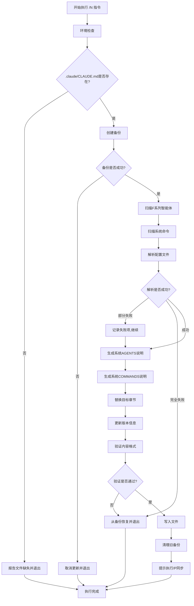

# 系统级CLAUDE.md更新指令 (/N)

## 📋 指令概述

**系统级CLAUDE.md更新指令**是一个智能化的框架配置同步工具，通过自动扫描框架通用智能体（.claude/agents/system系列）和系统命令（字母命名），动态生成和更新 `.claude/CLAUDE.md`中的"系统AGENTS说明"和"系统COMMANDS说明"板块，确保框架级配置文档与实际保持一致。

### 核心特性

- **智能扫描**: 自动扫描.claude/agents/system/和.claude/commands/目录
- **动态生成**: 根据实际配置动态生成系统级能力接口文档
- **实时同步**: 确保系统级CLAUDE.md与框架配置保持一致
- **跨workspace同步**: 执行后自动提示使用/P命令同步到其他项目
- **备份保护**: 更新前自动创建备份，确保数据安全
- **格式标准化**: 统一文档格式，保持专业性和可读性

### 应用场景

- 添加新的框架通用智能体后同步文档
- 修改系统命令功能描述后更新说明
- 重构系统级快捷键后统一文档
- 定期维护确保框架配置文档时效性
- 团队协作确保系统级配置一致性

## 🎯 核心功能

### 功能1: F系列智能体扫描与解析

**目标**: 自动扫描和解析框架通用智能体配置文件

**扫描范围**:

```yaml
智能体目录:
  路径: .claude/agents/system/
  文件类型: *.md
  扫描对象: F系列智能体（F0.md-F9.md, FF.md）

扫描内容:
  - 文件名（对应快捷键）
  - 文档标题（功能名称）
  - 功能描述（从文档提取）
  - 调用路径（相对路径）
```

**扫描实现**:

```python
from pathlib import Path
from typing import List, Dict, Optional
import re

class FSeriesScanner:
    """F系列智能体扫描器"""

    def __init__(self, project_root: Path):
        self.project_root = project_root
        self.agents_dir = project_root / ".claude" / "agents"

    def scan_f_series(self) -> List[Dict]:
        """
        扫描F系列智能体。

        Returns:
            List[Dict]: F系列智能体配置列表
        """
        f_agents = []

        if not self.agents_dir.exists():
            return f_agents

        # 扫描F系列文件（F0-F9, FF）
        for file_path in sorted(self.agents_dir.glob("F*.md")):
            if self._is_f_series_file(file_path):
                agent_info = self._parse_agent_file(file_path)
                if agent_info:
                    f_agents.append(agent_info)

        return f_agents

    def _is_f_series_file(self, file_path: Path) -> bool:
        """
        判断文件是否为F系列智能体。

        Args:
            file_path: 文件路径

        Returns:
            bool: 是否为F系列文件
        """
        stem = file_path.stem

        # F0-F9
        if stem.startswith('F') and len(stem) == 2 and stem[1].isdigit():
            return True

        # FF队长
        if stem == 'FF':
            return True

        return False

    def _parse_agent_file(self, file_path: Path) -> Optional[Dict]:
        """
        解析智能体文件。

        Args:
            file_path: 智能体文件路径

        Returns:
            Optional[Dict]: 智能体信息，解析失败返回None
        """
        try:
            content = file_path.read_text(encoding='utf-8')

            # 提取快捷键
            shortcut = f"/{file_path.stem}"

            # 提取标题（第一个一级标题）
            title_match = re.search(r'^#\s+(.+?)$', content, re.MULTILINE)
            title = title_match.group(1) if title_match else file_path.stem

            # 提取功能描述
            description = self._extract_description(content)

            return {
                "shortcut": shortcut,
                "filename": file_path.name,
                "title": title,
                "description": description,
                "path": f".claude/agents/{file_path.name}"
            }

        except Exception as e:
            print(f"解析文件失败 {file_path}: {e}")
            return None

    def _extract_description(self, content: str) -> str:
        """
        从文档中提取功能描述。

        Args:
            content: 文档内容

        Returns:
            str: 功能描述
        """
        # 尝试从"功能定位"章节提取
        pattern1 = r'##\s+🎯\s+功能定位\s*\n\*\*(.+?)\*\*'
        match1 = re.search(pattern1, content, re.DOTALL)
        if match1:
            desc = match1.group(1).strip()
            return desc.split('。')[0].split('.')[0][:100]

        # 尝试从"指令概述"章节提取
        pattern2 = r'##\s+📋\s+指令概述\s*\n\*\*(.+?)\*\*'
        match2 = re.search(pattern2, content, re.DOTALL)
        if match2:
            desc = match2.group(1).strip()
            return desc.split('。')[0].split('.')[0][:100]

        # 尝试从第一段提取
        lines = content.split('\n')
        for line in lines[1:]:
            line = line.strip()
            if line and not line.startswith('#') and not line.startswith('---'):
                return line[:100]

        return "功能描述提取失败"
```

### 功能2: 系统命令扫描与分类

**目标**: 自动扫描和分类系统级命令配置文件

**扫描范围**:

```yaml
命令目录:
  路径: .claude/commands/
  文件类型: *.md (直接在commands目录下的字母命名文件)
  扫描对象: A-Z单字母命令文件

命令分类:
  上下文与学习 (Context & Learning):
    Context: C, V, X, Z
    Learning: A, D, S, W

  执行与状态 (Execution & Status):
    Execution: E, F, Q, R
    Status: B, M, N

  代码与项目管理 (Code & Project):
    GitHub: G, H, Y
    System: I, J, K, L, O, P, T, U
```

**扫描实现**:

```python
from typing import Dict, List
from collections import defaultdict

class SystemCommandScanner:
    """系统命令扫描器"""

    def __init__(self, project_root: Path):
        self.project_root = project_root
        self.commands_dir = project_root / ".claude" / "commands"

        # 命令分类规则
        self.category_map = {
            # 上下文与学习
            'C': ('Context', 'Context & Learning'),
            'V': ('Context', 'Context & Learning'),
            'X': ('Context', 'Context & Learning'),
            'Z': ('Context', 'Context & Learning'),
            'A': ('Learning', 'Context & Learning'),
            'D': ('Learning', 'Context & Learning'),
            'S': ('Learning', 'Context & Learning'),
            'W': ('Learning', 'Context & Learning'),

            # 执行与状态
            'E': ('Execution', 'Execution & Status'),
            'F': ('Execution', 'Execution & Status'),
            'Q': ('Execution', 'Execution & Status'),
            'R': ('Execution', 'Execution & Status'),
            'B': ('Status', 'Execution & Status'),
            'M': ('Status', 'Execution & Status'),
            'N': ('Status', 'Execution & Status'),

            # 代码与项目管理
            'G': ('GitHub', 'Code & Project'),
            'H': ('GitHub', 'Code & Project'),
            'Y': ('GitHub', 'Code & Project'),
            'I': ('System', 'Code & Project'),
            'J': ('System', 'Code & Project'),
            'K': ('System', 'Code & Project'),
            'L': ('System', 'Code & Project'),
            'O': ('System', 'Code & Project'),
            'P': ('System', 'Code & Project'),
            'T': ('System', 'Code & Project'),
            'U': ('System', 'Code & Project')
        }

    def scan_system_commands(self) -> Dict[str, List[Dict]]:
        """
        扫描系统命令。

        Returns:
            Dict[str, List[Dict]]: 按大类分组的命令配置
        """
        commands_by_major_cat = defaultdict(lambda: defaultdict(list))

        if not self.commands_dir.exists():
            return dict(commands_by_major_cat)

        # 扫描直接在commands目录下的字母命名文件
        for file_path in sorted(self.commands_dir.glob("*.md")):
            if self._is_system_command_file(file_path):
                cmd_info = self._parse_command_file(file_path)
                if cmd_info:
                    # 根据分类规则归类
                    sub_cat, major_cat = self.category_map.get(
                        file_path.stem,
                        ('Other', 'Other')
                    )

                    cmd_info['category'] = sub_cat
                    commands_by_major_cat[major_cat][sub_cat].append(cmd_info)

        return dict(commands_by_major_cat)

    def _is_system_command_file(self, file_path: Path) -> bool:
        """
        判断文件是否为系统命令。

        Args:
            file_path: 文件路径

        Returns:
            bool: 是否为系统命令文件
        """
        stem = file_path.stem

        # 单字母命名
        if len(stem) == 1 and stem.isalpha() and stem.isupper():
            return True

        return False

    def _parse_command_file(self, file_path: Path) -> Optional[Dict]:
        """
        解析命令文件。

        Args:
            file_path: 命令文件路径

        Returns:
            Optional[Dict]: 命令信息，解析失败返回None
        """
        try:
            content = file_path.read_text(encoding='utf-8')

            # 提取快捷键
            shortcut = f"/{file_path.stem}"

            # 提取标题
            title_match = re.search(r'^#\s+(.+?)$', content, re.MULTILINE)
            title = title_match.group(1) if title_match else file_path.stem

            # 提取功能描述
            description = self._extract_description(content)

            return {
                "shortcut": shortcut,
                "filename": file_path.name,
                "title": title,
                "description": description,
                "path": f".claude/commands/{file_path.name}"
            }

        except Exception as e:
            print(f"解析文件失败 {file_path}: {e}")
            return None

    def _extract_description(self, content: str) -> str:
        """从文档中提取功能描述"""
        # 同F系列的提取逻辑
        pattern1 = r'##\s+📋\s+指令概述\s*\n\*\*(.+?)\*\*'
        match1 = re.search(pattern1, content, re.DOTALL)
        if match1:
            desc = match1.group(1).strip()
            return desc.split('。')[0].split('.')[0][:50]

        lines = content.split('\n')
        for line in lines[1:]:
            line = line.strip()
            if line and not line.startswith('#') and not line.startswith('---'):
                return line[:50]

        return "功能描述提取失败"
```

### 功能3: 系统AGENTS说明生成

**目标**: 基于F系列智能体生成系统级AGENTS说明文档

**生成规则**:

```yaml
表格格式:
  - 三列表格: 快捷键 | 功能描述 | 调用文档
  - 清晰分组: 按F系列分组
  - 描述简洁: 功能描述控制在50字以内
  - 链接准确: 调用文档路径相对于项目根目录

生成顺序:
  - F0-F9: 按数字顺序排列
  - FF: 队长置于最后
```

**生成实现**:

```python
class AgentsDocGenerator:
    """智能体文档生成器"""

    def __init__(self, f_agents: List[Dict]):
        self.f_agents = f_agents

    def generate(self) -> str:
        """
        生成系统AGENTS说明。

        Returns:
            str: 系统AGENTS说明Markdown内容
        """
        if not self.f_agents:
            return "# 2. 系统AGENTS说明\n\n暂无F系列智能体配置。\n"

        sections = []
        sections.append("# 2. 系统AGENTS说明")
        sections.append("")
        sections.append("## 智能体工程与上下文管理 (F系列)")
        sections.append("> 专注于智能体创建、上下文管理和系统级配置的专家智能体,提供元能力支持和开发工具链。")
        sections.append("")
        sections.append("| 快捷键 | 功能描述 | 调用文档 |")
        sections.append("|---|---|---|")

        # 排序：F0-F9, FF
        sorted_agents = sorted(
            self.f_agents,
            key=lambda x: (x['filename'] != 'FF.md', x['filename'])
        )

        for agent in sorted_agents:
            # 限制描述长度
            desc = agent['description']
            if len(desc) > 50:
                desc = desc[:47] + "..."

            sections.append(
                f"| `{agent['shortcut']}`  | {desc} | `{agent['path']}` |"
            )

        sections.append("")

        return '\n'.join(sections)
```

### 功能4: 系统COMMANDS说明生成

**目标**: 基于系统命令生成系统级COMMANDS说明文档

**生成规则**:

```yaml
分类结构:
  大类1 - 上下文与学习 (Context & Learning):
    - Context子类: C, V, X, Z
    - Learning子类: A, D, S, W

  大类2 - 执行与状态 (Execution & Status):
    - Execution子类: E, F, Q, R
    - Status子类: B, M, N

  大类3 - 代码与项目管理 (Code & Project):
    - GitHub子类: G, H, Y
    - System子类: I, J, K, L, O, P, T, U

表格格式:
  - 四列表格: 快捷键 | 功能描述 | 类别 | 调用文档
  - 按大类分组展示
  - 每个大类包含简介
  - 命令按字母顺序排列
```

**生成实现**:

```python
class CommandsDocGenerator:
    """命令文档生成器"""

    def __init__(self, commands_by_major_cat: Dict[str, Dict[str, List[Dict]]]):
        self.commands_by_major_cat = commands_by_major_cat

    def generate(self) -> str:
        """
        生成系统COMMANDS说明。

        Returns:
            str: 系统COMMANDS说明Markdown内容
        """
        if not self.commands_by_major_cat:
            return "# 3. 系统COMMANDS说明\n\n暂无系统命令配置。\n"

        sections = []
        sections.append("# 3. 系统COMMANDS说明")
        sections.append("")
        sections.append("## 通用命令与智能体")
        sections.append("")
        sections.append("> 跨项目通用的系统级能力接口,涵盖智能体工程、上下文管理、执行控制和项目管理等基础设施能力。")
        sections.append("")

        # 定义大类顺序
        major_cat_order = [
            'Context & Learning',
            'Execution & Status',
            'Code & Project'
        ]

        # 定义大类简介
        major_cat_intros = {
            'Context & Learning': "> 提供上下文管理和知识学习的系统化工具,支持经验积累、注意力控制和知识体系构建。",
            'Execution & Status': "> 提供任务执行控制和系统状态管理能力,支持PRP工作流、多代理协作和配置同步。",
            'Code & Project': "> 提供代码版本控制、项目管理和文档维护能力,支持GitHub集成、README管理和项目同步。"
        }

        for major_cat in major_cat_order:
            if major_cat not in self.commands_by_major_cat:
                continue

            sections.append(f"### {major_cat}")
            sections.append(major_cat_intros.get(major_cat, ""))
            sections.append("")
            sections.append("| 快捷键 | 功能描述 | 类别 | 调用文档 |")
            sections.append("|---|---|---|---|")

            # 获取该大类下的所有子类
            sub_cats = self.commands_by_major_cat[major_cat]

            # 按子类排序
            for sub_cat in sorted(sub_cats.keys()):
                commands = sub_cats[sub_cat]

                # 按快捷键字母顺序排序
                for cmd in sorted(commands, key=lambda x: x['shortcut']):
                    desc = cmd['description']
                    if len(desc) > 50:
                        desc = desc[:47] + "..."

                    sections.append(
                        f"| `{cmd['shortcut']}` | {desc} | {sub_cat} | `{cmd['path']}` |"
                    )

            sections.append("")

        return '\n'.join(sections)
```

### 功能5: 文档章节更新与备份

**目标**: 安全地更新系统级CLAUDE.md的目标章节

**更新策略**:

```yaml
更新范围:
  - "# 2. 系统AGENTS说明"章节
  - "# 3. 系统COMMANDS说明"章节

保护策略:
  - 更新前自动创建备份
  - 只更新目标章节
  - 保留其他章节不变
  - 失败时从备份恢复

验证策略:
  - 验证Markdown格式
  - 验证章节完整性
  - 验证表格格式
```

**更新实现**:

```python
import shutil
from datetime import datetime

class SystemClaudeUpdater:
    """系统级CLAUDE.md更新器"""

    def __init__(self, project_root: Path):
        self.project_root = project_root
        self.target_file = project_root / ".claude" / "CLAUDE.md"
        self.backup_dir = project_root / ".claude" / "backups"

    def update(
        self,
        agents_content: str,
        commands_content: str
    ) -> bool:
        """
        更新系统级CLAUDE.md。

        Args:
            agents_content: 系统AGENTS说明内容
            commands_content: 系统COMMANDS说明内容

        Returns:
            bool: 是否成功更新
        """
        # 1. 创建备份
        backup_path = self._create_backup()
        if not backup_path:
            print("❌ 备份失败,取消更新")
            return False

        try:
            # 2. 读取原文件
            if not self.target_file.exists():
                print("❌ 目标文件不存在")
                return False

            original_content = self.target_file.read_text(encoding='utf-8')

            # 3. 替换章节
            updated_content = self._replace_sections(
                original_content,
                agents_content,
                commands_content
            )

            # 4. 验证内容
            if not self._validate_content(updated_content):
                print("❌ 内容验证失败")
                self._restore_from_backup(backup_path)
                return False

            # 5. 更新版本信息
            updated_content = self._update_version_info(updated_content)

            # 6. 写入文件
            self.target_file.write_text(updated_content, encoding='utf-8')

            print(f"✅ 系统级CLAUDE.md更新成功")
            print(f"   备份位置: {backup_path}")

            return True

        except Exception as e:
            print(f"❌ 更新失败: {e}")
            self._restore_from_backup(backup_path)
            return False

    def _create_backup(self) -> Optional[Path]:
        """创建备份"""
        if not self.target_file.exists():
            return None

        self.backup_dir.mkdir(parents=True, exist_ok=True)

        timestamp = datetime.now().strftime("%Y%m%d_%H%M%S")
        backup_name = f"CLAUDE_system_backup_{timestamp}.md"
        backup_path = self.backup_dir / backup_name

        try:
            shutil.copy2(self.target_file, backup_path)
            return backup_path
        except Exception as e:
            print(f"备份失败: {e}")
            return None

    def _replace_sections(
        self,
        content: str,
        agents_content: str,
        commands_content: str
    ) -> str:
        """替换目标章节"""
        # 替换"# 2. 系统AGENTS说明"章节
        content = self._replace_single_section(
            content,
            "# 2. 系统AGENTS说明",
            "# 3.",
            agents_content
        )

        # 替换"# 3. 系统COMMANDS说明"章节
        content = self._replace_single_section(
            content,
            "# 3. 系统COMMANDS说明",
            "# 4.",
            commands_content
        )

        return content

    def _replace_single_section(
        self,
        content: str,
        start_marker: str,
        end_marker: str,
        new_content: str
    ) -> str:
        """替换单个章节"""
        # 查找开始位置
        start_pattern = re.escape(start_marker)
        start_match = re.search(f'^{start_pattern}', content, re.MULTILINE)

        if not start_match:
            print(f"⚠️  找不到章节: {start_marker}")
            return content

        start_pos = start_match.start()

        # 查找结束位置
        end_pattern = re.escape(end_marker)
        end_match = re.search(
            f'^{end_pattern}',
            content[start_pos + len(start_marker):],
            re.MULTILINE
        )

        if end_match:
            end_pos = start_pos + len(start_marker) + end_match.start()
            return content[:start_pos] + new_content + "\n\n" + content[end_pos:]
        else:
            # 找不到结束标记,替换到文件末尾
            return content[:start_pos] + new_content + "\n"

    def _validate_content(self, content: str) -> bool:
        """验证内容格式"""
        # 检查必要章节存在
        required_sections = [
            "# 1. 系统级CLAUDE.md的记载范围",
            "# 2. 系统AGENTS说明",
            "# 3. 系统COMMANDS说明"
        ]

        for section in required_sections:
            if section not in content:
                print(f"缺少必要章节: {section}")
                return False

        # 检查表格格式（至少应有表头和分隔线）
        table_pattern = r'\|.+\|\n\|[-:]+\|'
        if not re.search(table_pattern, content):
            print("表格格式错误")
            return False

        return True

    def _update_version_info(self, content: str) -> str:
        """更新版本信息"""
        # 更新last_updated字段
        today = datetime.now().strftime("%Y-%m-%d")

        # 更新front matter中的last_updated
        content = re.sub(
            r'(last_updated:\s*)\d{4}-\d{2}-\d{2}',
            f'\\g<1>{today}',
            content
        )

        # 更新文档末尾的版本信息
        content = re.sub(
            r'\*\*最后更新\*\*:\s*\d{4}-\d{2}-\d{2}',
            f'**最后更新**: {today}',
            content
        )

        return content

    def _restore_from_backup(self, backup_path: Path) -> bool:
        """从备份恢复"""
        try:
            shutil.copy2(backup_path, self.target_file)
            print(f"✅ 已从备份恢复: {backup_path}")
            return True
        except Exception as e:
            print(f"❌ 恢复失败: {e}")
            return False
```

## 🔧 使用方法

### 基本用法

直接使用，无需参数：

```bash
/N
```

**执行效果**:

1. 自动扫描F系列智能体和系统命令
2. 生成系统AGENTS说明和COMMANDS说明
3. 更新 `.claude/CLAUDE.md`文件
4. 提示使用 `/P`命令同步到其他workspace

### 完整工作流

```bash
# 步骤1: 更新系统级CLAUDE.md
/N

# 步骤2: 跨workspace同步（根据/N执行后的提示）
/P .claude/CLAUDE.md
```

**说明**:

- `/N`更新本workspace的系统级CLAUDE.md
- `/P .claude/CLAUDE.md`将更新后的文件同步到其他关联的workspace

## 📊 执行流程



## 🔍 意图解析逻辑

### 触发条件识别

```yaml
自动触发场景:
  - 用户输入"/N"指令
  - 无需额外参数或上下文

执行前提条件:
  - 当前工作目录是项目根目录
  - .claude/CLAUDE.md文件存在
  - .claude/agents/目录存在
  - .claude/commands/目录存在

权限要求:
  - .claude/CLAUDE.md文件读写权限
  - .claude/目录读取权限
  - 备份目录创建权限
```

### 配置变更检测

```yaml
检测策略:
  - 扫描F系列智能体数量变化
  - 扫描系统命令数量变化
  - 检测功能描述修改

变更类型:
  新增配置:
    - 新增F系列智能体或系统命令
    - 触发完整更新流程

  修改配置:
    - 修改功能描述
    - 触发增量更新流程

  删除配置:
    - 删除F系列智能体或系统命令
    - 触发清理和更新流程

  无变更:
    - 配置与上次一致
    - 跳过更新,输出确认信息
```

### 章节定位策略

```yaml
定位规则:
  系统AGENTS说明章节:
    - 标题: "# 2. 系统AGENTS说明"
    - 起始标记: 该一级标题
    - 结束标记: 下一个一级标题（# 3.）

  系统COMMANDS说明章节:
    - 标题: "# 3. 系统COMMANDS说明"
    - 起始标记: 该一级标题
    - 结束标记: 下一个一级标题（# 4.）或文件结尾

替换策略:
  - 精确定位起止位置
  - 完整替换章节内容
  - 保留章节前后的内容
  - 保持原有空行和格式
```

## 🎨 实现细节

### 文档结构保持

```python
class DocumentStructureManager:
    """文档结构管理器"""

    @staticmethod
    def preserve_structure(
        original_content: str,
        sections_to_update: Dict[str, str]
    ) -> str:
        """
        保持文档结构,只更新指定章节。

        Args:
            original_content: 原始内容
            sections_to_update: 要更新的章节字典 {章节标题: 新内容}

        Returns:
            str: 更新后的内容
        """
        content = original_content

        for section_title, new_content in sections_to_update.items():
            content = DocumentStructureManager._replace_section(
                content,
                section_title,
                new_content
            )

        return content

    @staticmethod
    def _replace_section(
        content: str,
        section_title: str,
        new_section_content: str
    ) -> str:
        """替换单个章节"""
        # 提取章节级别（# 的数量）
        level = section_title.count('#')

        # 构建下一章节的正则模式
        next_section_pattern = r'^#{1,' + str(level) + r'}\s'

        # 查找当前章节开始位置
        section_pattern = re.escape(section_title)
        section_match = re.search(f'^{section_pattern}', content, re.MULTILINE)

        if not section_match:
            return content

        start_pos = section_match.start()

        # 查找下一章节位置
        remaining_content = content[start_pos + len(section_title):]
        next_match = re.search(next_section_pattern, remaining_content, re.MULTILINE)

        if next_match:
            # 找到下一章节,替换之间的内容
            end_pos = start_pos + len(section_title) + next_match.start()
            return content[:start_pos] + new_section_content + "\n\n" + content[end_pos:]
        else:
            # 没有下一章节,替换到文件末尾
            return content[:start_pos] + new_section_content + "\n"
```

### 格式标准化

```python
class MarkdownFormatter:
    """Markdown格式化器"""

    @staticmethod
    def format_table(
        headers: List[str],
        rows: List[List[str]],
        alignment: Optional[List[str]] = None
    ) -> str:
        """
        格式化表格。

        Args:
            headers: 表头列表
            rows: 数据行列表
            alignment: 对齐方式列表 ('left', 'center', 'right')

        Returns:
            str: 格式化的表格Markdown
        """
        if not headers or not rows:
            return ""

        # 计算每列的最大宽度
        col_widths = [len(h) for h in headers]

        for row in rows:
            for i, cell in enumerate(row):
                if i < len(col_widths):
                    col_widths[i] = max(col_widths[i], len(str(cell)))

        lines = []

        # 表头
        header_cells = [h.ljust(col_widths[i]) for i, h in enumerate(headers)]
        lines.append("| " + " | ".join(header_cells) + " |")

        # 分隔线
        separators = []
        for i, width in enumerate(col_widths):
            if alignment and i < len(alignment):
                if alignment[i] == 'center':
                    separators.append(":" + "-" * (width - 2) + ":")
                elif alignment[i] == 'right':
                    separators.append("-" * (width - 1) + ":")
                else:
                    separators.append("-" * width)
            else:
                separators.append("-" * width)

        lines.append("|" + "|".join(separators) + "|")

        # 数据行
        for row in rows:
            cells = [str(cell).ljust(col_widths[i]) for i, cell in enumerate(row)]
            lines.append("| " + " | ".join(cells) + " |")

        return "\n".join(lines)

    @staticmethod
    def normalize_whitespace(content: str) -> str:
        """规范化空白字符"""
        # 移除行尾空格
        content = re.sub(r' +$', '', content, flags=re.MULTILINE)

        # 规范化多个空行为最多两个
        content = re.sub(r'\n{4,}', '\n\n\n', content)

        # 确保文件结尾有且只有一个换行符
        content = content.rstrip() + '\n'

        return content
```

## ⚙️ 配置项

### 系统配置

```yaml
配置版本: v3.2.0
更新时间: 2025-10-07

目标文件: .claude/CLAUDE.md (系统级配置)
更新范围:
  - 系统AGENTS说明章节（# 2.）
  - 系统COMMANDS说明章节（# 3.）

扫描目录:
  F系列智能体: .claude/agents/F*.md
  系统命令: .claude/commands/*.md (单字母命名)

备份配置:
  启用备份: true
  备份目录: .claude/backups/
  保留数量: 10
  自动清理: true
```

### 扫描配置

```yaml
文件类型: *.md
递归扫描: false (只扫描直接子文件)
跳过文件:
  - README.md
  - .template.md
  - .*  # 隐藏文件

解析配置:
  提取标题: true
  提取描述: true
  描述最大长度: 50
```

### 生成配置

```yaml
系统AGENTS说明:
  表格列数: 3
  功能描述长度: 50
  包含调用文档: true
  排序规则: F0-F9, FF

系统COMMANDS说明:
  表格列数: 4
  功能描述长度: 50
  分类展示: true
  大类数量: 3
```

## 📝 示例场景

### 场景1: 新增F系列智能体后同步

**操作**:

```
# 1. 创建新智能体文件
创建: .claude/agents/F10.md

# 2. 执行同步
/N
```

**执行结果**:

```
✅ 环境检查完成
✅ 备份已创建: .claude/backups/CLAUDE_system_backup_20251007_143025.md

📊 配置扫描结果:
   F系列智能体: 12个 (新增: F10)
   系统命令: 27个

📝 内容生成完成:
   - 系统AGENTS说明: 生成15行表格
   - 系统COMMANDS说明: 生成32行分类表格

✅ 系统级CLAUDE.md更新完成
   更新章节: 2个
   新增快捷键: 1个 (/F10)

📌 下一步建议:
  执行以下命令将更新同步到其他workspace:

  /P .claude/CLAUDE.md

  这将把更新后的系统级配置同步到所有关联的项目。
```

### 场景2: 修改功能描述后更新

**操作**:

```
# 1. 修改智能体描述
编辑: .claude/agents/F0.md
修改: 功能描述

# 2. 执行同步
/N
```

**执行结果**:

```
✅ 检测到配置变更

📊 变更内容:
   修改: F0智能体
     - 功能描述已更新

✅ 系统级CLAUDE.md更新完成
   更新内容:
     - F0快捷键描述已刷新

📌 建议: 执行 /P .claude/CLAUDE.md 同步到其他workspace
```

### 场景3: 定期维护检查

**操作**:

```
/N
```

**执行结果**:

```
✅ 环境检查完成
✅ 备份已创建

📊 配置扫描结果:
   F系列智能体: 11个（无变更）
   系统命令: 27个（无变更）

ℹ️  文档状态: 已是最新
   上次更新: 2025-10-07 14:30:25
   距今: 2小时

✅ 无需更新,文档与配置完全同步
```

## 🔍 错误处理

### 错误类型1: 文件不存在

```yaml
症状: .claude/CLAUDE.md文件不存在
原因: 首次使用或文件被删除
处理:
  1. 检测文件不存在
  2. 报告错误信息
  3. 提供创建文件的建议
```

**错误消息**:

```
❌ 目标文件不存在: .claude/CLAUDE.md

📝 建议操作:
该文件是系统级配置的核心文件,应该已存在于框架中。

如果文件被意外删除,可以:
1. 从Git历史恢复
2. 从备份恢复: .claude/backups/
3. 联系框架维护者获取标准文件

⚠️  注意: 系统级CLAUDE.md不应由/N命令创建,
          应从框架模板复制或从版本控制恢复。
```

### 错误类型2: 配置目录缺失

```yaml
症状: .claude/agents/或.claude/commands/目录不存在
原因: 项目结构不完整
处理:
  1. 检测缺失的目录
  2. 自动创建缺失的目录
  3. 提示用户添加配置文件
  4. 继续执行更新（可能生成空表格）
```

**错误消息**:

```
⚠️  配置目录不完整

缺失目录:
  - .claude/agents/ (已自动创建)
  - .claude/commands/ (已自动创建)

📝 下一步操作:
1. 在.claude/agents/目录添加F系列智能体定义文件
2. 在.claude/commands/目录添加系统命令定义文件
3. 再次执行 /N 同步文档

ℹ️  当前状态: 目录已创建,将生成空表格占位
```

### 错误类型3: 文件解析失败

```yaml
症状: 部分配置文件无法正确解析
原因:
  - Markdown格式错误
  - 文件编码问题
  - 缺少必要的元数据
处理:
  1. 记录解析失败的文件
  2. 跳过失败文件,继续处理其他文件
  3. 在更新完成后报告失败项
  4. 提供修复建议
```

**错误消息**:

```
⚠️  部分文件解析失败

解析失败文件:
  1. .claude/agents/F5.md
     原因: 缺少标题（# 开头的一级标题）
     建议: 在文件开头添加标题

  2. .claude/commands/X.md
     原因: 文件编码错误
     建议: 确保文件使用UTF-8编码保存

📊 成功解析: 10/11个F系列智能体, 26/27个系统命令

✅ 文档已基于成功解析的配置更新
⚠️  请修复失败项后再次执行 /N
```

### 错误类型4: 权限不足

```yaml
症状: 无法写入.claude/CLAUDE.md文件
原因: 文件权限设置或被其他程序占用
处理:
  1. 检测写入权限
  2. 尝试从备份恢复
  3. 提供详细的权限设置指南
```

**错误消息**:

```
❌ 无法更新.claude/CLAUDE.md
   原因: 权限不足或文件被占用

📝 解决方案:
1. 关闭其他正在编辑CLAUDE.md的程序
2. 检查文件权限:
   Windows: 右键 → 属性 → 取消"只读"
   Linux/Mac: chmod 644 .claude/CLAUDE.md

3. 如果问题持续:
   - 使用管理员权限运行
   - 检查文件锁定状态

✅ 已从备份恢复原文件
```

### 错误类型5: 内容验证失败

```yaml
症状: 生成的内容未通过格式验证
原因:
  - 表格格式错误
  - 必要章节缺失
处理:
  1. 识别具体的格式问题
  2. 从备份恢复
  3. 报告详细的验证错误
```

**错误消息**:

```
❌ 内容验证失败

验证错误:
  1. 表格格式错误
     位置: 系统COMMANDS说明表格
     问题: 列数不一致

  2. 缺少必要章节
     章节: # 3. 系统COMMANDS说明

✅ 已从备份恢复原文件
📝 建议: 检查配置文件格式是否正确
```

## 📈 性能优化

### 扫描性能优化

```yaml
并行扫描:
  - F系列智能体和系统命令并行扫描
  - 同一目录下的文件批量并行处理

缓存策略:
  - 缓存文件修改时间
  - 只重新解析修改过的文件
  - 缓存解析结果（会话期间）

增量扫描:
  - 检测文件变更（新增/修改/删除）
  - 只处理变更的文件
  - 合并缓存结果
```

**并行扫描实现**:

```python
import asyncio
from pathlib import Path
from typing import List, Dict

class ParallelScanner:
    """并行扫描器"""

    async def scan_all_async(
        self,
        agents_dir: Path,
        commands_dir: Path
    ) -> Dict[str, Any]:
        """
        异步并行扫描所有配置。

        Args:
            agents_dir: 智能体目录
            commands_dir: 命令目录

        Returns:
            Dict: 扫描结果
        """
        # 创建异步任务
        agents_task = asyncio.create_task(
            self._scan_f_series_async(agents_dir)
        )

        commands_task = asyncio.create_task(
            self._scan_commands_async(commands_dir)
        )

        # 并行执行
        f_agents, system_commands = await asyncio.gather(
            agents_task,
            commands_task
        )

        return {
            "f_agents": f_agents,
            "system_commands": system_commands
        }

    async def _scan_f_series_async(self, agents_dir: Path) -> List[Dict]:
        """异步扫描F系列智能体"""
        if not agents_dir.exists():
            return []

        files = list(agents_dir.glob("F*.md"))

        # 并行解析文件
        tasks = [self._parse_file_async(f) for f in files]
        results = await asyncio.gather(*tasks, return_exceptions=True)

        # 过滤成功的结果
        return [r for r in results if isinstance(r, dict)]

    async def _scan_commands_async(self, commands_dir: Path) -> List[Dict]:
        """异步扫描系统命令"""
        if not commands_dir.exists():
            return []

        # 只扫描单字母命名的文件
        files = [
            f for f in commands_dir.glob("*.md")
            if len(f.stem) == 1 and f.stem.isalpha()
        ]

        # 并行解析文件
        tasks = [self._parse_file_async(f) for f in files]
        results = await asyncio.gather(*tasks, return_exceptions=True)

        return [r for r in results if isinstance(r, dict)]

    async def _parse_file_async(self, file_path: Path) -> Dict:
        """异步解析文件"""
        import aiofiles

        async with aiofiles.open(file_path, 'r', encoding='utf-8') as f:
            content = await f.read()

        # 解析内容（同步操作，但不阻塞）
        return await asyncio.to_thread(self._parse_content, content, file_path)

    def _parse_content(self, content: str, file_path: Path) -> Dict:
        """解析文件内容"""
        # 实际的解析逻辑
        pass
```

### 生成性能优化

```yaml
模板预编译:
  - 预编译Markdown模板
  - 缓存常用格式化函数

批量生成:
  - 批量处理F系列智能体
  - 批量格式化表格行

懒加载:
  - 按需生成章节内容
  - 只生成变更的章节
```

## 🎯 成功标准

### 操作成功标准

```yaml
扫描成功:
  ✅ 所有F系列智能体成功解析
  ✅ 所有系统命令成功解析
  ✅ 关键信息准确提取
  ✅ 无解析错误或警告

生成成功:
  ✅ 系统AGENTS说明完整生成
  ✅ 系统COMMANDS说明准确分类
  ✅ 格式符合Markdown标准
  ✅ 内容通过验证检查

更新成功:
  ✅ 目标章节正确替换
  ✅ 其他章节保持完整
  ✅ 文件格式验证通过
  ✅ 备份成功创建
```

### 质量标准

```yaml
内容准确性:
  ✅ 快捷键与文件名对应正确
  ✅ 功能描述准确反映实际功能
  ✅ 分类归属合理清晰
  ✅ 调用路径正确可访问

格式规范性:
  ✅ 表格对齐美观
  ✅ 标题层级连续
  ✅ 空行间距适当
  ✅ 链接路径正确

可用性:
  ✅ 分组清晰便于查找
  ✅ 描述简洁易懂
  ✅ 调用文档路径可访问
  ✅ 整体结构逻辑合理
```

## 🔗 相关资源

### 相关指令

- `/B` - 机器级CLAUDE.md更新（跨所有框架和项目的全局配置）
- `/M` - 项目级CLAUDE.md更新（项目特定配置和项目智能体）
- `/P` - 跨workspace同步（将更新同步到其他项目）

### 文件路径参考

```yaml
主配置文件:
  - .claude/CLAUDE.md (系统级配置，本指令更新目标)

其他配置层级:
  - C:\Users\花小生\.claude\CLAUDE.md (机器级，跨所有框架和项目)
  - CLAUDE.md (项目级，项目根目录)

扫描目录:
  - .claude/agents/ (F系列智能体)
  - .claude/commands/ (系统命令)

备份目录:
  - .claude/backups/ (自动备份)
```

### 配置文件结构

```
.claude/
├── CLAUDE.md              # 系统级配置（本指令更新）
├── agents/                # 智能体定义目录
│   ├── F0.md             # F系列智能体
│   ├── F1.md
│   ├── ...
│   └── FF.md
├── commands/              # 命令定义目录
│   ├── A.md              # 系统命令
│   ├── B.md
│   ├── ...
│   └── Z.md
└── backups/               # 备份目录
    ├── CLAUDE_system_backup_20251007_143025.md
    └── ...
```

## ⚠️ 注意事项

### 执行要求

```yaml
环境要求:
  - 当前工作目录是项目根目录
  - .claude/CLAUDE.md文件存在
  - .claude/目录结构完整

权限要求:
  - .claude/CLAUDE.md文件读写权限
  - .claude/目录读取权限
  - 备份目录创建权限

执行时机:
  - 添加新F系列智能体后
  - 修改系统命令功能描述后
  - 重构系统级快捷键后
  - 定期维护（建议每周一次）
```

### 最佳实践

```yaml
配置文件规范:
  - 确保所有.md文件使用UTF-8编码
  - 保持标准的Markdown格式
  - 在文件开头添加清晰的标题
  - 在功能定位章节提供准确描述

更新策略:
  - 小变更: 修改后立即执行/N
  - 大重构: 完成后统一执行/N
  - 定期维护: 每周执行一次确保同步

同步习惯:
  - 每次执行/N后,立即执行/P .claude/CLAUDE.md
  - 确保所有关联workspace保持一致
  - 在团队协作中通知成员配置已更新
```

### 常见陷阱

```yaml
避免陷阱:
  1. 文件命名不规范:
     - F系列智能体必须命名为F0-F9, FF
     - 系统命令必须是单字母大写命名

  2. 描述过长:
     - 功能描述建议控制在50字以内
     - 避免在描述中包含大段落文本

  3. 格式不一致:
     - 保持所有配置文件的格式一致
     - 使用标准的章节标题（## 🎯 功能定位）

  4. 缺少关键信息:
     - 必须包含标题（# 开头）
     - 必须包含功能描述

  5. 编码问题:
     - 统一使用UTF-8编码
     - 避免使用BOM头
```

---

**配置版本**: v3.3.0
**更新时间**: 2025-10-22
**更新内容**: 规范化front matter配置，新增allowed-tools和argument-hint字段
**维护原则**: 自动化、准确性、一致性、规范化
