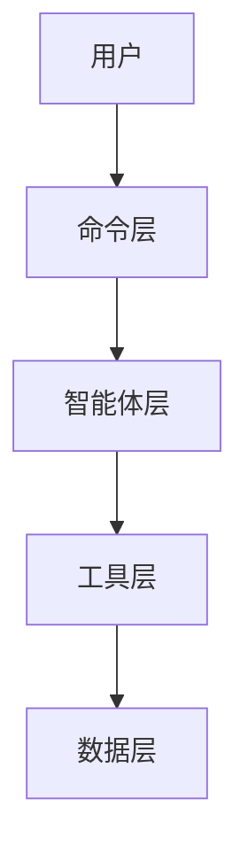
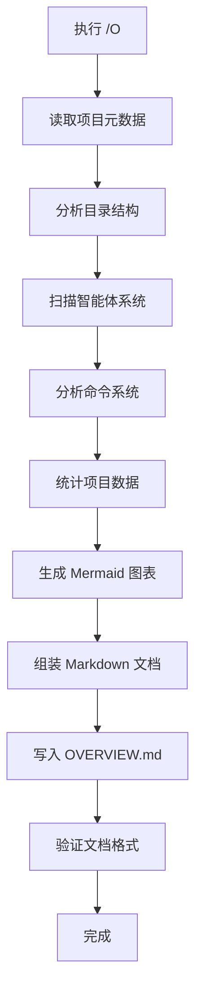

# /O - 项目概览文档生成指令

> 深度分析项目结构，自动生成 OVERVIEW.md 文档，提供比 README 更详细的架构设计、智能体系统、命令系统、技术实现和开发指南。

---

## 📋 指令概述

### 核心功能

**OVERVIEW.md** 是项目的技术深度文档，面向开发者和维护者：

- 🏗️ **架构设计**: 完整的系统架构、设计模式、技术选型
- 🤖 **智能体系统**: 详细的Agent组织结构、职责分工、协作机制
- 📜 **命令系统**: 完整的Slash Commands目录、使用指南、最佳实践
- 🛠️ **技术实现**: 核心模块分析、关键代码路径、实现细节
- 💻 **开发指南**: 环境配置、开发流程、测试规范、部署说明
- 📊 **项目统计**: 代码规模、文件统计、技术栈分布

### 与 /I 命令的区别

| 维度 | /I (README.md) | /O (OVERVIEW.md) |
|------|----------------|------------------|
| **定位** | 项目入口文档 | 技术深度文档 |
| **受众** | 新用户、访客 | 开发者、维护者 |
| **内容** | 快速开始、基础使用 | 架构设计、实现细节 |
| **深度** | ⭐⭐☆☆☆ | ⭐⭐⭐⭐⭐ |
| **更新频率** | 稳定版本更新 | 架构变更时更新 |

---

## 🎯 使用场景

### 场景1: 新开发者入职，需要了解项目全貌

```bash
/O
```

**效果**: 生成完整的 OVERVIEW.md，包含架构设计、智能体系统、命令系统、开发指南等全部内容。

### 场景2: 架构重构后更新技术文档

```bash
/O
```

**效果**: 重新扫描项目结构，更新架构图、模块关系、技术栈等信息。

### 场景3: 准备技术分享或代码审查

```bash
/O
```

**效果**: 快速生成项目技术文档，用于团队分享或外部审查。

---

## 🔍 分析维度

### 1. 项目基本信息

从以下来源提取项目信息：

- [CLAUDE.md](../CLAUDE.md) - 项目定位、核心能力
- [package.json](../package.json) - 项目名称、版本、依赖
- [README.md](../README.md) - 项目简介
- Git 信息 - 分支、提交历史

### 2. 架构分析

**检测内容**：

- 🏗️ 架构模式识别（多智能体架构、三层架构等）
- 📁 目录结构分析（[trees/](../trees/) 快照）
- 🔗 模块依赖关系
- 🎨 设计模式应用

**架构图生成**：



### 3. 智能体系统

深度分析 [.claude/agents/](../.claude/agents/) 目录：

- 📊 组织结构（System、各业务组）
- 🤖 智能体清单（91个智能体的职责矩阵）
- 🎯 能力分布（按组统计）
- 🔄 协作关系（智能体间调用关系）

### 4. 命令系统

分析 [.claude/commands/](../.claude/commands/) 目录：

- 📜 命令清单（26+ 个命令）
- 🏷️ 分类体系（按功能分类）
- 💡 使用示例
- ⚙️ 配置说明

### 5. 技术栈分析

**检测范围**：

- 编程语言（Python, TypeScript, Shell等）
- 框架和库（从 package.json, requirements.txt 提取）
- MCP 服务器（chrome-mcp, lark-mcp, github-mcp等）
- 开发工具（Git, Claude Code等）

### 6. 项目统计

**统计指标**：

- 文件数量（按类型统计）
- 代码行数（按语言统计）
- 智能体数量（91个）
- 命令数量（26+个）
- 目录深度

---

## 📊 文档结构

生成的 OVERVIEW.md 包含以下章节：

### 标准章节

```markdown
# 项目名称

> 一句话项目描述

## 📋 项目概要
- 项目类型、定位、版本
- 核心能力和价值主张
- 技术特点

## 🏗️ 架构设计

### 整体架构
- 架构模式（多智能体架构）
- 架构层次图（Mermaid）
- 核心设计理念

### 目录结构
- 基于 trees/ 最新快照
- 关键目录说明
- 模块依赖关系

## 🤖 智能体系统

### 组织架构
- System 系统智能体（9个）
- 各业务组智能体（82个）

### 智能体清单
| 组别 | 智能体 | 职责 | 工具 |
|------|--------|------|------|

### 协作机制
- 智能体调用关系
- Task 工具使用规范

## 📜 命令系统

### 命令清单
| 命令 | 名称 | 功能 | 版本 |
|------|------|------|------|

### 命令分类
- 开发流程类（/E, /Y, /X）
- 学习优化类（/A, /S, /D, /W）
- 文档管理类（/I, /O, /M, /N）
- 自动化类（/K, /L, /R）
- 其他工具类

### 使用示例
每个命令的典型使用场景

## 🛠️ 技术栈

### 核心技术
- Claude Code + AI Agent 架构
- Model Context Protocol (MCP)
- Git Worktree 并行开发

### MCP 服务器
- chrome-mcp: 浏览器自动化
- lark-mcp: 飞书集成
- github-mcp: GitHub 操作
- context7: 文档检索
- playwright-mcp: 网页测试

### 开发工具
- Git + GitHub
- Python + Shell
- Markdown + YAML

## 💻 开发指南

### 环境要求
- Claude Code 安装配置
- Git 和 Node.js 环境
- MCP 服务器配置

### 项目结构说明
- .claude/ 配置目录
- scripts/ 脚本目录
- trees/ 快照目录

### 开发流程
1. 使用 /Q 了解项目
2. 使用 /E 执行功能开发
3. 使用 /Y 处理问题
4. 使用 /M 更新文档

### 最佳实践
- 智能体设计原则
- 命令编写规范
- 文档维护标准

## 📊 项目统计

### 代码规模
- 文件数量
- 代码行数
- 目录深度

### 系统规模
- 智能体数量: 91个
- 命令数量: 26+个
- MCP 服务器: 8个

## 🔗 相关资源

- [README.md](../README.md) - 项目入门文档
- [CLAUDE.md](../CLAUDE.md) - 项目配置文档
- [.claude/agents/README.md](../.claude/agents/README.md) - 智能体系统文档
- [.claude/commands/README.md](../.claude/commands/README.md) - 命令系统文档
```

---

## 🔧 执行流程



### 执行步骤

1. **读取项目元数据**
   - CLAUDE.md（项目定位）
   - package.json（版本信息）
   - README.md（项目简介）

2. **分析目录结构**
   - 读取 trees/ 最新快照
   - 分析关键目录
   - 识别架构模式

3. **扫描智能体系统**
   - 遍历 .claude/agents/ 目录
   - 提取智能体元数据
   - 分析组织结构

4. **分析命令系统**
   - 遍历 .claude/commands/ 目录
   - 提取命令元数据
   - 分类整理命令

5. **统计项目数据**
   - 统计文件数量
   - 计算代码行数
   - 汇总系统规模

6. **生成文档**
   - 组装各章节内容
   - 生成 Mermaid 图表
   - 写入 OVERVIEW.md

---

## ⚠️ 注意事项

### 执行前检查

- ✅ 确保在项目根目录执行
- ✅ 确保 trees/ 目录包含最新快照（建议先执行 /I 更新）
- ✅ 确保有写入权限

### 文档更新建议

**何时更新 OVERVIEW.md**：

- ✅ 完成重大架构调整
- ✅ 新增或重构智能体组
- ✅ 命令系统有重大变更
- ✅ 新开发者入职需要技术文档
- ✅ 准备技术分享或代码审查

**更新频率**：

- 架构稳定期：1-2个月更新一次
- 架构迭代期：重大变更后立即更新

### 与其他命令的配合

```bash
# 推荐的文档更新流程
/I          # 更新 README.md 和 trees/ 快照
/O          # 更新 OVERVIEW.md（基于最新快照）
/M          # 更新项目级 CLAUDE.md
```

---

## 🔄 版本历史

### v4.0.0 (2025-10-20)

**重大更新**：
- 🎯 重新定位为实用的项目概览文档生成器
- 📝 简化执行流程，移除过度设计的三层架构
- 🤖 深度整合智能体系统分析（91个智能体）
- 📜 完整的命令系统文档（26+命令）
- 📊 增强项目统计和可视化
- 🔗 更准确的相关文档链接

**改进内容**：
- 移除未实现的 scripts/generate_overview.py 引用
- 简化文档结构，更符合实际使用场景
- 增加 Mermaid 架构图和流程图
- 优化章节组织，更易理解和维护

### v3.0.0 (2025-10-20)

- 从元指令重构为项目概览文档生成器
- 引入三层架构设计（理论阶段）

### v2.0.0 (2025-10-02)

- 元指令版本（用于创建 commands）
- 已废弃，功能迁移到 agent-creator

---

## 📚 相关资源

### 相关命令

- [/I](I.md) - 生成 README.md（入门文档）
- [/M](M.md) - 更新项目级 CLAUDE.md
- [/N](N.md) - 更新系统级 CLAUDE.md
- [/Q](Q.md) - 项目上下文感知

### 相关智能体

- [agent-creator](../.claude/agents/system/S1-Agent-Creator.md) - 创建新智能体
- [slash-command-creator](../.claude/agents/system/S2-Slash-Command-Creator.md) - 创建新命令

---

## 配置信息

**版本**: v4.1.0
**更新时间**: 2025-10-22
**更新内容**: 规范化front matter配置，新增allowed-tools和argument-hint字段
**维护原则**: 实用、简洁、准确、规范化
**文档类型**: 技术深度文档
