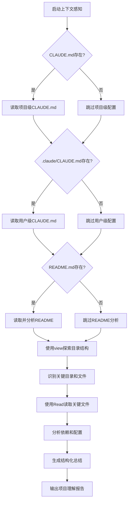

# 项目上下文感知

## 📋 指令概述

**项目上下文感知**是一个智能项目分析工具，通过系统化地探索项目结构、阅读关键文档和分析核心文件，快速建立对项目的全面理解。该指令优先使用文件系统工具而非Shell命令，确保分析过程的准确性和高效性。

### 核心特性
- **多层次配置分析**: 自动读取项目、用户和机器级的CLAUDE.md
- **文件系统优先**: 使用view和Read工具替代Shell命令
- **结构化输出**: 清晰展示项目架构、目标和关键组件
- **快速上手**: 帮助快速理解陌生项目的核心要素

### 应用场景
- 首次接触项目时快速建立全局认知
- 作为其他指令（如`/E`、`/F`）的研究辅助
- 项目交接或协作时的知识传递
- 定期审查项目结构和配置变化

## 🎯 核心功能(五步流程)

### 1. 配置文件优先读取
**目标**: 获取项目的指导原则和约定

```yaml
配置读取顺序:
  项目级配置:
    - 路径: CLAUDE.md (项目根目录)
    - 作用: 项目特定配置、业务规则、团队约定
    - 优先级: 最高

  用户级配置:
    - 路径: .claude/CLAUDE.md (项目中的用户配置)
    - 作用: 个人工作流、跨项目通用经验
    - 优先级: 中等

  机器级配置:
    - 路径: C:\Users\[用户名]\.claude\CLAUDE.md (全局)
    - 作用: 系统级配置、全局偏好
    - 优先级: 最低

读取策略:
  - 依次检查配置文件是否存在
  - 存在则完整读取其内容
  - 提取关键配置项和约定
  - 形成项目理解的基础框架
```

### 2. README文档分析
**目标**: 理解项目的总体目标和使用方式

```yaml
README分析内容:
  项目概述:
    - 项目名称和描述
    - 核心价值主张
    - 主要功能特性

  快速开始:
    - 安装依赖步骤
    - 运行和开发流程
    - 常用命令说明

  项目结构:
    - 目录组织说明
    - 核心模块介绍
    - 关键文件位置

  配置说明:
    - 环境变量配置
    - 配置文件说明
    - 部署相关信息
```

### 3. 项目结构探索
**目标**: 全面了解目录组织和文件分布

```yaml
探索策略:
  使用view工具:
    - 探索根目录结构
    - 识别关键目录（src/, api/, modules/等）
    - 记录目录层级关系

  目录分类:
    - 源代码目录
    - 配置文件目录
    - 文档目录
    - 测试目录
    - 构建输出目录

  特征识别:
    - 项目类型（Python/JavaScript/多语言）
    - 构建工具（pip/npm/docker）
    - 框架依赖（FastAPI/React/等）
```

### 4. 关键文件深度阅读
**目标**: 理解核心代码和实现细节

```yaml
关键文件识别:
  入口文件:
    - main.py / app.py / index.js
    - __init__.py（包入口）
    - 主要应用启动文件

  配置文件:
    - pyproject.toml / package.json
    - requirements.txt / Pipfile
    - .env.example / config files

  核心模块:
    - 业务逻辑核心文件
    - API路由定义
    - 数据模型定义
    - 工具函数库

阅读重点:
  - 导入依赖关系
  - 核心类和函数定义
  - 业务逻辑流程
  - 关键注释和文档字符串
```

### 5. 结构化总结输出
**目标**: 向用户清晰解释项目理解

```yaml
输出内容:
  项目结构:
    - 目录树形结构
    - 每个目录的用途说明
    - 关键文件位置标注

  项目目标:
    - 项目的核心目标
    - 解决的问题领域
    - 目标用户群体

  关键文件及用途:
    - 每个关键文件的作用
    - 文件间的依赖关系
    - 扩展和修改建议

  重要依赖:
    - 核心框架和库
    - 版本要求
    - 功能用途说明

  配置文件:
    - 配置文件清单
    - 关键配置项说明
    - 配置修改指南
```

## 🔧 使用方法

### 不及物动词型（默认行为）

直接使用，无需参数：

```bash
/Q
```

**行为**: 自动分析当前工作目录下的项目，依次执行配置读取、README分析、结构探索、关键文件阅读和总结输出。

### 工作模式

```yaml
执行模式:
  - 自动识别项目类型
  - 智能定位关键文件
  - 优先级驱动的分析流程
  - 结构化的输出格式
```

## 📊 执行流程



## 🔍 意图解析逻辑

### 项目类型识别
```yaml
识别策略:
  Python项目:
    - 存在 pyproject.toml 或 setup.py
    - 存在 requirements.txt 或 Pipfile
    - 存在 .py 文件

  JavaScript/Node项目:
    - 存在 package.json
    - 存在 node_modules/ 目录
    - 存在 .js/.ts 文件

  多语言项目:
    - 同时存在多种语言的配置文件
    - 存在 api/ 和 modules/ 等分离目录
    - 需要分别分析各语言模块

  特殊项目:
    - Docker项目（Dockerfile, docker-compose.yml）
    - 前端项目（webpack.config.js, vite.config.js）
    - 全栈项目（前后端分离的目录结构）
```

### 关键文件定位
```yaml
定位策略:
  入口文件优先:
    - 搜索 main.py, app.py, index.js 等
    - 检查 package.json 的 "main" 字段
    - 检查 pyproject.toml 的 [tool.poetry.scripts]

  配置文件次之:
    - 项目根目录的配置文件
    - .config/ 目录下的配置
    - 环境变量配置文件

  核心模块最后:
    - src/ 或 lib/ 目录下的核心文件
    - api/ 目录下的路由定义
    - models/ 目录下的数据模型
```

## 🎨 实现细节

### 工具使用策略

```yaml
view工具使用:
  适用场景:
    - 探索目录结构
    - 列出文件清单
    - 识别目录层级

  使用方法:
    - 递归探索关键目录
    - 记录文件数量和类型
    - 识别目录命名模式

Read工具使用:
  适用场景:
    - 读取完整文件内容
    - 分析文件结构和逻辑
    - 提取关键信息

  使用方法:
    - 完整读取关键文件
    - 不设置offset和limit（除非文件过大）
    - 解析文件内容并提取要点

Shell命令使用限制:
  避免使用:
    - ls, cat, grep 等基础命令
    - 文件读取和搜索操作
    - 目录遍历操作

  仅在必要时使用:
    - 运行项目特定的命令（如 npm list）
    - 检查环境变量或系统信息
```

### 分析深度控制

```yaml
配置文件:
  - 完整读取并分析所有CLAUDE.md
  - 提取关键约定和规范
  - 识别项目特定的工作流

README文档:
  - 完整读取项目README.md
  - 提取项目概述和快速开始
  - 识别项目目标和功能特性

目录结构:
  - 探索到2-3层深度
  - 记录所有一级目录
  - 选择性深入关键目录

关键文件:
  - 完整读取3-5个最重要文件
  - 部分读取次要文件（前100行）
  - 提取关键导入和定义
```

### 输出格式标准

```yaml
项目结构部分:
  - 使用树形结构展示
  - 标注每个目录的用途
  - 高亮关键文件

项目目标部分:
  - 清晰的目标陈述
  - 解决的核心问题
  - 目标用户描述

关键文件部分:
  - 文件路径 + 用途说明
  - 文件间的依赖关系图
  - 重要性评级

依赖部分:
  - 依赖名称 + 版本
  - 依赖用途说明
  - 关键依赖标注

配置部分:
  - 配置文件清单
  - 关键配置项解释
  - 配置修改建议
```

## ⚙️ 配置项

### 系统配置
```yaml
配置版本: v2.0.0
更新时间: 2025-09-30
工具优先级: view > Read > Bash
分析深度: 中等（可根据项目复杂度调整）
```

### 分析范围
```yaml
必读文件:
  - CLAUDE.md (所有层级)
  - README.md
  - 项目配置文件

探索目录:
  - 项目根目录
  - src/ 或 lib/
  - api/ 或 routes/
  - modules/
  - tests/

可选分析:
  - 依赖锁文件详细分析
  - 测试文件结构分析
  - 文档目录深度探索
```

### 输出控制
- **详细程度**: 中等（包含关键信息，避免过度细节）
- **格式风格**: Markdown结构化输出
- **长度限制**: 建议500-1000行

## 📝 示例场景

### 场景1：首次接触Python API项目

**执行**:
```bash
/Q
```

**输出示例**:
```markdown
# 项目上下文分析报告

## 📁 项目结构
```
project-root/
├── api/                  # FastAPI应用主目录
│   ├── main.py          # 应用入口
│   ├── routers/         # API路由定义
│   └── models/          # 数据模型
├── modules/             # 独立功能模块
│   ├── auth/            # 认证模块
│   └── storage/         # 存储模块
├── tests/               # 测试文件
├── CLAUDE.md            # 项目配置和规范
└── README.md            # 项目文档
```

## 🎯 项目目标
- **核心目标**: 构建餐饮行业的图片处理和管理API
- **解决问题**: 自动化餐饮设计物料的生成和管理
- **目标用户**: 餐饮设计师和运营团队

## 🔑 关键文件及用途
1. **api/main.py** - FastAPI应用主入口，定义全局配置和中间件
2. **api/routers/** - API路由模块，按功能领域组织
3. **modules/auth/** - 用户认证和授权模块
4. **CLAUDE.md** - 项目开发规范和指令系统

## 📦 重要依赖
- **FastAPI** (^0.104.0) - Web框架
- **Pydantic** (^2.4.0) - 数据验证
- **SQLAlchemy** (^2.0.0) - ORM框架
- **Redis** (^5.0.0) - 缓存和会话

## ⚙️ 配置文件
- **pyproject.toml** - 项目依赖和构建配置
- **.env.example** - 环境变量模板
- **CLAUDE.md** - 开发规范和工作流配置
```

### 场景2：分析多语言全栈项目

**执行**:
```bash
/Q
```

**关键发现**:
- 前端：React + TypeScript (frontend/)
- 后端：FastAPI + Python (api/)
- 共享模块：Python (modules/)
- 配置系统：三层CLAUDE.md架构
- 部署：Docker + docker-compose

### 场景3：新成员项目入职

**使用流程**:
1. 新成员克隆项目仓库
2. 运行 `/Q` 快速了解项目
3. 阅读输出的项目分析报告
4. 根据报告深入学习关键模块
5. 参考 CLAUDE.md 了解开发规范

**效果**: 从完全陌生到基本熟悉仅需15-30分钟

## 🔍 错误处理

### 常见错误类型

#### 1. 配置文件缺失
```yaml
症状: 无法找到CLAUDE.md或README.md
原因:
  - 项目未初始化配置
  - 文件命名不标准
  - 位于非标准位置
处理:
  - 跳过缺失的配置文件
  - 继续分析其他可用资源
  - 在报告中标注缺失项
```

#### 2. 文件读取失败
```yaml
症状: 无法读取某些关键文件
原因:
  - 文件权限不足
  - 文件损坏或编码问题
  - 文件过大
处理:
  - 记录失败的文件
  - 尝试读取替代文件
  - 在报告中说明限制
```

#### 3. 项目类型无法识别
```yaml
症状: 无法确定项目的技术栈
原因:
  - 非标准项目结构
  - 混合多种技术
  - 配置文件缺失
处理:
  - 基于现有文件推断类型
  - 分析所有可识别的组件
  - 在报告中说明不确定性
```

### 错误恢复策略
```yaml
降级策略:
  - 从完整分析降级到部分分析
  - 从深度分析降级到表层分析
  - 从自动分析降级到用户引导

补偿机制:
  - 使用替代文件补充信息
  - 基于常见模式进行推断
  - 提供人工分析建议
```

## 📈 性能优化

### 分析效率优化
```yaml
并行读取:
  - 配置文件和README并行读取
  - 多个关键文件批量读取
  - 减少工具调用次数

智能跳过:
  - 跳过node_modules/等大型目录
  - 跳过构建输出目录
  - 跳过临时文件和缓存

缓存机制:
  - 缓存目录结构探索结果
  - 缓存常见项目类型特征
  - 复用相似项目的分析结果
```

### 输出优化
```yaml
结构化输出:
  - 使用统一的Markdown格式
  - 分层次展示信息
  - 高亮关键内容

长度控制:
  - 避免冗长的文件内容展示
  - 提取和总结关键信息
  - 使用示例而非完整列表
```

## 🎯 成功标准

### 分析完整性
```yaml
必须包含:
  ✅ 项目结构树形图
  ✅ 项目目标和核心功能
  ✅ 3-5个关键文件说明
  ✅ 主要依赖清单
  ✅ 配置文件说明

可选包含:
  ✅ 测试结构说明
  ✅ 部署配置说明
  ✅ 开发工作流说明
```

### 输出质量
```yaml
质量要求:
  ✅ 信息准确无误
  ✅ 结构清晰易读
  ✅ 重点突出
  ✅ 长度适中（不过长不过短）
  ✅ 可操作性强
```

### 用户理解
```yaml
理解目标:
  ✅ 用户能快速定位关键文件
  ✅ 用户理解项目整体架构
  ✅ 用户知道如何开始开发
  ✅ 用户了解主要约定和规范
```

## 🔗 相关资源

### 内部资源
- **项目配置**: `CLAUDE.md` (三层架构)
- **项目文档**: `README.md`
- **开发指南**: `CONTRIBUTING.md` (如果存在)

### 相关指令
- `/E` - PRP生成与执行（需要项目上下文）
- `/F` - PRP快速创建（基于项目理解）
- `/R` - 并行任务执行（需要了解项目结构）

### 工作流集成
```yaml
典型工作流:
  1. /Q - 建立项目理解
  2. /F - 生成功能规划PRP
  3. /E - 执行功能实现

或:
  1. /Q - 分析现有项目
  2. 识别需要改进的部分
  3. 使用其他指令进行优化
```

## ⚠️ 注意事项

### 使用限制
```yaml
适用场景:
  ✅ 首次接触项目
  ✅ 项目交接
  ✅ 定期审查项目结构
  ✅ 作为其他指令的前置步骤

不适用场景:
  ❌ 已非常熟悉的项目（浪费时间）
  ❌ 超大型项目（分析时间过长）
  ❌ 临时脚本项目（结构过简单）
```

### 最佳实践
```yaml
执行前:
  - 确保在项目根目录下
  - 确保有基本的文件读取权限
  - 理解输出报告的用途

执行中:
  - 耐心等待分析完成
  - 关注关键信息而非全部细节

执行后:
  - 保存分析报告作为参考
  - 根据报告深入学习关键部分
  - 必要时重新运行更新理解
```

### 重要提醒
```yaml
关键原则:
  - 使用文件系统工具而非Shell命令
  - 优先读取配置文件和文档
  - 关注项目整体而非具体实现细节
  - 输出结构化、易读的分析报告

常见误区:
  - 不要试图分析所有文件
  - 不要陷入实现细节
  - 不要忽略配置文件
  - 不要跳过README分析
```

---

**配置版本**: v2.0.0
**更新时间**: 2025-09-30
**维护原则**: 文件系统优先、结构化输出、快速理解