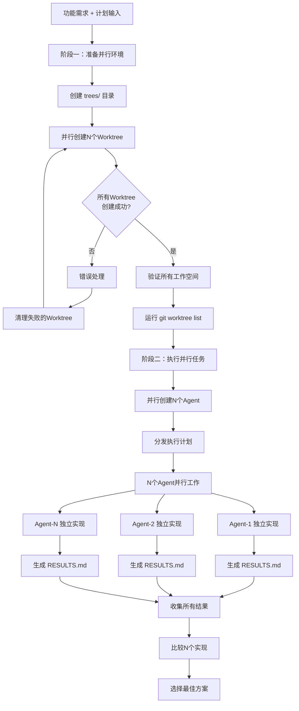

# 并行任务准备与执行

## 📋 指令概述

**并行任务准备与执行引擎**是一个基于Git Worktree的并行开发系统，通过创建多个隔离的工作空间，允许多个AI Agent同时探索不同的实现方案。该系统实现了真正的并行开发，每个Agent在独立的Git分支和工作目录中工作，互不干扰，最终可以选择最佳实现或合并多个方案的优点。

### 核心特性
- **完全隔离**: 每个任务在独立的Git worktree中运行
- **真正并行**: 多个Agent同时执行，大幅缩短开发时间
- **多样化探索**: 不同Agent可以尝试不同的实现路径
- **结果对比**: 便于比较多个实现方案的优劣

### 应用场景
- 探索多种技术方案并选择最佳
- 需要快速验证多个实现思路
- A/B测试不同的代码实现
- 并行开发互不依赖的功能模块

## 🎯 核心功能(两阶段流程)

### 阶段一：并行环境准备

#### 1. Worktree目录初始化
**目标**: 创建N个独立的Git工作空间

```yaml
初始化流程:
  创建根目录:
    - 在项目根创建 trees/ 目录
    - 用于存放所有并行工作空间

  循环创建Worktree:
    - 对于 i 从 1 到 并行工作树数量:
      - 创建新分支: FEATURE_NAME-i
      - 添加worktree: ./trees/FEATURE_NAME-i
      - 验证worktree创建成功

并行执行策略:
  - 使用Batch和Task工具并行执行循环
  - 所有worktree创建同时进行
  - 大幅缩短初始化时间
```

**关键命令**:
```bash
# 创建worktree目录
mkdir trees

# 为每个并行任务创建独立工作空间
git worktree add -b FEATURE_NAME-1 ./trees/FEATURE_NAME-1
git worktree add -b FEATURE_NAME-2 ./trees/FEATURE_NAME-2
...

# 验证所有worktree
git worktree list
```

#### 2. 环境完整性验证
**目标**: 确保所有工作空间准备就绪

```yaml
验证检查:
  Worktree创建验证:
    - 所有目录成功创建
    - Git分支正确设置
    - 目录结构完整

  代码同步验证:
    - 每个工作空间与主分支代码一致
    - git ls-files 输出正确
    - 文件权限和属性正确

  Git状态验证:
    - 所有工作空间处于清洁状态
    - 无未提交的修改
    - 分支指向正确
```

### 阶段二：并行任务执行

#### 1. Agent分配策略
**目标**: 为每个工作空间分配独立的AI Agent

```yaml
Agent创建方案:
  创建数量:
    - 创建 N 个新的子Agent
    - N = 并行工作树数量

  Agent命名:
    - Agent-1: 负责 trees/<功能名称>-1/
    - Agent-2: 负责 trees/<功能名称>-2/
    - ...
    - Agent-N: 负责 trees/<功能名称>-N/

并行创建机制:
  - 使用Task工具并行创建所有Agent
  - 每个Agent独立启动
  - Agent间无通信和协调
```

#### 2. 执行计划分发
**目标**: 向每个Agent提供完整的实现指导

```yaml
执行计划内容:
  - 详细的功能需求描述
  - 实现的技术要求
  - 代码规范和约定
  - 验证和测试标准

计划分发方式:
  - 每个Agent接收相同的执行计划
  - Agent在各自工作空间中独立实现
  - 鼓励探索不同的技术路径
```

**重要原则**:
- 务必阅读和理解`执行计划`
- 每个Agent独立决策实现细节
- 工作空间代码与当前分支保持一致

#### 3. 独立并行实现
**目标**: N个Agent同时独立完成实现

```yaml
Agent职责范围:
  仅关注代码更改:
    - 实现功能代码
    - 修改相关文件
    - 创建必要的新文件

  不执行验证操作:
    - 不运行测试
    - 不执行代码检查
    - 不进行代码审查

实现自由度:
  - 可以选择不同的技术方案
  - 可以采用不同的代码结构
  - 可以使用不同的库或工具
  - 鼓励创新和探索

隔离保证:
  - 每个Agent完全独立工作
  - 不与其他Agent通信
  - 不访问其他工作空间
  - 不共享任何状态
```

#### 4. 结果文档化
**目标**: 每个Agent记录实现细节和决策

```yaml
RESULTS.md要求:
  文件位置:
    - 每个工作空间根目录
    - 文件名: RESULTS.md

  必需内容:
    - 所做更改的摘要
    - 修改/创建的文件清单
    - 关键实现决策说明
    - 遇到的挑战和解决方案
    - 测试建议和验证方法

  可选内容:
    - 性能考虑
    - 安全考虑
    - 可扩展性分析
    - 替代方案对比
```

**RESULTS.md示例结构**:
```markdown
# 实现结果报告

## 📝 变更摘要
- 实现了XX功能
- 重构了YY模块
- 新增了ZZ工具

## 📁 修改文件
- `path/to/file1.py` - 新增功能A
- `path/to/file2.py` - 重构功能B
- `path/to/file3.py` - 新建工具C

## 🎯 关键决策
1. **决策1**: 选择方案X而非方案Y，原因是...
2. **决策2**: 使用库A而非库B，因为...

## 💡 挑战与解决
- **挑战1**: 问题描述
  - 解决方案: ...
- **挑战2**: 问题描述
  - 解决方案: ...

## ✅ 测试建议
- 单元测试: ...
- 集成测试: ...
- 手动验证: ...
```

## 🔧 使用方法

### 及物动词型（附带参数）

提供功能名称、并行数量和详细执行计划：

```bash
/R <功能名称> <并行数量> <执行计划的详细描述>
```

**示例**:
```bash
/R "new-auth-api" 3 "请实现一个新的用户认证API，支持邮箱密码登录和OAuth2.0集成。要求：1) FastAPI框架 2) JWT token认证 3) Redis会话管理 4) 完整的错误处理"
```

**参数说明**:
- **功能名称**: 用于命名分支和目录（如 new-auth-api）
- **并行数量**: 创建的工作空间数量，通常为 2-4
- **执行计划**: 详细的实现要求和技术规范

### 不及物动词型（默认目标）

直接使用，从PRP文件读取执行计划：

```bash
/R
```

**行为**: 默认从 `.claude/PRPs/PRP.md` 文件读取功能名称和执行计划，自动确定并行数量（默认2个）。

## 📊 执行流程



## 🔍 意图解析逻辑

### 并行数量决策
```yaml
决策策略:
  简单功能:
    - 并行数量: 2
    - 原因: 简单功能差异不大，2个方案足够对比

  中等复杂度:
    - 并行数量: 3
    - 原因: 需要更多方案探索，3个提供充分选择

  高复杂度:
    - 并行数量: 4
    - 原因: 复杂功能需要多角度探索

  资源限制:
    - 最大并行数: 5
    - 原因: 避免资源过度消耗和管理复杂度
```

### 执行计划解析
```yaml
解析维度:
  技术要求:
    - 提取框架和库要求
    - 识别架构模式
    - 确定技术约束

  功能范围:
    - 核心功能点
    - 边界条件
    - 验收标准

  质量标准:
    - 性能要求
    - 安全要求
    - 可维护性要求
```

## 🎨 实现细节

### Git Worktree管理

```yaml
Worktree创建:
  命令模式:
    git worktree add -b <分支名> <目录路径>

  分支命名:
    - 格式: FEATURE_NAME-<数字>
    - 示例: new-auth-api-1, new-auth-api-2

  目录结构:
    trees/
    ├── new-auth-api-1/
    ├── new-auth-api-2/
    └── new-auth-api-3/

Worktree特性:
  - 每个目录有独立的工作区
  - 共享同一个Git仓库
  - 分支间完全隔离
  - 可以独立提交和推送
```

### Agent并行执行机制

```yaml
并行创建:
  - 使用单个消息创建多个Task工具调用
  - 所有Agent同时启动
  - 无需等待前一个完成

Agent隔离:
  - 每个Agent分配不同的工作目录
  - Agent无法访问其他工作空间
  - Git操作局限于自己的分支

执行监控:
  - 主进程不监控Agent进度
  - Agent独立完成所有工作
  - 最终通过RESULTS.md汇报
```

### 结果收集和对比

```yaml
收集策略:
  - 读取所有工作空间的RESULTS.md
  - 检查修改的文件清单
  - 对比实现思路和决策

对比维度:
  代码质量:
    - 可读性
    - 可维护性
    - 符合规范程度

  实现完整性:
    - 功能覆盖度
    - 错误处理
    - 边界情况考虑

  技术选择:
    - 技术方案合理性
    - 性能考虑
    - 扩展性

  文档质量:
    - RESULTS.md完整性
    - 决策说明清晰度
    - 测试建议可行性
```

## ⚙️ 配置项

### 系统配置
```yaml
配置版本: v2.1.0
更新时间: 2025-09-30
Worktree根目录: trees/
结果文档: RESULTS.md
```

### 执行参数
```yaml
默认并行数量: 2
推荐并行数量: 2-4
最大并行数量: 5

工作空间命名:
  格式: trees/<功能名称>-<数字>
  示例: trees/new-feature-1

分支命名:
  格式: <功能名称>-<数字>
  示例: new-feature-1
```

### 质量标准
```yaml
环境准备标准:
  - 所有worktree创建成功
  - Git状态清洁无警告
  - 工作空间代码完整

执行标准:
  - 所有Agent完成实现
  - 所有RESULTS.md生成
  - 可对比和选择最佳方案
```

## 📝 示例场景

### 场景1：API实现方案探索

**输入**:
```bash
/R "user-auth-api" 3 "实现用户认证API，支持邮箱密码和OAuth2.0。可以探索不同的技术方案。"
```

**执行过程**:
1. **环境准备**: 创建3个独立工作空间
   - trees/user-auth-api-1/
   - trees/user-auth-api-2/
   - trees/user-auth-api-3/

2. **并行执行**: 3个Agent同时工作
   - Agent-1: 使用FastAPI + JWT + Redis
   - Agent-2: 使用FastAPI + Sessions + PostgreSQL
   - Agent-3: 使用FastAPI + OAuth2 library + Redis

3. **结果对比**:
   - Agent-1: 简洁高效，适合无状态API
   - Agent-2: 会话管理完整，适合有状态应用
   - Agent-3: OAuth集成最佳，但复杂度高

4. **最终选择**: 根据项目需求选择Agent-1方案，参考Agent-3的OAuth实现

### 场景2：重构方案对比

**输入**:
```bash
/R "cache-refactoring" 2 "重构缓存模块，将内存缓存替换为Redis。探索不同的迁移策略。"
```

**执行过程**:
1. **环境准备**: 创建2个工作空间
2. **并行执行**:
   - Agent-1: 渐进式迁移，保持向后兼容
   - Agent-2: 全面替换，彻底改造
3. **结果选择**: Agent-1方案风险更低，采用该方案

### 场景3：算法优化对比

**输入**:
```bash
/R "search-optimization" 4 "优化搜索算法性能。尝试不同的数据结构和算法。"
```

**执行过程**:
1. **环境准备**: 创建4个工作空间
2. **并行执行**:
   - Agent-1: 使用Trie树
   - Agent-2: 使用倒排索引
   - Agent-3: 使用ElasticSearch
   - Agent-4: 使用向量搜索
3. **性能测试**: 对比4个方案的性能和准确度
4. **最终选择**: 根据数据规模和查询模式选择最优方案

## 🔍 错误处理

### 常见错误类型

#### 1. Worktree创建失败
```yaml
症状: 部分或全部worktree创建失败
原因:
  - 分支名冲突
  - 目录已存在
  - 磁盘空间不足
  - Git版本过旧
处理:
  - 检查并删除冲突的分支
  - 清理已存在的目录
  - 验证磁盘空间
  - 升级Git版本
```

#### 2. Agent执行失败
```yaml
症状: 某个Agent未能完成实现
原因:
  - 执行计划不清晰
  - 技术难度超预期
  - 环境配置问题
  - Agent意外中断
处理:
  - 审查该Agent的工作进度
  - 手动完成未完成部分
  - 或仅使用成功Agent的结果
  - 记录失败原因供后续改进
```

#### 3. 结果文档缺失
```yaml
症状: 某些工作空间缺少RESULTS.md
原因:
  - Agent未按要求生成文档
  - 文件路径错误
  - Agent提前中断
处理:
  - 手动检查代码变更
  - 基于Git diff生成摘要
  - 补充缺失的文档
```

### 错误恢复策略
```yaml
环境清理:
  - 删除失败的worktree: git worktree remove <path>
  - 删除对应分支: git branch -D <branch-name>
  - 清理trees/目录

部分成功处理:
  - 使用成功Agent的结果
  - 将失败Agent视为额外探索
  - 不强制要求所有Agent成功

完全失败恢复:
  - 检查并修复环境问题
  - 调整执行计划
  - 减少并行数量重试
```

## 📈 性能优化

### 并行效率优化
```yaml
Worktree创建:
  - 批量并行创建而非串行
  - 使用Git --quiet减少输出
  - 预检查避免重复创建

Agent并行度:
  - 根据机器性能调整并行数
  - 避免过度并行导致资源竞争
  - 监控系统资源使用

结果收集:
  - 并行读取RESULTS.md
  - 使用Git diff快速对比
  - 缓存对比结果
```

### 磁盘空间优化
```yaml
Worktree管理:
  - 及时清理不需要的worktree
  - 使用浅克隆减少空间占用
  - 共享Git对象数据库

代码复用:
  - 共享node_modules/等依赖目录
  - 使用符号链接复用静态资源
  - 避免重复构建
```

## 🎯 成功标准

### 环境准备成功标准
```yaml
必达标准:
  ✅ 所有worktree创建成功
  ✅ Git状态清洁无冲突
  ✅ 工作空间代码完整一致
  ✅ git worktree list验证通过
```

### 执行成功标准
```yaml
必达标准:
  ✅ 所有Agent完成实现
  ✅ 所有RESULTS.md生成
  ✅ 代码符合基本规范
  ✅ 可进行方案对比

优秀标准:
  ✅ 多个实现质量高
  ✅ 探索了不同技术路径
  ✅ RESULTS.md文档详尽
  ✅ 提供清晰的对比依据
```

### 整体成功标准
```yaml
项目收益:
  ✅ 获得N个可选实现方案
  ✅ 可进行充分的对比分析
  ✅ 选择或合并最佳方案
  ✅ 加深对问题的理解
  ✅ 节省探索不同方案的时间
```

## 🔗 相关资源

### 内部资源
- **PRP文档**: `.claude/PRPs/PRP.md`
- **Worktree目录**: `trees/`
- **结果文档**: `trees/*/RESULTS.md`

### 相关指令
- `/E` - PRP生成与执行（单线程完整流程）
- `/F` - PRP快速创建（为并行执行生成计划）
- `/Q` - 项目上下文感知（了解项目结构）

### 工作流集成
```yaml
典型工作流:
  1. /F - 生成详细的PRP
  2. /R - 基于PRP并行探索多个实现
  3. 对比选择最佳方案
  4. 合并到主分支
  5. 清理worktree

或:
  1. /E - 生成单个实现
  2. 不满意时使用 /R 探索其他方案
  3. 对比两者选择更优
```

### Git Worktree参考
```bash
# 列出所有worktree
git worktree list

# 删除worktree
git worktree remove <path>

# 修剪陈旧worktree
git worktree prune

# 移动worktree
git worktree move <source> <destination>
```

## ⚠️ 注意事项

### 使用限制
```yaml
适用场景:
  ✅ 探索多种技术方案
  ✅ A/B测试不同实现
  ✅ 快速原型验证
  ✅ 并行开发独立模块

不适用场景:
  ❌ 简单修复（成本大于收益）
  ❌ 已有明确最佳方案
  ❌ 磁盘空间严重不足
  ❌ 功能间强依赖（难以并行）
```

### 最佳实践
```yaml
执行前:
  - 确保Git仓库状态清洁
  - 明确执行计划和质量标准
  - 评估并行数量的合理性
  - 确认有足够的磁盘空间

执行中:
  - 不干预Agent的独立工作
  - 关注整体进度而非单个Agent
  - 必要时提前中止明显失败的Agent

执行后:
  - 仔细对比所有实现方案
  - 记录每个方案的优缺点
  - 选择或合并最佳特性
  - 及时清理worktree和分支
```

### 重要提醒
```yaml
关键原则:
  - Agent完全独立无通信
  - 每个工作空间完全隔离
  - 鼓励探索不同技术路径
  - 最终结果需要人工审查和选择

常见陷阱:
  - 并行数量过多导致资源不足
  - 执行计划不够详细导致实现偏差
  - 忽视RESULTS.md文档要求
  - worktree清理不及时占用空间
  - Agent间意外产生依赖
```

---

**配置版本**: v2.1.0
**更新时间**: 2025-09-30
**维护原则**: 隔离、并行、多样化