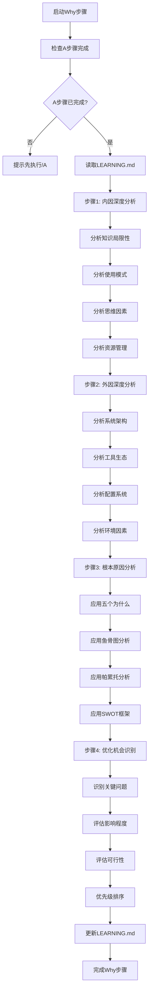

# ASDW学习系统 - Why (为什么)

## 📋 指令概述

**ASDW学习系统 - Why步骤**是学习流程的第二步，基于A步骤的现状考察结果，从内因（用户自身）和外因（环境工具）两个维度深度分析问题根源，运用多种分析方法识别优化机会，为后续的方法制定提供科学指导。

### 核心特性
- **内因分析**: 从知识、使用、思维、资源等角度深度自省
- **外因分析**: 从系统、工具、配置、环境等角度系统考察
- **根本原因**: 运用多种方法论挖掘问题本质
- **优化识别**: 准确识别改进方向和优先级

### 应用场景
- 问题根因分析
- 系统瓶颈诊断
- 优化机会识别
- 改进方向规划

## 🔄 执行逻辑

### 日期文件夹管理
```yaml
自动创建逻辑:
  1. 获取当前日期 (格式: YYYY-MM-DD)
  2. 检查 learning/{今日日期}/ 目录是否存在
  3. 不存在则自动创建
  4. 将学习成果保存到 S_WHY.md

前置依赖检查:
  - 检查当日 A_WHAT.md 是否存在
  - 如不存在，提示: "⚠️ 请先完成 /A 指令 (WHAT步骤)"
  - 读取 A_WHAT.md 中识别的问题作为分析起点

历史学习检测:
  1. 检查当日是否已存在 S_WHY.md
  2. 如果存在，提示用户追加或覆盖
  3. 查找最近7天的 S_WHY.md 文件
  4. 对比分析的问题是否重复
  5. 显示历史分析记录供参考

避免重复策略:
  - 基于 A 阶段识别的问题进行分析
  - 自动继承 A 阶段的主题上下文
  - 检测相似问题的历史分析
```

## 🎯 核心功能(四步流程)

### 1. 内因深度分析
**目标**: 从用户自身角度探究问题根源

**分析维度**:
```yaml
知识局限性:
  - 理解缺口和认知盲点
  - 技能不足和能力局限
  - 经验短缺和实践缺失
  - 学习障碍和思维局限

使用模式:
  - 工具使用模式和习惯
  - 工作流程效率问题
  - 配置掌握程度
  - 最佳实践采用情况

思维因素:
  - 学习态度和主动性
  - 问题解决方法偏好
  - 变化阻力和适应性
  - 持续改进意识

资源管理:
  - 时间分配和优先级管理
  - 注意力集中和分散问题
  - 精力分配和效率管理
  - 动机持续性和驱动力
```

**分析方法**:
- 自我反思和诚实评估
- 对照最佳实践找差距
- 识别习惯性错误模式
- 分析学习和工作效率瓶颈

### 2. 外因深度分析
**目标**: 从环境和工具角度探究问题根源

**分析维度**:
```yaml
系统架构:
  - 系统架构设计局限性
  - 集成复杂度和挑战
  - 扩展性约束
  - 维护负担和成本

工具生态:
  - 工具功能缺口和不足
  - 可用性问题和体验缺陷
  - 性能瓶颈和限制
  - 兼容性问题和冲突

配置系统:
  - 配置复杂度开销
  - 文档缺失和不完整
  - 学习曲线陡峭程度
  - 错误倾向和风险点

环境因素:
  - 资源约束和限制
  - 技术演进和变化压力
  - 行业标准和规范要求
  - 团队动态和协作环境
```

**分析方法**:
- 系统架构审查
- 工具功能评估
- 配置复杂度分析
- 环境约束识别

### 3. 根本原因分析
**目标**: 运用多种方法论深入挖掘问题本质

**分析方法论**:
```yaml
五个为什么分析法:
  方法: 连续追问"为什么"直至根本原因
  适用: 单一问题的深度挖掘
  输出: 因果链条和根本原因

鱼骨图因果分析:
  方法: 系统化分析多个因素的因果关系
  适用: 复杂问题的全面分析
  输出: 因素分类和影响路径

帕累托分析法:
  方法: 识别20%的关键因素导致80%的问题
  适用: 优先级排序和资源分配
  输出: 关键影响因素排序

SWOT分析框架:
  方法: 全面评估优势、劣势、机会、威胁
  适用: 整体战略分析和规划
  输出: 内外部因素矩阵
```

**因果关系识别**:
- 直接原因：问题的直接触发因素
- 间接原因：影响问题的间接因素
- 系统性原因：系统层面的根本原因
- 环境因素影响：外部环境的影响

### 4. 学习笔记产出
**目标**: 将分析结果整理为结构化的学习笔记

**输出位置**: `learning/{今日日期}/S_WHY.md`
- 格式示例: `learning/2025-10-18/S_WHY.md`
- 自动创建日期子文件夹
- 与当日A_WHAT.md配套使用

**内容结构**:
```markdown
## 🔍 WHY - 原因分析

### 🔬 根本原因总结
[核心问题和根本原因的总结]

### 🎯 内因深度分析
[从用户自身角度的问题分析]

### 🌍 外因深度分析
[从环境工具角度的问题分析]

### ✨ 优化机会清单
[识别出的具体优化机会]

### 📊 改进优先级排序
[按影响和可行性排序的改进项]
```

## 🔧 使用方法

### 不及物动词型（无需参数）

```bash
/S
```

**执行效果**:
- 基于A步骤的现状考察结果
- 深度分析内因和外因
- 运用多种方法论挖掘根本原因
- 识别优化机会并排序
- 更新LEARNING.md的WHY部分

**前置依赖**: 必须先执行 `/A` 步骤

## 📊 执行流程



## 🔍 意图解析逻辑

### 依赖检查
```yaml
检查机制:
  - 验证LEARNING.md文件存在
  - 验证WHAT部分已完成
  - 验证有足够的基础数据

失败处理:
  - 如果LEARNING.md不存在，提示先执行/A
  - 如果WHAT部分为空，提示先执行/A
  - 如果数据不足，引导补充分析
```

### 分析范围识别
```yaml
从WHAT部分提取:
  - 项目概览信息
  - 配置体系状况
  - 资源评估结果
  - 关键发现和洞察

分析重点:
  - 识别出的问题和差距
  - 工具和配置的不足
  - 工作流的瓶颈
  - 学习和使用的障碍
```

## 🎨 实现细节

### 内因分析框架
```yaml
知识维度:
  评估方法: 对照学习目标和技能清单
  关键问题:
    - 哪些概念理解不深？
    - 哪些技能需要提升？
    - 哪些经验需要积累？

使用维度:
  评估方法: 观察实际使用模式和效率
  关键问题:
    - 是否充分利用工具功能？
    - 工作流程是否高效？
    - 是否采用最佳实践？

思维维度:
  评估方法: 反思学习态度和问题解决方法
  关键问题:
    - 学习态度是否积极主动？
    - 面对问题是否善于思考？
    - 是否愿意接受改变？

资源维度:
  评估方法: 分析时间和精力分配
  关键问题:
    - 时间管理是否合理？
    - 注意力是否集中？
    - 动机是否持续？
```

### 外因分析框架
```yaml
系统维度:
  评估方法: 架构审查和设计评估
  关键问题:
    - 系统架构是否合理？
    - 集成是否过于复杂？
    - 扩展性是否受限？

工具维度:
  评估方法: 功能评估和体验测试
  关键问题:
    - 工具功能是否完整？
    - 使用体验是否良好？
    - 性能是否满足需求？

配置维度:
  评估方法: 复杂度分析和文档审查
  关键问题:
    - 配置是否过于复杂？
    - 文档是否充分？
    - 学习曲线是否合理？

环境维度:
  评估方法: 约束分析和趋势研究
  关键问题:
    - 资源是否充足？
    - 技术演进是否带来压力？
    - 外部要求是否合理？
```

### 根本原因挖掘
```yaml
五个为什么示例:
  问题: 智能体使用效率不高
  为什么1: 因为不熟悉智能体功能
  为什么2: 因为文档阅读不充分
  为什么3: 因为时间分配不合理
  为什么4: 因为优先级判断有误
  为什么5: 因为缺乏系统化的学习规划
  根本原因: 学习方法和时间管理问题

鱼骨图示例:
  问题: 工作流效率低
  人员因素: 技能不足、习惯不佳
  方法因素: 流程繁琐、缺乏自动化
  工具因素: 工具不熟悉、配置不当
  环境因素: 干扰多、资源不足
```

## ⚙️ 配置项

### 系统配置
```yaml
配置版本: v2.0.0
更新时间: 2025-09-30
步骤位置: 第二步 - 原因分析
输出文档: LEARNING.md (WHY部分)
```

### 分析方法
```yaml
必用方法:
  - 内因外因分析
  - 根本原因分析

可选方法:
  - 五个为什么
  - 鱼骨图
  - 帕累托分析
  - SWOT分析
```

### 输出要求
```yaml
格式: Markdown
位置: LEARNING.md的WHY部分
结构: 固定标题化结构
更新方式: 追加或更新WHY部分
```

## 📝 示例场景

### 场景1：工作效率问题分析

**背景** (来自A步骤):
```
📊 项目概览: 37个智能体，20个命令
💡 关键发现: 智能体使用效率不高，命令掌握不够
```

**操作**:
```bash
/S
```

**执行过程**:
```
🔍 开始原因分析...

🎯 内因深度分析:
  知识局限性:
    - 智能体功能理解不全面
    - 命令参数掌握不充分
    - 工作流设计经验不足

  使用模式:
    - 倾向使用熟悉的少数智能体
    - 很少使用高级命令功能
    - 工作流程未充分优化

  思维因素:
    - 学习新功能的主动性不足
    - 面对复杂任务缺乏耐心
    - 对自动化重视不够

  资源管理:
    - 学习时间分配不合理
    - 注意力容易被打断
    - 持续改进动力不足

🌍 外因深度分析:
  系统架构:
    - 37个智能体学习成本高
    - 智能体间协作机制复杂
    - 缺少渐进式学习路径

  工具生态:
    - 部分智能体文档不够详细
    - 示例场景不够丰富
    - 缺少交互式学习工具

  配置系统:
    - 配置文件较多较复杂
    - 快捷键记忆负担大
    - 错误提示不够友好

  环境因素:
    - 时间压力导致倾向快速完成
    - 缺少系统化学习的环境
    - 无人指导和交流

🔬 根本原因分析:
  五个为什么:
    Q1: 为什么智能体使用效率不高？
    A1: 因为只使用熟悉的少数智能体

    Q2: 为什么只使用少数智能体？
    A2: 因为不了解其他智能体的功能

    Q3: 为什么不了解其他智能体？
    A3: 因为缺少系统化学习

    Q4: 为什么缺少系统化学习？
    A4: 因为时间和精力分配不合理

    Q5: 为什么时间精力分配不合理？
    A5: 因为缺乏学习规划和优先级管理

    根本原因: 缺乏系统化的学习规划和时间管理

  帕累托分析:
    20%的关键因素:
      1. 学习方法不系统 (40%影响)
      2. 时间分配不合理 (30%影响)
      3. 文档不够详细 (20%影响)
      4. 缺少实践机会 (10%影响)

✨ 优化机会清单:
  1. 建立系统化学习计划
  2. 优化时间和精力分配
  3. 改进智能体文档
  4. 设计渐进式学习路径
  5. 增加实践练习机会

📊 改进优先级排序:
  高优先级 (立即实施):
    - 制定ASDW学习计划 (内因+高影响)
    - 优化时间分配策略 (内因+高影响)

  中优先级 (短期实施):
    - 补充智能体使用文档 (外因+中影响)
    - 设计学习路径图 (外因+中影响)

  低优先级 (长期规划):
    - 开发交互式学习工具 (外因+低影响)
    - 建立用户交流社区 (外因+低影响)

✅ 分析结果已写入LEARNING.md
```

**输出示例** (LEARNING.md):
```markdown
## 🔍 WHY - 原因分析

### 🔬 根本原因总结
通过五个为什么分析，识别出核心问题：**缺乏系统化的学习规划和时间管理**。这导致学习碎片化、效率低下，最终表现为智能体使用不充分、工作流程未优化。

### 🎯 内因深度分析

**知识局限性**:
- 智能体功能理解不全面，只掌握20%常用功能
- 命令参数和高级用法掌握不充分
- 缺少智能体协作和工作流设计经验

**使用模式**:
- 习惯性使用熟悉的5-6个智能体，其他30+个智能体很少使用
- 很少使用命令的高级参数和组合功能
- 工作流程未充分优化，存在大量重复劳动

**思维因素**:
- 学习新功能的主动性不足，倾向于"够用就好"
- 面对复杂任务缺乏耐心，倾向于寻找简单方法
- 对自动化和效率提升重视不够

**资源管理**:
- 学习时间分配不合理，缺少专门的学习时间
- 注意力容易被日常任务打断，难以深度学习
- 持续改进动力不足，缺乏长期规划

### 🌍 外因深度分析

**系统架构**:
- 37个智能体的学习成本高，缺少渐进式学习路径
- 智能体间协作机制复杂，需要理解多个智能体的配合
- 缺少智能体功能的分类和层级引导

**工具生态**:
- 部分智能体文档不够详细，缺少使用场景示例
- 高级功能的示例不足，难以理解其应用价值
- 缺少交互式学习工具和实践环境

**配置系统**:
- 配置文件较多（agents + commands），学习负担大
- 快捷键数量多，记忆负担大
- 错误提示不够友好，调试成本高

**环境因素**:
- 项目时间压力大，倾向于快速完成而非深度学习
- 缺少系统化学习的时间和环境
- 无人指导和交流，学习过程孤立

### ✨ 优化机会清单

1. **建立ASDW学习体系**: 系统化学习智能体和命令
2. **优化时间分配**: 每周安排固定学习时间
3. **改进文档**: 补充使用场景和高级用法示例
4. **设计学习路径**: 初级→中级→高级的渐进式路径
5. **增加实践**: 设计练习场景和实战项目

### 📊 改进优先级排序

**高优先级** (立即实施):
- 制定ASDW学习计划 (内因主导，高影响)
- 优化时间和精力分配策略 (内因主导，高影响)

**中优先级** (1-2周内):
- 补充智能体使用文档和场景示例 (外因改善，中影响)
- 设计智能体学习路径图 (外因改善，中影响)

**低优先级** (长期规划):
- 开发交互式学习工具 (外因改善，低影响)
- 建立用户交流社区 (外因改善，低影响)
```

### 场景2：配置复杂度问题分析

**背景** (来自A步骤):
```
🔧 资源评估: 配置文件多且复杂，学习曲线陡峭
```

**分析重点**:
```
🔬 根本原因分析:
  鱼骨图分析:
    配置因素:
      - 文件数量多 (3层CLAUDE.md + agents + commands)
      - 配置项复杂 (YAML front matter + 多层结构)
      - 缺少配置向导

    文档因素:
      - 配置说明分散
      - 示例不够充分
      - 缺少最佳实践指南

    工具因素:
      - 没有配置验证工具
      - 错误提示不清晰
      - 调试困难

    学习因素:
      - 缺少循序渐进的教程
      - 概念理解不深
      - 实践机会少

✨ 优化机会:
  1. 开发配置向导工具
  2. 整合和改进配置文档
  3. 提供配置验证和调试工具
  4. 创建配置最佳实践指南
```

## 🔍 错误处理

### 常见错误类型

#### 1. LEARNING.md不存在或WHAT部分未完成
```yaml
症状: 无法读取WHAT部分数据
原因: A步骤未执行或执行不完整
处理:
  - 检查LEARNING.md文件存在性
  - 验证WHAT部分完整性
  - 提示用户先执行/A步骤
```

#### 2. 分析数据不足
```yaml
症状: WHAT部分数据过于简单
原因: A步骤分析不充分
处理:
  - 提示数据不足
  - 建议重新执行/A进行深度分析
  - 或基于有限数据进行分析并标注不确定性
```

#### 3. 分析过于主观
```yaml
症状: 内因分析缺乏客观性
原因: 自我评估偏差
处理:
  - 引导使用客观评估标准
  - 提供对照参考和基准
  - 建议寻求外部反馈
```

## 📈 性能优化

### 分析效率优化
```yaml
并行分析:
  - 内因和外因可并行分析
  - 多种方法论可并行应用
  - 优化机会可边分析边识别

结构化输出:
  - 使用标准模板
  - 自动格式化
  - 增量写入LEARNING.md

智能提示:
  - 根据WHAT内容提供分析提示
  - 识别关键问题自动聚焦
  - 提供分析方法选择建议
```

## 🎯 成功标准

### 操作成功标准
```yaml
必达标准:
  ✅ 内因分析深入准确
  ✅ 外因识别全面系统
  ✅ 因果关系清晰明确
  ✅ 问题根源准确定位
  ✅ 优化机会具体可行
  ✅ 优先级排序合理

质量标准:
  ✅ 分析客观真实
  ✅ 逻辑严密清晰
  ✅ 洞察深刻有价值
  ✅ 建议切实可行
```

### 验证方法
```yaml
分析深度:
  - 原因分析是否深入本质
  - 内外因素是否全面覆盖
  - 逻辑关系是否清晰合理
  - 优化机会是否具体可行

客观性检查:
  - 分析结果的客观性验证
  - 偏见和假设的识别
  - 证据支撑的充分性
  - 结论的可信度评估
```

## 🔗 相关资源

### 相关指令
- `/A` - ASDW学习系统 - What (是什么)
- `/D` - ASDW学习系统 - How (怎么办)
- `/W` - ASDW学习系统 - 融会贯通

### 学习系统流程
```yaml
完整流程:
  1. /A - What: 现状考察与目标识别
  2. /S - Why: 原因分析与问题定位 ← 当前步骤
  3. /D - How: 方法制定与策略规划
  4. /W - Integration: 知识整合与方案落地

步骤依赖:
  - S依赖A: 基于A的现状考察结果进行原因分析
  - D依赖A+S: 基于现状和原因制定解决方法
  - W依赖A+S+D: 整合所有学习成果并落地
```

### 分析方法参考
```yaml
推荐资料:
  - 《第五项修炼》- 系统思考方法
  - 《精益思想》- 根本原因分析
  - 《批判性思维》- 逻辑分析方法
  - 《金字塔原理》- 结构化思考
```

## ⚠️ 注意事项

### 使用限制
```yaml
适用场景:
  ✅ 问题根因分析
  ✅ 系统瓶颈诊断
  ✅ 优化机会识别
  ✅ 改进方向规划

不适用场景:
  ❌ 简单问题的快速解决
  ❌ 无需深度分析的明显问题
  ❌ 外部无法控制的问题
```

### 最佳实践
```yaml
执行前:
  - 确保A步骤已完成
  - 准备客观评估态度
  - 预留足够分析时间

执行中:
  - 透过现象看本质
  - 系统化分析内外因素
  - 运用多种分析方法
  - 客观准确地评估因果关系

执行后:
  - 验证分析的客观性
  - 确认优化机会的可行性
  - 为D步骤准备充分的输入
```

### 重要提醒
```yaml
关键原则:
  - 客观性: 避免主观偏见和防御心理
  - 深度性: 不停留在表面现象
  - 系统性: 全面考虑内外因素
  - 逻辑性: 确保因果关系合理

常见陷阱:
  - 过度归因于外因，忽视内因
  - 过度自责，忽视外因
  - 分析过于表面，未触及根本
  - 优化机会过于宽泛，不够具体
```

---

**配置版本**: v2.0.1
**更新时间**: 2025-10-22
**目标文档**: LEARNING.md (WHY部分)
**维护原则**: 深度分析、系统思考、客观评估、规范化