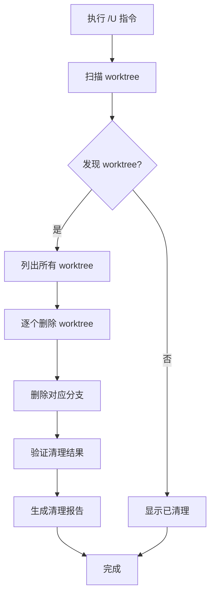

# Trees目录清理指令

## 📋 指令概述

**Trees目录清理指令（/U）**是专门用于清理并行开发工作空间的工具。当完成 `/R` 并行任务并确认最佳方案后,使用此指令可以一键清理所有 worktree、分支和临时文件,同时保留 `trees/` 目录和 `README.md` 文档。

### 核心特性

- **智能清理**: 自动识别并删除所有 worktree
- **分支删除**: 同步删除对应的 Git 分支
- **保留结构**: 保留 trees/ 目录和 README.md
- **安全确认**: 清理前显示将要删除的内容
- **完整报告**: 提供详细的清理结果报告

### 使用场景

典型使用流程:
```
1. 执行 /R 创建并行工作空间
2. 多个 Agent 完成实现
3. 对比选择最佳方案
4. 合并最佳方案到主分支
5. 执行 /U 清理所有 worktree ← 当前指令
```

## 🎯 核心功能

### 1. Worktree 清理

自动删除 `trees/` 目录下的所有 worktree:

```bash
# 扫描所有 worktree
git worktree list

# 逐个删除
git worktree remove --force trees/feature-1
git worktree remove --force trees/feature-2
git worktree remove --force trees/feature-3
```

**特点**:
- 使用 `--force` 强制删除(即使有未提交更改)
- 自动处理所有子目录
- 跳过非 worktree 目录(如 README.md)

### 2. 分支清理

同步删除对应的 Git 分支:

```bash
# 删除 worktree 对应的分支
git branch -D feature-1
git branch -D feature-2
git branch -D feature-3
```

**特点**:
- 使用 `-D` 强制删除(即使未合并)
- 自动提取分支名称
- 跳过主分支和当前分支

### 3. 保留必要文件

清理时保留以下内容:

```
trees/
├── README.md        ← 保留(文档说明)
└── .gitkeep         ← 保留(如果存在)
```

### 4. 清理验证

清理后进行验证:

```bash
# 验证 worktree 已清空
git worktree list
# 应该只显示主工作区

# 验证 trees/ 目录状态
ls -la trees/
# 应该只有 README.md 和可能的 .gitkeep
```

## 🔧 使用方法

### 标准调用

```bash
/U
```

### 执行流程

```yaml
阶段1: 扫描分析
  - 列出所有 worktree
  - 识别对应的分支
  - 统计将要删除的数量

阶段2: 清理 Worktree
  - 逐个删除 worktree
  - 显示删除进度
  - 处理删除错误

阶段3: 清理分支
  - 删除对应的 Git 分支
  - 跳过主分支和当前分支
  - 记录删除结果

阶段4: 验证清理
  - 验证 worktree 已清空
  - 检查 trees/ 目录状态
  - 生成清理报告
```

## 📊 执行示例

### 示例1: 清理2个并行工作空间

```bash
用户执行: /U

[扫描阶段]
🔍 扫描 trees/ 目录...
发现 2 个 worktree:
  - trees/todo-manager-1 (分支: todo-manager-1)
  - trees/todo-manager-2 (分支: todo-manager-2)

[清理阶段]
🗑️  删除 worktree: trees/todo-manager-1
✅ 删除成功

🗑️  删除 worktree: trees/todo-manager-2
✅ 删除成功

🗑️  删除分支: todo-manager-1
✅ 删除成功

🗑️  删除分支: todo-manager-2
✅ 删除成功

[验证阶段]
✅ 所有 worktree 已清理
✅ trees/ 目录已清空
✅ 保留 trees/README.md

[清理报告]
📊 清理统计:
  - 删除 worktree: 2 个
  - 删除分支: 2 个
  - 保留文件: 1 个 (README.md)
  - 执行时间: 1.2 秒

✅ Trees 目录清理完成!
```

### 示例2: 清理空目录

```bash
用户执行: /U

[扫描阶段]
🔍 扫描 trees/ 目录...
ℹ️  未发现任何 worktree

[验证阶段]
✅ trees/ 目录已经是干净的
✅ 保留 trees/README.md

✅ 无需清理!
```

### 示例3: 处理错误情况

```bash
用户执行: /U

[扫描阶段]
🔍 扫描 trees/ 目录...
发现 3 个 worktree

[清理阶段]
🗑️  删除 worktree: trees/feature-1
✅ 删除成功

🗑️  删除 worktree: trees/feature-2
⚠️  删除失败: worktree 正在被使用
💡 建议: 关闭所有打开该目录的终端或编辑器

🗑️  删除 worktree: trees/feature-3
✅ 删除成功

[清理报告]
⚠️  部分清理完成:
  - 成功删除: 2 个
  - 删除失败: 1 个
  - 建议: 手动处理失败项后重新执行 /U
```

## 🔍 实现逻辑

### Python 实现示例

```python
from pathlib import Path
import subprocess
import re

class TreesCleaner:
    """Trees目录清理器"""

    def __init__(self, project_root: Path):
        self.project_root = project_root
        self.trees_dir = project_root / "trees"
        self.stats = {
            'worktrees_removed': 0,
            'branches_removed': 0,
            'errors': []
        }

    def clean(self):
        """执行完整清理流程"""
        print("\n🧹 开始清理 trees/ 目录...\n")

        # 阶段1: 扫描
        worktrees = self._scan_worktrees()
        if not worktrees:
            print("ℹ️  未发现任何 worktree")
            print("✅ trees/ 目录已经是干净的\n")
            return

        print(f"发现 {len(worktrees)} 个 worktree:\n")
        for wt in worktrees:
            print(f"  - {wt['path']} (分支: {wt['branch']})")
        print()

        # 阶段2: 清理 worktree
        print("[清理 Worktree]\n")
        for wt in worktrees:
            self._remove_worktree(wt['path'])

        # 阶段3: 清理分支
        print("\n[清理分支]\n")
        for wt in worktrees:
            if wt['branch']:
                self._remove_branch(wt['branch'])

        # 阶段4: 验证
        print("\n[验证清理]\n")
        self._verify_cleanup()

        # 生成报告
        self._print_report()

    def _scan_worktrees(self):
        """扫描所有 worktree"""
        result = subprocess.run(
            ['git', 'worktree', 'list', '--porcelain'],
            capture_output=True,
            text=True,
            cwd=self.project_root
        )

        worktrees = []
        lines = result.stdout.strip().split('\n')

        current_wt = {}
        for line in lines:
            if line.startswith('worktree '):
                path = line.replace('worktree ', '')
                # 只处理 trees/ 目录下的 worktree
                if 'trees/' in path:
                    current_wt = {'path': path}
            elif line.startswith('branch '):
                branch = line.replace('branch refs/heads/', '')
                if current_wt:
                    current_wt['branch'] = branch
                    worktrees.append(current_wt)
                    current_wt = {}

        return worktrees

    def _remove_worktree(self, path: str):
        """删除单个 worktree"""
        print(f"🗑️  删除 worktree: {path}")

        result = subprocess.run(
            ['git', 'worktree', 'remove', '--force', path],
            capture_output=True,
            text=True,
            cwd=self.project_root
        )

        if result.returncode == 0:
            print("✅ 删除成功\n")
            self.stats['worktrees_removed'] += 1
        else:
            error_msg = result.stderr.strip()
            print(f"⚠️  删除失败: {error_msg}\n")
            self.stats['errors'].append(f"Worktree {path}: {error_msg}")

    def _remove_branch(self, branch: str):
        """删除分支"""
        # 跳过主分支
        if branch in ['main', 'master']:
            print(f"ℹ️  跳过主分支: {branch}\n")
            return

        print(f"🗑️  删除分支: {branch}")

        result = subprocess.run(
            ['git', 'branch', '-D', branch],
            capture_output=True,
            text=True,
            cwd=self.project_root
        )

        if result.returncode == 0:
            print("✅ 删除成功\n")
            self.stats['branches_removed'] += 1
        else:
            error_msg = result.stderr.strip()
            print(f"⚠️  删除失败: {error_msg}\n")
            self.stats['errors'].append(f"Branch {branch}: {error_msg}")

    def _verify_cleanup(self):
        """验证清理结果"""
        # 检查 worktree
        result = subprocess.run(
            ['git', 'worktree', 'list'],
            capture_output=True,
            text=True,
            cwd=self.project_root
        )

        worktree_count = len([
            line for line in result.stdout.split('\n')
            if 'trees/' in line
        ])

        if worktree_count == 0:
            print("✅ 所有 worktree 已清理")
        else:
            print(f"⚠️  仍有 {worktree_count} 个 worktree 未清理")

        # 检查 trees/ 目录
        trees_items = list(self.trees_dir.iterdir())
        kept_items = [
            item.name for item in trees_items
            if item.name in ['README.md', '.gitkeep']
        ]

        if len(trees_items) == len(kept_items):
            print("✅ trees/ 目录已清空")
            print(f"✅ 保留文件: {', '.join(kept_items)}")
        else:
            remaining = [
                item.name for item in trees_items
                if item.name not in kept_items
            ]
            print(f"⚠️  仍有 {len(remaining)} 个项目未清理: {remaining}")

    def _print_report(self):
        """打印清理报告"""
        print("\n" + "="*50)
        print("📊 清理报告")
        print("="*50)
        print(f"删除 worktree: {self.stats['worktrees_removed']} 个")
        print(f"删除分支: {self.stats['branches_removed']} 个")

        if self.stats['errors']:
            print(f"\n⚠️  遇到 {len(self.stats['errors'])} 个错误:")
            for error in self.stats['errors']:
                print(f"  - {error}")
        else:
            print("\n✅ 所有操作成功完成!")

        print("="*50 + "\n")

# 使用示例
if __name__ == "__main__":
    cleaner = TreesCleaner(Path.cwd())
    cleaner.clean()
```

## 📊 执行流程图



## 🎯 成功标准

```yaml
完全成功:
  ✅ 所有 worktree 已删除
  ✅ 所有对应分支已删除
  ✅ trees/ 目录只保留 README.md
  ✅ git worktree list 只显示主工作区
  ✅ 无错误信息

部分成功:
  ⚠️  大部分 worktree 已删除
  ⚠️  部分项目因占用无法删除
  ⚠️  需要手动处理失败项

清理失败:
  ❌ 无法访问 Git 仓库
  ❌ 权限不足
  ❌ trees/ 目录不存在
```

## ⚠️ 注意事项

### 执行前

**重要提醒**:
- ⚠️  **不可逆操作**: 删除后无法恢复
- ⚠️  **确认合并**: 确保已将最佳方案合并到主分支
- ⚠️  **关闭程序**: 关闭所有打开 trees/ 目录的终端和编辑器
- ⚠️  **备份数据**: 如有需要,先备份重要实现

**检查清单**:
```bash
# 1. 确认最佳方案已合并
git log --oneline -5

# 2. 检查当前分支
git branch

# 3. 查看 worktree 列表
git worktree list

# 4. 确认没有程序占用 trees/ 目录
lsof | grep trees/  # macOS/Linux
```

### 执行中

- 🔄 使用 `--force` 强制删除 worktree
- 🔄 使用 `-D` 强制删除分支
- 🔄 自动跳过主分支
- 🔄 保留 README.md 文件

### 执行后

**验证步骤**:
```bash
# 1. 验证 worktree 已清空
git worktree list
# 应该只显示主工作区

# 2. 验证分支已删除
git branch
# 不应该看到并行任务的分支

# 3. 验证目录状态
ls -la trees/
# 应该只有 README.md
```

## 🔗 相关资源

### 相关指令

- `/R` - 并行任务准备与执行(创建 worktree)
- `/Q` - 项目上下文感知
- `/E` - PRP生成与执行

### 工作流集成

```yaml
完整并行开发流程:
  1. /R - 创建并行工作空间
  2. 等待 Agent 完成实现
  3. 对比选择最佳方案
  4. 合并最佳方案到主分支
  5. /U - 清理所有 worktree  ← 当前指令
  6. 继续下一个开发任务
```

### Git Worktree 参考

```bash
# 手动删除 worktree
git worktree remove <path>
git worktree remove --force <path>

# 查看所有 worktree
git worktree list

# 修剪陈旧的 worktree 记录
git worktree prune

# 删除分支
git branch -d <branch>   # 安全删除(已合并)
git branch -D <branch>   # 强制删除(未合并也删)
```

## 🎨 使用场景

### 场景1: 完成并行任务后清理

```bash
# 1. 完成并行开发
/R "new-feature" 3 "..."

# 2. Agent 完成,对比方案
cd trees/new-feature-2
cat RESULTS.md

# 3. 合并最佳方案
git checkout main
git merge new-feature-2

# 4. 清理所有 worktree
/U

# 结果: trees/ 目录清空,只保留 README.md
```

### 场景2: 定期维护清理

```bash
# 定期检查并清理遗留的 worktree
git worktree list

# 发现有旧的 worktree
# 执行清理
/U

# 保持工作区整洁
```

### 场景3: 错误恢复

```bash
# 如果并行任务出错,想要重新开始
/U  # 先清理

# 然后重新创建
/R "feature" 2 "..."
```

## 💡 最佳实践

### 清理时机

**建议清理时机**:
- ✅ 完成并行任务并合并最佳方案后
- ✅ 不再需要对比其他实现方案时
- ✅ 准备开始新的并行任务前
- ✅ 定期维护工作区整洁

**不建议清理时机**:
- ❌ 尚未确定最佳方案
- ❌ 还需要参考其他实现
- ❌ 未合并任何方案到主分支
- ❌ 仍在开发测试阶段

### 清理策略

**保守策略** (推荐):
```bash
1. 完全确认最佳方案
2. 合并到主分支
3. 测试验证无误
4. 执行 /U 清理
```

**激进策略**:
```bash
1. 快速对比方案
2. 选择最佳实现
3. 立即执行 /U
4. 在主分支继续开发
```

## 📝 更新日志

### v4.0.0 (2025-10-20)

**重大更新**:
- 🔄 功能完全重构
- 🎯 从"快照管理"改为"清理工具"
- 🗑️ 专注于 worktree 清理功能
- 📚 保留 trees/ 目录和 README.md
- ✨ 与 /R 命令完美配合

**新增功能**:
- 智能 worktree 扫描
- 自动分支删除
- 清理结果验证
- 详细清理报告

**移除功能**:
- 目录快照生成
- 版本管理功能
- 统计信息更新

---

**配置版本**: v4.0.0
**更新时间**: 2025-10-20
**维护原则**: 安全、高效、自动化
**与 /R 配合**: 完美集成并行开发工作流
