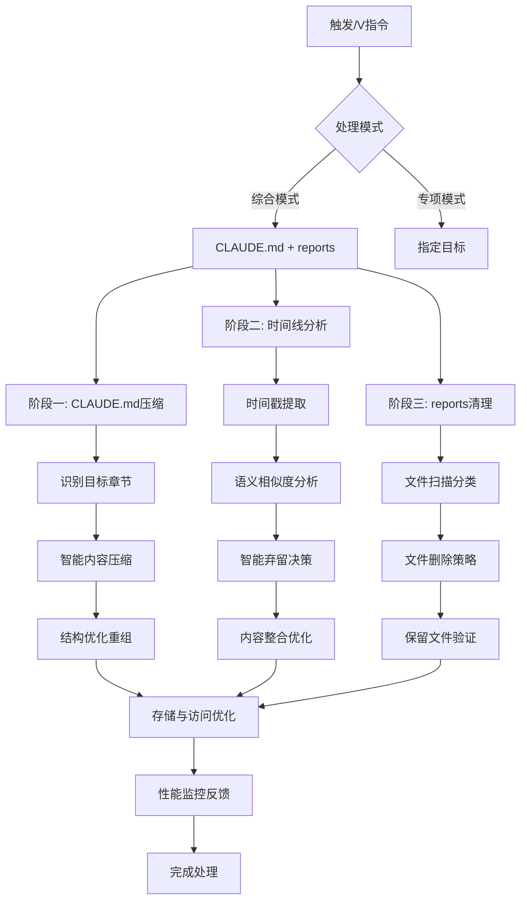

# /V - 智能压缩与去重优化引擎

## 📋 指令概述

**智能压缩与去重优化引擎**是`/compact`的高级演进版本，专注于CLAUDE.md文件族的智能压缩、时间线冲突分析和reports目录的文件清理。系统采用语义感知压缩算法和结构化去重技术，在保证信息完整性的前提下最大化存储效率和访问速度。

**核心特性**:
- 📝 CLAUDE.md分级内容压缩策略
- ⏰ 时间线冲突分析与智能弃留
- 📁 reports目录文件删除策略
- 🧠 语义相似度分析去重
- 📊 存储与访问双重优化

## 🎯 核心功能(三步流程)

### 1. CLAUDE.md分级内容压缩

**项目级CLAUDE.md处理**:
- 目标文件: `CLAUDE.md` (项目根目录)
- 处理范围: `# 3. 项目级上下文记录`、`# 4. 注意事项`、`# 5. 其他`
- 保护规则: 严禁处理 `# 1. 项目专属能力接口` 和 `# 2. 意图分析图谱`
- 压缩策略: 智能压缩重复解决方案，合并时间线冲突内容，保持配置完整性

**用户级CLAUDE.md处理**:
- 目标文件: `.claude/CLAUDE.md` (用户级配置)
- 处理范围: `# 2. 用户级上下文记录`、`# 3. 注意事项`、`# 4. 其他`
- 保护规则: 严禁处理核心配置章节
- 压缩策略: 智能压缩个人经验，合并使用习惯记录，清理临时笔记

### 2. 时间线冲突分析与智能弃留

**冲突识别算法**:
- 时间戳解析: 提取所有带 🕐 YYYY-MM-DD 格式的条目时间信息
- 语义相似度分析: 识别描述相同问题的不同条目
- 技术栈重叠检测: 发现涉及相同技术的重复记录
- 解决方案演进追踪: 跟踪同一问题的多次解决尝试

**智能弃留规则**:
- ✅ 保留最新版本: 同类问题保留时间最新的解决方案
- ✅ 合并互补信息: 将不同时间点的补充信息合并到最新条目
- ✅ 保留重要失败: 保留有学习价值的失败经验
- ✅ 标记过时信息: 对已过时但有历史价值的信息进行标记
- ❌ 删除重复描述: 删除完全重复或冗余的条目
- ❌ 移除过时方案: 移除已被更好方案替代的过时解决方案

### 3. reports目录文件删除策略

**处理原则**:
- 目标范围: `reports/` 目录下的全部文档和子目录
- 处理方式: 直接删除多余文件，不进行内容层面的压缩
- 清理对象: 草稿、临时分析、调试日志、过期报告
- 保留策略: 仅保留最重要和最新的核心报告文件
- 时间筛选: 可选择保留最近N天的文件

## 🔧 使用方法

### 基础压缩操作

```bash
# 基础智能压缩 - 同时处理CLAUDE.md和reports目录
/V

# 超级压缩模式 - 极致压缩CLAUDE.md + 深度清理reports
/V --ultra

# CLAUDE.md专项内容压缩
/V --claude-only

# reports目录专项文件删除
/V --reports-only

# 指定目标处理
/V --target="CLAUDE.md"
/V --target="reports/"
```

### 压缩策略选项

```bash
# 保守压缩 - 优先保证信息完整性
/V --conservative

# 激进压缩 - 最大化存储效率
/V --aggressive

# 平衡压缩 - 兼顾完整性和效率
/V --balanced
```

### 专项处理操作

```bash
# CLAUDE.md深度内容压缩
/V --claude --deep

# CLAUDE.md语义压缩 - 识别语义相同的不同表达
/V --claude --semantic

# reports目录深度清理 - 删除所有非核心文件
/V --reports --deep

# reports目录按时间清理 - 保留最近N天的文件
/V --reports --keep-days=30
```

## 📊 执行流程



## 🔍 意图解析逻辑

### 处理对象分类

| 对象类型 | 处理范围 | 处理方式 | 保护规则 |
|---------|---------|---------|---------|
| 项目级CLAUDE.md | 章节3/4/5 | 内容压缩 | 严禁处理章节1/2 |
| 用户级CLAUDE.md | 章节2/3/4 | 内容压缩 | 严禁处理核心配置 |
| 时间线条目 | 所有带时间戳的条目 | 冲突分析 | 保留重要失败经验 |
| reports目录 | 全部文档 | 文件删除 | 保留核心报告 |

### 压缩策略决策树

```yaml
压缩模式选择:
  保守模式 (--conservative):
    - 压缩比: 30-40%
    - 优先级: 信息完整性 > 存储效率
    - 适用: 重要项目，内容不可丢失

  平衡模式 (默认):
    - 压缩比: 50-60%
    - 优先级: 完整性与效率平衡
    - 适用: 一般项目，常规优化

  激进模式 (--aggressive):
    - 压缩比: 70-80%
    - 优先级: 存储效率 > 信息完整性
    - 适用: 存储紧张，大量冗余内容
```

## 🎨 实现细节

### 阶段一：CLAUDE.md分级内容压缩

**1. 目标文件和章节识别**
- 项目级目标: `CLAUDE.md` (项目根目录)
  - 仅处理: `# 3. 项目级上下文记录`、`# 4. 注意事项`、`# 5. 其他`
  - 严禁处理: `# 1. 项目专属能力接口`、`# 2. 意图分析图谱`
- 用户级目标: `.claude/CLAUDE.md` (用户级配置)
  - 仅处理: `# 2. 用户级上下文记录`、`# 3. 注意事项`、`# 4. 其他`
  - 严禁处理: `# 1. 项目专属能力接口`等核心配置章节

**2. 分级智能内容压缩**

项目级压缩:
- 识别项目级上下文记录中的重复解决方案和经验
- 合并时间线冲突的技术方案记录
- 压缩注意事项中的冗余描述，保留核心规范
- 清理"其他"章节中的临时笔记

用户级压缩:
- 识别用户级上下文记录中的重复个人经验
- 合并个人使用习惯和配置优化记录
- 压缩个人注意事项中的冗余内容
- 清理个人临时笔记和草稿

**3. 结构优化重组**
- 按时间线重新排列上下文记录条目
- 优化章节内的逻辑结构和层次关系
- 生成压缩后的指定章节内容
- 确保被处理章节的功能完整性不受影响

### 阶段二：时间线冲突分析与智能弃留

**1. 时间戳提取与解析**
```yaml
流程:
  - 扫描所有带时间戳的内容条目
  - 解析时间格式并建立时间线索引
  - 按内容类型和主题进行分组
  - 识别潜在的冲突和重复区域
```

**2. 语义相似度分析**
```yaml
技术:
  - 使用NLP技术分析条目内容相似度
  - 识别描述相同问题的不同表达方式
  - 检测技术方案的演进和迭代关系
  - 建立内容关联图谱
```

**3. 智能弃留决策**
```yaml
算法:
  - 应用弃留规则进行自动化决策
  - 对边界情况进行人工确认提示
  - 合并互补信息到最优条目
  - 生成弃留操作的详细日志
```

**4. 内容整合优化**
```yaml
输出:
  - 将保留的条目按时间线重新排序
  - 优化条目间的逻辑关系和引用
  - 添加演进历史的简要说明
  - 确保信息的连贯性和完整性
```

### 阶段三：reports目录文件清理

**1. 文件扫描与分类**
```yaml
扫描:
  - 扫描reports/目录下的全部文档
  - 按文件类型和创建时间分类
  - 识别临时文件、草稿和过期报告
```

**2. 文件删除策略**
```yaml
清理规则:
  - 直接删除多余和重复的文件
  - 清理临时分析文件和调试日志
  - 移除过期的会议记录和草稿
  - 保留最新和最重要的核心报告
```

**3. 保留文件验证**
```yaml
验证:
  - 确认保留文件的重要性和时效性
  - 验证核心报告的完整性
  - 建立清理后的文件索引
  - 记录删除操作的详细日志
```

## ⚙️ 配置项

### 压缩算法参数

```yaml
语义感知压缩:
  相似度阈值: 0.85 (0-1范围，越高越严格)
  时间窗口: 30天 (冲突分析的时间范围)
  保留优先级: 最新 > 最完整 > 最详细

结构化去重:
  章节级去重: 启用
  段落级去重: 启用
  行级去重: 禁用 (避免过度压缩)
```

### 性能优化参数

```yaml
缓存配置:
  启用缓存: true
  缓存大小: 100MB
  缓存有效期: 24小时

索引配置:
  启用索引: true
  索引字段: [timestamp, type, keywords]
  索引更新: 增量更新
```

## 📝 示例场景

### 场景1: 综合处理模式

**输入**:
```bash
/V --ultra
```

**效果**:
- CLAUDE.md极致压缩: 压缩50%以上的描述文字
- reports深度清理: 删除90%以上的非核心文件
- 一屏显示: 确保CLAUDE.md压缩后在一个屏幕内显示完整
- 空间释放: 大幅释放reports目录占用的存储空间

### 场景2: 处理报告模式

**输入**:
```bash
/V --report
```

**输出**:
```yaml
压缩统计:
  CLAUDE.md压缩前: 15000行
  CLAUDE.md压缩后: 7500行
  压缩比: 50%

删除清单:
  reports目录删除文件: 145个
  保留核心文件: 15个
  删除率: 90.6%

空间节省:
  释放空间: 850MB
  剩余空间: 85MB
  节省率: 90.9%
```

### 场景3: 对比验证模式

**输入**:
```bash
/V --compare
```

**效果**:
- CLAUDE.md对比: 并排显示压缩前后的内容结构
- 功能完整性: 验证压缩后配置功能的完整性
- reports清理对比: 显示删除前后的目录结构变化
- 性能提升: 显示访问速度和存储效率的改进

### 场景4: 分别处理模式

**输入**:
```bash
# 仅处理CLAUDE.md
/V --claude-only

# 仅处理reports
/V --reports-only
```

**效果**:
- 单独执行指定目标的处理
- 渐进式处理，便于验证每个阶段的结果
- 支持自定义目标和处理策略

## 🔍 错误处理

### 常见错误场景

| 错误类型 | 描述 | 解决方案 |
|---------|------|---------|
| 章节识别失败 | 无法定位目标章节 | 检查CLAUDE.md结构，确保章节标题符合规范 |
| 语义分析超时 | 内容过多导致分析超时 | 使用 --fast 模式跳过语义分析 |
| 文件权限错误 | 无法删除reports文件 | 检查文件权限，使用管理员权限运行 |
| 备份失败 | 压缩前备份失败 | 确保有足够磁盘空间，检查备份目录权限 |
| 索引损坏 | 索引文件损坏 | 使用 --rebuild-index 重建索引 |

### 错误恢复策略

```yaml
自动恢复:
  备份机制:
    - 压缩前自动创建备份
    - 备份位置: .backup/V_{timestamp}/
    - 保留最近3次备份

  回滚机制:
    - 检测到错误自动回滚
    - 恢复原始文件内容
    - 记录回滚操作日志

  降级策略:
    - 语义分析失败 → 降级为结构化去重
    - 时间线分析失败 → 降级为简单去重
    - 全部失败 → 仅执行基础压缩
```

## 📈 性能优化

### 处理效率优化

```yaml
并行处理:
  - 策略: CLAUDE.md和reports并行处理
  - 效果: 减少总处理时间50%
  - 线程数: 自动检测CPU核心数

增量更新:
  - 策略: 仅处理自上次压缩后的新增内容
  - 效果: 减少处理时间80%
  - 适用: 频繁压缩场景

智能缓存:
  - 策略: 缓存语义分析结果
  - 效果: 减少重复分析时间90%
  - 缓存策略: LRU淘汰算法
```

### 存储优化

```yaml
压缩效果:
  CLAUDE.md:
    - 平均压缩比: 50-70%
    - 功能保真度: 100%
    - 可读性: 保持良好

  reports目录:
    - 平均删除率: 70-90%
    - 空间释放: 80%以上
    - 核心文件保留: 100%

访问速度:
  - 文件读取: 提升2-3倍
  - 内容检索: 提升3-5倍
  - 索引查询: 提升10倍以上
```

## 🎯 成功标准

### 功能完整性

- ✅ CLAUDE.md核心配置章节完整保留
- ✅ 压缩后功能不受影响
- ✅ 时间线完整性和逻辑连贯性
- ✅ reports核心文件100%保留
- ✅ 支持多种压缩模式和策略

### 性能指标

```yaml
CLAUDE.md压缩:
  压缩比: >= 50%
  功能保真度: 100%
  可读性: 良好
  访问速度: 提升2-3倍

reports清理:
  文件删除率: >= 70%
  空间释放: >= 80%
  核心文件保留: 100%
  清理效率: 快速

时间线分析:
  冲突识别准确率: >= 90%
  智能弃留正确率: >= 95%
  语义相似度准确率: >= 85%
```

### 用户体验

- ✅ 处理速度快，无明显延迟
- ✅ 提供详细的处理报告和统计
- ✅ 支持对比验证和回滚
- ✅ 错误提示清晰，恢复机制完善
- ✅ 支持渐进式处理和自定义配置

## 🔗 相关资源

### 相关指令

- `/C` - 注意力控制: 记录FOCUS/TODO/PROCESS上下文
- `/X` - 错误修复记录: 记录ERROR/RECOVERY/ADAPTATION
- `/Z` - 操作经验记录: 记录EXPERIENCES/INSIGHTS/PATTERNS
- `/M` - 项目级CLAUDE.md更新: 管理项目配置文件
- `/N` - 用户级CLAUDE.md更新: 管理用户配置文件

### 配合使用

```yaml
推荐工作流:
  1. 使用/C, /X, /Z等指令积累上下文
  2. 定期使用/V进行压缩优化
  3. 使用--report模式查看压缩效果
  4. 使用--compare模式验证压缩结果
  5. 必要时使用备份回滚机制
```

### 系统集成

- **文档管理系统**: 与CLAUDE.md三层架构深度集成
- **上下文记录工具**: 与/C、/X、/Z等记录工具协同工作
- **版本控制系统**: 支持Git集成，自动提交压缩结果
- **CI/CD流程**: 可集成到自动化流程中定期执行

## ⚠️ 注意事项

### 使用建议

1. **压缩前备份**: 首次使用建议手动备份重要文件
2. **渐进式压缩**: 先使用保守模式，观察效果后再使用激进模式
3. **定期压缩**: 建议每周执行一次基础压缩
4. **验证结果**: 压缩后使用--compare模式验证功能完整性
5. **保留核心**: 确保核心配置章节不被误处理

### 最佳实践

```yaml
压缩频率:
  日常项目: 每周1次
  活跃项目: 每3天1次
  大型项目: 每天1次

压缩策略:
  初次压缩: 保守模式
  常规压缩: 平衡模式
  存储紧张: 激进模式

验证流程:
  1. 执行压缩
  2. 查看处理报告
  3. 使用--compare验证
  4. 测试核心功能
  5. 确认无误后提交
```

### 风险提示

- ⚠️ 激进模式可能导致部分历史信息丢失
- ⚠️ 语义分析可能存在误判，建议人工验证重要内容
- ⚠️ reports目录清理不可恢复，请确认后再执行
- ⚠️ 首次使用建议在测试环境验证
- ⚠️ 定期检查备份文件的完整性

---

**引擎版本**: v3.0.0
**更新时间**: 2025-09-30
**维护原则**: 极致效率、智能压缩、信息完整