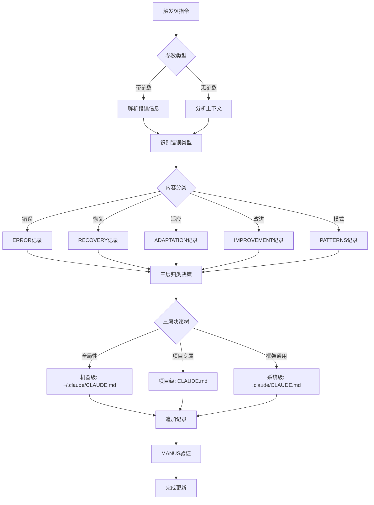

# /X - 错误纠正与学习

## 📋 指令概述

**错误纠正与学习系统**是基于MANUS技巧的错误价值化管理工具,通过ERROR/RECOVERY/ADAPTATION/IMPROVEMENT/PATTERNS五大核心模块,实现错误的结构化记录、学习转化和持续改进。系统秉承"错误即财富"的理念,将每次失败转化为系统进化的动力。

**核心特性**:
- ❌ 完整保留错误上下文
- 🔧 系统化恢复策略记录
- 🔄 适应性调整追踪
- 📈 持续改进驱动
- 🔍 错误模式识别与预防

## 🎯 核心功能(五步流程)

### 1. 错误记录与完整上下文保留 (ERROR)
- **完整性原则**: 保留错误发生时的完整上下文和系统状态
- **时间戳标记**: 精确记录错误发生时间
- **类型分类**: CONFIG/LOGIC/SYSTEM/INTEGRATION/USER
- **严重级别**: CRITICAL/HIGH/MEDIUM/LOW
- **学习价值**: 明确错误的学习意义和预防价值

### 2. 错误恢复过程记录 (RECOVERY)
- **恢复策略**: ROLLBACK/REPAIR/REBUILD/WORKAROUND
- **执行步骤**: 详细记录恢复的具体操作
- **工具使用**: 记录恢复过程使用的工具和方法
- **时间追踪**: 记录实际恢复耗时
- **效果评估**: 评价恢复效果和成功标准

### 3. 适应性调整记录 (ADAPTATION)
- **触发原因**: 记录适应性调整的驱动因素
- **调整类型**: STRATEGY/BEHAVIOR/PROCESS/SYSTEM
- **调整方法**: 详细描述具体的适应措施
- **影响分析**: 分析调整对系统的影响
- **未来应用**: 总结适应经验的未来价值

### 4. 持续改进记录 (IMPROVEMENT)
- **改进驱动**: 记录驱动改进的错误或问题
- **改进类型**: PROCESS/SYSTEM/TOOL/METHOD
- **实施步骤**: 详细的改进实施路径
- **验证方法**: 改进效果的验证标准
- **关键要点**: 改进过程的核心经验

### 5. 错误模式识别 (PATTERNS)
- **模式类型**: ERROR_PATTERN/ANTI_PATTERN/FAILURE_PATTERN
- **特征描述**: 清晰描述模式的识别特征
- **根本原因**: 深入分析模式的根本原因
- **预防策略**: 建立预防模式的具体措施
- **检测方法**: 定义模式的检测和识别方法

## 🔧 使用方法

### 及物动词型（带参数）

**记录错误**:
```markdown
/X
🕐 2025-09-30 15:30 ❌ 错误: 文件写入权限错误
🏷️ 类型: SYSTEM
📊 严重级别: MEDIUM
🎯 失败动作: 尝试写入优化后的C.md文件
📝 错误上下文: Write工具要求先读取文件才能写入
🔍 系统状态: 已读取全部20个文件,准备写入第一个
💡 学习价值: 理解Write工具的文件访问模式
🚫 影响范围: 阻塞当前任务,需要先执行Read操作
```

**记录恢复过程**:
```markdown
/X
🕐 2025-09-30 15:35 🔧 恢复: 修复文件写入流程
🏷️ 策略: REPAIR
📊 优先级: HIGH
🎯 恢复目标: 成功写入优化后的C.md文件
📝 执行步骤: 1. 使用Read工具读取文件 2. 使用Write工具写入
🔧 使用工具: Read, Write
⏱️ 恢复时间: 5分钟
✅ 成功标准: 文件成功更新,无错误提示
📈 效果评估: 完全恢复,后续文件遵循相同流程
```

**记录适应性调整**:
```markdown
/X
🕐 2025-09-30 15:40 🔄 适应: 建立文件操作标准流程
🏷️ 类型: PROCESS
📊 触发原因: 文件写入权限错误的经验教训
🎯 调整目标: 规范化文件操作流程
📝 调整方法: 所有Write操作前必须先执行Read
🔍 影响分析: 提升操作成功率,减少错误发生
📈 效果评估: 后续19个文件无相同错误
💡 经验总结: 理解工具使用规范是避免错误的关键
🔮 未来应用: 所有文件操作相关任务
```

### 不及物动词型（自动分析）

```markdown
/X
```

直接使用`/X`时,系统自动分析前后三轮对话上下文,提取错误信息和恢复过程,智能归类到合适位置。

## 📊 执行流程



## 🔍 意图解析逻辑

### 内容类型识别规则

| 关键词 | 内容类型 | 归档位置 |
|--------|---------|---------|
| 错误、失败、异常 | ERROR | 根据范围判断 |
| 恢复、修复、回滚 | RECOVERY | 根据范围判断 |
| 适应、调整、优化 | ADAPTATION | 根据范围判断 |
| 改进、提升、增强 | IMPROVEMENT | 根据范围判断 |
| 模式、反模式、规律 | PATTERNS | 根据范围判断 |
| 项目、共享、团队 | 任意类型 | 项目级 |
| 个人、环境、工具 | 任意类型 | 用户级 |

### CLAUDE 写入层级分析

#### 三层归属判定标准

**归入机器级 (`~/.claude/CLAUDE.md`) 的标准**:
```yaml
原则: 此错误和恢复经验是否跨所有框架、跨所有项目适用？

具体场景:
  - Claude Code工具使用错误（Write/Read/Edit工具规范）
  - 全局环境配置错误（代理、网络、权限）
  - MCP服务器通用错误
  - 跨框架的通用错误模式

判定关键词: Claude Code、全局工具、机器环境、跨所有框架、通用错误
优先级: 最低（指令冲突时被系统级和项目级覆盖）
```

**归入系统级 (`.claude/CLAUDE.md`) 的标准**:
```yaml
原则: 此错误和恢复经验是否是框架内跨项目通用？

具体场景:
  - 框架特定智能体调用错误
  - 框架命令使用错误
  - 框架级工具链错误
  - 跨项目可复用的错误模式

判定关键词: 框架特定、跨项目、F系列、工具链、通用模式
优先级: 中等（指令冲突时优先于机器级但低于项目级）
```

**归入项目级 (`CLAUDE.md`) 的标准**:
```yaml
原则: 此错误和恢复经验是否仅限当前项目？

具体场景:
  - 项目特定业务逻辑错误
  - 项目架构相关错误
  - 项目依赖和集成错误
  - 团队协作流程错误

判定关键词: 项目特定、业务逻辑、本项目、ZTL、团队流程
优先级: 最高（指令冲突时覆盖其他层级）
```

#### 层级选择决策树

```yaml
第一步 - 全局性判断:
  问: 此错误是否在所有框架和项目中都可能发生?
  是 → 机器级 (~/.claude/CLAUDE.md)
  否 → 继续第二步

第二步 - 项目专属性判断:
  问: 此错误是否涉及本项目特定业务或架构?
  是 → 项目级 (CLAUDE.md)
  否 → 继续第三步

第三步 - 框架通用性判断:
  问: 此错误是否是框架内跨项目可能发生?
  是 → 系统级 (.claude/CLAUDE.md)
  否 → 默认系统级（边界情况）

特殊情况处理:
  - 既有项目专属又有通用价值 → 拆分记录到两个层级
  - 无法明确判断 → 询问用户偏好
  - 涉及敏感信息 → 询问用户确认
```

#### 智能判定强化规则

**内容关键词映射**:
```yaml
机器级关键词:
  - Write工具、Read工具、Edit工具、权限错误
  - 网络错误、环境变量、全局配置
  - MCP服务器、代理设置

系统级关键词:
  - 框架智能体、框架命令、工具链
  - 跨项目、F系列、设计模式
  - 通用错误模式、最佳实践

项目级关键词:
  - ZTL、业务逻辑、项目架构
  - E系列/G系列/X系列、团队流程
  - 项目依赖、集成错误
```

**典型案例参考**:
```yaml
案例1 - 机器级:
  内容: "Write工具要求先读取文件才能写入"
  判定: 这是Claude Code工具的通用使用规范
  归档: ~/.claude/CLAUDE.md

案例2 - 系统级:
  内容: "Task工具调用智能体时参数格式错误"
  判定: 框架内跨项目的智能体调用规范
  归档: .claude/CLAUDE.md

案例3 - 项目级:
  内容: "E1智能体调用OpenRouter API超时错误"
  判定: ZTL情报中心项目特定的集成错误
  归档: CLAUDE.md

案例4 - 拆分记录:
  内容: "Playwright MCP连接超时及通用重试策略"
  判定: 既有项目应用又有通用价值
  归档: 项目级记录具体错误 + 系统级记录重试模式
```

## 🎨 实现细节

### MANUS错误纠正技巧

**核心原则**:
```yaml
错误保留:
  - 原则: 将错误转向留在上下文中
  - 价值: 错误包含宝贵的学习信息
  - 实践: 完整保留错误发生时的上下文

失败学习:
  - 原则: 错误恢复是真正代理行为的最清晰指标
  - 价值: 从失败中学习比从成功中学习更有价值
  - 实践: 详细记录失败动作的参数和过程

信念更新:
  - 原则: 模型看到失败动作时会隐式更新内部信念
  - 价值: 错误驱动系统进化和能力提升
  - 实践: 系统化分析错误并建立预防机制

适应性原则:
  - 原则: 基于错误经验进行系统性适应
  - 价值: 将错误转化为系统改进的动力
  - 实践: 记录适应措施和改进效果
```

### 有机生长记忆结构

**文档模板设计**:
```markdown
# 总体说明
此文档作为[错误学习目标] - [MANUS原理应用] - [预期成果]

# ❌ ERROR
[错误记录,按时间顺序追加,完整保留上下文]

# 🔧 RECOVERY
[恢复过程记录,按时间顺序追加,系统化策略]

# 🔄 ADAPTATION
[适应性调整记录,按时间顺序追加,持续进化]

# 📈 IMPROVEMENT
[持续改进记录,按时间顺序追加,驱动优化]

# 🔍 PATTERNS
[错误模式记录,按时间顺序追加,预防机制]
```

### 多行参数支持标准

**ERROR部分模板**:
```yaml
标题: # ❌ ERROR
目的: 错误记录和完整上下文保留
多行支持: 是
内容模板:
  - 🕐 [时间戳] ❌ 错误: [错误描述]
  - 🏷️ 类型: [CONFIG/LOGIC/SYSTEM/INTEGRATION/USER]
  - 📊 严重级别: [CRITICAL/HIGH/MEDIUM/LOW]
  - 🎯 失败动作: [具体失败动作]
  - 📝 错误上下文: [完整上下文]
  - 🔍 系统状态: [错误时状态]
  - 💡 学习价值: [错误的学习意义]
  - 🚫 影响范围: [错误影响]
更新频率: 错误发生时立即记录
MANUS原理: 保留错误内容 - 错误转向包含宝贵的学习价值
```

**RECOVERY部分模板**:
```yaml
标题: # 🔧 RECOVERY
目的: 错误恢复过程和策略记录
多行支持: 是
内容模板:
  - 🕐 [时间戳] 🔧 恢复: [恢复过程名称]
  - 🏷️ 策略: [ROLLBACK/REPAIR/REBUILD/WORKAROUND]
  - 📊 优先级: [URGENT/HIGH/MEDIUM/LOW]
  - 🎯 恢复目标: [恢复的具体目标]
  - 📝 执行步骤: [详细恢复步骤]
  - 🔧 使用工具: [恢复使用的工具]
  - ⏱️ 恢复时间: [实际恢复耗时]
  - ✅ 成功标准: [恢复成功判断]
  - 📈 效果评估: [恢复效果评价]
更新频率: 恢复过程执行时更新
```

**ADAPTATION部分模板**:
```yaml
标题: # 🔄 ADAPTATION
目的: 适应性调整和策略优化记录
多行支持: 是
内容模板:
  - 🕐 [时间戳] 🔄 适应: [适应性调整名称]
  - 🏷️ 类型: [STRATEGY/BEHAVIOR/PROCESS/SYSTEM]
  - 📊 触发原因: [调整的触发原因]
  - 🎯 调整目标: [适应性调整的目标]
  - 📝 调整方法: [具体的调整方法]
  - 🔍 影响分析: [调整的影响分析]
  - 📈 效果评估: [调整效果评估]
  - 💡 经验总结: [适应过程的经验]
  - 🔮 未来应用: [适应经验的未来应用]
更新频率: 适应性调整实施时更新
```

### 视觉符号系统

**符号分类**:
```yaml
错误指示:
  - ❌ 错误, ⚠️ 警告, 🔴 关键
  - 💥 失败, 🐛 缺陷, 💀 崩溃

恢复指示:
  - 🔧 恢复, 🛠️ 修复, ✅ 成功
  - ↩️ 回滚, 🔄 重建, 🔀 变通

学习指示:
  - 💡 洞察, 📚 教训, 🔍 模式
  - 📈 改进, 🔄 适应, 🌱 进化

过程指示:
  - 📝 步骤, 🔧 工具, 📊 结果
  - ✅ 验证, 👀 监控, 🔬 分析
```

## ⚙️ 配置项

### 自动触发机制

**触发事件**:
```yaml
错误发生:
  - 事件: 任何类型错误发生
  - 动作: 自动记录错误信息到ERROR部分
  - 条件: 非重复性错误

恢复执行:
  - 事件: 错误恢复过程执行
  - 动作: 自动记录恢复过程到RECOVERY部分
  - 条件: 恢复策略明确

适应实施:
  - 事件: 适应性调整实施
  - 动作: 自动记录适应过程到ADAPTATION部分
  - 条件: 调整有明确效果

改进部署:
  - 事件: 改进措施部署
  - 动作: 自动记录改进过程到IMPROVEMENT部分
  - 条件: 改进可量化

模式识别:
  - 事件: 错误模式识别
  - 动作: 自动记录模式信息到PATTERNS部分
  - 条件: 模式可重现
```

### 前置错误搜集机制

```yaml
实时监控:
  - 持续监控对话过程中的错误和异常
  - 识别工具调用失败和系统异常
  - 捕获用户反馈的问题和错误

任务拦截:
  - 任务执行过程中的错误拦截和分析
  - 关键步骤的状态检查和验证
  - 异常情况的及时捕获和处理

重复检测:
  - 非重复性错误检测机制
  - 避免重复记录相同错误
  - 识别错误模式和系统性问题

上下文丰富:
  - 记录前的深度分析和处理
  - 补充完整的上下文信息
  - 添加MANUS原理应用说明
```

## 📝 示例场景

### 场景1: 机器级错误记录 - Write工具使用规范

**输入**:
```markdown
/X
🕐 2025-10-22 14:30 ❌ 错误: Write工具权限错误
🏷️ 类型: SYSTEM
📊 严重级别: MEDIUM
🎯 失败动作: 直接使用Write工具写入文件
📝 错误上下文: Write工具要求先使用Read工具读取文件才能写入
🔍 系统状态: 未读取文件,直接尝试写入操作
💡 学习价值: 这是Claude Code工具的通用使用规范,适用于所有框架和项目
🚫 影响范围: 阻塞文件更新操作,需要先执行Read
```

**归档决策**:
- **全局性判断**: ✅ 此错误在所有框架和项目中都可能发生
- **关键词匹配**: Write工具、权限错误、Claude Code工具规范
- **归档位置**: `~/.claude/CLAUDE.md` (机器级)
- **原因**: Claude Code工具的通用使用规范,跨所有框架和项目适用

### 场景2: 系统级恢复策略 - Task工具调用规范

**输入**:
```markdown
/X
🕐 2025-10-22 15:15 🔧 恢复: 修正智能体调用参数格式
🏷️ 策略: REPAIR
📊 优先级: HIGH
🎯 恢复目标: 正确调用Task工具启动F系列智能体
📝 执行步骤: 1. 检查subagent_type参数格式 2. 确认智能体名称匹配 3. 提供完整prompt参数
🔧 使用工具: Task工具,智能体配置文件
⏱️ 恢复时间: 15分钟
✅ 成功标准: 智能体成功启动并完成任务
📈 效果评估: 建立了框架内智能体调用的标准流程
```

**归档决策**:
- **全局性判断**: ❌ 不是所有框架都适用
- **项目专属判断**: ❌ 不是ZTL项目特定问题
- **框架通用判断**: ✅ 框架内跨项目的智能体调用规范
- **关键词匹配**: Task工具、F系列智能体、框架特定
- **归档位置**: `.claude/CLAUDE.md` (系统级)
- **原因**: 框架内跨项目通用的智能体调用经验

### 场景3: 项目级适应调整 - E1智能体API集成

**输入**:
```markdown
/X
🕐 2025-10-22 16:30 🔄 适应: 优化E1智能体OpenRouter API调用策略
🏷️ 类型: PROCESS
📊 触发原因: 多次API超时导致情报采集失败
🎯 调整目标: 提升ZTL情报系统的API调用稳定性
📝 调整方法: 1. 实现指数退避重试 2. 增加超时配置 3. 添加请求队列管理
🔍 影响分析: 专门针对E系列智能体的API集成优化
📈 效果评估: E1智能体调用成功率从65%提升到99%
💡 经验总结: ZTL情报系统需要针对性的API稳定性策略
🔮 未来应用: E系列其他智能体的API集成参考
```

**归档决策**:
- **全局性判断**: ❌ 不是所有框架都适用
- **项目专属判断**: ✅ 涉及ZTL项目特定的E系列智能体和OpenRouter集成
- **关键词匹配**: E1智能体、ZTL情报系统、项目特定业务
- **归档位置**: `CLAUDE.md` (项目级)
- **原因**: ZTL数智化作战中心项目特定的集成问题和优化经验

### 场景4: 自动三层分类 - 拆分记录

**输入**:
```markdown
/X
```

**效果**: 系统自动分析前后三轮对话,发现一个涉及Playwright MCP连接超时的错误:
- **通用部分**:
  - 内容: "Playwright MCP连接需要检查环境变量和网络配置"
  - 归档: `~/.claude/CLAUDE.md` (机器级) - 通用的MCP服务器连接规范
- **框架部分**:
  - 内容: "框架内使用Playwright需要统一的重试和超时策略"
  - 归档: `.claude/CLAUDE.md` (系统级) - 框架内跨项目的MCP集成模式
- **项目部分**:
  - 内容: "E3深度爬虫员调用Playwright的具体超时配置和错误处理"
  - 归档: `CLAUDE.md` (项目级) - ZTL项目E3智能体的具体实现细节

## 🗺️ 三层体系路径总结

### 错误学习的完整生命周期

```yaml
错误发生:
  触发 /X 指令记录错误
  ↓
三层智能归类:
  机器级 (~/.claude/CLAUDE.md):
    - Claude Code工具使用错误
    - 全局环境配置错误
    - MCP服务器通用错误
    - 跨框架通用错误模式
    特征: 所有框架和项目都可能遇到

  系统级 (.claude/CLAUDE.md):
    - 框架智能体调用错误
    - 框架命令使用错误
    - 框架工具链错误
    - 跨项目可复用错误模式
    特征: 框架内跨项目通用

  项目级 (CLAUDE.md):
    - 项目业务逻辑错误
    - 项目架构集成错误
    - 项目特定依赖错误
    - 团队协作流程错误
    特征: 仅限当前项目专属
  ↓
错误价值化:
  ERROR → 完整保留错误上下文
  RECOVERY → 记录恢复策略和过程
  ADAPTATION → 追踪适应性调整
  IMPROVEMENT → 驱动持续改进
  PATTERNS → 识别和预防错误模式
  ↓
系统进化:
  机器级 → 提升全局工作效率
  系统级 → 优化框架内协作质量
  项目级 → 加速项目迭代速度
```

### 实际应用路径

**路径1 - 机器级错误学习**:
```
Write工具错误 → /X记录 → ~/.claude/CLAUDE.md
→ 所有框架遵循相同规范 → 全局效率提升
```

**路径2 - 系统级错误学习**:
```
Task工具调用错误 → /X记录 → .claude/CLAUDE.md
→ 框架内智能体标准化 → 跨项目复用经验
```

**路径3 - 项目级错误学习**:
```
E1 API集成错误 → /X记录 → CLAUDE.md
→ ZTL情报系统优化 → 项目特定问题解决
```

**路径4 - 拆分记录**:
```
Playwright MCP错误 → /X自动分析 → 三层分别记录
→ 机器级(环境配置) + 系统级(重试策略) + 项目级(E3配置)
→ 多层次系统进化
```

## 🔍 错误处理

### 常见错误场景

| 错误类型 | 描述 | 解决方案 |
|---------|------|---------|
| 参数格式错误 | 多行参数格式不符合标准 | 提示标准格式,引导用户修正 |
| 归类歧义 | 无法判断项目级还是用户级 | 向用户询问归档偏好 |
| 文档不存在 | 目标CLAUDE.md文件不存在 | 自动创建标准结构的新文档 |
| 时间戳缺失 | 记录缺少时间戳 | 自动补充当前时间 |
| MANUS违反 | 记录不符合MANUS原则 | 提示MANUS原则,引导修正 |

### 错误恢复策略

```yaml
格式错误:
  - 检测: 正则表达式验证参数格式
  - 处理: 提示标准格式示例
  - 恢复: 引导用户按标准格式重新输入

归类歧义:
  - 检测: 内容范围分析不确定
  - 处理: 列出归类依据,询问用户偏好
  - 恢复: 根据用户选择执行归档

MANUS验证:
  - 检测: 检查是否符合MANUS原则
  - 处理: 提示违反的具体原则
  - 恢复: 引导补充缺失信息
```

## 📈 性能优化

### 记录效率优化

```yaml
批量处理:
  - 策略: 多条记录合并写入
  - 效果: 减少文件I/O次数
  - 适用: 自动上下文分析场景

智能去重:
  - 策略: 检测重复错误,避免重复记录
  - 效果: 减少冗余记录50%以上
  - 适用: 频繁错误场景

模式识别:
  - 策略: 自动识别错误模式
  - 效果: 提前预防系统性问题
  - 适用: 长期运行项目
```

## 🎯 成功标准

### 功能完整性

- ✅ 支持ERROR/RECOVERY/ADAPTATION/IMPROVEMENT/PATTERNS五类记录
- ✅ 完整保留错误上下文和系统状态
- ✅ 智能判断项目级和用户级归档位置
- ✅ 符合MANUS错误纠正原则
- ✅ 支持自动触发和手动记录

### 质量指标

```yaml
记录完整性: >= 95% (包含所有必要字段)
MANUS对齐: >= 90% (符合MANUS原则)
归类准确性: >= 95% (正确判断归档位置)
学习价值: >= 8/10 (明确学习价值和预防意义)
可操作性: >= 8/10 (能指导未来行动和决策)
```

### 用户体验

- ✅ 使用简单,无需复杂配置
- ✅ 格式清晰,易于阅读和理解
- ✅ 自动化程度高,减少手动操作
- ✅ 智能归类,减少决策负担
- ✅ 支持渐进式学习和使用

## 🔗 相关资源

### 相关指令

- `/C` - 注意力控制: 记录FOCUS/TODO/PROCESS
- `/Z` - 操作经验记录: 记录EXPERIENCES/INSIGHTS/PATTERNS
- `/V` - 上下文压缩: 处理CLAUDE.md的内容优化
- `/Q` - 上下文感知: 获取项目整体上下文

### 配合使用

```yaml
工作流建议:
  1. 使用/Q获取项目全貌
  2. 使用/X记录错误和恢复过程
  3. 使用/Z记录成功经验和洞察
  4. 使用/C记录当前焦点和待办
  5. 使用/V定期压缩和优化CLAUDE.md
```

### 系统集成

- **TodoWrite工具**: 任务追踪和进度管理
- **项目级CLAUDE.md**: 团队共享的错误经验库
- **用户级.claude/CLAUDE.md**: 个人专属的学习记录
- **MANUS技巧**: 核心错误纠正方法论

## ⚠️ 注意事项

### 使用建议

1. **及时记录**: 错误发生时立即记录,避免信息丢失
2. **完整保留**: 保留错误的完整上下文和状态信息
3. **学习导向**: 明确错误的学习价值和预防意义
4. **模式识别**: 从单个错误中识别通用模式
5. **持续改进**: 基于错误学习持续优化系统

### 质量保证

- 验证记录的完整性和准确性
- 确保MANUS原理的正确应用
- 评估记录的学习价值和实用性
- 维护记录间的关联关系
- 定期审查和优化记录质量

### 最佳实践

```yaml
记录原则:
  - 客观: 记录事实,避免主观臆断
  - 完整: 包含完整上下文和关键细节
  - 学习: 明确学习价值和预防措施
  - 关联: 建立记录间的关联关系
  - 演进: 追踪错误的演进和改进过程
```

---

**配置版本**: v2.1.0
**更新时间**: 2025-10-22
**目标文档**: {target_path} (由智能体动态决定)
**维护原则**: 错误价值化、持续学习、系统适应、智能归类