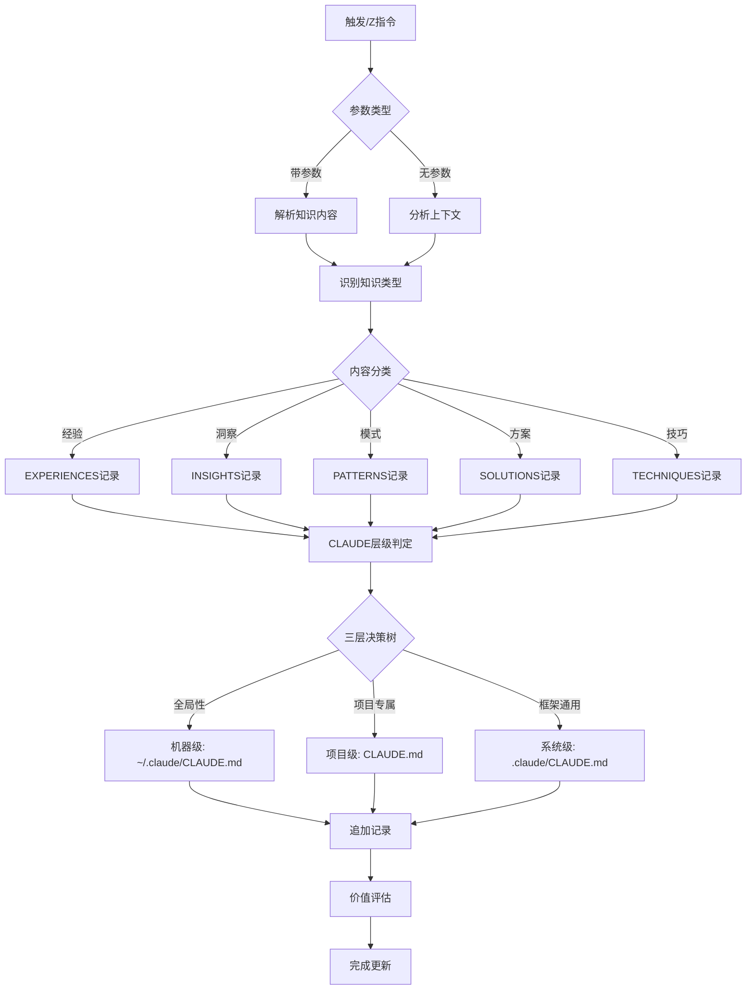

# /Z - 知识积累与技术洞察

## 📋 指令概述

**知识积累与技术洞察系统**是基于主动学习理念的知识资本化管理工具,通过EXPERIENCES/INSIGHTS/PATTERNS/SOLUTIONS/TECHNIQUES五大核心模块,实现技术经验的结构化积累、深度洞察的系统化沉淀和创新方案的资产化管理。系统秉承"知识即资本"的理念,将每次实践转化为可复用的智慧资产。

**核心特性**:
- 💡 技术经验系统化积累
- 🧠 深度洞察结构化沉淀
- 🔍 技术模式标准化提炼
- 🚀 创新方案资产化管理
- 🛠️ 实用技巧库建设

## 🎯 核心功能(五步流程)

### 1. 技术经验积累 (EXPERIENCES)
- **价值等级**: HIGH/MEDIUM/LOW
- **应用场景**: 明确经验的具体适用场景
- **实践过程**: 详细记录实践的具体过程
- **关键洞察**: 从经验中提炼的核心洞察
- **可复用性**: 评估经验的跨场景复用能力

### 2. 技术洞察沉淀 (INSIGHTS)
- **深度等级**: SURFACE/MODERATE/DEEP/BREAKTHROUGH
- **洞察领域**: 明确洞察涉及的技术领域
- **产生背景**: 记录洞察产生的具体背景
- **理论基础**: 阐述洞察的理论支撑
- **创新程度**: 评估洞察的创新性和独特性

### 3. 技术模式提炼 (PATTERNS)
- **模式类型**: DESIGN_PATTERN/ARCHITECTURAL_PATTERN/BEST_PRACTICE
- **复杂度**: SIMPLE/MODERATE/COMPLEX/ADVANCED
- **问题场景**: 清晰描述模式解决的问题
- **解决方案**: 详细说明模式提供的解决方案
- **可扩展性**: 评估模式的扩展和演进能力

### 4. 创新方案管理 (SOLUTIONS)
- **创新程度**: INCREMENTAL/SIGNIFICANT/BREAKTHROUGH
- **解决问题**: 明确方案解决的具体问题
- **实施方法**: 详细描述具体的实施步骤
- **核心创新**: 突出方案的创新点和独特价值
- **推广价值**: 评估方案的推广潜力和影响力

### 5. 实用技巧库建设 (TECHNIQUES)
- **难度等级**: BEGINNER/INTERMEDIATE/ADVANCED/EXPERT
- **应用场景**: 明确技巧的适用场景和限制条件
- **实施步骤**: 详细说明具体的操作步骤
- **关键要点**: 突出技巧的核心要点和注意事项
- **可重现性**: 验证技巧的稳定性和可重现程度

## 🔧 使用方法

### 及物动词型（带参数）

**记录技术经验**:
```markdown
/Z
🕐 2025-09-30 15:30 💡 经验: 大规模文档标准化重构方法
🏷️ 类型: BEST_PRACTICE
📊 价值等级: HIGH
🎯 应用场景: 需要对多个文档进行统一格式重构的场景
📝 经验描述: 通过全量读取→任务追踪→批量处理→质量验证的四步流程,高效完成20个文档的标准化重构
🔍 实践过程:
  1. 使用Read工具全量读取所有目标文件,建立完整认知
  2. 使用TodoWrite创建任务追踪列表,按类别分组管理
  3. 按类别批量处理,使用统一模板确保一致性
  4. 执行质量验证,确保所有文件符合标准
💡 关键洞察: 批量处理前必须先全量读取,避免中途遗漏或重复
🚀 应用价值: 显著提升文档重构效率,保证输出质量的一致性
📈 可复用性: 极高,适用于任何需要大规模文档标准化的场景
```

**记录技术洞察**:
```markdown
/Z
🕐 2025-09-30 16:00 🧠 洞察: 13节标准模板的文档组织哲学
🏷️ 类型: ARCHITECTURAL
📊 深度等级: DEEP
🎯 洞察领域: 文档工程、知识管理
📝 洞察内容: 13节标准模板通过固定的章节结构,实现了从概述到实践的完整认知链路,每个章节都有明确的职责边界和信息密度控制
🔍 产生背景: 在优化20个指令文档的过程中,深度理解了标准模板的设计意图
💡 理论基础:
  - 认知负载理论: 通过结构化降低理解成本
  - 信息架构原则: 固定结构提升信息检索效率
  - 文档工程实践: 标准化确保质量和一致性
🚀 实践价值: 为后续文档创建和优化提供了标准化方法论
📈 创新程度: SIGNIFICANT,在项目文档管理层面具有重要指导意义
```

**记录技术模式**:
```markdown
/Z
🕐 2025-09-30 16:30 🔍 模式: 三步流程任务指令模式
🏷️ 类型: ARCHITECTURAL_PATTERN
📊 复杂度: MODERATE
🎯 应用领域: 任务指令设计、工作流自动化
📝 模式描述: 将复杂任务标准化为"意图解析 → 参数生成 → API调用"三步流程
🔍 问题场景:
  - 用户意图多样,难以标准化
  - 任务参数复杂,手动配置易错
  - API调用需要精确的参数和错误处理
💡 解决方案:
  步骤1 - 意图解析: 理解用户需求,提取关键信息
  步骤2 - 参数生成: 根据任务描述生成JSON配置
  步骤3 - API调用: 执行实际操作,处理错误
🚀 应用价值: 清晰的职责分离,易于测试和维护,可无缝扩展
📈 可扩展性: 已应用于/1指令,可直接复用到/2-/9其他指令
```

### 不及物动词型（自动分析）

```markdown
/Z
```

直接使用`/Z`时,系统自动分析前后三轮对话上下文,提取技术经验、洞察和方案,智能归类到合适位置。

## 📊 执行流程



### 执行流程详解

**步骤1: 判定归属**
```yaml
根据"三层归属判定标准"确定知识信息的归属:
  - 分析内容关键词
  - 评估影响范围
  - 判断可复用性
  - 确定优先级
```

**步骤2: 确定目标路径**
```yaml
根据判定结果动态设置target_path:
  - 机器级: target_path = "~/.claude/CLAUDE.md"
  - 系统级: target_path = ".claude/CLAUDE.md"
  - 项目级: target_path = "CLAUDE.md"
```

**步骤3: 执行记录**
```yaml
将知识内容写入目标文档:
  - 读取目标文档当前内容
  - 定位到相应部分（EXPERIENCES/INSIGHTS/PATTERNS/SOLUTIONS/TECHNIQUES）
  - 追加新记录到末尾
  - 保持时间顺序和有机生长特性
```

## 🔍 意图解析逻辑

### 内容类型识别规则

| 关键词 | 内容类型 | 归档位置 |
|--------|---------|---------|
| 经验、实践、案例 | EXPERIENCES | 根据范围判断 |
| 洞察、理解、发现 | INSIGHTS | 根据范围判断 |
| 模式、范式、方法 | PATTERNS | 根据范围判断 |
| 方案、解决、创新 | SOLUTIONS | 根据范围判断 |
| 技巧、诀窍、方法 | TECHNIQUES | 根据范围判断 |
| 项目、业务、特定 | 任意类型 | 项目级 |
| 通用、跨项目、个人 | 任意类型 | 用户级 |

### CLAUDE 写入层级分析

#### 三层归属判定标准

**归入机器级 (`~/.claude/CLAUDE.md`) 的标准**:
```yaml
原则: 此信息是否是跨所有框架、跨所有项目的全局配置或通用方法论？

具体场景:
  - Claude Code通用使用规则
  - 全局工作流方法论
  - 机器特定设置
  - MCP服务器配置

判定关键词: Claude Code、全局、机器特定、跨所有框架、跨所有项目、通用方法论
优先级: 最低（指令冲突时被系统级和项目级覆盖）
```

**归入系统级 (`.claude/CLAUDE.md`) 的标准**:
```yaml
原则: 此信息是否是同一框架内跨项目通用的知识和配置？

具体场景:
  - 框架特定智能体使用经验
  - 框架通用命令使用规范
  - 个人工作流偏好
  - 框架级物料管理
  - 跨项目经验和洞察

判定关键词: 框架特定、跨项目、F系列、个人偏好、通用经验、系统命令
优先级: 中等（指令冲突时优先于机器级但低于项目级）
```

**归入项目级 (`CLAUDE.md`) 的标准**:
```yaml
原则: 此信息是否是仅限当前项目的专属知识？

具体场景:
  - 项目特定规则和架构决策
  - 业务规则和团队约定
  - 项目依赖项和技术选型
  - 项目智能体使用经验

判定关键词: 项目特定、业务规则、本项目、团队约定、ZTL
优先级: 最高（指令冲突时覆盖其他层级）
```

#### 层级选择决策树

```yaml
第一步 - 全局性判断:
  问: 此信息是否跨所有框架和项目适用?
  是 → 机器级 (~/.claude/CLAUDE.md)
  否 → 继续第二步

第二步 - 项目专属性判断:
  问: 此信息是否涉及本项目特定业务或团队约定?
  是 → 项目级 (CLAUDE.md)
  否 → 继续第三步

第三步 - 框架通用性判断:
  问: 此信息是否是框架内跨项目通用的知识或配置?
  是 → 系统级 (.claude/CLAUDE.md)
  否 → 默认系统级（边界情况）

特殊情况处理:
  - 既有项目专属又有通用价值 → 拆分记录到两个层级
  - 无法明确判断 → 询问用户偏好
  - 涉及敏感信息 → 询问用户确认
```

#### 智能判定强化规则

**内容关键词映射**:
```yaml
机器级关键词:
  - Claude Code、全局配置、跨所有框架、跨所有项目
  - 方法论、工作流规范、文件编码、主动记录
  - 机器特定、环境变量、代理设置、MCP全局配置

系统级关键词:
  - 框架特定、跨项目、F系列、字母命令
  - 个人偏好、工作流、通用经验、设计模式
  - 工具链、AI协作、诊断方法、最佳实践

项目级关键词:
  - ZTL、情报中心、本项目、团队、业务规则
  - 架构决策、项目依赖、共享、E系列/G系列/X系列
```

**典型案例参考**:
```yaml
案例1 - 机器级:
  内容: "主动记录行为规范 - 无需询问,智能判断,自动记录"
  判定: 这是跨所有框架和项目的通用方法论
  归档: ~/.claude/CLAUDE.md

案例2 - 系统级:
  内容: "Provider抽象基类多云支持模式"
  判定: 框架内跨项目可复用的通用设计模式
  归档: .claude/CLAUDE.md（框架根目录）

案例3 - 项目级:
  内容: "E系列情报智能体完整工作流程"
  判定: ZTL情报中心项目特定的业务架构
  归档: CLAUDE.md（项目根目录）

案例4 - 拆分记录:
  内容: "OpenRouter提供商路由一致性配置"
  判定: 既有项目应用（E1智能体）又有框架通用价值
  归档: 项目级记录应用细节 + 系统级记录通用洞察
```

## 🎨 实现细节

### 有机生长记忆结构

**文档模板设计**:
```markdown
# 总体说明
此文档作为[知识积累目标] - [主动学习原理] - [预期成果]

# 💡 EXPERIENCES
[技术经验记录,按时间顺序追加,系统化积累]

# 🧠 INSIGHTS
[技术洞察记录,按时间顺序追加,深度理解]

# 🔍 PATTERNS
[技术模式记录,按时间顺序追加,标准化提炼]

# 🚀 SOLUTIONS
[创新方案记录,按时间顺序追加,资产化管理]

# 🛠️ TECHNIQUES
[实用技巧记录,按时间顺序追加,库建设]
```

### 多行参数支持标准

**EXPERIENCES部分模板**:
```yaml
标题: # 💡 EXPERIENCES
目的: 技术经验和实践总结记录
多行支持: 是
内容模板:
  - 🕐 [时间戳] 💡 经验: [经验名称]
  - 🏷️ 类型: [PRACTICAL/LESSON/BEST_PRACTICE/CASE_STUDY]
  - 📊 价值等级: [HIGH/MEDIUM/LOW]
  - 🎯 应用场景: [具体应用场景]
  - 📝 经验描述: [详细经验内容]
  - 🔍 实践过程: [实践的具体过程]
  - 💡 关键洞察: [从经验中获得的洞察]
  - 🚀 应用价值: [经验的应用价值]
  - 📈 可复用性: [经验的可复用程度]
更新频率: 积累重要实践经验时更新
学习原理: 经验资本化 - 将实践经验转化为可复用的知识资产
```

**INSIGHTS部分模板**:
```yaml
标题: # 🧠 INSIGHTS
目的: 技术洞察和深度理解记录
多行支持: 是
内容模板:
  - 🕐 [时间戳] 🧠 洞察: [洞察名称]
  - 🏷️ 类型: [TECHNICAL/ARCHITECTURAL/DESIGN/INNOVATION]
  - 📊 深度等级: [SURFACE/MODERATE/DEEP/BREAKTHROUGH]
  - 🎯 洞察领域: [技术领域或范围]
  - 📝 洞察内容: [核心洞察和观点]
  - 🔍 产生背景: [洞察产生的背景]
  - 💡 理论基础: [洞察的理论支撑]
  - 🚀 实践价值: [洞察的应用价值]
  - 📈 创新程度: [洞察的创新性评估]
更新频率: 产生深度技术理解时更新
学习原理: 洞察价值化 - 将深度理解转化为指导性洞察
```

**PATTERNS部分模板**:
```yaml
标题: # 🔍 PATTERNS
目的: 技术模式和设计模式记录
多行支持: 是
内容模板:
  - 🕐 [时间戳] 🔍 模式: [模式名称]
  - 🏷️ 类型: [DESIGN_PATTERN/ARCHITECTURAL_PATTERN/BEST_PRACTICE]
  - 📊 复杂度: [SIMPLE/MODERATE/COMPLEX/ADVANCED]
  - 🎯 应用领域: [模式的应用领域]
  - 📝 模式描述: [模式的核心特征]
  - 🔍 问题场景: [模式解决的问题]
  - 💡 解决方案: [模式提供的解决方案]
  - 🚀 应用价值: [模式的实际价值]
  - 📈 可扩展性: [模式的扩展能力]
更新频率: 识别技术模式时更新
学习原理: 模式知识化 - 将技术模式转化为标准化知识
```

### 视觉符号系统

**符号分类**:
```yaml
知识指示:
  - 💡 经验, 🧠 洞察, 🔍 模式
  - 🚀 方案, 🛠️ 技巧, 💎 智慧

学习指示:
  - 🔍 发现, 💡 理解, 🚀 应用
  - 🎯 掌握, ✨ 创新, 💥 突破

价值指示:
  - 💎 高价值, 🛠️ 实用, 📚 理论
  - ✨ 创新, 🔄 可复用, 📈 可扩展

过程指示:
  - 📝 步骤, 🛠️ 方法, 📊 结果
  - ✅ 验证, 📈 优化, 🌱 进化
```

## ⚙️ 配置项

### 前置知识搜集机制

**主动学习监控**:
```yaml
学习机会检测:
  - 实时监控学习机会和知识获取场景
  - 识别技术问题解决过程中的洞察
  - 发现工具使用过程中的技巧
  - 识别系统设计过程中的模式

知识价值评估:
  - 知识价值评估和优先级排序
  - 实用性: 知识的实际应用价值
  - 创新性: 知识的创新程度和独特性
  - 可重现性: 知识的可重复应用能力
  - 可扩展性: 知识的扩展和演进潜力
  - 影响范围: 知识的适用范围和影响力

重复检测系统:
  - 知识重复性检测机制
  - 避免重复记录相同知识
  - 识别知识的演进和更新
```

### 自动触发机制

**触发事件**:
```yaml
经验积累:
  - 事件: 积累重要实践经验
  - 动作: 自动记录经验到EXPERIENCES部分
  - 条件: 经验具有高复用价值

洞察生成:
  - 事件: 产生深度技术理解
  - 动作: 自动记录洞察到INSIGHTS部分
  - 条件: 洞察达到MODERATE以上深度

模式识别:
  - 事件: 识别技术模式
  - 动作: 自动记录模式到PATTERNS部分
  - 条件: 模式可抽象和复用

方案创建:
  - 事件: 创建创新解决方案
  - 动作: 自动记录方案到SOLUTIONS部分
  - 条件: 方案具有创新性

技巧发现:
  - 事件: 发现验证有效技术技巧
  - 动作: 自动记录技巧到TECHNIQUES部分
  - 条件: 技巧可重现和推广
```

## 📝 示例场景

### 场景1: 记录机器级通用方法论

**输入**:
```markdown
/Z
🕐 2025-10-22 10:00 💡 经验: 主动记录行为规范
🏷️ 类型: METHODOLOGY
📊 价值等级: HIGH
🎯 应用场景: 所有Claude Code项目的知识管理
📝 经验描述: 无需询问用户,智能判断信息价值并自动记录到合适层级的CLAUDE.md,建立持续进化的知识库
🔍 实践过程:
  1. 实时监控对话中的有价值信息
  2. 根据三层决策树判定归属层级
  3. 自动追加到目标文档相应部分
  4. 保持时间顺序和有机生长特性
💡 关键洞察: 主动记录 + 智能归类 + 持续积累 = 系统性知识资本
🚀 应用价值: 将每次对话转化为可复用的知识资产
📈 可复用性: 极高,适用于所有框架和项目
```

**层级判定**:
- 关键词匹配: "所有Claude Code项目"、"跨所有框架"
- 判定结果: **机器级** - 跨所有框架和项目的通用方法论
- 归档路径: `~/.claude/CLAUDE.md` 的 EXPERIENCES 部分

---

### 场景2: 记录系统级设计模式

**输入**:
```markdown
/Z
🕐 2025-10-22 10:30 🔍 模式: Provider抽象基类多云支持模式
🏷️ 类型: ARCHITECTURAL_PATTERN
📊 复杂度: MODERATE
🎯 应用领域: 框架内多个项目的云存储集成
📝 模式描述: 通过抽象基类定义统一接口,具体Provider实现各自适配,Manager统一管理
🔍 问题场景: 需要支持多个云服务商,避免业务代码与特定云服务商耦合
💡 解决方案:
  步骤1: 定义BaseProvider抽象基类
  步骤2: 实现具体Provider（TencentCOS/AliyunOSS）
  步骤3: 创建Manager统一管理
🚀 应用价值: 业务代码与云服务商解耦,易于切换和扩展
📈 可扩展性: 已应用于情报组和中台组,可推广到其他组
```

**层级判定**:
- 关键词匹配: "框架内多个项目"、"跨项目"、"设计模式"
- 判定结果: **系统级** - 框架内跨项目通用的设计模式
- 归档路径: `.claude/CLAUDE.md` 的 PATTERNS 部分

---

### 场景3: 记录项目级业务架构

**输入**:
```markdown
/Z
🕐 2025-10-22 11:00 🧠 洞察: E系列情报智能体完整工作流程
🏷️ 类型: BUSINESS_ARCHITECTURE
📊 深度等级: DEEP
🎯 洞察领域: ZTL情报中心项目架构
📝 洞察内容: E0-E6智能体协同完成情报任务的完整流程,包括任务拆解、并行采集、深度分析、数据存储的四阶段架构
🔍 产生背景: 在构建情报组智能体系统时总结的业务架构
💡 理论基础:
  - 任务编排模式: E0统一拆解
  - 并行执行模式: EE调度多智能体并行
  - 数据流转模式: E4分析 → E5/E6存储
🚀 实践价值: 为ZTL情报中心提供标准化的任务执行框架
📈 创新程度: SIGNIFICANT,在本项目具有核心价值
```

**层级判定**:
- 关键词匹配: "ZTL情报中心"、"E系列"、"本项目"、"业务架构"
- 判定结果: **项目级** - 仅限当前项目的专属业务知识
- 归档路径: `CLAUDE.md` 的 INSIGHTS 部分

### 场景4: 自动知识提取（三层智能归档）

**输入**:
```markdown
/Z
```

**效果**:
系统自动分析前后三轮对话上下文:
1. 发现"主动记录规范" → 判定为**机器级**方法论 → 归档到 `~/.claude/CLAUDE.md`
2. 发现"Provider抽象基类模式" → 判定为**系统级**设计模式 → 归档到 `.claude/CLAUDE.md`
3. 发现"E系列工作流程" → 判定为**项目级**业务架构 → 归档到 `CLAUDE.md`

**透明度说明**:
每次记录前会输出简要的层级判定理由,例如:
- "此为跨框架通用方法论,将记录于机器级 `~/.claude/CLAUDE.md`"
- "此为框架通用设计模式,将记录于系统级 `.claude/CLAUDE.md`"
- "此为项目特定业务架构,将记录于项目级 `CLAUDE.md`"

## 🔍 错误处理

### 常见错误场景

| 错误类型 | 描述 | 解决方案 |
|---------|------|---------|
| 参数格式错误 | 多行参数格式不符合标准 | 提示标准格式,引导用户修正 |
| 归类歧义 | 无法判断项目级还是用户级 | 向用户询问归档偏好 |
| 价值评估失败 | 无法评估知识价值 | 使用默认MEDIUM等级 |
| 时间戳缺失 | 记录缺少时间戳 | 自动补充当前时间 |
| 重复记录 | 检测到相同知识已存在 | 提示用户是否更新或跳过 |

### 错误恢复策略

```yaml
格式错误:
  - 检测: 正则表达式验证参数格式
  - 处理: 提示标准格式示例
  - 恢复: 引导用户按标准格式重新输入

价值评估:
  - 检测: 缺少价值等级或深度等级
  - 处理: 根据内容自动评估
  - 恢复: 使用默认值MEDIUM或MODERATE

重复检测:
  - 检测: 相似度分析发现重复内容
  - 处理: 提示用户已存在相似记录
  - 恢复: 询问是否更新、合并或跳过
```

## 📈 性能优化

### 知识管理优化

```yaml
智能分类:
  - 策略: 基于关键词和语义自动分类
  - 效果: 减少手动分类工作量80%
  - 适用: 所有知识记录场景

价值评估:
  - 策略: 多维度自动评估知识价值
  - 效果: 确保高价值知识优先记录
  - 适用: 知识搜集和筛选场景

关联建立:
  - 策略: 自动识别知识间的关联关系
  - 效果: 形成知识图谱,提升检索效率
  - 适用: 知识库建设和维护
```

## 🎯 成功标准

### 功能完整性

- ✅ 支持EXPERIENCES/INSIGHTS/PATTERNS/SOLUTIONS/TECHNIQUES五类记录
- ✅ 主动发现和记录有价值的知识
- ✅ 智能判断项目级和用户级归档位置
- ✅ 建立知识间的关联关系
- ✅ 支持自动触发和手动记录

### 质量指标

```yaml
价值性: >= 8/10 (知识具有明确学习价值)
准确性: >= 95% (知识内容准确可靠)
完整性: >= 90% (包含所有必要字段)
可重现性: >= 85% (知识可重复应用)
关联性: >= 80% (建立有效关联关系)
```

### 用户体验

- ✅ 使用简单,无需复杂配置
- ✅ 格式清晰,易于阅读和检索
- ✅ 自动化程度高,减少手动操作
- ✅ 智能分类,减少决策负担
- ✅ 支持渐进式积累和系统化管理

## 🔗 相关资源

### 相关指令

- `/C` - 注意力控制: 记录FOCUS/TODO/PROCESS
- `/X` - 错误修复记录: 记录ERROR/RECOVERY/ADAPTATION
- `/V` - 上下文压缩: 处理CLAUDE.md的内容优化
- `/Q` - 上下文感知: 获取项目整体上下文

### 配合使用

```yaml
工作流建议:
  1. 使用/Q获取项目全貌
  2. 使用/Z记录成功经验和洞察
  3. 使用/X记录错误和恢复过程
  4. 使用/C记录当前焦点和待办
  5. 使用/V定期压缩和优化CLAUDE.md
```

### 系统集成

- **TodoWrite工具**: 任务追踪和进度管理
- **项目级CLAUDE.md**: 团队共享的知识库
- **用户级.claude/CLAUDE.md**: 个人专属的智慧资产
- **主动学习系统**: 持续的知识发现和积累

## ⚠️ 注意事项

### 使用建议

1. **主动记录**: 主动发现和记录有价值的知识
2. **价值导向**: 明确知识的学习价值和应用意义
3. **关联建立**: 建立知识间的关联关系
4. **持续验证**: 持续验证知识的有效性和适用性
5. **系统积累**: 系统性地积累和组织知识资产

### 质量保证

- 验证记录的价值性和实用性
- 确保学习原理的正确应用
- 评估记录的完整性和准确性
- 维护记录间的关联关系
- 定期审查和优化记录质量

### 最佳实践

```yaml
记录原则:
  - 价值: 明确知识的价值和意义
  - 完整: 包含完整上下文和关键细节
  - 可复用: 确保知识可在其他场景应用
  - 关联: 建立知识间的逻辑联系
  - 演进: 追踪知识的演进和更新
```

---

## 📚 三层体系路径总结

```yaml
机器级:
  路径: ~/.claude/CLAUDE.md
  作用域: 跨所有框架、跨所有项目
  优先级: 最低
  适用场景: 全局配置、通用方法论、机器特定设置

系统级:
  路径: .claude/CLAUDE.md（框架根目录）
  作用域: 同一框架内跨项目通用
  优先级: 中等
  适用场景: 框架智能体经验、通用设计模式、个人工作流

项目级:
  路径: CLAUDE.md（项目根目录）
  作用域: 当前项目专属
  优先级: 最高
  适用场景: 项目特定规则、业务架构、团队约定
```

---

**配置版本**: v2.1.0
**更新时间**: 2025-10-22
**目标文档**: {target_path} (由智能体根据三层决策树动态决定)
**维护原则**: 智能归类、价值导向、系统积累、持续验证