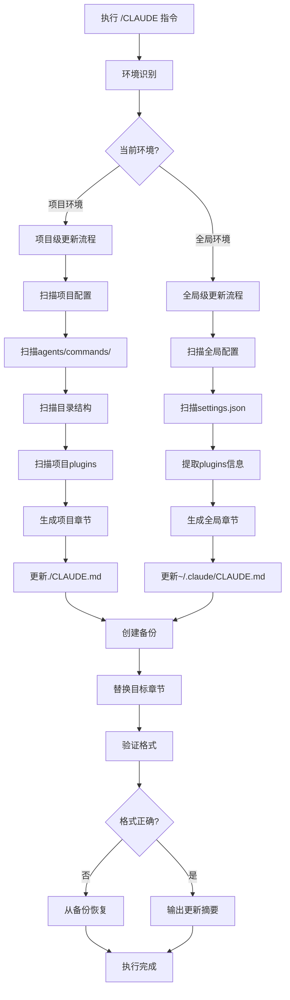

# 统一CLAUDE.md更新指令 (/CLAUDE)

## 📋 指令概述

**统一CLAUDE.md更新指令**是一个智能化的双层级配置同步工具，通过自动识别当前执行环境，智能更新全局级配置文档(`~/.claude/CLAUDE.md`)和项目级配置文档(`./CLAUDE.md`)，确保两个层级的文档与实际配置保持完全同步。

### 核心特性
- **双层级智能识别**: 自动判断更新全局级还是项目级配置
- **智能配置扫描**: 自动扫描agents/、commands/、skills/目录
- **Plugins信息同步**: 自动同步全局和项目级plugins配置
- **目录结构扫描**: 自动扫描项目目录结构并生成开发物料管理规范
- **动态内容生成**: 基于实际配置动态生成文档章节
- **备份保护机制**: 更新前自动创建备份，确保数据安全
- **格式标准化**: 统一文档格式，保持专业性和可读性

### 双层级配置对比

| 维度 | 全局级 (~/.claude/CLAUDE.md) | 项目级 (./CLAUDE.md) |
|------|------------------------------|----------------------|
| **作用范围** | 跨所有项目和框架 | 当前项目专属 |
| **配置内容** | 通用开发规范、工具配置、最佳实践 | 项目智能体、命令、目录结构 |
| **Plugins** | 全局插件配置(settings.json) | 项目专属插件配置 |
| **更新频率** | 新增通用规范时 | 项目配置变更时 |
| **同步目标章节** | 工具和插件配置 | Agents说明、意图分析图谱、开发物料管理 |

## 🎯 核心功能

### 功能1: 双层级智能识别

**目标**: 自动判断当前环境并决定更新哪个层级的配置

**识别逻辑**:
```yaml
执行环境检测:
  检查当前目录:
    - 如果存在./CLAUDE.md → 项目环境
    - 如果存在./.claude/目录 → 项目环境

  智能决策:
    项目环境:
      - 优先更新项目级CLAUDE.md
      - 如果项目有专属配置，更新项目文档

    非项目环境:
      - 更新全局级~/.claude/CLAUDE.md
      - 同步全局plugins配置

默认策略:
  - 在项目根目录执行 → 更新项目级
  - 在其他位置执行 → 更新全局级
  - 可通过参数强制指定层级
```

### 功能2: 全局级配置管理

**目标**: 管理跨项目通用的全局配置文档

**扫描范围**:
```yaml
全局配置目录:
  路径: ~/.claude/
  扫描对象:
    - settings.json: 全局插件配置
    - 通用agents/: 跨项目智能体(如果存在)
    - 通用commands/: 跨项目命令(如果存在)

Plugins配置:
  位置: ~/.claude/settings.json
  扫描内容:
    - enabledPlugins: Anthropic Agent Skills
    - MCP服务器配置
    - 工具权限配置

更新目标章节:
  - 6. 工具和插件配置
    - 6.1 Claude Code全局设置
    - 6.2 Anthropic Agent Skills
    - 6.3 MCP服务器集成
```

**生成内容**:
```yaml
全局配置章节:
  Claude Code设置:
    - alwaysThinkingEnabled配置
    - defaultMode配置
    - permissionPolicy配置
    - hooks配置状态

  Anthropic Agent Skills:
    - document-skills状态和功能
    - example-skills状态和功能
    - 其他启用插件列表

  MCP服务器:
    - chrome-mcp功能和工具数
    - context7功能和工具数
    - playwright-mcp功能和工具数
    - lark-mcp功能和工具数
    - github-mcp功能和工具数
    - cos-mcp功能和工具数
    - supabase-mcp功能和工具数
    - shadcn-ui功能和工具数
```

### 功能3: 项目级配置管理

**目标**: 管理项目专属的智能体、命令和目录结构

**扫描范围**:
```yaml
项目配置目录:
  路径: .claude/
  扫描对象:
    - agents/: 项目专属智能体
    - commands/: 项目专属命令
    - settings.json: 项目专属plugins(如果存在)

项目目录结构:
  扫描范围:
    - PRPs/: 功能规划文档
    - reports/: 执行报告
    - output/: 智能体输出
    - api/: API工具
    - scripts/: 自动化脚本
    - input/: 输入素材
    - learning/: 知识沉淀
    - trees/: 并行工作空间

更新目标章节:
  - 3. Agents智能体系统
  - 5. Commands命令系统
  - 8. 意图分析图谱
  - 1.4 开发物料管理规范(如适用)
  - 工具和插件配置(如有项目专属配置)
```

**生成内容**:
```yaml
Agents智能体系统:
  按业务组分类:
    - 战略组(G系列): 智能体列表和功能
    - 创意组(X系列): 智能体列表和功能
    - 情报组(E系列): 智能体列表和功能
    - 行政组(R系列): 智能体列表和功能
    - 中台组(M系列): 智能体列表和功能
    - 筹建组(Z系列): 智能体列表和功能
    - 开发组(F系列): 智能体列表和功能

Commands命令系统:
  按类别分类:
    - 上下文与学习管理类
    - 执行与状态管理类
    - 代码与项目管理类

意图分析图谱:
  基于实际智能体生成:
    - 关键词映射表
    - 意图识别示例
    - 智能路由规则

开发物料管理规范:
  基于目录结构生成:
    - 物料分类和存储位置
    - 命名规范
    - Git工作流程
```

### 功能4: Plugins配置同步

**目标**: 自动同步全局和项目级的plugins配置

**同步策略**:
```yaml
全局Plugins同步:
  源文件: ~/.claude/settings.json
  目标章节: ~/.claude/CLAUDE.md → 6. 工具和插件配置
  同步内容:
    - enabledPlugins列表
    - MCP服务器配置
    - 工具权限策略

项目Plugins同步:
  源文件: ./.claude/settings.json(如果存在)
  目标章节: ./CLAUDE.md → 工具和插件配置
  同步内容:
    - 项目专属插件
    - 项目专属MCP服务器
    - 项目特殊配置

智能判断:
  - 如果项目无专属plugins配置，跳过项目plugins章节
  - 如果全局无plugins配置，使用默认模板
```

## 🔧 使用方法

### 基础用法（不及物动词型）

**语法**: `/CLAUDE`

**功能**: 自动识别环境并执行相应的更新流程

**执行过程**:
```yaml
步骤1 - 环境识别:
  - 检测当前目录是否为项目根目录
  - 检查是否存在./CLAUDE.md
  - 检查是否存在./.claude/目录

步骤2 - 层级判断:
  项目环境:
    - 更新项目级./CLAUDE.md
    - 扫描项目agents/commands/
    - 扫描项目目录结构
    - 扫描项目plugins配置

  非项目环境:
    - 更新全局级~/.claude/CLAUDE.md
    - 扫描全局settings.json
    - 同步全局plugins配置

步骤3 - 配置扫描:
  - 扫描对应层级的配置文件
  - 解析智能体和命令定义
  - 提取plugins配置信息

步骤4 - 内容生成:
  - 根据层级生成对应章节
  - 格式化Markdown内容
  - 验证生成内容正确性

步骤5 - 文档更新:
  - 创建原文件备份
  - 替换目标章节
  - 验证文件格式
  - 输出更新摘要
```

### 使用示例

**场景1 - 在项目根目录执行（更新项目级）**:
```bash
cd /path/to/project
/CLAUDE
```

**输出**:
```
✅ 环境识别: 项目环境
📍 目标文件: ./CLAUDE.md

📊 配置扫描:
   - Agents: 60个 (G/X/E/R/M/Z/F系列)
   - Commands: 26个
   - 目录结构: 12个主要目录

✅ 项目级CLAUDE.md已更新
   更新章节:
   - 3. Agents智能体系统
   - 5. Commands命令系统
   - 8. 意图分析图谱
   - 1.4 开发物料管理规范
```

**场景2 - 在非项目目录执行（更新全局级）**:
```bash
cd ~
/CLAUDE
```

**输出**:
```
✅ 环境识别: 全局环境
📍 目标文件: ~/.claude/CLAUDE.md

📊 Plugins配置扫描:
   - Anthropic Skills: 2个插件已启用
   - MCP服务器: 8个服务器已配置

✅ 全局级CLAUDE.md已更新
   更新章节:
   - 6. 工具和插件配置
```

**场景3 - 添加新智能体后（项目环境）**:
```bash
# 创建新智能体
vi .claude/agents/战略组/G8-新智能体.md

# 同步文档
/CLAUDE
```

**输出**:
```
✅ 检测到配置变更
   新增: G8-新智能体

📊 文档已更新:
   - Agents智能体系统: 新增G8条目
   - 意图分析图谱: 更新映射示例
```

## 📊 执行流程



## 🎨 实现细节

### 环境识别器

```python
from pathlib import Path
from enum import Enum
from typing import Tuple

class EnvironmentType(Enum):
    """环境类型"""
    PROJECT = "project"  # 项目环境
    GLOBAL = "global"    # 全局环境

class EnvironmentDetector:
    """环境检测器"""

    def __init__(self):
        self.current_dir = Path.cwd()
        self.home_dir = Path.home()

    def detect(self) -> Tuple[EnvironmentType, Path]:
        """
        检测当前环境类型。

        Returns:
            Tuple[EnvironmentType, Path]: (环境类型, 目标CLAUDE.md路径)
        """
        # 检查项目环境标志
        project_claude = self.current_dir / "CLAUDE.md"
        project_config_dir = self.current_dir / ".claude"

        if project_claude.exists() or project_config_dir.exists():
            # 项目环境
            return EnvironmentType.PROJECT, project_claude

        # 全局环境
        global_claude = self.home_dir / ".claude" / "CLAUDE.md"
        return EnvironmentType.GLOBAL, global_claude

    def is_project_environment(self) -> bool:
        """判断是否为项目环境"""
        env_type, _ = self.detect()
        return env_type == EnvironmentType.PROJECT

    def get_target_file(self) -> Path:
        """获取目标CLAUDE.md文件路径"""
        _, target_path = self.detect()
        return target_path
```

### 全局级配置扫描器

```python
import json
from pathlib import Path
from typing import Dict, List

class GlobalConfigScanner:
    """全局配置扫描器"""

    def __init__(self):
        self.claude_dir = Path.home() / ".claude"
        self.settings_path = self.claude_dir / "settings.json"

    def scan_plugins(self) -> Dict[str, any]:
        """
        扫描全局plugins配置。

        Returns:
            Dict: 包含插件和MCP服务器信息
        """
        if not self.settings_path.exists():
            return {
                "anthropic_skills": [],
                "mcp_servers": [],
                "settings": {}
            }

        try:
            with open(self.settings_path, 'r', encoding='utf-8') as f:
                settings = json.load(f)

            # 提取Anthropic Agent Skills
            enabled_plugins = settings.get('enabledPlugins', {})
            anthropic_skills = []

            # document-skills
            if enabled_plugins.get('document-skills@anthropic-agent-skills'):
                anthropic_skills.append({
                    "name": "document-skills@anthropic-agent-skills",
                    "features": ["xlsx", "docx", "pptx", "pdf"],
                    "description": "Office文档处理能力"
                })

            # example-skills
            if enabled_plugins.get('example-skills@anthropic-agent-skills'):
                anthropic_skills.append({
                    "name": "example-skills@anthropic-agent-skills",
                    "features": [
                        "skill-creator", "mcp-builder", "canvas-design",
                        "algorithmic-art", "internal-comms", "webapp-testing"
                    ],
                    "description": "示例技能包集合"
                })

            # 提取MCP服务器信息（从已知列表推断）
            mcp_servers = self._detect_mcp_servers()

            return {
                "anthropic_skills": anthropic_skills,
                "mcp_servers": mcp_servers,
                "settings": {
                    "alwaysThinkingEnabled": settings.get('alwaysThinkingEnabled', True),
                    "defaultMode": settings.get('defaultMode', 'bypassPermissions'),
                    "permissionPolicy": settings.get('permissionPolicy', {})
                }
            }

        except Exception as e:
            print(f"扫描全局plugins配置失败: {e}")
            return {
                "anthropic_skills": [],
                "mcp_servers": [],
                "settings": {}
            }

    def _detect_mcp_servers(self) -> List[Dict]:
        """检测已配置的MCP服务器"""
        # 基于项目实际情况的MCP服务器列表
        return [
            {
                "name": "chrome-mcp",
                "description": "浏览器自动化操作",
                "tools_count": "20+",
                "features": ["页面导航", "元素交互", "内容抓取", "网络监控"]
            },
            {
                "name": "context7",
                "description": "实时库文档检索",
                "tools_count": "2",
                "features": ["库名称解析", "文档获取"]
            },
            {
                "name": "playwright-mcp",
                "description": "深度网页爬虫和测试",
                "tools_count": "30+",
                "features": ["真实浏览器操作", "复杂交互", "网络捕获", "控制台监控"]
            },
            {
                "name": "lark-mcp",
                "description": "飞书协同集成",
                "tools_count": "15+",
                "features": ["消息推送", "多维表格", "云文档", "权限管理"]
            },
            {
                "name": "github-mcp",
                "description": "GitHub代码协作",
                "tools_count": "25+",
                "features": ["仓库管理", "Issue/PR", "代码搜索", "分支操作"]
            },
            {
                "name": "cos-mcp",
                "description": "腾讯云COS存储管理",
                "tools_count": "10+",
                "features": ["文件管理", "图片处理", "媒体智能封面"]
            },
            {
                "name": "supabase-mcp",
                "description": "Supabase云数据库管理",
                "tools_count": "数据库操作全集",
                "features": ["PostgreSQL操作", "表结构管理", "实时订阅"]
            },
            {
                "name": "shadcn-ui",
                "description": "shadcn/ui v4组件库",
                "tools_count": "5",
                "features": ["组件源码获取", "演示代码", "元数据查询"]
            }
        ]

    def generate_plugins_section(self, plugins_data: Dict) -> str:
        """
        生成全局插件配置章节。

        Args:
            plugins_data: 插件数据

        Returns:
            str: 格式化的章节内容
        """
        sections = []

        # Claude Code全局设置
        sections.append("### 6.1 Claude Code全局设置")
        sections.append("")
        sections.append("```yaml")
        sections.append("配置文件位置: ~/.claude/settings.json")
        sections.append("")
        sections.append("核心配置:")
        settings = plugins_data.get('settings', {})
        sections.append(f"  alwaysThinkingEnabled: {settings.get('alwaysThinkingEnabled', 'true')}")
        sections.append(f"  defaultMode: {settings.get('defaultMode', 'bypassPermissions')}")
        sections.append("  permissionPolicy:")
        sections.append("    allow: [\"*\"]")
        sections.append("```")
        sections.append("")

        # Anthropic Agent Skills
        sections.append("### 6.2 Anthropic Agent Skills")
        sections.append("")
        sections.append("**已启用的官方插件包**:")
        sections.append("")

        for skill in plugins_data.get('anthropic_skills', []):
            sections.append(f"**{skill['name']}**:")
            sections.append(f"- 状态: ✅ 已启用")
            sections.append(f"- 功能: {skill['description']}")
            sections.append(f"- 包含技能: {', '.join(skill['features'][:5])}")
            sections.append("")

        # MCP服务器
        sections.append("### 6.3 MCP服务器集成")
        sections.append("")
        sections.append("**已集成的MCP服务器**:")
        sections.append("")

        for server in plugins_data.get('mcp_servers', []):
            sections.append(f"**{server['name']}**:")
            sections.append(f"- 描述: {server['description']}")
            sections.append(f"- 工具数: {server['tools_count']}")
            sections.append(f"- 核心功能: {', '.join(server['features'])}")
            sections.append("")

        return '\n'.join(sections)
```

### 项目级配置扫描器

```python
from pathlib import Path
from typing import Dict, List, Optional
import re

class ProjectConfigScanner:
    """项目配置扫描器"""

    def __init__(self, project_root: Path):
        self.project_root = project_root
        self.agents_dir = project_root / ".claude" / "agents"
        self.commands_dir = project_root / ".claude" / "commands"

    def scan_agents(self) -> Dict[str, List[Dict]]:
        """
        扫描项目智能体（按业务组分类）。

        Returns:
            Dict: 按业务组分类的智能体列表
        """
        agents_by_group = {}

        if not self.agents_dir.exists():
            return agents_by_group

        # 扫描各业务组子目录
        group_dirs = [
            "战略组", "创意组", "情报组",
            "行政组", "中台组", "筹建组", "开发组"
        ]

        for group_name in group_dirs:
            group_dir = self.agents_dir / group_name
            if not group_dir.exists():
                continue

            agents = []
            for file_path in sorted(group_dir.glob("*.md")):
                agent_info = self._parse_agent_file(file_path)
                if agent_info:
                    agents.append(agent_info)

            if agents:
                agents_by_group[group_name] = agents

        return agents_by_group

    def scan_commands(self) -> Dict[str, List[Dict]]:
        """
        扫描项目命令（按类别分类）。

        Returns:
            Dict: 按类别分类的命令列表
        """
        commands_by_category = {
            "上下文与学习管理类": [],
            "执行与状态管理类": [],
            "代码与项目管理类": []
        }

        if not self.commands_dir.exists():
            return commands_by_category

        # 类别映射
        category_map = {
            "C": "上下文与学习管理类", "V": "上下文与学习管理类",
            "X": "上下文与学习管理类", "Z": "上下文与学习管理类",
            "A": "上下文与学习管理类", "S": "上下文与学习管理类",
            "D": "上下文与学习管理类", "W": "上下文与学习管理类",
            "E": "执行与状态管理类", "F": "执行与状态管理类",
            "Q": "执行与状态管理类", "R": "执行与状态管理类",
            "B": "执行与状态管理类", "M": "执行与状态管理类",
            "N": "执行与状态管理类",
            "G": "代码与项目管理类", "H": "代码与项目管理类",
            "Y": "代码与项目管理类", "I": "代码与项目管理类",
            "O": "代码与项目管理类", "P": "代码与项目管理类",
            "U": "代码与项目管理类", "T": "代码与项目管理类"
        }

        for file_path in sorted(self.commands_dir.glob("*.md")):
            cmd_info = self._parse_command_file(file_path)
            if cmd_info:
                # 根据快捷键分类
                shortcut = cmd_info['shortcut'].lstrip('/')
                category = category_map.get(shortcut, "其他")
                if category in commands_by_category:
                    commands_by_category[category].append(cmd_info)

        return commands_by_category

    def _parse_agent_file(self, file_path: Path) -> Optional[Dict]:
        """解析智能体文件"""
        try:
            content = file_path.read_text(encoding='utf-8')

            # 提取文件名中的快捷键
            # 格式: G1-智能体名称.md 或 GG-组长名称.md
            filename = file_path.stem
            parts = filename.split('-', 1)
            shortcut = f"/{parts[0]}" if parts else f"/{filename}"
            name = parts[1] if len(parts) > 1 else filename

            # 提取功能定位
            description_match = re.search(
                r'\*\*定位\*\*:\s*(.+?)(?:\n|$)',
                content
            )
            description = description_match.group(1).strip() if description_match else "功能描述待补充"

            return {
                "shortcut": shortcut,
                "name": name,
                "description": description[:80],
                "path": str(file_path.relative_to(self.project_root))
            }

        except Exception as e:
            print(f"解析智能体文件失败 {file_path}: {e}")
            return None

    def _parse_command_file(self, file_path: Path) -> Optional[Dict]:
        """解析命令文件"""
        try:
            content = file_path.read_text(encoding='utf-8')

            shortcut = f"/{file_path.stem}"

            # 提取name字段（从YAML frontmatter）
            name_match = re.search(r'^name:\s*(.+?)$', content, re.MULTILINE)
            name = name_match.group(1).strip() if name_match else file_path.stem

            # 提取description字段
            desc_match = re.search(r'^description:\s*(.+?)$', content, re.MULTILINE)
            description = desc_match.group(1).strip() if desc_match else "功能描述待补充"

            return {
                "shortcut": shortcut,
                "name": name,
                "description": description[:80],
                "path": str(file_path.relative_to(self.project_root))
            }

        except Exception as e:
            print(f"解析命令文件失败 {file_path}: {e}")
            return None
```

## ⚙️ 配置项

```yaml
配置版本: v4.0.0
更新时间: 2025-10-23

双层级配置:
  全局级:
    目标文件: ~/.claude/CLAUDE.md
    更新章节: 6. 工具和插件配置
    扫描来源: ~/.claude/settings.json

  项目级:
    目标文件: ./CLAUDE.md
    更新章节:
      - 3. Agents智能体系统
      - 5. Commands命令系统
      - 8. 意图分析图谱
      - 1.4 开发物料管理规范
    扫描来源:
      - .claude/agents/
      - .claude/commands/
      - 项目目录结构

备份配置:
  启用备份: true
  备份目录:
    全局级: ~/.claude/backups/
    项目级: .claude/backups/
  保留数量: 5
  自动清理: true
```

## 🎯 成功标准

```yaml
环境识别成功:
  ✅ 准确判断项目/全局环境
  ✅ 正确定位目标CLAUDE.md文件
  ✅ 无误判或漏判

扫描成功:
  全局级:
    ✅ settings.json解析成功
    ✅ plugins信息提取完整

  项目级:
    ✅ agents/commands扫描完整
    ✅ 目录结构识别准确

更新成功:
  ✅ 目标章节正确替换
  ✅ 其他章节保持完整
  ✅ 格式验证通过
  ✅ 备份成功创建
```

## 🔗 相关资源

### 被合并的原命令
- **原`/B`命令**: 机器级CLAUDE.md更新（已整合到全局级功能）
- **原`/M`命令**: 项目级CLAUDE.md更新（已整合到项目级功能）

### 迁移说明
```yaml
向后兼容:
  - `/B`和`/M`命令文件暂时保留
  - 在命令文件顶部添加弃用警告
  - 引导用户使用新的`/CLAUDE`命令

迁移步骤:
  1. 保留原`/B`和`/M`命令1个月（过渡期）
  2. 在原命令中添加提示："建议使用 /CLAUDE 命令替代"
  3. 1个月后删除原命令文件
  4. 更新CLAUDE.md移除旧命令文档
```

## ⚠️ 注意事项

```yaml
环境识别:
  - 确保在正确的目录执行命令
  - 项目环境需要存在CLAUDE.md或.claude/目录
  - 非项目环境会更新全局配置

权限要求:
  - 全局级: ~/.claude/CLAUDE.md读写权限
  - 项目级: ./CLAUDE.md读写权限
  - 备份目录创建权限

执行频率:
  全局级:
    - 安装新插件后
    - 配置MCP服务器后
    - 修改全局设置后

  项目级:
    - 添加新智能体/命令后
    - 修改功能描述后
    - 项目结构调整后
    - 建议每周定期执行一次
```

---

**配置版本**: v4.0.0
**更新时间**: 2025-10-23
**更新内容**: 合并`/B`和`/M`命令为统一的`/CLAUDE`命令，支持全局级和项目级配置的智能识别与更新
**维护原则**: 双层级配置的统一管理、自动化同步、确保文档与实际配置的完全一致性
