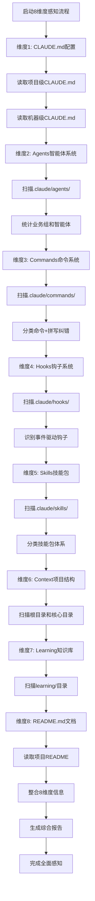

# Context-Aware Analysis (上下文感知分析)

## 📋 指令概述

**Context-Aware Analysis (上下文感知分析)**是一个全方位的项目智能分析工具，通过扫描和理解项目的**8大核心维度**，建立深度的项目上下文理解。该指令采用文件系统工具优先策略，结合智能拼写纠错，确保分析的准确性、全面性和友好性。

### 8大感知维度

| 维度 | 路径 | 感知内容 | 价值 |
|------|------|----------|------|
| **1. Agents** | `.claude/agents/` | 智能体系统架构、业务组划分、智能体能力 | 理解项目的智能协作体系 |
| **2. Commands** | `.claude/commands/` | 斜杠命令系统、工作流自动化、快捷操作 | 掌握项目的操作入口 |
| **3. Hooks** | `.claude/hooks/` | 事件驱动钩子、自动化触发器、生命周期管理 | 了解项目的自动化机制 |
| **4. Skills** | `.claude/skills/` | 技能包体系、可复用能力、执行引擎 | 发现项目的核心能力模块 |
| **5. Context** | 项目目录结构 | 目录组织、文件分布、模块划分 | 理解项目的整体架构 |
| **6. Learning** | `learning/` | 知识积累、技术洞察、智慧沉淀 | 获取项目的经验和教训 |
| **7. CLAUDE.md** | 各级CLAUDE.md | 配置规范、开发约定、团队规则 | 掌握项目的配置和规范 |
| **8. README.md** | README.md | 项目介绍、快速开始、使用指南 | 快速了解项目的目标和用法 |

### 核心特性
- **🎯 8维度全覆盖**: 从智能体到文档的全方位分析
- **🔍 智能拼写纠错**: 自动检测和纠正文件路径、命令名称的拼写错误
- **🛠️ 文件系统优先**: 使用Read、Glob、Grep工具替代Shell命令
- **📊 结构化输出**: 清晰展示项目架构、能力矩阵和关键组件
- **⚡ 快速上手**: 帮助快速理解陌生项目的核心要素

### 应用场景
- **首次接触项目**: 15-30分钟建立全局认知
- **项目交接**: 系统化的知识传递
- **定期审查**: 发现配置变化和新增能力
- **命令探索**: 发现和理解可用的斜杠命令
- **智能体理解**: 了解项目的智能体协作体系
- **拼写纠错**: 输入错误的命令或路径时自动提示正确用法

## 🎯 核心功能(8维度感知流程)

### 维度1: Agents智能体系统

**目标**: 理解项目的智能体协作架构

**扫描范围**:
```yaml
扫描路径:
  - .claude/agents/
  - .claude/agents/system/
  - .claude/agents/[业务组]/

扫描内容:
  业务组识别:
    - 战略组(G系列): 战略规划、经营分析、产品力打造
    - 创意组(X系列): 广告策划、文案创作、平面设计
    - 情报组(E系列): 公开调研、网站采集、深度分析
    - 行政组(R系列): 财务管理、人事管理、飞书协同
    - 中台组(M系列): 美团管家运营、营销、报表
    - 筹建组(Z系列): 平面图设计、BIM建模、动画渲染
    - 开发组(F系列): 前后端开发、数据库、测试部署

  智能体统计:
    - 每个组别的智能体数量
    - 智能体的名称和功能定位
    - 组长智能体识别
    - 智能体协作模式
```

**输出示例**:
```
📊 Agents智能体系统:
   - 总计: 60个智能体
   - 业务组: 7个 (G/X/E/R/M/Z/F)
   - 战略组(G系列): 9个智能体
     ├─ GG: 战略规划总监(组长)
     ├─ G1: 经营分析优化师
     └─ G2: 产品力打造专家
     ...
```

---

### 维度2: Commands命令系统

**目标**: 发现项目的斜杠命令和工作流自动化入口

**扫描范围**:
```yaml
扫描路径:
  - .claude/commands/

扫描内容:
  命令分类:
    - 上下文与学习管理类 (/C, /V, /X, /Z, /A, /S, /D, /W)
    - 执行与状态管理类 (/E, /F, /Q, /R, /B, /M, /N)
    - 代码与项目管理类 (/G, /H, /Y, /I, /O, /P, /U, /T)

  命令解析:
    - 命令名称(name字段)
    - 命令描述(description字段)
    - 参数类型(transitive/intransitive)
    - 版本和更新时间

  拼写纠错:
    - 检测常见拼写错误
    - 提供正确命令建议
    - 支持模糊匹配
```

**拼写纠错示例**:
```
用户输入: /comit
智能识别: 您是否想输入 `/commit`?

用户输入: /test-coverage
智能识别: 相似命令有:
   - /test: 测试与质量验证
   - /T: 测试与质量验证工程师
```

**输出示例**:
```
⚡ Commands命令系统:
   - 总计: 26个命令
   - 上下文与学习管理: 8个
     ├─ /C: 有机生长注意力管理
     ├─ /Z: 知识积累与智慧沉淀
     └─ /X: MANUS错误纠正与学习
     ...
   - 执行与状态管理: 7个
   - 代码与项目管理: 11个
```

---

### 维度3: Hooks钩子系统

**目标**: 了解项目的事件驱动自动化机制

**扫描范围**:
```yaml
扫描路径:
  - .claude/hooks/
  - .claude/settings.json (hooks配置)

扫描内容:
  钩子类型:
    - SessionStart: 会话启动钩子
    - SessionEnd: 会话结束钩子
    - UserPromptSubmit: 用户提交钩子
    - PreCompact: 上下文压缩前钩子
    - PostCompact: 上下文压缩后钩子
    - ToolUse: 工具使用前钩子
    - ToolResult: 工具使用后钩子
    - Stop: Stop按钮钩子

  钩子配置:
    - 钩子触发事件
    - 执行命令
    - 功能描述
    - 来源(自定义/第三方)

  已知钩子:
    - Stop Hook: 智能任务延续 (fish895623/claude-hook)
    - PreCompact Hook: 智能记忆提取 (rhowardstone/memory-system)
    - SessionStart Hook: 智能记忆注入 (rhowardstone/memory-system)
```

**输出示例**:
```
🪝 Hooks钩子系统:
   - 已配置钩子: 3个
   - Stop Hook: 智能任务延续
     └─ 触发: 用户点击Stop按钮
     └─ 功能: 自动保存任务进度
   - PreCompact Hook: 智能记忆提取
     └─ 触发: 上下文压缩前
     └─ 功能: 提取重要信息
```

---

### 维度4: Skills技能包体系

**目标**: 发现项目的可复用能力模块和执行引擎

**扫描范围**:
```yaml
扫描路径:
  - .claude/skills/

扫描内容:
  技能包分类:
    - 元Skills: agents、commands、hooks、skills创建工具
    - 工作流Skills: 业务流程和方法论
    - 知识库Skills: 领域知识和配置模板
    - 执行引擎Skills: API工具、MCP服务器、通用模块

  技能包统计:
    - 每个分类的技能包数量
    - 技能包名称和功能描述
    - 技能包的SKILL.md结构
    - 执行引擎脚本识别

  结构分析:
    - 单文件Skills vs 多文件Skills
    - 是否包含scripts/目录
    - 是否包含reference.md
    - 是否包含templates/目录
```

**输出示例**:
```
🎯 Skills技能包体系:
   - 总计: 33个技能包
   - 元Skills: 6个
     ├─ agents: 智能体设计与创建
     ├─ commands: 斜杠命令设计
     └─ skills: 技能包创建指南
   - 执行引擎Skills: 17个
     ├─ AIGC文生图: nano-banana API
     └─ Excel自动化: office模块
```

---

### 维度5: Context项目结构

**目标**: 理解项目的目录组织和文件分布

**扫描范围**:
```yaml
扫描路径:
  - 项目根目录
  - 核心目录: PRPs/, reports/, output/, api/, scripts/

扫描内容:
  目录分类:
    - 配置目录: .claude/, .git/, .vscode/
    - 功能规划: PRPs/ (completed/, in-progress/, archived/)
    - 执行报告: reports/ (agents/, commands/, system/)
    - 输出目录: output/ (战略组/, 创意组/, 情报组/, ...)
    - API工具: api/ (mcp-servers/, integrations/, scripts/)
    - 自动化脚本: scripts/ (automation/, data-processing/)
    - 输入素材: input/ (images/, documents/, data/)
    - 知识沉淀: learning/ (insights/, decisions/, errors/)
    - 并行空间: trees/ (Git worktrees)

  目录识别:
    - 项目类型识别
    - 构建工具识别
    - 框架依赖识别
```

**输出示例**:
```
📁 Context项目结构:
   ZTL数智化作战中心/
   ├── .claude/          # Claude Code配置中心
   │   ├── agents/       # 智能体定义 (60个)
   │   ├── commands/     # 斜杠命令 (26个)
   │   ├── skills/       # 技能包库 (33个)
   │   └── hooks/        # 事件钩子
   ├── PRPs/             # 功能规划文档
   ├── reports/          # 执行报告
   ├── output/           # 智能体输出
   └── learning/         # 知识沉淀
```

---

### 维度6: Learning知识积累

**目标**: 获取项目的经验、教训和技术洞察

**扫描范围**:
```yaml
扫描路径:
  - learning/
  - learning/insights/
  - learning/decisions/
  - learning/errors/

扫描内容:
  知识分类:
    - insights/: 技术洞察和最佳实践
    - decisions/: 重要决策记录和理由
    - errors/: 错误记录和改进措施

  知识结构:
    - 记录日期和版本
    - 问题描述和分析
    - 解决方案和效果
    - 可复用性评估

  知识统计:
    - 总记录数
    - 按类别统计
    - 最新更新时间
```

**输出示例**:
```
📚 Learning知识积累:
   - 技术洞察: 5条
     ├─ Skills三层架构设计
     └─ PRP工作流程优化
   - 决策记录: 3条
     ├─ 移除"系统级"配置概念
     └─ 合并/B和/M命令
   - 错误记录: 2条
     └─ M1智能体使用错误
```

---

### 维度7: CLAUDE.md配置文件

**目标**: 掌握项目的配置规范和开发约定

**扫描范围**:
```yaml
扫描路径:
  项目级配置:
    - ./CLAUDE.md (项目根目录)
    - 作用: 项目特定配置、业务规则、团队约定
    - 优先级: 最高

  机器级配置:
    - ~/.claude/CLAUDE.md (全局)
    - 作用: 全局配置、通用规范、跨项目最佳实践
    - 优先级: 中等

扫描内容:
  项目级CLAUDE.md:
    - 项目说明和定位
    - 技术架构
    - Agents智能体系统
    - Commands命令系统
    - Skills技能包体系
    - 意图分析图谱
    - 开发物料管理规范
    - 优秀经验记录
    - 错误与纠正记录

  机器级CLAUDE.md:
    - Claude Code核心概念
    - 三层架构规范
    - 全局最佳实践
    - 工具和插件配置
```

**输出示例**:
```
📄 CLAUDE.md配置文件:
   项目级 (./CLAUDE.md):
   - 版本: v2.0.0
   - 更新: 2025-10-23
   - 章节:
     ├─ 1. 项目说明
     ├─ 3. Agents智能体系统 (60个)
     ├─ 5. Commands命令系统 (26个)
     ├─ 8. 意图分析图谱
     └─ 9/10. 经验和错误记录

   机器级 (~/.claude/CLAUDE.md):
   - 版本: v1.4.0
   - 更新: 2025-10-23
   - 章节:
     ├─ 1. Claude Code核心概念
     ├─ 5. 复杂系统三层架构
     └─ 6. 工具和插件配置
```

---

### 维度8: README.md项目文档

**目标**: 快速了解项目的目标、特性和使用方式

**扫描范围**:
```yaml
扫描路径:
  - ./README.md (项目根目录)

扫描内容:
  项目概述:
    - 项目名称和描述
    - 核心价值主张
    - 主要功能特性
    - 徽章系统(badges)

  快速开始:
    - 安装依赖步骤
    - 运行和开发流程
    - 常用命令说明

  项目结构:
    - 目录组织说明
    - 核心模块介绍
    - 关键文件位置

  技术栈:
    - 核心框架和库
    - 版本要求
    - MCP服务器集成

  使用指南:
    - 基础用法
    - 高级特性
    - 配置说明
```

**输出示例**:
```
📖 README.md项目文档:
   - 项目名称: ZTL数智化作战中心
   - 核心定位: 餐饮行业数智化转型平台
   - 技术栈:
     ├─ AI基础: Claude Sonnet 4.5
     ├─ 开发框架: Claude Code v1.0+
     └─ 协议标准: MCP
   - 业务矩阵: 7大业务组、60个智能体
   - 特色功能:
     ├─ 多智能体协作
     ├─ PRP工作流
     └─ 知识积累系统
```

## 🔧 使用方法

### 不及物动词型（默认行为）

直接使用，无需参数：

```bash
/context-aware
```

**行为**: 自动分析当前工作目录下的项目，依次扫描8大感知维度，生成全面的项目上下文分析报告。

### 工作模式

```yaml
执行模式:
  - 8维度全覆盖扫描
  - 智能拼写纠错
  - 自动识别项目配置
  - 优先级驱动的分析流程
  - 结构化的Markdown输出

扫描顺序:
  1. CLAUDE.md配置文件 (项目级、机器级)
  2. Agents智能体系统 (.claude/agents/)
  3. Commands命令系统 (.claude/commands/)
  4. Hooks钩子系统 (.claude/hooks/)
  5. Skills技能包体系 (.claude/skills/)
  6. Context项目结构 (根目录、核心目录)
  7. Learning知识积累 (learning/)
  8. README.md项目文档 (./README.md)
```

### 拼写纠错功能

```yaml
自动检测:
  命令拼写错误:
    - 输入: /comit → 建议: /commit
    - 输入: /tets → 建议: /test, /T
    - 输入: /PRP → 建议: /prp, /E, /F

  路径拼写错误:
    - 输入: .claude/agnet/ → 建议: .claude/agents/
    - 输入: learing/ → 建议: learning/
    - 输入: skilss/ → 建议: skills/

  模糊匹配:
    - 支持部分匹配和相似度计算
    - 提供Top 3相似度最高的建议
    - 显示正确路径和功能描述
```

## 📊 执行流程



## 🔍 意图解析逻辑

### 项目类型识别
```yaml
识别策略:
  Python项目:
    - 存在 pyproject.toml 或 setup.py
    - 存在 requirements.txt 或 Pipfile
    - 存在 .py 文件

  JavaScript/Node项目:
    - 存在 package.json
    - 存在 node_modules/ 目录
    - 存在 .js/.ts 文件

  多语言项目:
    - 同时存在多种语言的配置文件
    - 存在 api/ 和 modules/ 等分离目录
    - 需要分别分析各语言模块

  特殊项目:
    - Docker项目（Dockerfile, docker-compose.yml）
    - 前端项目（webpack.config.js, vite.config.js）
    - 全栈项目（前后端分离的目录结构）
```

### 关键文件定位
```yaml
定位策略:
  入口文件优先:
    - 搜索 main.py, app.py, index.js 等
    - 检查 package.json 的 "main" 字段
    - 检查 pyproject.toml 的 [tool.poetry.scripts]

  配置文件次之:
    - 项目根目录的配置文件
    - .config/ 目录下的配置
    - 环境变量配置文件

  核心模块最后:
    - src/ 或 lib/ 目录下的核心文件
    - api/ 目录下的路由定义
    - models/ 目录下的数据模型
```

## 🎨 实现细节

### 工具使用策略

```yaml
view工具使用:
  适用场景:
    - 探索目录结构
    - 列出文件清单
    - 识别目录层级

  使用方法:
    - 递归探索关键目录
    - 记录文件数量和类型
    - 识别目录命名模式

Read工具使用:
  适用场景:
    - 读取完整文件内容
    - 分析文件结构和逻辑
    - 提取关键信息

  使用方法:
    - 完整读取关键文件
    - 不设置offset和limit（除非文件过大）
    - 解析文件内容并提取要点

Shell命令使用限制:
  避免使用:
    - ls, cat, grep 等基础命令
    - 文件读取和搜索操作
    - 目录遍历操作

  仅在必要时使用:
    - 运行项目特定的命令（如 npm list）
    - 检查环境变量或系统信息
```

### 分析深度控制

```yaml
配置文件:
  - 完整读取并分析所有CLAUDE.md
  - 提取关键约定和规范
  - 识别项目特定的工作流

README文档:
  - 完整读取项目README.md
  - 提取项目概述和快速开始
  - 识别项目目标和功能特性

目录结构:
  - 探索到2-3层深度
  - 记录所有一级目录
  - 选择性深入关键目录

关键文件:
  - 完整读取3-5个最重要文件
  - 部分读取次要文件（前100行）
  - 提取关键导入和定义
```

### 输出格式标准

```yaml
项目结构部分:
  - 使用树形结构展示
  - 标注每个目录的用途
  - 高亮关键文件

项目目标部分:
  - 清晰的目标陈述
  - 解决的核心问题
  - 目标用户描述

关键文件部分:
  - 文件路径 + 用途说明
  - 文件间的依赖关系图
  - 重要性评级

依赖部分:
  - 依赖名称 + 版本
  - 依赖用途说明
  - 关键依赖标注

配置部分:
  - 配置文件清单
  - 关键配置项解释
  - 配置修改建议
```

## ⚙️ 配置项

### 系统配置

```yaml
配置版本: v3.0.0
更新时间: 2025-10-24
感知维度: 8大维度全覆盖
工具优先级: Read > Glob > Grep > Bash
分析深度: 全面（8维度深度扫描）
拼写纠错: 启用（命令和路径智能纠错）
```

### 分析范围

```yaml
8大感知维度:
  维度1-Agents:
    - .claude/agents/: 所有业务组和智能体
    - system/: 系统智能体

  维度2-Commands:
    - .claude/commands/: 所有斜杠命令
    - 命令分类和统计

  维度3-Hooks:
    - .claude/hooks/: 钩子脚本
    - settings.json: hooks配置

  维度4-Skills:
    - .claude/skills/: 所有技能包
    - 技能包分类统计

  维度5-Context:
    - 项目根目录
    - 核心目录: PRPs/, reports/, output/, api/, scripts/, learning/

  维度6-Learning:
    - learning/insights/: 技术洞察
    - learning/decisions/: 决策记录
    - learning/errors/: 错误记录

  维度7-CLAUDE.md:
    - ./CLAUDE.md: 项目级配置
    - ~/.claude/CLAUDE.md: 机器级配置

  维度8-README.md:
    - ./README.md: 项目文档
```

### 输出控制
- **详细程度**: 中等（包含关键信息，避免过度细节）
- **格式风格**: Markdown结构化输出
- **长度限制**: 建议500-1000行

## 📝 示例场景

### 场景1：首次接触ZTL项目

**执行**:
```bash
/context-aware
```

**输出示例**:
```markdown
# 8维度项目上下文分析报告

## 维度1: Agents智能体系统
📊 总计: 60个智能体，7大业务组
- 战略组(G系列): 9个 - 战略规划、经营分析、产品打造
- 创意组(X系列): 9个 - 广告策划、文案设计、短视频制作
- 情报组(E系列): 8个 - 公开调研、网站采集、深度分析
- 行政组(R系列): 8个 - 财务人事、法务秘书、飞书协同
- 中台组(M系列): 9个 - 美团管家运营、营销、报表
- 筹建组(Z系列): 6个 - 平面图、BIM建模、动画渲染
- 开发组(F系列): 11个 - 产品、前后端、数据库、测试

## 维度2: Commands命令系统
⚡ 总计: 26个命令，3大类别
- 上下文与学习: 8个 (/C注意力, /Z知识积累, /X错误纠正...)
- 执行与状态: 7个 (/E PRP执行, /M项目更新, /N系统更新...)
- 代码与项目: 11个 (/G同步推送, /I README生成, /T测试...)

## 维度3: Hooks钩子系统
🪝 已配置: 3个钩子
- Stop Hook: 智能任务延续 (fish895623/claude-hook)
- PreCompact Hook: 智能记忆提取 (rhowardstone/memory-system)
- SessionStart Hook: 智能记忆注入 (rhowardstone/memory-system)

## 维度4: Skills技能包体系
🎯 总计: 33个技能包
- 元Skills: 6个 (agents/commands/hooks创建工具)
- 工作流Skills: 1个 (美团管家运营知识库)
- 知识库Skills: 9个 (Marketing Genius, 设计风格模板)
- 执行引擎Skills: 17个 (AIGC, Figma, Excel, PDF...)

## 维度5: Context项目结构
📁 核心目录:
- .claude/: 配置中心 (60 agents, 26 commands, 33 skills)
- PRPs/: 功能规划文档
- output/: 智能体输出目录
- learning/: 知识沉淀

## 维度6: Learning知识积累
📚 知识记录:
- insights/: 技术洞察 (Skills三层架构, PRP优化)
- decisions/: 决策记录 (移除系统级配置, 合并命令)
- errors/: 错误记录 (M1智能体使用错误)

## 维度7: CLAUDE.md配置
📄 双层级配置:
- 项目级: v2.0.0, 60个agents说明, 意图分析图谱
- 机器级: v1.4.0, 核心概念, 三层架构, 插件配置

## 维度8: README.md文档
📖 项目定位: 餐饮行业数智化转型平台
- 技术栈: Claude Sonnet 4.5 + Claude Code + MCP
- 业务矩阵: 7大业务组、60个智能体
- 特色功能: 多智能体协作、PRP工作流、知识积累
```

### 场景2：拼写纠错示例

**用户输入错误命令**:
```bash
/comit  # 拼写错误
```

**智能识别**:
```
❌ 命令未找到: /comit
💡 您是否想输入: /commit?

相似命令建议:
  - /C: 有机生长注意力管理
  - /context-aware: 上下文感知分析
```

**用户输入错误路径**:
```bash
.claude/agnet/  # 拼写错误
```

**智能识别**:
```
❌ 路径未找到: .claude/agnet/
💡 您是否想输入: .claude/agents/?

相似路径建议:
  - .claude/agents/: 智能体系统
  - .claude/agents/战略组/: G系列智能体
  - .claude/agents/创意组/: X系列智能体
```

### 场景3：新成员项目入职

**使用流程**:
1. 新成员克隆项目仓库
2. 运行 `/context-aware` 快速建立全局认知
3. 阅读8维度分析报告，15-30分钟理解项目全貌
4. 根据报告深入学习关键业务组
5. 参考意图分析图谱了解智能体协作模式

**效果**: 从完全陌生到熟悉整体架构仅需15-30分钟

## 🔍 错误处理

### 常见错误类型

#### 1. 配置文件缺失
```yaml
症状: 无法找到CLAUDE.md或README.md
原因:
  - 项目未初始化配置
  - 文件命名不标准
  - 位于非标准位置
处理:
  - 跳过缺失的配置文件
  - 继续分析其他可用资源
  - 在报告中标注缺失项
```

#### 2. 文件读取失败
```yaml
症状: 无法读取某些关键文件
原因:
  - 文件权限不足
  - 文件损坏或编码问题
  - 文件过大
处理:
  - 记录失败的文件
  - 尝试读取替代文件
  - 在报告中说明限制
```

#### 3. 项目类型无法识别
```yaml
症状: 无法确定项目的技术栈
原因:
  - 非标准项目结构
  - 混合多种技术
  - 配置文件缺失
处理:
  - 基于现有文件推断类型
  - 分析所有可识别的组件
  - 在报告中说明不确定性
```

### 错误恢复策略
```yaml
降级策略:
  - 从完整分析降级到部分分析
  - 从深度分析降级到表层分析
  - 从自动分析降级到用户引导

补偿机制:
  - 使用替代文件补充信息
  - 基于常见模式进行推断
  - 提供人工分析建议
```

## 📈 性能优化

### 分析效率优化
```yaml
并行读取:
  - 配置文件和README并行读取
  - 多个关键文件批量读取
  - 减少工具调用次数

智能跳过:
  - 跳过node_modules/等大型目录
  - 跳过构建输出目录
  - 跳过临时文件和缓存

缓存机制:
  - 缓存目录结构探索结果
  - 缓存常见项目类型特征
  - 复用相似项目的分析结果
```

### 输出优化
```yaml
结构化输出:
  - 使用统一的Markdown格式
  - 分层次展示信息
  - 高亮关键内容

长度控制:
  - 避免冗长的文件内容展示
  - 提取和总结关键信息
  - 使用示例而非完整列表
```

## 🎯 成功标准

### 分析完整性
```yaml
必须包含:
  ✅ 项目结构树形图
  ✅ 项目目标和核心功能
  ✅ 3-5个关键文件说明
  ✅ 主要依赖清单
  ✅ 配置文件说明

可选包含:
  ✅ 测试结构说明
  ✅ 部署配置说明
  ✅ 开发工作流说明
```

### 输出质量
```yaml
质量要求:
  ✅ 信息准确无误
  ✅ 结构清晰易读
  ✅ 重点突出
  ✅ 长度适中（不过长不过短）
  ✅ 可操作性强
```

### 用户理解
```yaml
理解目标:
  ✅ 用户能快速定位关键文件
  ✅ 用户理解项目整体架构
  ✅ 用户知道如何开始开发
  ✅ 用户了解主要约定和规范
```

## 🔗 相关资源

### 内部资源
- **项目配置**: `CLAUDE.md` (三层架构)
- **项目文档**: `README.md`
- **开发指南**: `CONTRIBUTING.md` (如果存在)

### 相关指令
- `/E` - PRP生成与执行（需要项目上下文）
- `/F` - PRP快速创建（基于项目理解）
- `/R` - 并行任务执行（需要了解项目结构）

### 工作流集成
```yaml
典型工作流:
  1. /Q - 建立项目理解
  2. /F - 生成功能规划PRP
  3. /E - 执行功能实现

或:
  1. /Q - 分析现有项目
  2. 识别需要改进的部分
  3. 使用其他指令进行优化
```

## ⚠️ 注意事项

### 使用限制
```yaml
适用场景:
  ✅ 首次接触项目
  ✅ 项目交接
  ✅ 定期审查项目结构
  ✅ 作为其他指令的前置步骤

不适用场景:
  ❌ 已非常熟悉的项目（浪费时间）
  ❌ 超大型项目（分析时间过长）
  ❌ 临时脚本项目（结构过简单）
```

### 最佳实践
```yaml
执行前:
  - 确保在项目根目录下
  - 确保有基本的文件读取权限
  - 理解输出报告的用途

执行中:
  - 耐心等待分析完成
  - 关注关键信息而非全部细节

执行后:
  - 保存分析报告作为参考
  - 根据报告深入学习关键部分
  - 必要时重新运行更新理解
```

### 重要提醒
```yaml
关键原则:
  - 使用文件系统工具而非Shell命令
  - 优先读取配置文件和文档
  - 关注项目整体而非具体实现细节
  - 输出结构化、易读的分析报告

常见误区:
  - 不要试图分析所有文件
  - 不要陷入实现细节
  - 不要忽略配置文件
  - 不要跳过README分析
```

---

**配置版本**: v3.0.0
**更新时间**: 2025-10-24
**核心升级**: 扩展为8维度全覆盖分析（Agents/Commands/Hooks/Skills/Context/Learning/CLAUDE.md/README.md），新增智能拼写纠错功能
**维护原则**: 8维度全覆盖、智能拼写纠错、文件系统优先、结构化输出、快速理解
