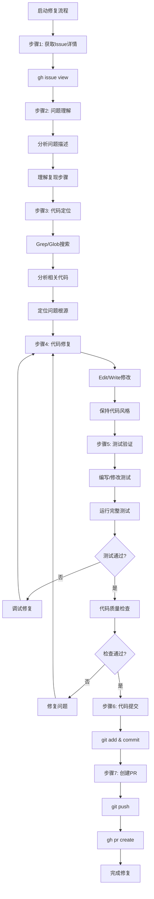

# GitHub Issue修复流程

## 📋 指令概述

**GitHub Issue修复流程**是一个规范化的问题解决工具，通过标准化的分析、修复和验证流程，确保GitHub Issues得到彻底解决并正确关闭。提供从问题理解到代码提交的完整工作流，保证问题解决的质量和可追溯性。

### 核心特性
- **系统化分析**: 深入理解Issue的根本原因
- **规范化修复**: 遵循最佳实践完成代码修复
- **完整验证**: 确保修复有效且无副作用
- **自动关联**: 提交信息自动关联Issue

### 应用场景
- Bug修复和问题解决
- 功能增强和改进
- 技术债务处理
- 用户反馈响应

## 🎯 核心功能(六步流程)

### 1. 问题理解
**目标**: 深入理解Issue的问题描述和复现步骤

```bash
gh issue view [Issue编号]
```

**理解维度**:
- Issue描述的核心问题
- 复现问题的步骤和条件
- 期望的正确行为
- 问题的影响范围和严重程度

### 2. 代码定位与分析
**目标**: 在代码库中定位问题根源

**定位工具**:
- `Grep`: 搜索相关代码和函数
- `Glob`: 查找相关文件
- `Read`: 深入分析代码逻辑

**分析方法**:
- 追踪调用链和数据流
- 识别关键代码段
- 分析潜在的根本原因

### 3. 代码修复与实现
**目标**: 实施代码修复方案

**修复工具**:
- `Edit`: 修改现有文件
- `Write`: 创建新文件（如需要）

**修复原则**:
- 保持代码风格一致
- 最小化修改范围
- 添加必要的注释
- 考虑边界情况和异常处理

### 4. 测试与验证
**目标**: 确保修复有效且无副作用

**测试层次**:
```yaml
单元测试:
  - 编写或修改测试用例
  - 验证修复的代码逻辑
  - 覆盖边界情况

集成测试:
  - 运行项目完整测试套件
  - 使用: pytest, npm test 等
  - 确保无回归问题

代码质量检查:
  - 静态检查: ruff, eslint
  - 类型检查: mypy, tsc
  - 确保代码通过所有检查
```

### 5. 代码提交
**目标**: 规范提交修复代码

```bash
# 添加修改的文件
git add [文件列表]

# 提交并关联Issue
git commit -m "Fix: [简短描述] (#[Issue编号])

Fixes #[Issue编号]

- [修复内容详细说明]
- [测试验证说明]
"
```

**提交规范**:
- 使用清晰、规范的提交信息
- 必须关联Issue编号
- 详细说明修复内容和验证结果
- 保持提交的原子性

### 6. 创建Pull Request
**目标**: 推送代码并创建PR请求审查

```bash
# 推送到远程仓库
git push origin [分支名]

# 创建Pull Request
gh pr create --title "Fix: [标题]" \
  --body "Fixes #[Issue编号]" \
  --assignee @me
```

**PR要求**:
- 标题清晰描述修复内容
- 正文关联Issue编号
- 说明问题、原因和解决方案
- 指明测试验证结果

## 🔧 使用方法

### 及物动词型（需要参数）

```bash
/github-issue <Issue的URL或号码>
```

**示例**:
```bash
# 使用完整URL
/github-issue https://github.com/owner/repo/issues/123

# 使用Issue编号（在正确的仓库上下文中）
/github-issue 123
```

**执行效果**:
- 自动获取Issue详情
- 引导完成六步修复流程
- 生成规范的提交信息和PR

## 📊 执行流程



## 🔍 意图解析逻辑

### 参数解析
```yaml
Issue标识:
  URL格式: https://github.com/owner/repo/issues/123
  编号格式: 123 (需在正确的仓库上下文)

解析方法:
  - 从URL提取仓库和编号
  - 从编号推断当前仓库
  - 验证Issue存在性
```

### 仓库上下文
```yaml
上下文检测:
  - 检查当前目录是否为Git仓库
  - 获取远程仓库信息
  - 确认GitHub仓库访问权限

上下文验证:
  - 验证Issue属于当前仓库
  - 确认有权限访问Issue
  - 检查Issue状态（open/closed）
```

## 🎨 实现细节

### GitHub CLI集成
```yaml
Issue查看:
  命令: gh issue view [编号]
  输出: Issue标题、描述、标签、评论

PR创建:
  命令: gh pr create
  参数:
    --title: PR标题
    --body: PR描述（包含Fixes #编号）
    --assignee: 指派审查者
```

### Git工作流
```yaml
分支管理:
  创建分支: git checkout -b fix/issue-123
  提交修改: git commit -m "message"
  推送分支: git push origin fix/issue-123

提交信息格式:
  标题: Fix: [简短描述] (#123)
  正文:
    - Fixes #123
    - [修复详情]
    - [测试说明]
```

### 测试最佳实践
```yaml
TDD方式:
  1. 先编写失败的测试用例
  2. 实施修复使测试通过
  3. 重构代码保持测试通过

测试覆盖:
  - 核心修复逻辑
  - 边界情况
  - 异常处理
  - 回归测试
```

## ⚙️ 配置项

### 系统配置
```yaml
配置版本: v3.0.0
更新时间: 2025-10-24
维护原则: 准确、高效、规范
```

### 必需环境
```yaml
必需工具:
  - Git (>= 2.20)
  - GitHub CLI (gh) (>= 2.0)
  - 项目测试框架 (pytest/npm test等)
  - 代码检查工具 (ruff/eslint等)

必需权限:
  - GitHub仓库访问权限
  - Issue查看和修改权限
  - 代码提交和PR创建权限
```

## 📝 示例场景

### 场景1：Bug修复（完整流程）

**Issue信息**:
```
Issue #123: Login fails with empty password
Labels: bug, priority-high

Steps to reproduce:
1. Open login page
2. Enter username
3. Leave password empty
4. Click login button

Expected: Show validation error
Actual: Application crashes
```

**执行流程**:
```bash
# 1. 启动修复流程
/github-issue 123

# 2. 查看Issue详情（自动执行）
gh issue view 123

# 3. 搜索相关代码
Grep "login" --glob "*.py"

# 4. 定位问题
Read src/auth/login.py

# 5. 实施修复
Edit src/auth/login.py
# 添加密码验证逻辑

# 6. 编写测试
Edit tests/test_login.py
# 添加空密码测试用例

# 7. 运行测试
pytest tests/test_login.py

# 8. 提交代码
git add src/auth/login.py tests/test_login.py
git commit -m "Fix: Add password validation to prevent crash (#123)

Fixes #123

- Add null check for password field
- Return validation error for empty password
- Add test case for empty password scenario
"

# 9. 推送并创建PR
git push origin fix/issue-123
gh pr create --title "Fix: Login validation for empty password" \
  --body "Fixes #123"
```

### 场景2：功能增强

**Issue信息**:
```
Issue #456: Add export to CSV feature
Labels: enhancement

Description:
Users need to export data to CSV format for further analysis.
```

**执行流程**:
```bash
/github-issue 456

# 实施步骤：
# 1. 分析需求和现有导出功能
# 2. 实现CSV导出逻辑
# 3. 添加UI按钮
# 4. 编写单元测试
# 5. 测试导出功能
# 6. 提交代码
git commit -m "Feat: Add CSV export functionality (#456)

Closes #456

- Implement CSV export service
- Add export button to data table
- Include all visible columns in export
- Add tests for CSV generation
"

# 7. 创建PR
gh pr create
```

## 🔍 错误处理

### 常见错误类型

#### 1. Issue不存在
```yaml
症状: gh issue view 提示 "could not find issue"
原因: Issue编号错误或已删除
处理:
  - 验证Issue编号
  - 检查仓库上下文
  - 确认Issue状态
```

#### 2. 测试失败
```yaml
症状: 修复后测试无法通过
原因: 修复不完整或引入新问题
处理:
  - 分析失败的测试用例
  - 调试修复逻辑
  - 考虑边界情况
```

#### 3. 代码检查失败
```yaml
症状: ruff/eslint报错
原因: 代码风格或静态检查问题
处理:
  - 查看具体错误信息
  - 修复代码风格问题
  - 重新运行检查
```

#### 4. PR创建失败
```yaml
症状: gh pr create 失败
原因: 权限不足或分支未推送
处理:
  - 确认分支已推送
  - 验证GitHub权限
  - 检查仓库设置
```

## 📈 性能优化

### 代码搜索优化
```yaml
精准搜索:
  - 使用具体的函数名或类名
  - 限定文件类型和目录
  - 利用正则表达式

批量操作:
  - 一次性搜索多个关键词
  - 并行读取多个文件
```

### 测试效率优化
```yaml
增量测试:
  - 仅运行相关测试
  - 使用测试标记过滤
  - 跳过慢速测试（初期）

快速反馈:
  - 先运行单元测试
  - 后运行集成测试
  - 持续集成自动化
```

## 🎯 成功标准

### 操作成功标准
```yaml
必达标准:
  ✅ Issue已成功修复
  ✅ 所有测试通过
  ✅ 代码质量检查通过
  ✅ 已创建Pull Request
  ✅ PR已关联到Issue
  ✅ PR描述清晰完整
```

### 质量标准
```yaml
代码质量:
  - 遵循项目编码规范
  - 代码风格一致
  - 无新增警告或错误

测试覆盖:
  - 核心逻辑有测试
  - 边界情况有覆盖
  - 无回归问题

文档完整:
  - 提交信息清晰
  - PR描述详细
  - 必要时更新文档
```

## 🔗 相关资源

### 相关指令
- `/github-pull` - GitHub仓库同步推送
- `/github-start` - GitHub仓库创建与同步

### GitHub CLI参考
```bash
# 查看Issue
gh issue view [编号]

# 列出Issues
gh issue list

# 创建PR
gh pr create

# 查看PR
gh pr view

# 合并PR
gh pr merge
```

### Git命令参考
```bash
# 创建分支
git checkout -b [分支名]

# 查看修改
git diff

# 提交代码
git commit -m "message"

# 推送分支
git push origin [分支名]
```

## ⚠️ 注意事项

### 使用限制
```yaml
适用场景:
  ✅ Bug修复
  ✅ 功能增强
  ✅ 性能优化
  ✅ 文档更新

不适用场景:
  ❌ 大型架构重构
  ❌ 多Issue关联任务
  ❌ 长期开发功能
```

### 最佳实践
```yaml
执行前:
  - 仔细阅读Issue描述
  - 理解问题的根本原因
  - 评估修复的影响范围
  - 准备测试环境

执行中:
  - 始终使用GitHub CLI (gh)
  - 遵循TDD方式开发
  - 保持提交的原子性
  - 及时运行测试验证

执行后:
  - 确认所有测试通过
  - 验证代码质量检查通过
  - 确认PR已创建并关联Issue
  - 回复Issue说明修复情况
```

### 重要提醒
```yaml
关键原则:
  - 一个Issue对应一个修复分支
  - 提交信息必须关联Issue编号（Fixes #123）
  - 修复前先复现问题
  - 修复后必须测试验证
  - 保持代码风格一致

常见陷阱:
  - 修复超出Issue范围的问题
  - 忘记编写或更新测试
  - 提交信息不规范
  - 未验证代码质量检查
  - PR描述不清晰
```

---

**配置版本**: v3.0.0
**更新时间**: 2025-10-24
**核心升级**: 重命名为github-issue，优化文档结构和格式
**维护原则**: 准确、高效、规范、规范化
