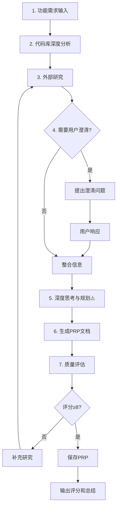

# PRP快速创建 (/prp)

## 📋 指令概述

**PRP快速创建**是专注于规划阶段的轻量级指令，通过深度研究和分析快速生成高质量的PRP（Plan-Research-Plan）文档。与完整工作流不同，该指令**仅完成研究和规划工作，不执行代码实现**，适合需要先制定详细计划、后续再执行的场景。

### 核心特性

- **研究驱动**: 深度代码库分析 + 外部最佳实践研究
- **专注规划**: 仅生成PRP文档，不执行实现
- **高质量标准**: 确保PRP评分 ≥8/10
- **可执行验证**: 验证门控必须可由AI自动执行

### 应用场景

- 需要先规划、后执行的复杂功能
- 需要团队审查和讨论的重要功能
- 需要明确实施路径的大型重构
- 作为多方案探索的规划基础

---

## 🎯 核心工作流（7步）

### 1. 功能需求理解

**目标**: 理解功能需求和上下文

```yaml
加载内容:
  - 读取功能需求文件或描述: $ARGUMENTS
  - 理解核心功能点和业务价值
  - 识别技术约束和集成要求
  - 提取关键成功标准

关键原则:
  - AI代理只能访问PRP中的上下文和训练数据
  - 必须将研究发现完整包含在PRP中
```

### 2. 代码库深度分析

**目标**: 识别现有模式和可复用经验

```yaml
分析维度:

  相似功能搜索:
    - 搜索代码库中类似功能或模式
    - 识别可借鉴的实现方式
    - 记录成功的技术方案

  文件引用识别:
    - 确定需要在PRP中引用的关键文件
    - 提取相关代码片段作为示例
    - 记录文件路径:行号

  约定规范提取:
    - 识别编码约定和命名规范
    - 记录项目特定的技术标准
    - 注意代码风格和架构模式

  测试模式分析:
    - 检查现有测试模式和框架
    - 确定验证方法和测试策略
    - 识别需要的测试工具
```

### 3. 外部研究与知识整合

**目标**: 获取行业最佳实践和解决方案

```yaml
研究来源:

  官方文档:
    - 查找相关库的官方文档
    - 记录具体URL和章节
    - 提取关键API和使用方法

  实现示例:
    - GitHub参考实现
    - StackOverflow解决方案
    - 技术博客实践经验

  最佳实践:
    - 行业公认的实现模式
    - 常见设计模式应用
    - 性能和安全考虑

  技术陷阱:
    - 识别库的特殊性和限制
    - 版本兼容性问题
    - 已知的技术陷阱和规避方法

重要提醒:
  - AI代理具有Web搜索能力
  - 在PRP中传递URL到文档和示例非常重要
```

### 4. 用户澄清（如需要）

**目标**: 明确模糊需求和技术细节

```yaml
澄清问题示例:

  特定模式:
    - 需要镜像哪些特定模式？
    - 这些模式在哪里可以找到？
    - 如何适配到当前功能？

  集成要求:
    - 需要与哪些系统集成？
    - 集成点的具体要求？
    - 相关文档在哪里？

  技术约束:
    - 性能要求（QPS、延迟）
    - 兼容性限制（版本、平台）
    - 安全考虑（认证、授权）
```

### 5. 深度思考与方法规划 ⚠️

**关键步骤**: 在研究完成后、开始编写PRP之前

```yaml
深度思考内容:

  整体架构:
    - 思考整体实现架构和技术选型
    - 识别关键技术挑战和风险点
    - 规划解决方案和技术路线

  实施路径:
    - 确定实施的最佳路径
    - 识别依赖关系和执行顺序
    - 规划分阶段交付策略

  质量保证:
    - 思考如何确保质量
    - 规划测试和验证策略
    - 定义成功标准和验收条件

目的:
  - 确保生成的PRP是经过深思熟虑的
  - 而不是机械地填充模板
```

### 6. PRP文档生成

**目标**: 基于 `PRPs/templates/prp_base.md` 模板生成完整PRP

#### 关键上下文包含

```yaml
文档引用:
  - 提供完整URL
  - 标注具体章节或页面
  - 说明相关性和用途

代码示例:
  - 从代码库提取真实片段
  - 标注文件路径:行号
  - 说明参考目的和适配要点

技术陷阱:
  - 记录库的特殊性和限制
  - 注意版本兼容性问题
  - 提供规避方法和解决方案

实现模式:
  - 描述需要遵循的现有方法
  - 提供参考实现和文件位置
  - 说明选择原因和优势
```

#### 实现蓝图结构

```yaml
蓝图内容:

  伪代码设计:
    - 从高层伪代码开始
    - 展示整体实现方法和逻辑流程
    - 标注关键决策点

  文件结构:
    - 需要创建/修改的文件列表
    - 参考真实文件中的模式
    - 说明文件职责和依赖关系

  错误处理:
    - 包含完整的错误处理策略
    - 定义异常情况和边界条件
    - 提供恢复机制和降级方案

  任务清单:
    - 按完成顺序列出任务
    - 任务粒度适中（2-4小时）
    - 依赖关系明确
```

#### 验证门控定义 ⚠️

**关键要求**: 必须可由AI自动执行

```bash
# Python项目示例
# 1. 语法和类型检查
ruff check --fix && mypy .

# 2. 单元测试
uv run pytest tests/ -v --cov

# 3. 集成测试
uv run pytest tests/integration/ -v
```

**验证门控原则**:

- 所有命令必须可在CI/CD环境自动执行
- 不依赖人工干预或手动步骤
- 失败时提供清晰的错误信息
- 覆盖语法、类型、单元测试、集成测试等多层面

### 7. 质量评估与保存

**目标**: 输出高质量PRP文档

```yaml
保存位置:
  - 路径: PRPs/{feature-name}.md
  - 格式: Markdown
  - 编码: UTF-8

质量检查清单:
  □ 包含所有必要上下文
  □ 验证门控可由AI执行
  □ 参考现有模式
  □ 实现路径清晰
  □ 错误处理已记录
  □ 技术陷阱已识别
  □ 任务分解合理

评分标准:
  - 评分范围: 1-10分
  - 评分依据: 使用Claude Code一次性实现成功的信心等级
  - 目标评分: ≥8/10
  - 低分处理: 补充研究并重新生成
```

---

## 🔧 使用方法

### 方式1: 附带参数（推荐）

```bash
/prp <功能需求描述或功能文件路径>
```

**示例**:

```bash
# 描述型
/prp 实现用户认证API，支持邮箱密码和OAuth2.0

# 文件型
/prp PRPs/features/cache-refactoring.md

# 重构型
/prp 重构缓存模块，引入Redis作为新的缓存后端
```

### 方式2: 无参数

```bash
/prp
```

系统会提示输入功能需求。

---

## 📊 执行流程图



---

## 🎨 PRP文档模板

基于 `PRPs/templates/prp_base.md` 生成，包含以下结构：

```markdown
---
name: 功能名称
description: 功能简要描述
version: 1.0.0
created: 2025-10-24
---

# 功能名称

## 📋 功能概述
- 目标和业务价值
- 应用场景
- 核心功能点

## 🔍 上下文与参考

### 文档引用

- [标题](URL) - 相关章节说明

### 代码示例

```python
# 文件: path/to/file.py:123
# 参考代码示例
```

### 技术陷阱

- 陷阱描述和规避方法

### 实现模式

- 需要遵循的模式和原因

## 🎯 实现蓝图

### 伪代码设计

```python
# 高层实现逻辑
```

### 文件结构

- 需要创建/修改的文件

### 错误处理策略

- 异常情况和处理方式

### 任务清单

- [ ] 任务1
- [ ] 任务2

## ✅ 验证门控

```bash
# 验证命令
```

## 📈 质量标准

- 完成标准
- 性能要求
```

---

## 📈 质量评分体系

```yaml
评分维度:

  上下文完整性 (30%):
    - 代码库引用充分
    - 外部资源丰富
    - 技术陷阱清晰

  实现路径清晰度 (30%):
    - 蓝图逻辑清晰
    - 任务分解合理
    - 依赖关系明确

  验证可执行性 (20%):
    - 验证命令准确
    - 可自动执行
    - 覆盖全面

  错误处理完整性 (20%):
    - 异常情况考虑周全
    - 处理策略明确
    - 恢复机制可行

评分标准:
  8-9分: 良好，可以开始实现
  9-10分: 优秀，实现成功率极高
  <8分: 需要补充研究并重新生成
```

---

## 🎯 成功标准

### PRP质量标准

```yaml
必达标准:
  ✅ 评分 ≥8/10
  ✅ 所有必需章节完整
  ✅ 上下文引用准确完整
  ✅ 验证门控明确且可执行
  ✅ 实现蓝图清晰可行

优秀标准:
  ✅ 评分 ≥9/10
  ✅ 包含多个参考实现
  ✅ 技术陷阱识别全面
  ✅ 错误处理策略完善
  ✅ 任务分解合理细致
```

### 可用性标准

```yaml
可用性要求:
  ✅ AI可基于PRP独立实现功能
  ✅ 验证门控可自动执行
  ✅ 实现路径无歧义
  ✅ 技术决策有充分依据
  ✅ 可作为团队讨论基础
```

---

## 📝 示例场景

### 场景1: API功能规划

**输入**:

```bash
/prp 实现RESTful API用于订单管理，支持创建、查询、更新和取消订单
```

**执行过程**:

1. **代码库分析**: 搜索现有API实现模式（如用户管理API）
2. **外部研究**: FastAPI最佳实践、订单管理业务逻辑
3. **PRP生成**: API端点设计、数据模型、验证规则
4. **质量评估**: 评分9/10

**输出**: `PRPs/order-management-api.md`

### 场景2: 系统重构规划

**输入**:

```bash
/prp 重构日志系统，统一使用结构化日志，替换现有print语句
```

**执行过程**:

1. **代码库分析**: 扫描所有print语句位置
2. **外部研究**: Python结构化日志最佳实践（structlog、loguru）
3. **用户澄清**: 日志级别标准、存储位置、性能要求
4. **PRP生成**: 分步重构计划、迁移脚本、测试策略
5. **质量评估**: 评分8/10

**输出**: `PRPs/logging-refactoring.md`

### 场景3: 第三方集成规划

**输入**:

```bash
/prp 集成Stripe支付网关，支持创建支付意图、处理Webhook回调
```

**执行过程**:

1. **代码库分析**: 检查现有支付相关代码
2. **外部研究**: Stripe官方文档、Python SDK、Webhook安全
3. **用户澄清**: 支付流程、货币类型、回调URL配置
4. **PRP生成**: Stripe集成、Webhook处理、错误恢复
5. **质量评估**: 评分9/10

**输出**: `PRPs/stripe-integration.md`

---

## 🔗 相关资源

### 内部资源

- **PRP模板**: `PRPs/templates/prp_base.md`
- **示例PRP**: `PRPs/EXAMPLE_multi_agent_prp.md`
- **项目规范**: `CLAUDE.md`

### 相关命令

- `/E` - PRP生成与执行（完整工作流）
- `/Q` - 项目上下文感知（研究辅助）
- `/R` - 并行任务执行（基于PRP）

### 工作流集成

```yaml
典型工作流:
  方案A - 规范流程:
    1. /prp - 生成PRP
    2. 团队审查PRP
    3. 修改和完善PRP
    4. /E - 执行PRP实现
    5. 验证和交付

  方案B - 探索流程:
    1. /prp - 生成PRP
    2. /R - 并行探索多种实现
    3. 选择最佳实现
    4. 合并和优化
```

---

## ⚠️ 注意事项

### 适用场景

```yaml
✅ 适合:
  - 需要详细规划的复杂功能
  - 需要团队审查的重要功能
  - 需要多方案对比的功能
  - 作为知识库的规划文档

❌ 不适合:
  - 简单功能（直接实现更快）
  - 紧急修复（跳过规划阶段）
  - 已有清晰实现路径
```

### 最佳实践

```yaml
规划前:
  - 明确功能需求和边界
  - 准备相关参考资料
  - 了解现有代码库结构

规划中:
  - 充分研究代码库和外部资源
  - 必要时与用户澄清需求
  - 深度思考实现路径
  - 不要机械填充模板

规划后:
  - 审查PRP质量和完整性
  - 与团队讨论和完善
  - 作为实现的唯一指南
```

### 关键原则

```yaml
核心原则:
  - 研究充分优于快速生成
  - 评分不达标必须重新规划
  - 验证门控必须可自动执行
  - PRP是后续实现的唯一依据

常见陷阱:
  - 研究深度不足导致低评分
  - 验证门控定义模糊
  - 缺少关键上下文引用
  - 实现蓝图不够清晰
  - 机械填充模板而非深度思考
```

---

## 🔄 版本历史

- **v3.0.0** (2025-10-24): 优化文档结构，重命名为 `/prp`
- **v2.1.0** (2025-10-22): 增强研究深度和质量评分体系
- **v2.0.0** (2025-09-30): 初始版本

---

**配置版本**: v3.0.0
**更新时间**: 2025-10-24
**维护原则**: 研究驱动、质量优先、可执行性、标准化
