# README文档统一更新

## 📋 指令概述

**README文档统一更新**是一个全自动化的项目文档生成工具，整合了根目录README.md和项目概览OVERVIEW.md的功能，通过深度分析项目结构、智能提取项目信息、集成数据可视化，生成完整的项目文档体系。

### 核心特性
- **双层文档生成**: 同时生成README.md（入门文档）和OVERVIEW.md（技术文档）
- **前置比对检查**: 类似github-pull的智能变更检测和引用同步
- **深度分析**: 增强的ProjectAnalyzer进行全方位项目洞察
- **智能生成**: 95%以上自动化信息提取和内容生成
- **数据可视化**: 集成chart-mcp生成专业图表
- **子目录README**: 自动生成和更新子目录的README文档
- **验证机制**: 确保更新的准确性和一致性

### 应用场景
- 项目初始化时生成完整文档
- 架构重构后更新技术文档
- 新增智能体/命令后同步文档
- 目录结构调整后批量更新
- 定期维护项目文档

## 🎯 核心功能(五步流程)

### 0. 前置比对检查：目录结构变更与引用同步

**目标**: 检测目录结构变更并自动同步文档引用（继承自github-pull机制）

#### 0.1 检测目录结构变更

**优先级策略**:
1. 优先使用 `.claude/logs/changes.log` (实时变更日志)
2. 如果日志不存在或为空,回退到 git diff 检测

```bash
# 方法1: 从 changes.log 读取最近变更(推荐)
if [ -f .claude/logs/changes.log ]; then
  echo "=== 基于 changes.log 的变更检测 ==="
  # 获取今天的所有变更
  grep "$(date '+%Y-%m-%d')" .claude/logs/changes.log || \
  # 如果今天没有变更,获取最近50条
  tail -50 .claude/logs/changes.log
else
  echo "⚠️ changes.log 不存在,回退到 git diff 检测"

  # 方法2: git diff 检测(回退方案)
  # 检测文件移动和重命名
  git diff --name-status HEAD --diff-filter=R

  # 检测新增和删除的文件
  git diff --name-status HEAD --diff-filter=AD

  # 检测暂存区中的重命名
  git diff --cached --name-status --diff-filter=R
fi
```

**检测内容**:

- 文件/目录重命名 (R = Renamed)
- 文件/目录移动（路径变化）
- 目录新增/删除 (A/D)
- 智能体文件位置调整
- Commands命令文件迁移
- 子目录结构变化

#### 0.2 扫描文档引用

**扫描范围**:

```yaml
目标文档:
  根目录文档:
    - README.md
    - OVERVIEW.md
    - CLAUDE.md

  子目录README:
    - .claude/agents/README.md (如存在)
    - .claude/commands/README.md (如存在)
    - .claude/skills/README.md (如存在)
    - trees/README.md
    - PRPs/README.md (如存在)
    - reports/README.md (如存在)

  配置文档:
    - .claude/CLAUDE.md
    - ~/.claude/CLAUDE.md (全局级)

引用类型识别:
  相对路径: .claude/agents/system/F1-*.md
  绝对路径: /Users/.../ZTL/.claude/agents/
  Markdown链接: [文本](.claude/agents/...)
  文件引用: @.claude/commands/G.md
  代码块路径: `.claude/agents/system/F1-*.md`
```

#### 0.3 自动同步引用路径

**同步策略**:

```yaml
检测到变更:
  步骤1 - 构建映射表:
    - 旧路径 → 新路径
    - 记录所有重命名/移动的文件

  步骤2 - 扫描引用:
    - 在所有README文档中搜索旧路径
    - 识别引用类型和位置
    - 记录需要更新的文件

  步骤3 - 批量更新:
    - 使用Edit工具替换旧路径为新路径
    - 保持引用格式不变（相对/绝对路径）
    - 更新Markdown链接文本（如需要）

  步骤4 - 生成报告:
    - 列出所有更新的文件
    - 统计引用更新数量
    - 记录到execution log
```

**比对验证**:

```yaml
验证机制:
  变更前快照:
    - 记录当前所有README文档状态
    - 提取关键引用路径列表
    - 建立验证基准

  变更后验证:
    - 对比新旧文档结构
    - 验证引用路径的准确性
    - 检查无损链接失效
    - 确认内容完整性

  一致性检查:
    - README.md与OVERVIEW.md信息一致
    - 子目录README与主README呼应
    - 引用路径与实际文件匹配
    - 版本号与配置同步
```

#### 0.4 前置检查报告

```
━━━━━━━━━━━━━━━━━━━━━━━━━━━━━━━━━
📋 目录结构变更检测报告
━━━━━━━━━━━━━━━━━━━━━━━━━━━━━━━━━

🔍 检测到的变更:
  [R] .claude/agents/system/test-engineer.md
   → .claude/agents/system/F12-测试工程师.md

  [A] .claude/commands/readme.md (新增)

━━━━━━━━━━━━━━━━━━━━━━━━━━━━━━━━━
🔗 引用路径扫描结果
━━━━━━━━━━━━━━━━━━━━━━━━━━━━━━━━━

需要更新的文档:
  📄 README.md
     - 第125行: test-engineer → F12-测试工程师

  📄 OVERVIEW.md
     - 第89行: test-engineer → F12-测试工程师
     - 第203行: test-engineer → F12-测试工程师

  📄 .claude/agents/README.md
     - 第47行: test-engineer → F12-测试工程师

━━━━━━━━━━━━━━━━━━━━━━━━━━━━━━━━━
✅ 自动同步完成
━━━━━━━━━━━━━━━━━━━━━━━━━━━━━━━━━

更新统计:
  ✅ 更新文件: 3个
  ✅ 更新引用: 4处
  ⏱️ 耗时: 0.5秒

继续执行README文档生成...
```

### 1. 前置树快照更新

**目标**: 更新trees/目录快照，确保目录结构信息最新

```python
class TreeSnapshotManager:
    """Trees目录快照管理器"""

    def update_before_readme(self):
        """README生成前更新快照"""
        # 1. 生成3种格式快照
        self._generate_dirs_list()        # dirs_*.txt
        self._generate_full_tree()        # tree_full_*.txt
        self._generate_structured_doc()   # tree_structure_*.md

        # 2. 更新trees/README.md统计
        self._update_trees_readme()

        # 3. 清理旧快照(保留最新10个)
        self._cleanup_old_snapshots(keep=10)
```

### 2. 深度项目分析

**目标**: 全面分析项目结构、技术栈、智能体系统

```python
class ProjectAnalyzer:
    """项目智能分析器（增强版）"""

    def analyze_comprehensively(self) -> ProjectProfile:
        """全面分析项目"""
        return {
            "basic_info": self._extract_basic_info(),
            "tech_stack": self._detect_tech_stack(),
            "architecture": self._analyze_architecture(),
            "features": self._extract_features(),
            "agents_system": self._analyze_agents(),
            "commands_system": self._analyze_commands(),
            "statistics": self._calculate_statistics(),
            "directory_structure": self._scan_directory_tree()
        }
```

### 3. 双层文档生成

**目标**: 生成README.md和OVERVIEW.md

#### 3.1 生成README.md（入门文档）

**目标受众**: 新用户、访客

**内容结构**:
```markdown
# [项目名称]

[徽章系统]

## 📖 项目简介
[一句话描述 + 核心价值主张]

## ✨ 核心特性
[3-5个亮点特性]

## 🏗️ 技术架构

### 技术栈
[技术栈表格 + 可视化图表]

### 架构模式
[架构图 + 说明]

## 📁 项目结构
[基于trees/最新快照的目录树]

## 🚀 快速开始

### 环境要求
### 安装步骤
### 使用指南

## 🤖 智能体系统
[智能体组织概览]

## 📜 命令系统
[命令分类概览]

## 📊 项目统计
[数据可视化图表]

## 🛣️ 开发路线图
[如果存在TODO或ROADMAP]

## 📦 版本历史
[版本记录]

## 📄 许可证
[许可证信息]

---
**⭐ 如果这个项目对您有帮助，请给我们一个Star！**
```

#### 3.2 生成OVERVIEW.md（技术文档）

**目标受众**: 开发者、维护者

**内容结构**:
```markdown
# [项目名称] - 技术概览

> 深度技术文档

## 📋 项目概要
- 项目类型、定位、版本
- 核心能力和价值主张

## 🏗️ 架构设计

### 整体架构
- 架构模式（多智能体架构）
- 架构层次图（Mermaid）

### 目录结构
- 基于trees/最新快照
- 关键目录说明

## 🤖 智能体系统

### 组织架构
- System智能体
- 各业务组智能体

### 智能体清单
| 组别 | 智能体 | 职责 | 工具 |
|------|--------|------|------|

### 协作机制
- 智能体调用关系
- Task工具使用规范

## 📜 命令系统

### 命令清单
| 命令 | 名称 | 功能 | 版本 |

### 命令分类
- 开发流程类
- 学习优化类
- 文档管理类
- 自动化类

### 使用示例
每个命令的典型使用场景

## 🛠️ 技术栈

### 核心技术
- Claude Code + AI Agent架构
- Model Context Protocol (MCP)

### MCP服务器
[8个MCP服务器的详细说明]

## 💻 开发指南

### 环境要求
### 项目结构说明
### 开发流程
### 最佳实践

## 📊 项目统计

### 代码规模
### 系统规模

## 🔗 相关资源
```

### 4. 子目录README生成

**目标**: 为关键子目录生成README文档

```yaml
目标子目录:
  .claude/agents/:
    - 生成agents组织结构说明
    - 列出所有业务组智能体
    - 提供快速查找指南

  .claude/commands/:
    - 生成命令分类索引
    - 列出所有命令及功能
    - 提供使用示例

  trees/:
    - 说明trees目录用途
    - 记录快照统计信息
    - 提供使用指南

  PRPs/:
    - 说明PRP工作流程
    - 列出已完成/进行中的PRP
    - 提供模板和规范

  reports/:
    - 说明报告类型和用途
    - 提供报告检索指南
```

### 5. 验证与输出

**目标**: 验证文档准确性并生成报告

```yaml
验证检查:
  内容一致性:
    - README.md与OVERVIEW.md版本号一致
    - 智能体数量统计准确
    - 命令数量统计准确
    - 技术栈信息一致

  引用准确性:
    - 所有文件路径引用有效
    - Markdown链接无失效
    - 相对路径正确

  格式规范:
    - Markdown语法正确
    - 表格格式完整
    - 代码块闭合

  数据准确:
    - 统计数据正确
    - 图表数据匹配
    - 时间戳准确
```

## 🔧 使用方法

### 标准调用

```bash
/readme
```

**执行流程**:
1. 🔍 前置比对检查（变更检测+引用同步）
2. 🌲 更新trees目录快照（3个文件）
3. 🔍 深度分析项目（8个维度）
4. 📊 生成数据可视化（5种图表）
5. 📝 生成README.md（完整结构）
6. 📝 生成OVERVIEW.md（技术深度）
7. 📝 生成子目录README（如适用）
8. ✅ 验证文档准确性
9. 💾 备份旧文档（如果存在）

## 📊 执行流程

```mermaid
graph TD
    A[启动/readme指令] --> B[阶段0: 前置比对检查]
    B --> B1[检测目录结构变更]
    B1 --> B2{发现路径变更?}
    B2 -->|是| B3[扫描文档引用]
    B2 -->|否| C
    B3 --> B4[自动更新引用路径]
    B4 --> B5[生成变更报告]
    B5 --> B6[验证更新准确性]
    B6 --> C

    C[阶段1: 前置更新] --> C1[更新trees/快照]
    C1 --> C2[生成3种格式文件]
    C2 --> C3[更新统计信息]

    C3 --> D[阶段2: 深度分析]
    D --> D1[提取基本信息]
    D1 --> D2[检测技术栈]
    D2 --> D3[分析架构模式]
    D3 --> D4[分析智能体系统]
    D4 --> D5[分析命令系统]
    D5 --> D6[扫描目录结构]
    D6 --> D7[计算项目统计]

    D7 --> E[阶段3: 内容生成]
    E --> E1[生成README.md内容]
    E1 --> E2[生成OVERVIEW.md内容]
    E2 --> E3[生成子目录README]

    E3 --> F[阶段4: 数据可视化]
    F --> F1[技术栈分布图]
    F1 --> F2[语言分布图]
    F2 --> F3[智能体分布图]
    F3 --> F4[命令分布图]

    F4 --> G[阶段5: 验证与输出]
    G --> G1[验证内容一致性]
    G1 --> G2[验证引用准确性]
    G2 --> G3[验证格式规范]
    G3 --> G4[备份现有文档]
    G4 --> G5[写入新文档]
    G5 --> G6[生成更新报告]
    G6 --> H[完成]
```



## 🎨 实现细节

### 比对验证机制

```python
class DocumentValidator:
    """文档验证器（继承自github-pull机制）"""

    def __init__(self):
        self.old_state = {}
        self.new_state = {}

    def create_snapshot(self, docs: List[Path]) -> Dict:
        """创建文档快照"""
        snapshot = {}
        for doc in docs:
            if doc.exists():
                content = doc.read_text(encoding='utf-8')
                snapshot[str(doc)] = {
                    "content": content,
                    "references": self._extract_references(content),
                    "hash": hashlib.md5(content.encode()).hexdigest()
                }
        return snapshot

    def _extract_references(self, content: str) -> List[str]:
        """提取文档中的路径引用"""
        references = []

        # Markdown链接: [text](path)
        md_links = re.findall(r'\[([^\]]+)\]\(([^\)]+)\)', content)
        references.extend([link[1] for link in md_links])

        # 代码块路径: `.claude/agents/...`
        code_paths = re.findall(r'`([^\`]*\.claude[^\`]*)`', content)
        references.extend(code_paths)

        # 相对路径引用
        rel_paths = re.findall(r'\.claude/[a-zA-Z0-9/_\-\.]+', content)
        references.extend(rel_paths)

        return list(set(references))

    def validate_update(
        self,
        old_docs: List[Path],
        new_docs: List[Path]
    ) -> Dict[str, bool]:
        """验证文档更新"""
        validation_result = {
            "references_valid": True,
            "content_consistent": True,
            "format_correct": True,
            "errors": []
        }

        # 验证引用有效性
        for doc in new_docs:
            if not doc.exists():
                continue

            content = doc.read_text(encoding='utf-8')
            references = self._extract_references(content)

            for ref in references:
                if not self._validate_reference(ref):
                    validation_result["references_valid"] = False
                    validation_result["errors"].append(
                        f"无效引用: {ref} (在 {doc})"
                    )

        # 验证内容一致性（README vs OVERVIEW）
        readme_content = self._get_content("README.md")
        overview_content = self._get_content("OVERVIEW.md")

        if readme_content and overview_content:
            # 验证版本号一致
            readme_version = self._extract_version(readme_content)
            overview_version = self._extract_version(overview_content)

            if readme_version != overview_version:
                validation_result["content_consistent"] = False
                validation_result["errors"].append(
                    f"版本号不一致: README({readme_version}) vs OVERVIEW({overview_version})"
                )

        return validation_result

    def _validate_reference(self, ref: str) -> bool:
        """验证引用是否有效"""
        # 跳过外部链接
        if ref.startswith('http://') or ref.startswith('https://'):
            return True

        # 验证本地文件引用
        ref_path = Path(ref)
        if ref_path.is_absolute():
            return ref_path.exists()
        else:
            # 相对路径
            return (Path.cwd() / ref_path).exists()
```

### README生成器（双层文档）

```python
class UnifiedREADMEGenerator:
    """统一README生成器"""

    def __init__(
        self,
        project_profile: Dict,
        tech_stack: Dict,
        charts: Dict
    ):
        self.profile = project_profile
        self.tech_stack = tech_stack
        self.charts = charts

    def generate_readme(self) -> str:
        """生成README.md（入门文档）"""
        sections = []

        sections.append(self._generate_header())
        sections.append(self._generate_badges())
        sections.append("")
        sections.append(self._generate_introduction())
        sections.append("")
        sections.append(self._generate_features())
        sections.append("")
        sections.append(self._generate_tech_architecture())
        sections.append("")
        sections.append(self._generate_project_structure())
        sections.append("")
        sections.append(self._generate_quick_start())
        sections.append("")

        # 智能体系统（概览）
        if self.profile.get("agents_system"):
            sections.append(self._generate_agents_overview())
            sections.append("")

        # 命令系统（概览）
        if self.profile.get("commands_system"):
            sections.append(self._generate_commands_overview())
            sections.append("")

        sections.append(self._generate_statistics())
        sections.append("")
        sections.append(self._generate_footer())

        return "\n".join(sections)

    def generate_overview(self) -> str:
        """生成OVERVIEW.md（技术文档）"""
        sections = []

        sections.append(self._generate_header() + " - 技术概览")
        sections.append("")
        sections.append("> 深度技术文档")
        sections.append("")
        sections.append(self._generate_project_summary())
        sections.append("")
        sections.append(self._generate_architecture_design())
        sections.append("")

        # 智能体系统（详细）
        if self.profile.get("agents_system"):
            sections.append(self._generate_agents_detailed())
            sections.append("")

        # 命令系统（详细）
        if self.profile.get("commands_system"):
            sections.append(self._generate_commands_detailed())
            sections.append("")

        sections.append(self._generate_tech_stack_detailed())
        sections.append("")
        sections.append(self._generate_dev_guide())
        sections.append("")
        sections.append(self._generate_project_stats())
        sections.append("")
        sections.append(self._generate_resources())

        return "\n".join(sections)

    def _generate_agents_overview(self) -> str:
        """生成智能体概览（用于README）"""
        agents = self.profile["agents_system"]
        overview = []

        overview.append("## 🤖 智能体系统")
        overview.append("")
        overview.append("本项目采用多智能体协作架构，共有**{}个专业智能体**分布在**{}个业务组**。".format(
            agents.get("total_count", 0),
            agents.get("group_count", 0)
        ))
        overview.append("")

        # 按业务组概览
        overview.append("### 业务组概览")
        overview.append("")
        overview.append("| 业务组 | 智能体数量 | 核心职能 |")
        overview.append("|--------|-----------|----------|")

        for group_name, group_agents in agents.get("by_group", {}).items():
            count = len(group_agents)
            # 提取第一个智能体的描述作为核心职能
            core_function = group_agents[0]["description"][:30] if group_agents else "职能描述"
            overview.append(f"| {group_name} | {count}个 | {core_function}... |")

        overview.append("")
        overview.append("详细信息请参阅 [OVERVIEW.md](OVERVIEW.md#智能体系统)")

        return "\n".join(overview)

    def _generate_agents_detailed(self) -> str:
        """生成智能体详细说明（用于OVERVIEW）"""
        agents = self.profile["agents_system"]
        detailed = []

        detailed.append("## 🤖 智能体系统")
        detailed.append("")

        # 组织架构
        detailed.append("### 组织架构")
        detailed.append("")
        detailed.append("本项目采用多智能体协作架构，共有**{}个专业智能体**。".format(
            agents.get("total_count", 0)
        ))
        detailed.append("")

        # 各业务组详细列表
        for group_name, group_agents in agents.get("by_group", {}).items():
            detailed.append(f"### {group_name}")
            detailed.append("")
            detailed.append("| 快捷键 | 智能体名称 | 功能定位 |")
            detailed.append("|--------|-----------|----------|")

            for agent in group_agents:
                detailed.append(
                    f"| {agent['shortcut']} | {agent['name']} | {agent['description']} |"
                )

            detailed.append("")

        # 协作机制
        detailed.append("### 协作机制")
        detailed.append("")
        detailed.append("- **Task工具**: 调用子智能体执行专业任务")
        detailed.append("- **组长智能体**: 负责任务分解和调度")
        detailed.append("- **专业智能体**: 执行具体的业务任务")
        detailed.append("")

        return "\n".join(detailed)
```

## 🎯 成功标准

```yaml
前置比对成功:
  ✅ 目录结构变更检测准确
  ✅ 文档引用扫描完整
  ✅ 引用路径自动同步成功
  ✅ 验证机制确认无误

文档生成成功:
  ✅ trees/目录快照已更新（3个文件）
  ✅ 项目分析完成（8个维度）
  ✅ README.md生成成功
  ✅ OVERVIEW.md生成成功
  ✅ 子目录README生成成功（如适用）
  ✅ 数据图表嵌入成功（5种）

验证通过:
  ✅ 内容一致性验证通过
  ✅ 引用准确性验证通过
  ✅ 格式规范性验证通过
  ✅ 数据准确性验证通过

质量标准:
  ✅ 信息准确率 > 95%
  ✅ 目录树与实际一致
  ✅ 技术栈检测准确
  ✅ 图表数据正确
  ✅ Markdown格式规范
  ✅ 所有链接有效
  ✅ 旧文件已备份
```

## 🔗 相关资源

### 合并的原命令
- **原`/I`命令**: 根目录README更新（已整合）
- **原`/O`命令**: 项目概览文档生成（已整合）

### 相关指令
- `/CLAUDE` - 统一CLAUDE.md更新
- `/github-pull` - GitHub同步推送（包含比对机制）
- `/trees` - 并行工作空间管理

### 依赖工具
- **chart-mcp**: 数据可视化生成
- **shields.io**: 徽章生成服务
- **trees/**: 目录结构快照源

### 文件路径
```yaml
主要文件:
  根目录:
    - README.md (入门文档)
    - OVERVIEW.md (技术文档)

  子目录:
    - .claude/agents/README.md (智能体说明)
    - .claude/commands/README.md (命令说明)
    - trees/README.md (快照说明)
    - PRPs/README.md (PRP说明)

  快照来源:
    - trees/ (目录结构快照)
    - CLAUDE.md (项目信息)
    - .claude/agents/ (智能体信息)
    - .claude/commands/ (命令信息)

  备份文件:
    - README.md.backup.{timestamp}
    - OVERVIEW.md.backup.{timestamp}
```

## ⚠️ 注意事项

### 执行前
- ✅ 确保在项目根目录执行
- ✅ 确保trees/目录可写
- ✅ 检查磁盘空间充足
- ✅ 确认git仓库状态（用于变更检测）

### 执行中
- 🔄 自动执行前置比对检查
- 🔄 自动更新trees/快照
- 🔄 自动分析项目结构
- 🔄 自动生成双层文档
- 🔄 自动验证文档准确性

### 执行后
- ✔️ 检查README.md和OVERVIEW.md内容准确性
- ✔️ 验证所有引用路径有效
- ✔️ 测试快速开始指南可用
- ✔️ 确认trees/快照已更新
- ✔️ 验证子目录README已生成
- ⚠️ 再次执行将覆盖手动修改

### 重要提醒
- 📌 每次执行自动更新trees/快照
- 📌 完全重写README.md和OVERVIEW.md
- 📌 手动修改会被覆盖
- 📌 自动备份保障安全
- 📌 基于最新快照和实际配置生成
- 📌 包含类似github-pull的比对验证机制

### 迁移说明
```yaml
向后兼容:
  - `/I`和`/O`命令文件暂时保留
  - 在命令文件顶部添加弃用警告
  - 引导用户使用新的`/readme`命令

迁移步骤:
  1. 保留原`/I`和`/O`命令1个月（过渡期）
  2. 在原命令中添加提示："建议使用 /readme 命令替代"
  3. 1个月后删除原命令文件
  4. 更新CLAUDE.md移除旧命令文档
```

---

**配置版本**: v1.0.0
**更新时间**: 2025-10-24
**核心升级**: 合并/I和/O命令为统一的/readme命令，整合前置比对检查机制
**维护原则**: 深度分析、智能生成、比对验证、数据驱动、规范化
**更新内容**:
- 整合README.md和OVERVIEW.md双层文档生成
- 引入类似github-pull的前置比对检查机制
- 新增子目录README自动生成功能
- 增强文档验证和一致性检查
- 优化执行流程和错误处理
