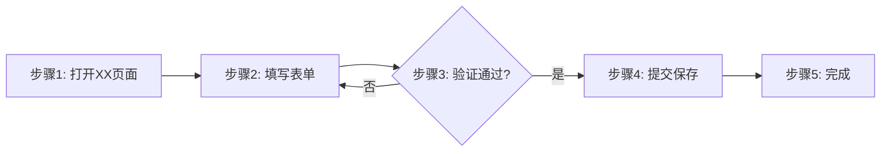
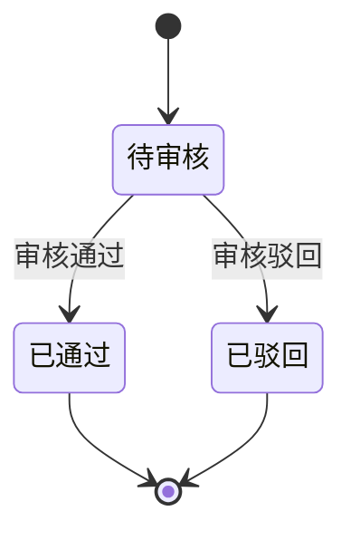
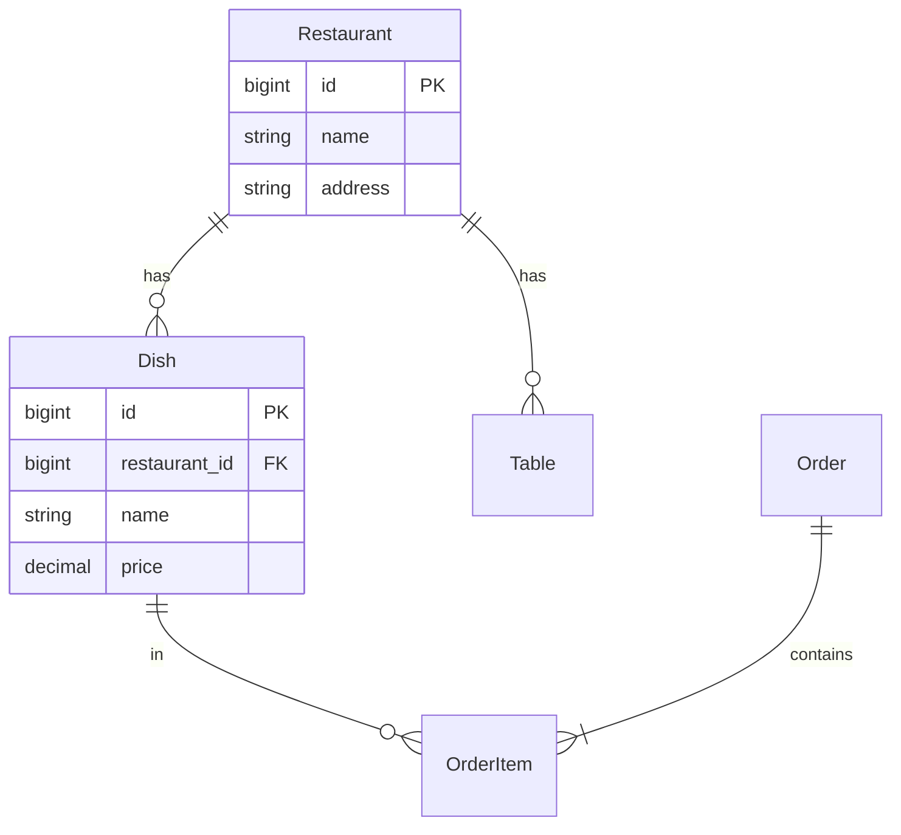

# 网站解构知识库型Skills创建工作流

---
name: website-deconstruction-knowledge-base-workflow
description: 标准化的网站解构知识库型Skills创建工作流：网站深度解构 → 结构化知识提取 → 知识库型Skills创建 → 智能体集成。通过系统化解构网站的9大核心类型（导航、表单、数据展示、交互、实体、流程、权限、API、技术细节），构建可被AI智能体使用的完整知识库
version: 1.0.0
created: 2025-10-23
---

## 📋 概述

本工作流提供一个**标准化、规范化、可复用**的四阶段流程，用于将复杂网站系统（如SaaS平台、管理后台）转化为可被AI智能体使用的结构化知识库。

### 核心框架：9大解构类型

本工作流采用**系统化的9大类型解构方法**，确保网站信息提取的完整性和结构化：

1. **🧭 导航系统**: 顶部导航、侧边栏、面包屑、快捷入口
2. **📝 表单系统**: 输入组件、字段定义、验证规则、提交逻辑
3. **📊 数据展示**: 表格、列表、卡片、图表及其数据结构
4. **🖱️ 交互元素**: 按钮、链接、Tab、弹窗、抽屉及其行为
5. **📦 数据实体**: 实体定义、关联关系、数据流向
6. **🔄 业务流程**: 典型场景、流程步骤、状态流转
7. **🔐 权限规则**: 功能权限、数据权限、操作限制
8. **🌐 API接口**: 接口定义、分页规范、文件接口
9. **🔧 技术细节**: 路由模式、CSS选择器、认证机制

### 核心价值

- ✅ **系统化方法**: 从数据采集到智能体集成的完整闭环
- ✅ **完整覆盖**: 9大类型体系确保信息提取无遗漏
- ✅ **可复用流程**: 标准化步骤可应用于任何复杂网站
- ✅ **质量保证**: 每个阶段都有明确的产出标准和验证方法
- ✅ **智能体友好**: 知识库设计遵循Claude Code框架最佳实践

### 适用场景

- 🎯 **企业SaaS平台**: 如美团管家、钉钉、企业微信等多模块管理系统
- 🎯 **电商后台**: 订单管理、商品管理、营销中心等复杂业务系统
- 🎯 **数据分析平台**: BI系统、报表中心、数据大屏等
- 🎯 **业务管理系统**: ERP、CRM、OA等企业管理软件

---

## 🚀 Quick Start

### 标准执行流程

```bash
# Phase 1: 网站情报采集
调用 E2-网站情报采集员 智能体
输入: 目标网站URL + 采集范围说明
输出: navigation-tree.json + knowledge-base-report.md

# Phase 2: 验证研究数据质量
检查 output/情报组/[task-id]/ 目录
确认: 导航结构完整 + 研究报告详尽

# Phase 3: 创建知识库型Skills
目录: .claude/skills/工作流/业务/[业务分类]/[模块名]/
文件: SKILL.md + knowledge/index.md + 复制研究数据

# Phase 4: 智能体集成
更新: .claude/agents/[组别]/[智能体].md
添加: "知识库资源" 章节引用新创建的Skills
```

### 成功案例参考

参考 **美团管家-运营中心** 的完整实施案例：
- 📁 Skills位置: `.claude/skills/工作流/业务/美团管家/运营中心/`
- 🤖 智能体集成: `.claude/agents/中台组/M1-美团管家运营管理员.md`
- 📊 研究数据: `output/情报组/meituan-operation-center-research-20251023/`

---

## 📚 四阶段详细流程

### Phase 1: 网站深度解构 🔍

**目标**: 系统化解构目标网站，提取9大核心类型的结构化信息，构建完整的可操作知识库

**执行智能体**: E2-网站情报采集员 (`.claude/agents/情报组/E2-网站情报采集员.md`)

---

#### 🎯 网站解构目标与类型体系

网站解构是一个系统化的信息提取过程，目标是将复杂的网站系统转化为结构化、可操作的知识库。解构内容包括以下**9大核心类型**：

##### 1. 导航系统 (Navigation System) 🧭

**解构目标**: 完整提取网站的导航架构，确保AI智能体能够准确定位任何功能入口

**解构内容**:
- **顶部导航**: 一级菜单、下拉菜单、Tab切换
- **侧边栏导航**: 多级菜单树、可折叠菜单、图标菜单
- **面包屑导航**: 路径追踪、层级关系
- **快捷入口**: 常用功能、收藏夹、最近使用
- **辅助导航**: 搜索框、帮助中心、用户菜单

**关键信息**:
- CSS选择器（如 `#menucode_119`、`.nav-item`）
- URL路由（如 `#/dish/list`、`/api/menu`）
- menucode或功能标识符
- 导航层级关系和父子关联

##### 2. 表单系统 (Form System) 📝

**解构目标**: 识别所有表单和输入组件，提取字段定义、验证规则和提交逻辑

**解构内容**:
- **输入组件**:
  - 文本框（text, textarea）：字段名、占位符、最大长度
  - 下拉框（select）：选项列表、默认值、联动关系
  - 单选/复选（radio, checkbox）：选项组、互斥规则
  - 日期选择器（datepicker）：格式要求、时间范围限制
  - 数字输入（number）：最小/最大值、步长、精度
  - 文件上传（file）：文件类型、大小限制、多文件支持
  - 富文本编辑器（editor）：工具栏配置、内容格式

- **表单属性**:
  - 字段名（name/id）
  - 字段标签（label）
  - 数据类型（string, number, date, boolean, file）
  - 必填/可选（required）
  - 默认值（default value）
  - 验证规则（validation rules）：正则表达式、范围限制、自定义验证
  - 提示信息（placeholder, helper text）
  - 错误提示（error messages）

- **表单行为**:
  - 提交接口（submit API）
  - 联动逻辑（如选择A后，B字段自动填充）
  - 动态字段（根据条件显示/隐藏）
  - 自动保存（draft saving）

##### 3. 数据展示 (Data Display) 📊

**解构目标**: 识别数据呈现方式，提取列定义、分页规则和数据结构

**解构内容**:
- **表格（Table）**:
  - 列定义：列名、数据类型、宽度、对齐方式
  - 排序规则：可排序列、默认排序
  - 筛选条件：筛选器类型、筛选选项
  - 分页参数：页大小、总记录数、页码
  - 行操作：编辑、删除、详情查看

- **列表（List）**:
  - 列表项结构：标题、描述、图标、标签
  - 无限滚动 vs 分页
  - 搜索/筛选逻辑

- **卡片（Card）**:
  - 卡片布局：栅格系统、响应式规则
  - 数据字段映射
  - 操作按钮

- **图表（Chart）**:
  - 图表类型（折线图、柱状图、饼图、散点图等）
  - 数据维度和指标
  - 交互功能（缩放、筛选、下钻）

##### 4. 交互元素 (Interactive Elements) 🎮

**解构目标**: 识别用户交互组件，提取触发条件和响应行为

**解构内容**:
- **按钮（Button）**:
  - 主要按钮（primary）：提交、保存、确认
  - 次要按钮（secondary）：取消、返回
  - 危险按钮（danger）：删除、清空
  - CSS选择器和文本标识

- **链接（Link）**:
  - 文本链接
  - 图标链接
  - 跳转目标（内部路由 vs 外部URL）

- **标签页（Tab）**:
  - Tab标识符
  - 切换逻辑
  - 默认激活Tab

- **弹窗（Modal/Dialog）**:
  - 弹窗类型（信息、确认、表单、详情）
  - 触发条件
  - 弹窗大小和布局

- **抽屉（Drawer）**:
  - 抽屉方向（左、右、上、下）
  - 内容类型

- **下拉菜单（Dropdown）**:
  - 菜单项列表
  - 操作回调

##### 5. 数据实体 (Data Entities) 🗄️

**解构目标**: 识别业务数据模型，提取实体定义和关联关系

**解构内容**:
- **实体定义**:
  - 实体名称（如 Restaurant, Dish, Order）
  - 主键字段（primary key）
  - 属性字段（attributes）：字段名、数据类型、约束条件
  - 枚举类型（enum）：状态、类别等

- **关联关系**:
  - 一对一（One-to-One）
  - 一对多（One-to-Many）
  - 多对多（Many-to-Many）
  - 外键关系（foreign keys）

- **数据流向**:
  - 数据来源（数据库、API、缓存）
  - 数据去向（存储位置、同步目标）

##### 6. 业务流程 (Business Process) 🔄

**解构目标**: 提取业务操作序列，识别流程步骤和决策点

**解构内容**:
- **典型业务场景**:
  - 场景名称（如"菜品上架流程"、"订单处理流程"）
  - 前置条件
  - 操作步骤序列
  - 后置结果

- **流程步骤**:
  - 步骤编号和名称
  - 操作页面和功能
  - 输入数据
  - 输出结果
  - 用户决策点（分支逻辑）

- **状态流转**:
  - 状态定义（如订单状态：待支付→已支付→配送中→已完成）
  - 状态转换条件
  - 状态转换操作

- **跨模块协作**:
  - 模块间调用关系
  - 数据传递方式

##### 7. 权限规则 (Permission Rules) 🔐

**解构目标**: 识别权限控制逻辑，提取角色定义和访问限制

**解构内容**:
- **功能权限**:
  - 角色定义（管理员、员工、普通用户等）
  - 角色权限矩阵（角色 × 功能）
  - 菜单可见性规则

- **数据权限**:
  - 数据范围限制（如只能查看本店数据）
  - 字段级权限（敏感字段隐藏）

- **操作限制**:
  - 按钮启用/禁用规则
  - 批量操作限制（如最多选择100条）
  - 时间限制（如只能在营业时间操作）

##### 8. API接口 (API Endpoints) 🔌

**解构目标**: 识别后端接口，提取请求参数和响应格式

**解构内容**:
- **接口定义**:
  - 接口路径（如 `/api/dish/list`）
  - 请求方法（GET, POST, PUT, DELETE）
  - 请求参数：路径参数、查询参数、请求体
  - 响应格式：成功响应、错误响应
  - 状态码定义

- **分页接口**:
  - 分页参数名（page, pageSize, offset, limit）
  - 响应数据结构（total, items, hasMore）

- **文件接口**:
  - 上传接口（multipart/form-data）
  - 下载接口

##### 9. 技术实现细节 (Technical Details) ⚙️

**解构目标**: 提取技术架构信息，支持自动化操作和调试

**解构内容**:
- **路由模式**:
  - Hash Router（如 `#/dish/list`）
  - Path Router（如 `/dish/list`）
  - 路由参数（动态路由、查询参数）

- **CSS选择器规范**:
  - ID选择器（如 `#menucode_119`）
  - Class选择器（如 `.btn-primary`）
  - 属性选择器（如 `[data-action="submit"]`）
  - 层级选择器

- **事件监听**:
  - 点击事件（click）
  - 输入事件（input, change）
  - 提交事件（submit）
  - 自定义事件

- **数据存储**:
  - LocalStorage
  - SessionStorage
  - Cookies
  - IndexedDB

- **认证机制**:
  - Token类型（JWT, Session）
  - Token存储位置
  - Token刷新逻辑

---

#### 📋 解构质量标准

为确保解构的完整性和准确性，每个类型都应满足以下标准：

| 类型 | 完整性指标 | 准确性要求 |
|-----|-----------|-----------|
| **导航系统** | 所有菜单层级100%覆盖 | CSS选择器可直接用于自动化 |
| **表单系统** | 所有输入字段已标注类型和验证规则 | 字段名与后端API一致 |
| **数据展示** | 表格/列表的列定义完整 | 数据结构与API响应匹配 |
| **交互元素** | 主要按钮和弹窗已识别 | 触发条件和响应行为清晰 |
| **数据实体** | 核心实体及关联关系已绘制 | 实体定义与业务模型一致 |
| **业务流程** | 典型场景的完整步骤序列 | 决策点和分支逻辑明确 |
| **权限规则** | 角色权限矩阵完整 | 权限控制逻辑可验证 |
| **API接口** | 核心接口的参数和响应已记录 | 接口路径和参数名准确 |
| **技术细节** | 路由模式、认证机制已识别 | 技术信息可用于调试 |

---

**输入要求**:
```yaml
必需信息:
  - 目标网站URL (如: https://pos.meituan.com/web/operation/main)
  - 采集范围说明 (如: "运营中心模块的所有子菜单和功能")
  - 登录凭证 (如需要)
  - 特殊要求 (如: "重点关注财务管理和报表功能")

可选信息:
  - 已知的关键功能点
  - 业务流程描述
  - 特定数据结构
```

**执行步骤**:
1. **启动E2智能体**: 使用Task工具调用
   ```
   Task(subagent_type="E2-网站情报采集员",
        prompt="全面采集[网站名称]-[模块名称]的导航结构和功能详情...")
   ```

2. **E2自动执行**:
   - 使用Chrome MCP进行网页导航
   - 提取顶部导航、侧边栏菜单、面包屑等导航元素
   - 识别CSS选择器、URL路由、menucode等技术细节
   - 分析表单字段、数据实体、业务流程
   - 截图关键界面（可选）

3. **质量验证**:
   - ✅ 导航树完整性：所有一级、二级、三级菜单都已采集
   - ✅ 技术信息准确性：CSS选择器、路由URL可直接用于自动化
   - ✅ 业务描述详尽性：每个功能模块都有清晰的业务说明

**产出标准**:

**文件1: navigation-tree.json** (导航结构数据)
```json
{
  "metadata": {
    "task_id": "系统生成的任务ID",
    "platform": "平台名称",
    "module": "模块名称",
    "base_url": "基础URL",
    "routing_mode": "hash | path",
    "collected_at": "采集时间戳",
    "collector": "E2-网站情报采集员"
  },
  "top_navigation": [...],
  "side_navigation": {
    "section": "导航区域名称",
    "total_menus": 数量,
    "menus": [
      {
        "id": "menucode或唯一标识",
        "name": "菜单名称",
        "level": 层级,
        "type": "page | submenu",
        "url": "路由URL",
        "selector": "CSS选择器",
        "children": [...],
        "description": "功能描述"
      }
    ]
  },
  "statistics": {
    "total_level1_menus": 一级菜单数,
    "total_level2_menus": 二级菜单数,
    "estimated_total_pages": 估计总页面数
  }
}
```

**文件2: knowledge-base-report.md** (综合知识库报告)

**结构标准** (完全覆盖9大核心类型):
```markdown
# [平台名称]-[模块名称] 知识库报告

> 本报告系统化解构[平台名称][模块名称]的完整功能架构，覆盖导航、表单、数据、交互、实体、流程、权限、API、技术9大核心类型

---

## 1. 模块概览与定位

**模块定位**:
- 业务价值和核心功能
- 目标用户和使用场景
- 与其他模块的关系

**覆盖范围**:
- 功能模块数量统计
- 菜单层级结构
- 关键业务流程数量

**数据来源**:
- 采集时间和采集方式
- 数据版本和更新频率
- 质量验证标准

---

## 2. 导航系统全景 (Navigation System)

### 2.1 顶部导航
- 一级菜单列表和功能分类
- Tab切换和下拉菜单
- 导航激活状态标识

### 2.2 侧边栏导航
- 完整导航树结构（Mermaid图）
- 多级菜单层级关系
- 可折叠菜单和图标系统

### 2.3 导航技术细节
| 菜单项 | menucode/ID | 路由URL | CSS选择器 | 层级 |
|-------|-------------|---------|-----------|------|
| 示例菜单 | menucode_119 | #/dish/list | #menucode_119 | 2 |

### 2.4 快捷入口和辅助导航
- 搜索框功能和使用方法
- 常用功能快捷入口
- 帮助中心和用户菜单

---

## 3. 核心功能模块深度解析

### 模块1: [模块名称] (menucode_XXX)

**功能定位**:
- 业务目标和使用场景
- 核心价值和关键指标

**子功能清单**:
1. **子功能1**: [功能描述]
   - 路由: `#/path1`
   - 选择器: `#selector1`
   - 主要操作: [操作列表]

2. **子功能2**: [功能描述]
   - 路由: `#/path2`
   - 选择器: `#selector2`
   - 主要操作: [操作列表]

**关键字段和数据结构**:
- 实体名称和字段定义
- 数据关联关系
- 存储位置和API端点

**业务流程**:
- 典型操作序列
- 决策点和分支逻辑
- 跨子功能协作

[重复每个模块...]

---

## 4. 表单系统完整清单 (Form System)

### 4.1 表单总览

| 表单名称 | 所属模块 | 路由 | 表单类型 | 字段数 |
|---------|---------|------|---------|--------|
| 示例表单 | 模块1 | #/form1 | 新增/编辑 | 15 |

### 4.2 表单详细定义

#### 表单1: [表单名称]

**基本信息**:
- 表单ID/Name: `form_xxx`
- 提交API: `POST /api/xxx`
- 验证规则: 客户端验证 + 服务端验证

**字段定义**:
| 字段名 | 标签 | 类型 | 必填 | 默认值 | 验证规则 | 提示信息 |
|-------|------|------|------|--------|---------|---------|
| dish_name | 菜品名称 | text | ✓ | - | 2-50字符 | 请输入菜品名称 |
| price | 价格 | number | ✓ | 0 | >0, 最多2位小数 | 请输入价格 |
| category | 分类 | select | ✓ | - | 枚举值 | 请选择分类 |

**表单行为**:
- 联动逻辑: [字段A变化时，字段B自动填充]
- 动态字段: [根据条件显示/隐藏字段]
- 自动保存: [是否支持草稿保存]

[重复每个表单...]

---

## 5. 数据展示体系 (Data Display)

### 5.1 表格列表

#### 表格1: [表格名称]

**列定义**:
| 列名 | 数据类型 | 宽度 | 对齐 | 可排序 | 可筛选 |
|-----|---------|------|------|--------|--------|
| 菜品名称 | string | 200px | left | ✓ | ✓ |
| 价格 | number | 100px | right | ✓ | ✓ |

**分页参数**:
- 页大小: 20/50/100可选
- 默认排序: 按创建时间降序

**行操作**:
- 编辑: 打开编辑表单
- 删除: 二次确认后删除
- 详情: 打开详情抽屉

### 5.2 卡片布局

**卡片类型**: [卡片1名称]
- 栅格布局: 4列自适应
- 数据字段映射: [字段 → 卡片元素]
- 操作按钮: [按钮列表]

### 5.3 图表可视化

**图表类型**: [图表1名称]
- 图表库: ECharts/Chart.js
- 数据维度: [维度列表]
- 交互功能: 缩放、筛选、下钻

---

## 6. 交互元素索引 (Interactive Elements)

### 6.1 按钮系统

| 按钮文本 | 类型 | 所属模块 | CSS选择器 | 触发操作 |
|---------|------|---------|-----------|---------|
| 保存 | primary | 模块1 | .btn-save | 提交表单 |
| 删除 | danger | 模块1 | .btn-delete | 确认删除 |

### 6.2 弹窗和抽屉

**弹窗类型**: [弹窗1名称]
- 触发方式: 点击按钮/链接
- 弹窗大小: 中等(600px)
- 内容类型: 表单/详情/确认

**抽屉类型**: [抽屉1名称]
- 抽屉方向: 右侧
- 宽度: 480px
- 内容类型: 详情查看/快速编辑

### 6.3 Tab切换和导航

**Tab组**: [Tab组1名称]
- Tab标识符: tab1, tab2, tab3
- 默认激活: tab1
- 切换方式: 点击/路由

---

## 7. 业务流程设计 (Business Process)

### 7.1 典型业务场景

#### 场景1: [场景名称]

**前置条件**:
- 用户权限要求
- 数据准备条件

**流程步骤**:


**详细步骤说明**:
1. **步骤1**: 打开XX页面
   - 路由: `#/path1`
   - 操作: 点击菜单`#menucode_XXX`

2. **步骤2**: 填写表单
   - 必填字段: [字段列表]
   - 验证规则: [规则列表]

3. **步骤3**: 提交保存
   - API: `POST /api/xxx`
   - 成功提示: "保存成功"

**后置结果**:
- 数据变化: [数据表更新]
- 状态流转: [状态变化]
- 触发事件: [其他影响]

[重复每个场景...]

### 7.2 状态流转图

**实体**: [实体名称]

**状态定义**:
- 待审核 (pending)
- 已通过 (approved)
- 已驳回 (rejected)

**状态流转规则**:


---

## 8. 数据模型与实体关系 (Data Entities)

### 8.1 核心数据实体

#### 实体1: [实体名称]

**实体定义**:
- 表名/集合名: `table_xxx`
- 主键: `id` (UUID/自增)
- 创建时间: `created_at`
- 更新时间: `updated_at`

**字段详细**:
| 字段名 | 数据类型 | 长度 | 约束 | 默认值 | 说明 |
|-------|---------|------|------|--------|------|
| id | bigint | - | PK | auto | 主键 |
| name | varchar | 100 | NOT NULL | - | 名称 |
| status | enum | - | NOT NULL | active | 状态 |

**枚举类型**:
- `status`: active(激活), inactive(禁用), deleted(删除)

### 8.2 实体关系图



### 8.3 数据流向

**数据来源**:
- 用户输入 → 表单提交 → 数据库存储
- 外部API → 数据同步 → 本地缓存

**数据去向**:
- 数据库 → API查询 → 前端展示
- 本地数据 → 数据导出 → Excel/PDF

---

## 9. 权限规则体系 (Permission Rules)

### 9.1 角色定义

| 角色名称 | 角色标识 | 权限范围 | 说明 |
|---------|---------|---------|------|
| 超级管理员 | super_admin | 全部 | 系统最高权限 |
| 管理员 | admin | 门店管理 | 单店管理权限 |
| 员工 | staff | 基础操作 | 日常操作权限 |

### 9.2 功能权限矩阵

| 功能模块 | 超级管理员 | 管理员 | 员工 |
|---------|-----------|--------|------|
| 餐厅管理 | ✓ | ✓ | ✗ |
| 菜品管理 | ✓ | ✓ | ✓(只读) |
| 订单管理 | ✓ | ✓ | ✓ |
| 财务管理 | ✓ | ✓ | ✗ |

### 9.3 数据权限规则

**数据范围限制**:
- 超级管理员: 查看所有门店数据
- 管理员: 只能查看所管理门店数据
- 员工: 只能查看自己创建的数据

**字段级权限**:
- 敏感字段(如价格成本): 仅管理员可见
- 个人信息: 仅本人和管理员可见

### 9.4 操作限制

**批量操作**:
- 最多选择100条记录
- 删除操作需要二次确认

**时间限制**:
- 某些操作只能在营业时间执行
- 财务操作有时间窗口限制

---

## 10. API接口规范 (API Endpoints)

### 10.1 接口总览

| 接口名称 | 方法 | 路径 | 功能 | 认证 |
|---------|------|------|------|------|
| 获取菜品列表 | GET | /api/dish/list | 分页查询菜品 | ✓ |
| 创建菜品 | POST | /api/dish/create | 新增菜品 | ✓ |
| 更新菜品 | PUT | /api/dish/:id | 更新菜品信息 | ✓ |
| 删除菜品 | DELETE | /api/dish/:id | 删除菜品 | ✓ |

### 10.2 接口详细定义

#### 接口1: 获取菜品列表

**请求**:
```
GET /api/dish/list?page=1&pageSize=20&category=hot
```

**请求参数**:
| 参数名 | 类型 | 必填 | 默认值 | 说明 |
|-------|------|------|--------|------|
| page | number | 否 | 1 | 页码 |
| pageSize | number | 否 | 20 | 页大小 |
| category | string | 否 | - | 分类筛选 |

**响应格式**:
```json
{
  "code": 0,
  "message": "success",
  "data": {
    "total": 100,
    "items": [
      {
        "id": 1,
        "name": "宫保鸡丁",
        "price": 38.00,
        "category": "hot"
      }
    ],
    "hasMore": true
  }
}
```

**状态码**:
- 200: 成功
- 400: 参数错误
- 401: 未认证
- 403: 无权限
- 500: 服务器错误

[重复每个接口...]

### 10.3 分页规范

**分页参数**:
- `page`: 页码，从1开始
- `pageSize`: 页大小，默认20，最大100

**分页响应**:
- `total`: 总记录数
- `items`: 当前页数据
- `hasMore`: 是否有下一页

### 10.4 文件上传接口

**上传接口**:
```
POST /api/upload
Content-Type: multipart/form-data
```

**参数**:
- `file`: 文件对象
- `type`: 文件类型(image/document)

**响应**:
```json
{
  "code": 0,
  "data": {
    "url": "https://cdn.example.com/xxx.jpg",
    "fileId": "file_123456"
  }
}
```

---

## 11. 技术实现细节 (Technical Details)

### 11.1 路由模式

**路由类型**: Hash Router / Path Router

**Hash Router示例**:
- 基础URL: `https://example.com/web/main`
- 路由格式: `#/module/function`
- 完整URL: `https://example.com/web/main#/dish/list`

**路由参数**:
- 路径参数: `#/dish/:id`
- 查询参数: `#/dish/list?category=hot`

### 11.2 CSS选择器规范

**选择器类型**:
- ID选择器: `#menucode_119` (菜单定位)
- Class选择器: `.btn-primary` (按钮样式)
- 属性选择器: `[data-id="xxx"]` (数据绑定)

**选择器命名规范**:
- 菜单: `#menucode_[数字]`
- 表单: `form[name="xxx"]`
- 按钮: `.btn-[type]`

### 11.3 事件监听

**事件类型**:
- click: 点击事件
- input: 输入事件
- change: 变化事件
- submit: 提交事件

**事件委托**:
- 动态元素使用事件委托
- 性能优化最佳实践

### 11.4 数据存储

**LocalStorage**:
- 用户偏好设置
- 临时表单数据

**SessionStorage**:
- 会话级临时数据
- 页面间数据传递

**Cookies**:
- 认证Token
- 会话标识

### 11.5 认证机制

**Token类型**: JWT / Session

**Token存储**:
- LocalStorage: `access_token`
- HttpOnly Cookie: `refresh_token`

**Token刷新**:
- 过期时间: 2小时
- 刷新策略: 自动刷新/手动刷新

**认证流程**:
1. 用户登录
2. 服务端验证
3. 返回Token
4. 前端存储Token
5. 请求携带Token
6. 服务端验证Token

---

## 12. 自动化操作指南

### 12.1 常见操作序列

#### 操作1: [操作名称]

**目标**: [操作目标说明]

**前置条件**:
- 已登录系统
- 具有相应权限

**操作步骤**:
```python
# 伪代码示例
1. navigate_to("#/module/page")
2. click("#menucode_119")
3. fill_form({
     "field1": "value1",
     "field2": "value2"
   })
4. click(".btn-submit")
5. wait_for_success_message()
```

**CSS选择器清单**:
- 菜单入口: `#menucode_119`
- 表单输入: `input[name="field1"]`
- 提交按钮: `.btn-submit`
- 成功提示: `.message-success`

**预期结果**:
- 数据成功保存
- 页面跳转到列表页
- 显示成功提示

[重复每个操作...]

### 12.2 批量操作模板

**批量导入**:
- 下载模板: `/api/template/dish`
- 填写数据: Excel格式
- 上传文件: POST `/api/dish/import`

**批量导出**:
- 选择数据范围
- 点击导出按钮
- 下载Excel文件

---

## 13. 最佳实践建议

### 13.1 高频操作优化

**快捷操作**:
- 使用快捷键: Ctrl+S保存
- 使用批量操作减少重复点击
- 使用筛选和搜索快速定位

**性能优化**:
- 分页加载大数据集
- 使用虚拟滚动渲染长列表
- 图片懒加载

### 13.2 错误处理建议

**常见错误**:
1. **权限不足**: 联系管理员开通权限
2. **数据验证失败**: 检查必填字段和格式
3. **网络超时**: 检查网络连接，稍后重试

**错误恢复**:
- 表单数据自动保存草稿
- 操作失败后可重试
- 提供错误详情和解决建议

### 13.3 数据安全

**敏感操作**:
- 删除操作二次确认
- 批量操作限制数量
- 重要数据导出审计

**数据备份**:
- 定期备份关键数据
- 导出重要报表存档

---

## 14. 附录

### 14.1 术语表

| 术语 | 英文 | 说明 |
|-----|------|------|
| 菜品 | Dish | 餐厅提供的食物项目 |
| 桌台 | Table | 餐厅的就餐位置 |
| 订单 | Order | 顾客的点餐记录 |

### 14.2 CSS选择器速查表

| 功能 | 选择器 | 说明 |
|-----|--------|------|
| 一级菜单 | #menucode_XXX | 侧边栏一级菜单 |
| 表单输入 | input[name="xxx"] | 表单输入框 |
| 提交按钮 | .btn-submit | 表单提交按钮 |
| 删除按钮 | .btn-delete | 危险操作按钮 |

### 14.3 常见问题FAQ

**Q1: 如何快速定位某个功能？**
A: 使用顶部搜索框输入功能名称，或查阅第2章导航系统索引。

**Q2: 表单验证规则在哪里查看？**
A: 参考第4章表单系统的详细字段定义表。

**Q3: API接口文档在哪里？**
A: 参考第10章API接口规范的完整接口清单。

### 14.4 更新日志

**v1.0 (2025-10-23)**:
- 初始版本发布
- 覆盖12个核心模块
- 包含56+子功能详细说明

---

**报告生成信息**:
- 采集时间: YYYY-MM-DD HH:mm:ss
- 采集智能体: E2-网站情报采集员
- 任务ID: [task-id]
- 报告版本: v1.0
- 总字数: [字数统计]
```

**存储位置**: `output/情报组/[task-id]/`
- ✅ navigation-tree.json
- ✅ knowledge-base-report.md
- 📸 screenshots/ (可选)

---

### Phase 2: 研究数据质量验证 ✅

**目标**: 确保采集的数据质量符合知识库创建标准

**验证清单**（完全覆盖9大核心类型）:

**1. 导航系统 (Navigation System)**:
- [ ] 所有导航层级（顶部、侧边栏、面包屑）都已识别
- [ ] CSS选择器格式正确（如 `#menucode_119`）
- [ ] URL路由可访问且格式规范（如 `#/dish/list`）
- [ ] menucode或功能标识符唯一且可追溯

**2. 表单系统 (Form System)**:
- [ ] 所有表单的输入字段已完整定义
- [ ] 字段类型、验证规则、默认值已标注
- [ ] 表单联动逻辑和动态字段已说明
- [ ] 提交接口和错误提示已记录

**3. 数据展示 (Data Display)**:
- [ ] 表格、列表、卡片的列定义完整
- [ ] 图表类型和数据结构已说明
- [ ] 分页、排序、筛选规则已记录

**4. 交互元素 (Interactive Elements)**:
- [ ] 按钮、链接、Tab、弹窗的触发逻辑清晰
- [ ] 交互元素的CSS选择器准确
- [ ] 状态变化和响应行为已描述

**5. 数据实体 (Data Entities)**:
- [ ] 核心数据实体定义完整（字段、类型、主键）
- [ ] 实体间关联关系已绘制（ER图）
- [ ] 数据流向和依赖关系清晰

**6. 业务流程 (Business Process)**:
- [ ] 典型业务场景的完整步骤序列已记录
- [ ] 流程图清晰展示决策点和分支
- [ ] 状态流转和异常处理已说明

**7. 权限规则 (Permission Rules)**:
- [ ] 角色定义和权限矩阵完整
- [ ] 功能级和数据级权限规则已标注
- [ ] 权限控制逻辑可验证

**8. API接口 (API Endpoints)**:
- [ ] 核心接口的请求参数和响应格式已记录
- [ ] 接口路径和HTTP方法准确
- [ ] 分页规范和错误码定义清晰

**9. 技术实现细节 (Technical Details)**:
- [ ] 路由模式（hash/path）已识别
- [ ] 认证机制（JWT/Session）已说明
- [ ] 关键技术栈和前端框架已记录

**数据规模合理性**:
- [ ] navigation-tree.json: 200-1000行（取决于系统复杂度）
- [ ] knowledge-base-report.md: 1000-4000行（完整覆盖9大类型）

**如果验证失败**:
- 🔄 重新执行Phase 1，明确缺失部分
- 📝 补充说明E2采集时的重点关注项
- 🤖 可使用E4-深度情报分析员进行数据增强

---

### Phase 3: 创建知识库型Skills 📦

**目标**: 将研究数据转化为Claude Code框架标准的知识库型Skills

**执行步骤**:

#### 3.1 创建Skills目录结构

```bash
.claude/skills/工作流/业务/[业务分类]/[模块名称]/
├── SKILL.md                          # Skills主文档
└── knowledge/                        # 知识库资源目录
    ├── index.md                      # 快速索引
    ├── navigation-tree.json          # 导航结构数据
    └── knowledge-base-report.md      # 综合知识库报告
```

**目录命名规范**:
- 业务分类: 如 `美团管家`、`钉钉`、`企业微信`
- 模块名称: 如 `运营中心`、`营销中心`、`报表中心`

#### 3.2 编写SKILL.md主文档

**YAML Frontmatter** (必需):
```yaml
---
name: [业务分类]-[模块名称]-knowledge
description: [平台名称][模块名称]完整知识库，系统化解构9大核心类型（导航、表单、数据展示、交互、实体、流程、权限、API、技术细节），包含XX个核心模块的详细功能说明、导航结构、表单定义、业务流程和自动化指南
version: 1.0.0
created: YYYY-MM-DD
---
```

**主体结构**:
```markdown
# [平台名称][模块名称]知识库

## 📋 概述
[简要说明知识库内容、覆盖范围、适用场景]

## 🚀 Quick Start
### 基础查询
- navigation-tree.json: 获取完整导航树结构
- knowledge-base-report.md: 获取详细功能说明
- index.md: 获取快速导航索引

### 常见使用场景
[列出3-5个高频使用场景]

## 📚 知识库结构
1. **导航结构数据** (navigation-tree.json)
   - 完整的导航树（顶部导航 + 侧边栏菜单）
   - CSS选择器和URL路由映射
   - menucode或功能标识符索引

2. **综合知识库报告** (knowledge-base-report.md)
   - 14个标准章节的详细文档，完整覆盖9大核心类型
   - 章节包括：概览、导航系统、核心模块、表单系统、数据展示、交互元素、业务流程、数据实体、权限规则、API接口、技术细节、自动化指南、最佳实践、附录
   - 每个章节都明确映射到一个或多个核心类型

3. **快速索引** (index.md)
   - 按模块的快速导航
   - 按9大类型的分类索引
   - 高频操作快捷访问
   - 关键数据实体速查

## 🎯 核心模块速查
[列出所有一级模块，格式:]
- **模块N**: [模块名称] ([menucode或标识符])
  - 子功能: [子功能列表]
  - 路由: [主要路由URL]
  - 描述: [功能定位]

## 🔧 技术细节
### 路由模式
- **类型**: Hash Router / Path Router
- **Base URL**: [基础URL]
- **路由格式**: [示例路由]

### CSS选择器规范
- **菜单选择器**: `#menucode_XXX`
- **表单选择器**: [说明]
- **按钮选择器**: [说明]

## 🤖 智能体集成
本知识库服务于以下智能体:
- **主要智能体**: [智能体名称和路径]
- **协作智能体**: [相关智能体列表]

## 📊 知识库统计
- **总模块数**: XX个
- **总功能点数**: XXX+
- **导航层级**: X级
- **数据实体数**: XX个
- **业务流程数**: XX个

## 📝 数据来源
- **采集时间**: YYYY-MM-DD
- **采集智能体**: E2-网站情报采集员
- **任务ID**: [task-id]
- **数据版本**: v1.0

## 🔄 维护计划
- **更新频率**: 随平台更新同步维护
- **验证方法**: 定期校验CSS选择器和路由有效性
- **联系方式**: [维护负责人或团队]
```

#### 3.3 创建knowledge/index.md快速索引

**目标**: 提供高频操作的快速查询入口

**结构模板**:
```markdown
# [平台名称][模块名称] - 快速索引

> 本文档提供高频操作的快速导航，适用于日常任务的即时查询

---

## 🚀 按模块快速导航

### 模块1: [模块名称] ([menucode])

| 子功能 | 路由 | 关键字段 | CSS选择器 |
|-------|------|---------|-----------|
| 子功能1 | #/path1 | 字段列表 | #selector1 |
| 子功能2 | #/path2 | 字段列表 | #selector2 |

**业务说明**: [简要描述业务用途]

[重复每个模块...]

---

## 🔥 高频操作快捷访问

### 日常运营
1. **操作1名称**
   - 路由: `#/path`
   - 选择器: `#selector`
   - 说明: [操作步骤]

2. **操作2名称**
   [同上]

### 配置管理
[列出配置类高频操作]

### 数据查询
[列出查询类高频操作]

---

## 📊 关键数据实体速查

### 1. 实体名称
- **主键字段**: [字段名]
- **必填字段**: [字段列表]
- **关联实体**: [关联关系]
- **存储位置**: [数据库表或API端点]

[重复每个实体...]

---

## 🎯 按业务场景索引

### 场景1: [场景名称]
**涉及模块**: [模块列表]
**操作步骤**:
1. [步骤1] - 路由: `#/path1`
2. [步骤2] - 路由: `#/path2`
3. [步骤3] - 路由: `#/path3`

[重复每个场景...]

---

## 🔍 CSS选择器索引

| 功能 | 选择器 | 说明 |
|-----|--------|------|
| 一级菜单 | #menucode_XXX | [说明] |
| 表单输入 | input[name="xxx"] | [说明] |
| 提交按钮 | button.submit-btn | [说明] |

---

## 📝 使用说明

**如何使用本索引**:
1. 按模块查找: 定位到具体模块章节
2. 按操作查找: 查看"高频操作快捷访问"
3. 按场景查找: 查看"按业务场景索引"
4. 按数据查找: 查看"关键数据实体速查"

**获取详细信息**:
- 完整业务流程: 查阅 `knowledge-base-report.md`
- 完整导航结构: 查阅 `navigation-tree.json`
- Skills使用指南: 查阅 `SKILL.md`
```

#### 3.4 复制研究数据文件

```bash
# 从情报组输出目录复制
cp output/情报组/[task-id]/navigation-tree.json \
   .claude/skills/工作流/业务/[业务分类]/[模块名称]/knowledge/

cp output/情报组/[task-id]/knowledge-base-report.md \
   .claude/skills/工作流/业务/[业务分类]/[模块名称]/knowledge/
```

**验证文件完整性**:
- [ ] navigation-tree.json 文件大小 > 5KB
- [ ] knowledge-base-report.md 文件大小 > 50KB
- [ ] JSON文件格式有效（可用JSON validator验证）
- [ ] Markdown文件结构完整（包含所有10个章节）

---

### Phase 4: 智能体集成 🤖

**目标**: 在相关智能体配置中引用新创建的知识库Skills，建立明确的调用关系

**执行步骤**:

#### 4.1 识别目标智能体

**确定需要集成的智能体**:
- 根据模块功能确定主要服务的智能体
- 例如: 运营中心 → M1-美团管家运营管理员
- 例如: 营销中心 → M2-美团管家营销管理员

#### 4.2 更新智能体配置文件

**在智能体Markdown文件中添加"知识库资源"章节**:

**插入位置**: 在"协作智能体"章节之后，"特殊说明"章节之前

**内容模板**:
```markdown
## 知识库资源

<knowledge_base>
**[模块名称]完整知识库**:
- **位置**: `.claude/skills/工作流/业务/[业务分类]/[模块名称]/`
- **类型**: 知识库型Skills (Static Knowledge Base)
- **版本**: v1.0 (YYYY-MM-DD)

**核心资源**:
1. **SKILL.md**: 知识库完整说明文档
   - 模块概述和Quick Start
   - 核心模块速查
   - 技术细节和集成指南

2. **knowledge/navigation-tree.json**: 导航结构数据
   - 完整的导航树（XX个一级菜单，XX+个二级菜单）
   - 精确的CSS选择器 (如 `#menucode_XXX`)
   - URL路由映射 (Hash Router: `#/path`)

3. **knowledge/knowledge-base-report.md**: 综合知识库
   - 14个标准章节的详细文档，完整覆盖9大核心类型
   - XX个核心模块的深度解析
   - 业务流程、数据模型、自动化指南

4. **knowledge/index.md**: 快速索引
   - 按模块的快速导航表格
   - 按9大类型的分类索引
   - 高频操作快捷访问
   - 关键数据实体速查

**使用场景**（按9大核心类型分类）:

**1. 导航系统 (Navigation)**:
- 🧭 定位功能入口："XX功能在哪里？" → 查阅导航树和menucode
- 🗺️ 理解功能架构："这个模块包含哪些子功能？" → 查看导航层级

**2. 表单系统 (Form)**:
- 📝 表单配置："创建XX需要哪些字段？" → 查看表单定义和字段清单
- ✅ 验证规则："这个字段的格式要求是什么？" → 查看验证规则

**3. 数据展示 (Display)**:
- 📊 列表设计："XX列表有哪些列？如何排序？" → 查看表格列定义
- 📈 图表说明："这个图表显示什么数据？" → 查看数据展示章节

**4. 交互元素 (Interactive)**:
- 🖱️ 按钮操作："点击XX按钮会发生什么？" → 查看交互逻辑
- 🪟 弹窗流程："这个弹窗包含哪些步骤？" → 查看交互元素索引

**5. 数据实体 (Entities)**:
- 🔗 实体关系："XX和YY是什么关系？" → 查看ER图和实体定义
- 📦 数据结构："这个实体有哪些字段？" → 查看数据实体章节

**6. 业务流程 (Process)**:
- 🔄 流程理解："XX操作的完整流程是什么？" → 查看业务流程图
- ⚠️ 异常处理："出现XX错误怎么办？" → 查看异常处理说明

**7. 权限规则 (Permission)**:
- 🔐 权限查询："XX角色可以做什么？" → 查看权限矩阵
- 🚫 权限限制："为什么不能XX？" → 查看权限规则

**8. API接口 (API)**:
- 🌐 接口调用："XX功能对应哪个API？" → 查看API接口清单
- 📥 数据格式："API返回什么数据结构？" → 查看响应格式

**9. 技术细节 (Technical)**:
- 🤖 自动化操作：精确的CSS选择器和URL路由定位
  - 示例: 使用 `#menucode_119` 定位菜品管理菜单
- 🔧 技术排查："路由是hash还是path模式？" → 查看技术实现细节

**调用方式**:
Claude会自动发现并调用此知识库。当执行[模块名称]相关任务时，系统会:
1. **识别任务需求** (如 "配置菜品库"、"生成财务报表")
2. **自动读取相关知识库内容**
   - 从navigation-tree.json获取导航定位
   - 从knowledge-base-report.md获取业务逻辑
   - 从index.md获取快速操作指引
3. **结合[智能体名称]的专业能力提供精准指导**
4. **确保操作准确性和业务合规性**

**知识覆盖范围**:
[列出所有模块，格式:]
- ✅ 模块1 (menucode_XXX) - XX个子功能
- ✅ 模块2 (menucode_XXX) - XX个子功能
...

**质量保障**:
- **数据来源**: E2-网站情报采集员 (YYYY-MM-DD采集)
- **完整度**: [模块名称]模块100%覆盖
- **准确性**: 基于[平台名称]官方系统实际结构
- **维护**: 随[平台名称]平台更新同步维护

**最佳实践建议**:
1. **优先使用快速索引**: 对于高频操作，直接查阅index.md
2. **深入理解业务**: 复杂业务流程请参考knowledge-base-report.md
3. **自动化验证**: 使用前验证CSS选择器和路由的有效性
4. **反馈改进**: 发现知识库内容更新或错误，及时反馈维护
</knowledge_base>
```

#### 4.3 验证集成效果

**测试知识库调用**:
1. 在对话中提出具体任务（如 "配置XX功能"）
2. 观察Claude是否自动读取知识库文件
3. 检查回答是否引用了navigation-tree或knowledge-base-report的内容
4. 验证提供的CSS选择器和路由URL是否准确

**预期效果**:
- ✅ Claude能够准确回答模块内的功能位置
- ✅ 提供的CSS选择器可直接用于自动化操作
- ✅ 业务流程描述清晰，步骤完整
- ✅ 数据结构和字段说明准确

---

## 🛠️ 工具和依赖

### 必需智能体
- **E2-网站情报采集员**: Phase 1数据采集
  - 位置: `.claude/agents/情报组/E2-网站情报采集员.md`
  - 能力: Chrome MCP网页自动化、导航结构提取

### 可选智能体
- **E4-深度情报分析员**: 数据质量增强
  - 位置: `.claude/agents/情报组/E4-深度情报分析员.md`
  - 用途: 对采集数据进行深度分析和补充

- **F5-Skills技能包创建工程师**: Skills标准化审查
  - 位置: `.claude/agents/system/F5-Skills技能包创建工程师.md`
  - 用途: 验证Skills是否符合Claude Code框架规范

### 必需工具
- **Chrome MCP**: 网页自动化和数据采集
- **Markdown编辑器**: 编写SKILL.md和报告文档
- **JSON验证工具**: 验证navigation-tree.json格式

---

## 📊 质量标准

### Phase 1产出质量标准
**navigation-tree.json**:
- [ ] JSON格式有效
- [ ] 包含metadata元数据
- [ ] 导航层级完整（至少2级）
- [ ] CSS选择器格式规范
- [ ] URL路由可访问

**knowledge-base-report.md**:
- [ ] 包含14个标准章节，完整覆盖9大核心类型
- [ ] 每个模块都有详细描述
- [ ] 包含Mermaid图表（导航树、流程图、ER图）
- [ ] 自动化操作指南完整
- [ ] 文档长度1000-4000行（取决于系统复杂度）

### Phase 3产出质量标准
**SKILL.md**:
- [ ] YAML frontmatter完整
- [ ] Quick Start章节清晰
- [ ] 模块速查列表完整
- [ ] 技术细节准确
- [ ] 智能体集成说明明确

**knowledge/index.md**:
- [ ] 按模块导航表格完整
- [ ] 高频操作列表实用
- [ ] CSS选择器索引准确
- [ ] 业务场景描述清晰

**knowledge/目录**:
- [ ] 包含navigation-tree.json
- [ ] 包含knowledge-base-report.md
- [ ] 文件完整性验证通过

### Phase 4集成质量标准
**智能体配置更新**:
- [ ] "知识库资源"章节格式规范
- [ ] 资源路径准确
- [ ] 使用场景描述完整
- [ ] 调用方式说明清晰
- [ ] 知识覆盖范围列表完整

---

## 🔄 维护和更新

### 定期维护任务
1. **季度验证** (每3个月):
   - 验证CSS选择器有效性
   - 检查URL路由是否变更
   - 确认功能模块是否有新增或调整

2. **版本更新** (当平台更新时):
   - 重新执行Phase 1采集最新数据
   - 比对差异，更新知识库内容
   - 更新SKILL.md中的版本号和更新日志

3. **使用反馈收集**:
   - 记录智能体使用过程中的问题
   - 补充缺失的业务场景说明
   - 优化高频操作索引

### 版本管理规范
```yaml
版本号格式: X.Y.Z
- X (主版本): 平台架构重大变更（如路由模式改变）
- Y (次版本): 功能模块新增或删除
- Z (修订版): 内容补充、错误修正

更新日志位置: SKILL.md的"版本历史"章节
```

---

## 🎯 最佳实践

### ✅ 推荐做法
1. **采集前准备充分**
   - 提前登录目标网站，确认访问权限
   - 梳理清楚需要采集的模块范围
   - 准备好关键功能的截图或描述
   - **明确9大类型的采集重点**：确保每个类型都有对应的采集计划

2. **分模块逐步执行**
   - 对于超大型系统，建议按模块分批采集
   - 每个模块完成后立即验证质量
   - 避免一次性采集过多导致数据混乱
   - **按类型验证完整性**：每个模块都应覆盖适用的9大类型

3. **确保类型完整覆盖**
   - 导航系统：必采项，是其他类型的基础
   - 表单系统：所有数据录入场景都要详细记录
   - 数据展示：表格、列表的列定义要完整
   - 交互元素：按钮、链接的触发逻辑要清晰
   - 数据实体：ER图要准确反映实体关系
   - 业务流程：关键流程要有Mermaid流程图
   - 权限规则：角色权限矩阵要完整
   - API接口：至少记录核心CRUD接口
   - 技术细节：路由模式、认证机制必须明确

4. **重视index.md快速索引**
   - 这是使用频率最高的文档
   - 要站在智能体和用户的角度设计
   - 高频操作要放在最显眼的位置
   - **按9大类型分类索引**：方便快速定位

5. **智能体集成要详细**
   - "知识库资源"章节要写清楚每个使用场景
   - 提供具体的示例问题和预期答案
   - 说明与其他智能体的协作关系
   - **明确知识库覆盖的9大类型范围**

### ❌ 常见错误
1. **采集不完整 - 9大类型覆盖不全**
   - ❌ 只采集了导航系统，忽略了表单、数据展示等其他类型
   - ❌ 表单系统：只记录了字段名，没有验证规则和默认值
   - ❌ 数据实体：缺少实体关联关系的ER图
   - ❌ 业务流程：没有Mermaid流程图，只有文字描述
   - ❌ API接口：完全遗漏，导致自动化集成困难
   - ❌ 只采集了一级菜单，忽略了二级、三级菜单
   - ❌ CSS选择器缺失或格式错误
   - ❌ 业务描述过于简略

2. **文档结构混乱**
   - ❌ SKILL.md没有按照标准模板编写
   - ❌ index.md缺少关键的快速索引表格
   - ❌ knowledge-base-report.md章节顺序错乱
   - ❌ **14个标准章节不全**，9大类型映射不清晰

3. **智能体集成不明确**
   - ❌ 没有在智能体配置中添加"知识库资源"章节
   - ❌ 使用场景描述模糊，智能体不知道何时调用
   - ❌ 缺少调用方式说明
   - ❌ **没有说明知识库覆盖哪些类型**，智能体无法判断适用范围

4. **维护计划缺失**
   - ❌ 创建后就不再更新
   - ❌ 平台更新后知识库内容过时
   - ❌ 没有定期验证CSS选择器有效性
   - ❌ **9大类型信息过时**但未及时补充更新

---

## 📖 参考资料

### 成功案例
1. **美团管家-运营中心知识库**
   - Skills: `.claude/skills/工作流/业务/美团管家/运营中心/`
   - 智能体: `.claude/agents/中台组/M1-美团管家运营管理员.md`
   - 研究数据: `output/情报组/meituan-operation-center-research-20251023/`
   - 特点: 12个核心模块，56+子功能，完整导航树

### Claude Code框架文档
- **Skills设计规范**: `~/.claude/CLAUDE.md` → "Skills (技能包)" 章节
- **三层架构说明**: `.claude/CLAUDE.md` → "三层架构标准" 章节
- **Agents与Skills关系**: `.claude/CLAUDE.md` → "Agents与Skills关系" 章节

### 相关智能体
- **E2-网站情报采集员**: `.claude/agents/情报组/E2-网站情报采集员.md`
- **E4-深度情报分析员**: `.claude/agents/情报组/E4-深度情报分析员.md`
- **F5-Skills技能包创建工程师**: `.claude/agents/system/F5-Skills技能包创建工程师.md`

---

## 📝 常见问题FAQ

### Q1: 如果目标网站需要登录怎么办？
**A**: E2智能体支持登录操作。在启动E2时，提供登录凭证或让E2通过Chrome MCP执行登录流程。建议使用测试账号，避免影响生产数据。

### Q2: 采集过程中遇到动态加载内容如何处理？
**A**: Chrome MCP支持等待元素加载。E2会自动处理常见的动态加载场景。如有特殊需求，可在任务说明中明确"等待XX秒后再采集"或"等待特定元素出现"。

### Q3: 知识库创建后如何测试效果？
**A**:
1. 在对话中提出具体任务（如"查看XX功能在哪里"）
2. 观察Claude是否自动读取知识库文件
3. 检查回答的CSS选择器和路由是否准确
4. 可用Chrome MCP验证选择器的有效性

### Q4: 一个模块是否可以服务多个智能体？
**A**: 可以。在多个智能体的配置文件中都添加"知识库资源"章节即可。例如，营销中心的知识库可以同时服务M2-营销管理员和X1-广告策划师。

### Q5: 知识库需要多久更新一次？
**A**: 建议：
- **季度验证**: 每3个月验证CSS选择器和路由有效性
- **按需更新**: 当目标平台发布重大更新时
- **反馈驱动**: 智能体使用中发现问题时

### Q6: 如何处理超大型系统（如100+功能模块）？
**A**: 采用**分批分模块**策略：
1. 第一批: 核心高频模块（如运营中心）
2. 第二批: 重要辅助模块（如报表中心）
3. 第三批: 低频功能模块
每批独立创建知识库Skills，避免单个Skills过大。

### Q7: navigation-tree.json和knowledge-base-report.md有什么区别？
**A**:
- **navigation-tree.json**: 结构化数据，主要用于自动化（CSS选择器、URL路由）
- **knowledge-base-report.md**: 人类可读文档，主要用于理解业务逻辑和流程
- **index.md**: 快速查询索引，结合两者优点，适合高频操作

### Q8: 如果E2采集的数据不够详细怎么办？
**A**:
1. **重新执行**: 明确告诉E2需要补充的部分
2. **手动补充**: 编辑knowledge-base-report.md添加业务说明
3. **深度分析**: 调用E4-深度情报分析员进行数据增强

### Q9: 9大类型是否都必须采集？某些类型不适用怎么办？
**A**: **并非所有类型都必须强制采集**，根据实际情况灵活处理：

**必采类型**（适用于所有网站）:
- ✅ **导航系统**: 必须采集，这是定位功能的基础
- ✅ **数据展示**: 几乎所有系统都有列表、表格等展示形式
- ✅ **交互元素**: 按钮、链接等基本交互必须记录

**常见类型**（多数网站适用）:
- 📝 **表单系统**: 如果有数据录入功能则必须采集
- 🔄 **业务流程**: 有明确业务逻辑的系统应该采集
- 🔧 **技术细节**: 自动化操作需要CSS选择器和路由信息

**可选类型**（根据系统复杂度决定）:
- 📦 **数据实体**: 复杂系统建议采集ER图，简单系统可省略
- 🔐 **权限规则**: 有权限管理的系统才需要
- 🌐 **API接口**: 需要API集成的场景才采集

**处理建议**:
1. **标注不适用**: 在knowledge-base-report.md中标注"本系统无此类型"
2. **部分采集**: 某类型信息较少时，可简化描述
3. **优先级排序**: 先采集必采类型，再根据时间和需求补充其他类型

### Q10: 如何确保9大类型采集的完整性？
**A**: 使用**Phase 2验证清单**（lines 1058-1109）进行逐项检查：

1. **采集时对照清单**: E2采集过程中参考9大类型清单
2. **验证时逐类检查**: Phase 2质量验证时按清单逐项确认
3. **缺漏及时补充**: 发现缺失类型立即执行补充采集
4. **文档交叉验证**: navigation-tree.json和knowledge-base-report.md相互验证

**检查工具**:
- 使用本工作流提供的验证清单（Phase 2）
- 参考美团管家-运营中心案例的完整覆盖
- 让E4-深度情报分析员审查数据完整性

---

## 🎓 学习路径

### 初学者（第一次创建知识库）
1. **阅读成功案例**: 详细研究美团管家-运营中心的完整实施
2. **小规模试验**: 选择一个简单的网站（如3-5个菜单的后台系统）练手
3. **逐步扩展**: 在掌握基础流程后，挑战更复杂的系统

### 进阶者（已创建过1-2个知识库）
1. **优化index.md**: 学习如何设计更实用的快速索引
2. **跨模块协同**: 研究如何让一个知识库服务多个智能体
3. **自动化验证**: 编写脚本定期验证CSS选择器有效性

### 专家级（团队知识库管理）
1. **标准化模板**: 为团队制定统一的知识库创建规范
2. **版本管理**: 建立知识库的Git工作流程
3. **质量审查**: 制定知识库质量审查清单和流程

---

## 🚀 开始你的第一个知识库

现在，你已经掌握了完整的工作流程。选择一个目标网站，开始创建你的第一个知识库型Skills吧！

**推荐起步项目**:
- 内部管理系统（如OA、CRM、ERP）
- SaaS平台的某个模块
- 电商后台的订单管理
- 数据分析平台的报表中心

**记住三个关键**:
1. ✅ **数据完整**: Phase 1采集要全面
2. ✅ **文档规范**: Phase 3要严格遵循模板
3. ✅ **集成明确**: Phase 4智能体引用要详细

祝你成功！🎉
