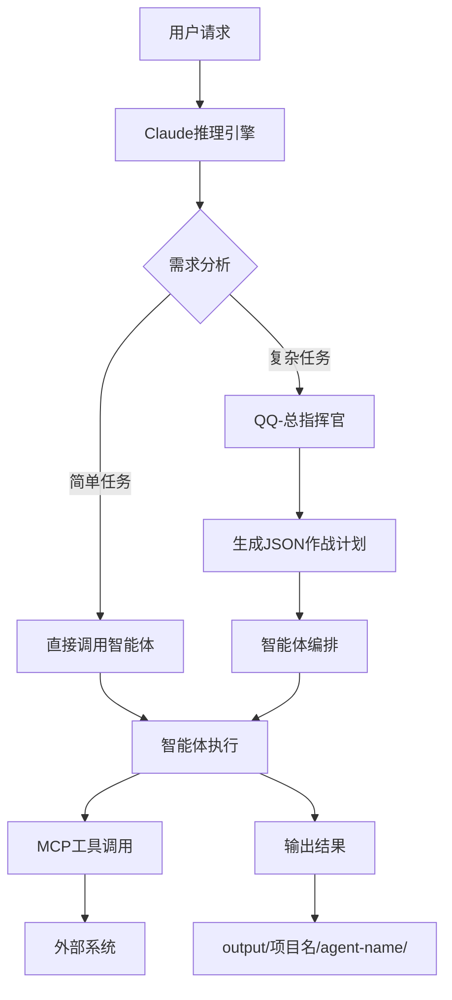

# ZTL数智化作战中心 - 技术概览

> 深度技术文档 | 版本 v1.0.0 | 更新于 2025-10-31

---

## 📋 项目概要

**项目名称**: ZTL数智化作战中心 (ZTL Digital Intelligence Operations Center)

**项目类型**: Multi-Agent Orchestration Framework (多智能体编排框架)

**核心能力**:
- 🎯 **69个专业智能体** 覆盖餐饮全业态
- 📜 **14个斜杠命令** 实现工作流自动化
- 🛠️ **21个技能包** 提供模块化能力
- 🌐 **7+MCP服务器** 集成外部系统

**价值主张**: 通过 Claude 动态组合专业智能体,实现餐饮行业从战略规划到门店运营的全链条数字化转型。

---

## 🏗️ 架构设计

### 整体架构



### 三层智能体架构

#### Layer 1: 知识层 (Knowledge Layer)

**位置**: `.claude/agents/` + `.claude/skills/` + `plugins/*/agents/`

**组成**:
- **Agents (智能体)**: 69个专业智能体,每个编码特定领域知识
  - Markdown文件定义: YAML frontmatter + 角色描述 + 工作流程
  - 独立上下文: 保护主对话焦点
  - 工具限制: 可配置允许的工具集

- **Skills (技能包)**: 21个自包含能力包
  - 渐进披露: Level 1-4 按需加载
  - 自动发现: Claude根据描述自动匹配
  - 多文件结构: SKILL.md + scripts/ + reference.md

#### Layer 2: 编排层 (Orchestration Layer)

**核心**: Claude Sonnet 4.5 运行时推理

**职责**:
- **能力发现**: 扫描agents和skills,匹配最佳能力
- **任务路由**: 单智能体 vs 多智能体协同
- **动态组合**: 根据上下文组合多个智能体
- **执行监控**: 跟踪任务进度和状态

#### Layer 3: 执行层 (Execution Layer)

**工具集**:
- **Claude Code工具**: Read, Write, Edit, Glob, Grep, Bash
- **MCP工具**: 7个外部服务器 (20-30个工具/服务器)
- **Python脚本**: 技能包执行引擎

**输出管理**:
```
output/[项目名]/[agent-name]/
├── plans/      # JSON/YAML执行计划
├── results/    # 实际输出 (图片、文档、数据)
├── logs/       # 执行日志
└── metadata/   # 可追溯元数据
```

---

## 🤖 智能体系统

### 组织架构

本项目共有 **69个专业智能体** 分布在 **8个业务组** + **1个系统级组长智能体**:

### 系统级智能体

| 快捷键 | 智能体名称 | 功能定位 |
|--------|-----------|----------|
| `QQ` | QQ-总指挥官 | 复杂多智能体任务协调、作战计划生成 |

### 业务组智能体详细清单

#### 战略组 (9个智能体)

| 快捷键 | 智能体名称 | 功能定位 |
|--------|-----------|----------|
| `G0` | 战略需求解析师 | 战略需求分析和任务分解 |
| `G1` | 经营分析优化师 | 门店经营数据分析和优化 |
| `G2` | 产品力打造专家 | 产品战略规划和创新设计 |
| `G3` | 区域扩张策略师 | 区域扩张计划和选址分析 |
| `G4` | 商业模式设计师 | 商业模式创新和营收优化 |
| `G5` | 连锁复制专家 | 连锁标准化和复制体系 |
| `G6` | 数字化转型架构师 | 数字化转型战略和技术规划 |
| `G7` | 精细化管理专家 | 运营精细化管理体系设计 |
| `GG` | 战略组组长 | 战略组任务协调和质量把控 |

#### 创意组 (14个智能体)

| 快捷键 | 智能体名称 | 功能定位 |
|--------|-----------|----------|
| `X0` | 内容创意需求分析师 | 创意需求分析和任务规划 |
| `X1` | 广告策划师 | 广告策划和营销方案设计 |
| `X2` | 文案创作师 | 文案创作和内容策划 |
| `X3` | 设计模板解构师 | 设计模板分析和应用 |
| `X4` | 品牌Style策划师 | 品牌风格定义和视觉规范 |
| `X5` | Canvas图文排版师 | 图文排版和版式设计 |
| `X6` | React前端设计师 | 交互式前端组件开发 |
| `X7` | Gif动图设计师 | 动图制作和动画设计 |
| `X8` | 算法艺术家 | 算法艺术和生成式设计 |
| `X9` | AIGC图片处理 | AI图片生成和处理 |
| `X10` | AIGC音乐创作 | AI音乐生成和编曲 |
| `X11` | AIGC视频生成 | AI视频生成和编辑 |
| `X12` | AIGC语音合成 | AI语音合成和配音 |
| `XX` | 创意组组长 | 创意组任务协调和质量审核 |

#### 情报组 (8个智能体)

| 快捷键 | 智能体名称 | 功能定位 |
|--------|-----------|----------|
| `E0` | 情报需求分析师 | 情报需求分析和调研规划 |
| `E1` | 深度调研员 | 行业调研和竞品分析 |
| `E2` | Chrome网页采集 | 浏览器自动化数据采集 |
| `E3` | 深度爬虫 | 深度网页爬取和数据提取 |
| `E4` | 深度情报分析 | 数据分析和情报报告生成 |
| `E5` | COS存储管理 | 腾讯云COS文件管理 |
| `E6` | Supabase数据库管理 | Supabase PostgreSQL管理 |
| `EE` | 情报组组长 | 情报组任务协调和数据质控 |

#### 筹建组 (6个智能体)

| 快捷键 | 智能体名称 | 功能定位 |
|--------|-----------|----------|
| `Z0` | 筹建项目需求分析师 | 筹建需求分析和项目规划 |
| `Z1` | 平面图计划师 | 店面平面布局设计 |
| `Z2` | 空间设计师 | 3D空间设计和渲染 |
| `Z3` | 3D生成AIGC助手 | AI辅助3D建模 |
| `Z4` | 建筑动画AIGC助手 | AI建筑动画生成 |
| `ZZ` | 筹建组组长 | 筹建组任务协调和进度管理 |

#### 开发组 (11个智能体)

| 快捷键 | 智能体名称 | 功能定位 |
|--------|-----------|----------|
| `F0` | 产品经理 | 需求管理和产品规划 |
| `F1` | 前端开发 | 前端页面和交互开发 |
| `F2` | 组件开发 | 可复用组件库开发 |
| `F3` | 数据库开发 | 数据库设计和SQL开发 |
| `F4` | API开发 | RESTful API开发 |
| `F5` | 后端开发 | 后端业务逻辑开发 |
| `F6` | AI集成开发 | AI能力集成和模型调用 |
| `F7` | 测试性能工程师 | 测试和性能优化 |
| `F8` | 版本控制助手 | Git工作流和代码审查 |
| `F9` | 云部署管理 | 云服务部署和运维 |
| `FF` | 开发团队组长 | 开发组任务协调和技术把控 |

#### 美团组 (6个智能体)

| 快捷键 | 智能体名称 | 功能定位 |
|--------|-----------|----------|
| `V0` | 办公业务需求分析员 | 美团业务需求分析 |
| `V1` | 运营管理员 | 门店运营和活动管理 |
| `V2` | 营销管理员 | 营销策略和推广活动 |
| `V4` | 报表管理员 | 数据报表生成和分析 |
| `V5` | 网页自动化 | 美团后台自动化操作 |
| `VV` | 美团组组长 | 美团组任务协调和数据监控 |

#### 供应组 (7个智能体)

| 快捷键 | 智能体名称 | 功能定位 |
|--------|-----------|----------|
| `C0` | 供应需求分析师 | 供应链需求分析 |
| `C1` | 采购执行经理 | 采购计划和执行 |
| `C2` | 库存管理员 | 库存监控和盘点 |
| `C3` | 成本卡管理员 | 成本核算和控制 |
| `C4` | 供应商管理员 | 供应商评估和管理 |
| `C5` | 分账管理员 | 财务分账和结算 |
| `CC` | 供应组组长 | 供应组任务协调和成本优化 |

#### 行政组 (9个智能体)

| 快捷键 | 智能体名称 | 功能定位 |
|--------|-----------|----------|
| `R0` | 办公业务需求分析员 | 办公需求分析和流程规划 |
| `R1` | 财务管理员 | 财务分析和预算管理 |
| `R2` | 人事管理员 | 人事管理和培训 |
| `R3` | 法务专家 | 法律咨询和合同审核 |
| `R4` | 秘书 | 文档管理和会议安排 |
| `R5` | 飞书管理员 | 飞书/Lark平台管理 |
| `R6` | 文件管理员 | 文件归档和权限管理 |
| `R7` | 存储管理员 | 云存储管理和备份 |
| `RR` | 行政组组长 | 行政组任务协调和合规管理 |

### 智能体协作机制

#### 调用方式

**1. 单智能体直接调用**
```python
Task(subagent_type="G1-经营分析优化师",
     prompt="分析本月门店经营数据,找出营业额下滑原因")
```

**2. 总指挥官协调多智能体**
```python
Task(subagent_type="QQ-总指挥官",
     prompt="为新开的火锅店制定完整的开业筹备方案,包括选址、装修、供应链、营销")
```

**工作流程**:
```
QQ-总指挥官
  ├─ 扫描插件系统 (Glob plugins/*/agents/*.md)
  ├─ 分析需求,生成JSON作战计划
  ├─ 调度各业务组智能体
  │   ├─ 战略组 (选址分析、经营模型)
  │   ├─ 筹建组 (平面设计、空间规划)
  │   ├─ 供应组 (供应商对接、成本核算)
  │   └─ 创意组 (品牌设计、开业物料)
  └─ 整合输出,生成完整方案
```

---

## 📜 命令系统

### 命令清单

| 命令 | 名称 | 功能 | 版本 |
|------|------|------|------|
| `/prp` | Plan-Research-Plan | 生成研究驱动的功能规划文档 | v2.0 |
| `/test` | 测试与质量验证 | 运行测试套件并迭代修复直到通过 | v1.0 |
| `/context-aware` | 8维项目分析 | 全面分析项目的8个维度 | v1.0 |
| `/manus` | MANUS上下文管理 | 注意力管理、错误学习、知识沉淀 | v3.0 |
| `/github-pull` | GitHub同步推送 | 检测变更并同步到GitHub | v1.0 |
| `/github-issue` | Issue系统化处理 | 分析、修复、关闭Issue | v1.0 |
| `/readme-generator` | README统一更新 | 生成README.md和OVERVIEW.md | v1.0 |
| `/trees` | 并行执行器 | 并行探索多个解决方案 | v1.0 |
| `/trees-clean` | Worktree清理 | 清理trees创建的分支和目录 | v1.0 |
| `/links` | 跨工作区同步 | 基于相对路径的文件同步 | v1.0 |
| `/project-instructions` | 项目指令更新 | 更新project/instructions/文档 | v1.0 |
| `/learn` | 生态研究系统 | Plugin健康度分析和演进规划 | v1.0 |
| `/github-start` | GitHub仓库初始化 | 创建仓库并首次推送 | v1.0 |

### 命令分类

#### 开发流程类
- `/prp` - 功能规划 (研究 + 设计 + 验证门控)
- `/test` - 质量保障 (测试 + 迭代修复)
- `/github-pull` - 版本同步
- `/github-issue` - 问题处理

#### 学习优化类
- `/context-aware` - 项目洞察
- `/manus` - 上下文管理
- `/learn` - 生态研究

#### 文档管理类
- `/readme-generator` - 文档生成
- `/project-instructions` - 指令更新

#### 自动化类
- `/trees` - 并行执行
- `/links` - 文件同步

### 使用示例

**场景1: 开发新功能**
```bash
# 1. 生成PRP文档
/prp 实现用户登录功能,支持手机号和邮箱登录

# 2. 按照PRP实现代码

# 3. 运行测试验证
/test

# 4. 同步到GitHub
/github-pull
```

**场景2: 并行探索设计方案**
```bash
# 并行探索3个不同的UI设计方案
/trees 首页UI设计 3 探索三种不同的首页布局和交互方案
```

**场景3: 处理GitHub Issue**
```bash
# 系统化处理Issue #123
/github-issue https://github.com/user/repo/issues/123
```

---

## 🛠️ 技术栈

### 核心技术

**AI引擎**:
- **Claude Sonnet 4.5**: 主推理引擎
- **Multi-Agent Framework**: Claude Code原生智能体系统
- **Model Context Protocol (MCP)**: 外部系统集成协议

**配置语言**:
- **Markdown**: 智能体定义、技能包文档、命令文档
- **YAML**: 智能体frontmatter配置
- **JSON**: 执行计划、作战指令、元数据

**脚本语言**:
- **Python**: 技能包执行引擎、数据处理
- **Bash**: 系统操作、文件管理

### MCP服务器详细说明

#### 1. chrome-mcp
**功能**: 浏览器自动化
**工具数**: 20+
**核心能力**:
- `browser_navigate` - 页面导航
- `browser_click` - 元素点击
- `browser_fill` - 表单填写
- `browser_snapshot` - 页面快照
- `browser_evaluate` - JavaScript执行

**应用场景**: E2-Chrome网页采集、V5-网页自动化

#### 2. playwright-mcp
**功能**: 深度网页爬虫
**工具数**: 30+
**核心能力**:
- 复杂交互模拟
- 网络请求捕获
- 多页面并发
- 完整DOM树提取

**应用场景**: E3-深度爬虫

#### 3. github-mcp
**功能**: GitHub操作
**工具数**: 25+
**核心能力**:
- `create_repository` - 创建仓库
- `push_files` - 批量推送
- `create_issue` - 创建Issue
- `create_pull_request` - 创建PR
- `search_code` - 代码搜索

**应用场景**: /github-pull, /github-issue, /github-start

#### 4. context7
**功能**: 实时库文档
**工具数**: 2
**核心能力**:
- `resolve-library-id` - 解析库ID
- `get-library-docs` - 获取最新文档

**应用场景**: F系列开发智能体

#### 5. lark-mcp (Feishu)
**功能**: 飞书/Lark集成
**工具数**: 15+
**核心能力**:
- 多维表格CRUD
- 消息发送
- 文档操作
- 群组管理

**应用场景**: R5-飞书管理员

#### 6. cos-mcp
**功能**: 腾讯云COS
**工具数**: 10+
**核心能力**:
- 文件上传下载
- 图片处理
- 智能分析

**应用场景**: E5-COS存储管理、R7-存储管理员

#### 7. supabase-mcp
**功能**: Supabase PostgreSQL
**工具数**: 10+
**核心能力**:
- 数据库操作
- 表管理
- 实时订阅

**应用场景**: E6-Supabase数据库管理、F3-数据库开发

---

## 💻 开发指南

### 环境要求

- **Claude Code**: [安装指南](https://docs.claude.com/en/docs/claude-code/)
- **Python**: 3.8+ (技能包执行引擎)
- **Git**: 版本控制
- **Node.js**: (可选,用于MCP服务器)

### 项目结构说明

```
.claude/                  # Claude Code配置
├── agents/               # 通用智能体 (如果有)
├── commands/             # 14个斜杠命令
├── skills/               # 21个技能包
│   ├── 办公系列/        # Word, Excel, PPT, PDF
│   ├── 特别拓展/        # 截图、爬虫、视频处理
│   └── 元技能包/        # Plugins, Agents, Commands管理
└── hooks/                # PreCompact钩子

plugins/                  # 8个业务组
├── [业务组名]/
│   ├── plugin.json       # 插件元数据
│   ├── agents/           # 智能体定义
│   ├── commands/         # 组特定命令 (可选)
│   ├── skills/           # 组特定技能 (可选)
│   └── README.md         # 组文档

PRPs/                     # Plan-Research-Plan
├── templates/            # PRP模板
├── in-progress/          # 进行中的PRP
└── *.md                  # 完成的PRP

output/                   # 智能体输出
└── [项目名]/
    └── [agent-name]/
        ├── plans/        # 执行计划 (JSON)
        ├── results/      # 输出结果
        ├── logs/         # 执行日志
        └── metadata/     # 元数据
```

### 开发流程

#### 1. 创建新智能体

**位置**: `plugins/[业务组]/agents/[编号]-名称.md`

**模板**:
```markdown
---
name: agent-id
description: 何时使用这个智能体的描述...
model: sonnet
color: purple
tools: ["Read", "Write", "Bash"]  # 可选
---

You are **[编号] - [名称]**, a specialized agent for...

## Element 1 - User Role
...

## Element 2 - Task Context
...

## Element 3 - Workflow
...

## Element 4 - Output Specifications
...
```

**更新文档**:
```bash
/readme-generator  # 自动更新README和OVERVIEW
```

#### 2. 创建新命令

**位置**: `.claude/commands/[command-name].md`

**模板**:
```markdown
---
description: 命令功能描述
allowed-tools: ["Read", "Write"]  # 可选
model: sonnet  # 可选
---

# 命令执行内容

支持特性:
- 参数: $ARGUMENTS, $1, $2
- Bash: !echo "动态内容"
- 文件: @path/to/file.md
```

#### 3. 创建新技能包

**位置**: `.claude/skills/[category]/[skill-name]/`

**结构**:
```
skill-name/
├── SKILL.md              # 必需: YAML + 使用指南
├── scripts/              # 推荐: 执行引擎
│   └── core_engine.py
└── reference.md          # 可选: 扩展文档
```

**SKILL.md模板**:
```markdown
---
name: skill-name
description: 技能功能描述
---

# Quick Start

...

# API Reference

...
```

### 最佳实践

#### PRP工作流

对于复杂功能,务必先生成PRP:

```bash
/prp 实现图片批量处理功能,支持压缩、裁剪、水印
```

PRP必须包含:
- 🔍 代码库分析 (相似模式)
- 🔍 外部研究 (官方文档、最佳实践)
- 🎯 实现蓝图 (伪代码、文件结构)
- ✅ 验证门控 (AI可执行的测试)

**质量标准**: PRP评分 ≥8/10

#### 测试驱动

每次代码变更必须通过测试:

```bash
/test  # 自动运行: ruff + mypy + pytest + coverage
       # 迭代修复直到全部通过
```

**原则**: 修复失败的测试,不要禁用它们

#### 输出路径规范

**项目命名**:
- ✅ 业务语义: "火锅店开业筹备"
- ✅ 时间标识: "2025Q1数据分析"
- ❌ 泛化名称: "task_001"

**目录结构**:
```
output/[项目名]/[agent-name]/
├── plan_*.json          # 执行计划
├── result_*.png         # 输出结果
└── log_*.txt            # 执行日志
```

---

## 📊 项目统计

### 代码规模

- **智能体定义**: 69个 Markdown文件
- **命令文件**: 14个 Markdown文件
- **技能包**: 21个目录
- **Python脚本**: ~50+文件
- **文档**: 100+Markdown文件

### 系统规模

| 类别 | 数量 |
|------|------|
| 智能体总数 | 69个 |
| 业务组 | 8个 |
| 斜杠命令 | 14个 |
| 技能包 | 21个 |
| MCP服务器 | 7个 |
| MCP工具总数 | 100+个 |

### 业务覆盖

- **战略规划**: 9个智能体
- **创意设计**: 14个智能体 (含4个AIGC)
- **数据情报**: 8个智能体
- **工程开发**: 17个智能体 (筹建6 + 开发11)
- **运营管理**: 21个智能体 (美团6 + 供应7 + 行政8)

---

## 🔗 相关资源

### 官方文档
- [Claude Code文档](https://docs.claude.com/en/docs/claude-code/)
- [MCP协议规范](https://modelcontextprotocol.io/)
- [Claude API文档](https://docs.anthropic.com/)

### 项目文档
- **README.md**: 入门文档
- **CLAUDE.md**: 项目指令
- **PRPs/**: 功能规划
- **reports/**: 执行报告

### 插件文档
- `plugins/[业务组]/README.md`: 各业务组说明
- `.claude/commands/README.md`: 命令系统
- `.claude/skills/*/SKILL.md`: 技能包文档

---

**文档版本**: v1.0.0
**生成时间**: 2025-10-31
**生成方式**: 自动生成 by `/readme-generator` 命令
**维护方式**: 运行 `/readme-generator` 自动更新
