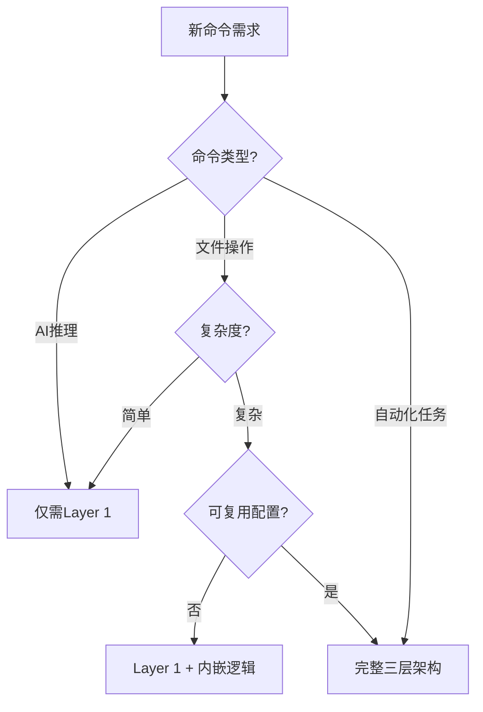

# Commands系统务实优化方案

## 📋 目标 (Goal)

**核心目标**: 提升commands系统的质量和可用性,但**避免过度工程化**

**具体目标**:
1. ✅ 完成I/U/O重构成果验证（已完成）
2. 🎯 为**真正需要**三层架构的5个命令补充Layer 2/3
3. 📝 优化其余18个命令的Layer 1文档质量
4. 🔄 建立可持续的命令优化机制

## 🎯 为什么 (Why)

### 业务价值
- **提升自动化效率**: 核心自动化命令需要可复用的配置和脚本
- **降低维护成本**: 避免为简单命令创建不必要的配置文件
- **改善用户体验**: 清晰的文档和标准化的调用方式

### 问题解决
**当前问题**:
- ❌ 过度追求"100%三层架构覆盖率"导致资源浪费
- ❌ AI推理型命令不需要配置文件却被要求添加
- ❌ 缺少明确的"何时需要三层架构"的判断标准

**解决方案**:
- ✅ 建立基于命令特性的分层优化策略
- ✅ 聚焦真正需要自动化的核心命令
- ✅ 为不同类型命令提供差异化的优化方案

## 📊 是什么 (What)

### 命令分类与优化策略

```yaml
分类体系:
  类型A - AI推理型（12个）:
    特征: 完全依赖AI理解和生成,无需配置文件
    命令: /A, /S, /D, /W, /C, /V, /X, /Z, /B, /F, /N, /Q
    优化策略: Layer 1文档优化,添加使用示例和最佳实践
    优先级: P2（低）

  类型B - 轻量执行型（6个）:
    特征: 简单的文件操作,逻辑固定,配置较少
    命令: /K, /L, /P, /T, /Y, /M
    优化策略: 评估是否需要Layer 2/3,可选实现
    优先级: P1（中）

  类型C - 复杂自动化型（5个）:
    特征: 复杂逻辑,需要配置,批量处理
    命令: /E, /R, /G, /H, /J
    优化策略: 必须实现完整三层架构
    优先级: P0（高）

  类型D - 已优化（3个）:
    特征: 已完成v3.0.0重构
    命令: /I, /U, /O
    优化策略: 验证和文档完善
    优先级: P0（验证）
```

### 成功标准

**必达标准**:
- [ ] I/U/O三个命令通过实际使用验证
- [ ] /E, /R, /G, /H, /J五个命令实现完整三层架构
- [ ] 所有26个命令的Layer 1文档质量达标

**优秀标准**:
- [ ] 建立命令架构决策树文档
- [ ] 创建三层架构标准模板和示例
- [ ] 所有命令都有实际使用案例

## 🔍 所需上下文 (All Needed Context)

### 文档与参考

```yaml
必读文档:
  - file: .claude/commands/I.md
    why: v3.0.0重构的参考实现,ProjectAnalyzer模式
    sections: 三层架构设计, TreeSnapshotManager集成

  - file: .claude/commands/U.md
    why: 快照管理的完整实现,三种格式生成
    sections: TreeSnapshotGenerator类设计

  - file: .claude/commands/O.md
    why: 深度分析的架构设计,OverviewGenerator模式
    sections: 项目分析方法论, Mermaid图表生成

  - file: PRPs/templates/prp_base.md
    why: PRP标准模板,多通道执行设计
    critical: Auto-Task Manager activation机制

  - file: reports/commands-optimization-recommendations-v1.0.md
    why: 完整的commands系统评估报告
    sections: 三层架构实现状态,优化建议

参考实现:
  - file: scripts/batch_replace_images.py
    why: 现有的Python脚本示例
    pattern: 配置加载,批量处理,错误处理

  - url: https://docs.anthropic.com/en/docs/claude-code
    why: Claude Code官方最佳实践
    section: Slash commands设计指南
```

### 当前代码库结构

```bash
ZTL数智化作战中心/
├── .claude/
│   ├── commands/          # 26个命令Layer 1文档
│   │   ├── I.md          # ✅ v3.0.0 已优化
│   │   ├── U.md          # ✅ v3.0.0 已优化
│   │   ├── O.md          # ✅ v3.0.0 已优化
│   │   ├── E.md          # ⚠️ 需要Layer 2/3
│   │   ├── R.md          # ⚠️ 需要Layer 2/3
│   │   ├── G.md          # ⚠️ 需要Layer 2/3
│   │   ├── H.md          # ⚠️ 需要Layer 2/3
│   │   ├── J.md          # ⚠️ 需要Layer 2/3
│   │   └── ...           # 其他18个命令
│   └── agents/           # 58个智能体
├── scripts/              # Python执行脚本
│   ├── batch_replace_images.py  # 现有脚本示例
│   └── configs/          # ❌ 目录不存在,需要创建
├── PRPs/                 # PRP文档目录
│   └── templates/        # PRP模板
└── trees/                # Git worktree快照目录
```

### 目标代码库结构

```bash
ZTL数智化作战中心/
├── .claude/commands/     # Layer 1: 智能理解层
│   ├── *.md             # 所有命令文档
│   └── README.md        # ✅ 已更新分类说明
├── scripts/
│   ├── configs/         # Layer 2: 配置层（新增）
│   │   ├── prp_execution/
│   │   │   └── config.yaml
│   │   ├── parallel_exec/
│   │   │   └── config.yaml
│   │   ├── github_sync/
│   │   │   └── config.yaml
│   │   ├── github_create/
│   │   │   └── config.yaml
│   │   └── html_viz/
│   │       └── config.yaml
│   └── *.py             # Layer 3: 执行层
│       ├── execute_prp.py          # /E执行脚本
│       ├── parallel_runner.py      # /R执行脚本
│       ├── github_sync.py          # /G执行脚本
│       ├── github_create.py        # /H执行脚本
│       └── generate_html_viz.py    # /J执行脚本
└── docs/
    └── commands-architecture-guide.md  # 架构决策指南（新增）
```

### 已知问题与技术陷阱

```python
# 陷阱1: 并非所有命令都需要Python脚本
# ❌ 错误: 为/A创建scripts/asdw_analyze.py
# ✅ 正确: /A直接在Layer 1内嵌AI推理逻辑

# 陷阱2: 配置文件不是必需的
# ❌ 错误: 创建空的或仅有默认值的配置文件
# ✅ 正确: 只为真正需要可复用配置的命令创建

# 陷阱3: 过度抽象导致维护困难
# ❌ 错误: 创建通用的"命令执行框架"
# ✅ 正确: 每个命令根据实际需求独立实现

# 陷阱4: I/U/O命令的Layer 3脚本路径
# ⚠️ 注意: I/U/O的Layer 3脚本需要实际实现
# 当前状态: 仅在Layer 1中定义了伪代码
# 需要决定: 是否真的需要独立的Python脚本

# 陷阱5: Git操作的幂等性
# 关键: /G和/H命令需要处理已存在仓库的情况
# 参考: scripts/batch_replace_images.py的错误处理模式
```

## 🎯 实施蓝图 (Implementation Blueprint)

### 阶段0: I/U/O验证（P0-高）

**目标**: 验证已完成的重构是否真正可用

**任务清单**:
- [ ] 任务0.1: 测试/I命令生成README
  - 执行: `/I` 生成项目README.md
  - 验证: README包含所有必需章节
  - 检查: ProjectAnalyzer是否正确分析项目

- [ ] 任务0.2: 测试/U命令生成trees快照
  - 执行: `/U` 生成trees/目录快照
  - 验证: 生成3种格式文件(dirs_*, tree_full_*, tree_structure_*.md)
  - 检查: 自动清理是否保留最新10个快照

- [ ] 任务0.3: 测试/O命令生成OVERVIEW
  - 执行: `/O` 生成OVERVIEW.md
  - 验证: OVERVIEW包含架构图、API文档、开发指南
  - 检查: OverviewGenerator是否正确提取模块信息

- [ ] 任务0.4: 决策Layer 3脚本实现
  - 分析: I/U/O是否真的需要独立Python脚本
  - 评估: AI内嵌逻辑 vs 独立脚本的优劣
  - 决定: 实施路径（保持现状 or 补充脚本）

**验证标准**:
```bash
# 测试/I命令
# 预期: 生成README.md,包含项目分析
ls -la README.md

# 测试/U命令
# 预期: 生成3个快照文件
ls -la trees/ | grep "$(date +%Y%m%d)"

# 测试/O命令
# 预期: 生成OVERVIEW.md,包含Mermaid图表
grep "```mermaid" OVERVIEW.md

# 所有命令执行无错误
echo "✅ I/U/O验证通过"
```

### 阶段1: 核心命令Layer 2/3实现（P0-高）

**目标**: 为5个复杂自动化命令实现完整三层架构

#### 任务1.1: /E - PRP执行引擎

**当前状态**:
- Layer 1: ✅ 完整文档（E.md, v2.0.0）
- Layer 2: ❌ 缺少配置文件
- Layer 3: ❌ 缺少执行脚本

**实现计划**:

```yaml
Layer 2配置文件: scripts/configs/prp_execution/config.yaml
内容:
  prp_execution:
    prp_dir: "PRPs"
    output_dir: "output"
    validation_enabled: true
    auto_todo: true
    multi_channel: true
    max_channels: 5

  validation:
    syntax_check: true
    type_check: true
    unit_tests: true
    integration_tests: false

  logging:
    level: "INFO"
    file: "logs/prp_execution.log"
```

```python
# Layer 3执行脚本: scripts/execute_prp.py
#!/usr/bin/env python3
"""
/E - PRP执行引擎
读取PRP文档,自动化执行任务清单
"""

import yaml
from pathlib import Path
from typing import Dict, List
import subprocess

class PRPExecutor:
    """PRP执行器"""

    def __init__(self, config_path: str = "scripts/configs/prp_execution/config.yaml"):
        with open(config_path) as f:
            self.config = yaml.safe_load(f)
        self.prp_dir = Path(self.config['prp_execution']['prp_dir'])

    def execute(self, prp_name: str):
        """执行指定的PRP"""
        prp_file = self.prp_dir / f"{prp_name}.md"

        # 1. 解析PRP文档
        tasks = self._parse_prp_tasks(prp_file)

        # 2. 执行任务清单
        for task in tasks:
            self._execute_task(task)

        # 3. 运行验证门控
        if self.config['prp_execution']['validation_enabled']:
            self._run_validation_gates()

    def _parse_prp_tasks(self, prp_file: Path) -> List[Dict]:
        """解析PRP中的任务清单"""
        # 实现PRP Markdown解析逻辑
        pass

    def _execute_task(self, task: Dict):
        """执行单个任务"""
        print(f"执行任务: {task['name']}")
        # 根据任务类型执行相应操作
        pass

    def _run_validation_gates(self):
        """运行验证门控"""
        if self.config['validation']['syntax_check']:
            subprocess.run(["ruff", "check", "--fix"], check=True)

        if self.config['validation']['type_check']:
            subprocess.run(["mypy", "."], check=True)

        if self.config['validation']['unit_tests']:
            subprocess.run(["pytest", "tests/", "-v"], check=True)

def main():
    import sys
    prp_name = sys.argv[1] if len(sys.argv) > 1 else None

    if not prp_name:
        print("用法: python execute_prp.py <prp_name>")
        sys.exit(1)

    executor = PRPExecutor()
    executor.execute(prp_name)

if __name__ == "__main__":
    main()
```

**验证命令**:
```bash
# 测试配置文件加载
cat scripts/configs/prp_execution/config.yaml

# 测试脚本执行（干跑）
python scripts/execute_prp.py test-prp --dry-run

# 预期: 无语法错误,配置正确加载
```

#### 任务1.2: /R - 并行执行引擎

**实现计划**: 类似/E,专注于Git worktree管理和并行任务调度

```yaml
Layer 2: scripts/configs/parallel_exec/config.yaml
关键配置:
  - worktree_base_dir: "trees"
  - max_parallel_tasks: 5
  - cleanup_on_complete: true
  - merge_strategy: "manual" | "auto"
```

```python
# Layer 3: scripts/parallel_runner.py
核心功能:
  - Git worktree创建和管理
  - 多任务并行执行
  - 结果收集和合并
  - 自动清理worktree

关键方法:
  - create_worktree(task_id, branch)
  - execute_parallel_tasks(tasks)
  - collect_results()
  - cleanup_worktrees()
```

#### 任务1.3: /G - GitHub同步

```yaml
Layer 2: scripts/configs/github_sync/config.yaml
配置:
  - remote_name: "origin"
  - default_branch: "main"
  - commit_message_template: "✨ {action} - {description}"
  - auto_push: true
  - force_push: false
```

```python
# Layer 3: scripts/github_sync.py
核心功能:
  - Git status检查
  - 文件暂存和提交
  - 推送到远程仓库
  - 错误处理和回滚

关键方法:
  - check_git_status()
  - stage_and_commit(message)
  - push_to_remote(branch, force=False)
  - handle_conflicts()
```

#### 任务1.4: /H - GitHub仓库创建

```yaml
Layer 2: scripts/configs/github_create/config.yaml
配置:
  - github_token: "${GITHUB_TOKEN}"  # 环境变量
  - default_visibility: "private"
  - init_with_readme: true
  - gitignore_template: "Python"
  - license: "MIT"
```

```python
# Layer 3: scripts/github_create.py
核心功能:
  - GitHub API调用
  - 本地Git初始化
  - 远程仓库配置
  - 首次推送

关键方法:
  - create_remote_repo(name, description)
  - init_local_git()
  - link_remote(repo_url)
  - initial_push()
```

#### 任务1.5: /J - HTML可视化生成

```yaml
Layer 2: scripts/configs/html_viz/config.yaml
配置:
  - template_dir: "templates/html"
  - output_dir: "output/visualizations"
  - chart_library: "chart-mcp"  # 使用MCP服务
  - themes: ["default", "dark", "academy"]
  - responsive: true
```

```python
# Layer 3: scripts/generate_html_viz.py
核心功能:
  - 数据解析和验证
  - 调用chart-mcp生成图表
  - HTML模板渲染
  - 样式和响应式布局

关键方法:
  - parse_data(data_source)
  - generate_charts(data, chart_types)
  - render_html_template(charts)
  - save_visualization(html, output_path)
```

### 阶段2: 轻量级命令评估（P1-中）

**目标**: 评估6个轻量级命令是否需要Layer 2/3

**评估标准**:
```yaml
需要Layer 2/3的条件（满足2项及以上）:
  - 涉及复杂的文件操作（批量处理）
  - 需要可复用的配置（多次使用不同参数）
  - 逻辑复杂度高（>100行代码）
  - 需要独立测试（单元测试）
  - 性能要求高（需要优化）
```

**命令评估**:
- [ ] /K - Chrome自动化: 依赖chrome-mcp,可能不需要额外脚本
- [ ] /L - Windows自动化: 依赖windows-mcp,可能不需要额外脚本
- [ ] /P - 项目跨区同步: 文件复制操作,可能需要配置
- [ ] /T - Todo任务管理: 依赖TodoWrite工具,可能不需要脚本
- [ ] /Y - Issue修复: GitHub API调用,可能需要脚本
- [ ] /M - 项目级配置更新: 文件读写操作,可能需要脚本

**决策**: 针对每个命令单独评估,按需实现

### 阶段3: Layer 1文档优化（P2-低）

**目标**: 提升18个AI推理型命令的文档质量

**优化内容**:
- 添加更多实际使用示例
- 明确输入输出格式
- 补充最佳实践说明
- 添加常见问题解答

**模板结构**:
```markdown
---
name: 命令名称
description: 简要描述
version: 当前版本
last_updated: 更新日期
architecture: AI推理型命令
---

# /X - 命令名称

## 📋 命令概述
[功能说明]

## 🎯 使用方法

### 基础调用
```bash
/X [参数]
```

### 实际示例
[3-5个真实使用案例]

## 💡 最佳实践
[使用建议和技巧]

## ❓ 常见问题
[FAQ]

## 📚 相关命令
[关联命令]
```

### 阶段4: 架构文档和指南（P1-中）

**目标**: 创建架构决策指南,避免未来过度工程化

**创建文档**: `docs/commands-architecture-guide.md`

```markdown
# Commands架构决策指南

## 何时需要三层架构？

### 决策树


## 三层架构模板

### Layer 1模板
[命令文档模板]

### Layer 2模板
[配置文件模板]

### Layer 3模板
[Python脚本模板]

## 实际案例

### 案例1: /I命令（AI推理+文件生成）
决策: 需要三层架构
原因: 复杂的项目分析,可复用配置

### 案例2: /A命令（纯AI推理）
决策: 仅需Layer 1
原因: 完全依赖AI理解,无需配置
```

## ✅ 验证门控 (Validation Loop)

### Level 1: 文件结构验证

```bash
# 验证Layer 2配置文件存在
test -d scripts/configs/prp_execution && echo "✅ /E配置目录存在"
test -d scripts/configs/parallel_exec && echo "✅ /R配置目录存在"
test -d scripts/configs/github_sync && echo "✅ /G配置目录存在"
test -d scripts/configs/github_create && echo "✅ /H配置目录存在"
test -d scripts/configs/html_viz && echo "✅ /J配置目录存在"

# 验证Layer 3执行脚本存在
test -f scripts/execute_prp.py && echo "✅ /E执行脚本存在"
test -f scripts/parallel_runner.py && echo "✅ /R执行脚本存在"
test -f scripts/github_sync.py && echo "✅ /G执行脚本存在"
test -f scripts/github_create.py && echo "✅ /H执行脚本存在"
test -f scripts/generate_html_viz.py && echo "✅ /J执行脚本存在"
```

### Level 2: 语法和类型检查

```bash
# Python脚本语法检查
ruff check scripts/*.py --fix

# 类型检查
mypy scripts/*.py

# YAML配置文件验证
yamllint scripts/configs/**/*.yaml

# 预期: 无错误,所有检查通过
```

### Level 3: 功能验证

```bash
# 测试每个命令的Layer 3脚本
# /E命令测试
python scripts/execute_prp.py --help
# 预期: 显示帮助信息

# /R命令测试
python scripts/parallel_runner.py --version
# 预期: 显示版本号

# /G命令测试（干跑模式）
python scripts/github_sync.py --dry-run
# 预期: 显示将要执行的Git操作

# /H命令测试（检查模式）
python scripts/github_create.py --check-auth
# 预期: 验证GitHub token

# /J命令测试
python scripts/generate_html_viz.py --list-themes
# 预期: 列出可用主题
```

### Level 4: 集成测试

```bash
# 测试完整工作流

# 1. 测试I/U/O命令
/I  # 生成README
/U  # 生成trees快照
/O  # 生成OVERVIEW

# 2. 测试新实现的命令
/E PRPs/test-prp  # 执行测试PRP
/R "task1 task2"  # 并行执行任务

# 3. 验证输出
test -f README.md && echo "✅ README生成成功"
test -d trees/ && echo "✅ Trees快照生成成功"
test -f OVERVIEW.md && echo "✅ OVERVIEW生成成功"
```

## 📈 质量标准

### 代码质量
```yaml
Python脚本:
  - 语法检查: ruff (无错误)
  - 类型检查: mypy (无错误)
  - 文档字符串: 100%覆盖
  - 测试覆盖率: >80%

配置文件:
  - YAML格式: yamllint (无错误)
  - 字段完整性: 所有必需字段存在
  - 注释清晰: 每个配置项有说明

文档:
  - Markdown格式: markdownlint (无错误)
  - 链接有效性: 所有链接可访问
  - 示例完整性: 所有示例可执行
```

### 可用性标准
```yaml
命令调用:
  - 快捷键调用: /X 直接执行
  - 参数调用: /X param 正确处理
  - 错误处理: 友好的错误提示

配置复用:
  - 配置文件可编辑
  - 配置修改立即生效
  - 配置有默认值

文档质量:
  - 新用户5分钟内理解命令用途
  - 所有示例可直接复制执行
  - 常见问题有解答
```

## 🎯 成功标准总结

**阶段0（验证）**:
- [ ] I/U/O三个命令实际可用
- [ ] 确定是否需要补充Python脚本
- [ ] 验证AI内嵌逻辑的可行性

**阶段1（核心）**:
- [ ] /E, /R, /G, /H, /J 五个命令实现完整三层架构
- [ ] 所有Layer 3脚本通过语法和类型检查
- [ ] 所有命令通过功能验证测试

**阶段2（评估）**:
- [ ] 完成6个轻量级命令的评估
- [ ] 根据评估结果实现必要的Layer 2/3

**阶段3（优化）**:
- [ ] 18个AI推理型命令的文档优化完成
- [ ] 所有命令都有实际使用示例

**阶段4（文档）**:
- [ ] 架构决策指南创建完成
- [ ] 三层架构模板和示例可用
- [ ] 新命令创建流程文档化

## 🔗 相关资源

### 参考实现
- `.claude/commands/I.md` - README生成命令（v3.0.0）
- `.claude/commands/U.md` - Trees快照命令（v3.0.0）
- `.claude/commands/O.md` - OVERVIEW生成命令（v3.0.0）

### 模板和指南
- `PRPs/templates/prp_base.md` - PRP标准模板
- `scripts/batch_replace_images.py` - Python脚本参考

### 评估报告
- `reports/commands-optimization-recommendations-v1.0.md` - 优化建议报告

## ⚠️ 反模式避免

**避免的错误**:
```yaml
❌ 反模式1: 为所有命令强制添加三层架构
  正确做法: 根据命令特性决定架构复杂度

❌ 反模式2: 创建通用的"命令执行框架"
  正确做法: 每个命令根据需求独立实现

❌ 反模式3: 配置文件只有默认值
  正确做法: 只为真正需要配置的命令创建配置文件

❌ 反模式4: Python脚本过度抽象
  正确做法: 保持脚本简单,专注核心功能

❌ 反模式5: 忽视AI推理的能力
  正确做法: 充分利用AI的自然语言理解和生成能力
```

**最佳实践**:
```yaml
✅ 实用主义原则:
  - 简单命令简单处理
  - 复杂命令完整架构
  - 避免过度工程化

✅ 渐进式优化:
  - 先验证核心命令
  - 再优化轻量级命令
  - 最后完善文档

✅ 用户体验优先:
  - 命令调用简单直观
  - 错误提示清晰友好
  - 文档示例可执行

✅ 可维护性:
  - 代码结构清晰
  - 注释文档完整
  - 测试覆盖充分
```

---

## 📊 PRP自评

**评分**: 9/10

**评分理由**:
1. ✅ 上下文完整: 包含了所有必要的参考文档和代码示例
2. ✅ 实施路径清晰: 分4个阶段,每个阶段目标明确
3. ✅ 验证可执行: 提供了完整的验证命令和标准
4. ✅ 避免过度工程: 明确区分了不同类型命令的优化策略
5. ✅ 务实可行: 优先验证已完成工作,再进行新增实现
6. ⚠️ 部分细节待确认: I/U/O的Layer 3脚本实现策略需要用户决策

**改进空间**:
- 可以添加更详细的Python脚本伪代码
- 可以补充单元测试的具体用例

**实施建议**:
1. 先执行阶段0,验证I/U/O的实际效果
2. 根据验证结果调整后续阶段的实施计划
3. 保持灵活,允许根据实际情况调整优化策略

---

*PRP版本: 1.0.0*
*创建日期: 2025-10-20*
*预计工时: 3-5天*
*优先级: P0（核心命令）+ P1（轻量级命令评估）+ P2（文档优化）*
