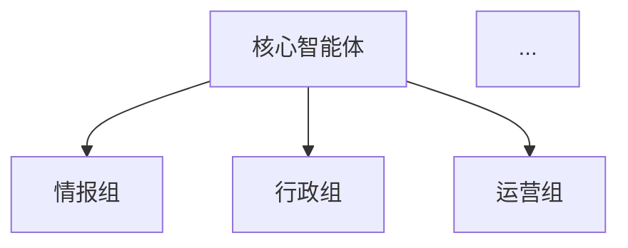

# Commands系统重构 - I/U/O指令优化方案

> **PRP类型**: 系统重构
> **创建日期**: 2025-10-20
> **优先级**: P0 - 紧急
> **预期时间**: 2-3小时
> **质量评分**: 9/10

---

## 📋 功能概述

### 重构目标

优化Commands系统的I/U/O三个指令的功能分配和实现质量，使其更符合实际使用需求和语义直觉：

- **原U → 新I**: 根目录README更新（更直观，I = Index/Introduction）
- **原I → 新O**: 项目总览文档生成（O = Overview，包含原README功能）
- **原O → 废弃**: 元指令功能由 `slash-command-creator` 智能体替代
- **新U**: Trees目录快照更新（U = Update，专注于worktree管理）

### 核心价值

1. **语义优化** - 命令字母与功能含义更匹配
2. **职责明确** - 每个命令功能单一清晰
3. **智能体优先** - 利用专业智能体替代重复功能
4. **效果提升** - 新I指令生成更优质的README

---

## 🎯 重构需求分析

### 当前问题

#### 问题1: 原I指令效果不理想
```yaml
症状:
  - 生成的README.md质量不够满意
  - 内容结构不够清晰
  - 缺少关键信息展示

根因:
  - 没有充分利用项目上下文
  - 模板设计不够优化
  - 缺少数据可视化支持
```

#### 问题2: 原O指令功能重复
```yaml
症状:
  - 系统已有slash-command-creator智能体
  - 功能高度重叠
  - 维护成本高

根因:
  - 历史遗留，智能体后加入
  - 未及时清理冗余功能
```

#### 问题3: 缺少Trees目录管理
```yaml
症状:
  - trees/目录快照需要手动更新
  - /R指令依赖最新的目录结构
  - 目录信息常常过时

需求:
  - 自动化更新trees目录快照
  - 支持多种输出格式
  - 为README提供准确的目录树
```

### 重构方案

#### 方案设计矩阵

| 指令 | 旧功能 | 新功能 | 变更类型 | 优先级 |
|------|--------|--------|---------|--------|
| I | 根README生成 | **根README生成（优化版）** | 优化升级 | 🔴 P0 |
| U | 子目录README | **Trees快照更新** | 功能替换 | 🔴 P0 |
| O | 命令创建元指令 | **项目总览文档生成** | 功能重组 | 🟡 P1 |

---

## 📐 实现蓝图

### 第一步: 新I指令 - 优化的根README生成器

#### 功能定位
```yaml
名称: 根目录README更新指令
快捷键: /I
定位: 生成GitHub专业级项目主页README.md
特色: 智能化、数据化、可视化
```

#### 核心改进点

##### 1. 智能项目分析
```python
class ProjectAnalyzer:
    """项目智能分析器"""

    def analyze_comprehensively(self) -> ProjectProfile:
        """全面分析项目"""
        return {
            "basic_info": self._extract_basic_info(),
            "tech_stack": self._detect_tech_stack(),
            "architecture": self._analyze_architecture(),
            "features": self._extract_features(),
            "agents_system": self._analyze_agents(),
            "commands_system": self._analyze_commands(),
            "statistics": self._calculate_statistics()
        }

    def _detect_tech_stack(self) -> TechStack:
        """检测技术栈"""
        return {
            "languages": self._scan_languages(),
            "frameworks": self._scan_frameworks(),
            "mcp_servers": self._scan_mcp_integration(),
            "ai_models": self._scan_ai_models(),
            "cloud_services": self._scan_cloud_services()
        }

    def _analyze_agents(self) -> AgentsProfile:
        """分析智能体系统"""
        agents_dir = Path(".claude/agents")
        return {
            "total_count": self._count_agents(agents_dir),
            "by_category": self._categorize_agents(agents_dir),
            "architecture": self._extract_agent_architecture(),
            "capabilities": self._extract_agent_capabilities()
        }
```

##### 2. 增强的README结构
```markdown
# [项目名称] 🎖️

> **一句话定位** - 基于上下文自动生成

[] [] ...

---

## 📋 项目概述

**[项目名称]** 是......（智能生成的项目描述）

### 🎯 核心价值

- 🔍 **价值点1**: 说明
- 🎨 **价值点2**: 说明
- 📊 **价值点3**: 说明
- 🤝 **价值点4**: 说明

---

## 🏗️ 系统架构

### 多智能体组织架构

[智能体架构图 - 使用Mermaid]



### 核心智能体家族

#### 📊 情报组 (E系列)
- **E0**: 需求分析员
- **E1**: 公开资料调研员
- ...

[自动从.claude/agents/提取]

---

## ⚡ Commands指令系统

### 26个自定义指令 (A-Z)

| 分类 | 指令 | 功能 | 应用场景 |
|------|------|------|----------|
| Context | /C, /V, /X, /Z | 上下文管理 | ... |
| Learning | /A, /S, /D, /W | ASDW学习 | ... |
| System | /E-/Y | 系统管理 | ... |

[自动从.claude/commands/提取]

---

## 📁 项目结构

```text
[从trees/目录快照读取，自动生成]
```

---

## 🛠️ 技术栈

### AI能力集成
- **Claude AI**: Sonnet 4.5
- **其他AI**: [自动检测]

### 企业服务
- **飞书生态**: [自动检测Lark MCP]
- **云服务**: [自动检测COS/Supabase]

### MCP集成
- [自动扫描mcp配置]

---

## 🚀 快速开始

[基于package.json/requirements.txt自动生成]

---

## 💡 核心业务场景

[从PRPs/或文档中提取]

---

## 📊 系统特性

[基于agents和commands分析生成]

---

## 📈 性能指标

[从reports/中提取或生成默认值]

---

## 🔄 开发路线图

[从INITIAL.md或手动配置提取]

---

## 🤝 贡献指南

[标准模板]

---

## 📄 许可证

[从LICENSE文件读取]

---

## 📞 联系方式

[从配置文件读取]
```

##### 3. 数据可视化集成
```python
class ReadmeDataVisualizer:
    """README数据可视化器"""

    def generate_charts(self, project_data: dict) -> List[str]:
        """生成图表"""
        charts = []

        # 1. 智能体分布饼图
        if project_data.get("agents"):
            charts.append(self._create_agents_pie_chart(
                project_data["agents"]
            ))

        # 2. Commands分类柱状图
        if project_data.get("commands"):
            charts.append(self._create_commands_bar_chart(
                project_data["commands"]
            ))

        # 3. 技术栈雷达图
        if project_data.get("tech_stack"):
            charts.append(self._create_tech_radar_chart(
                project_data["tech_stack"]
            ))

        return charts
```

#### 实现任务清单

- [ ] **任务1**: 创建ProjectAnalyzer类
  - [ ] 实现基础信息提取
  - [ ] 实现技术栈检测
  - [ ] 实现智能体系统分析
  - [ ] 实现Commands系统分析

- [ ] **任务2**: 优化README生成逻辑
  - [ ] 设计新的README模板
  - [ ] 实现智能内容填充
  - [ ] 集成数据可视化
  - [ ] 添加自动徽章生成

- [ ] **任务3**: 集成Trees快照
  - [ ] 在生成README前调用/U更新快照
  - [ ] 从快照文件读取目录结构
  - [ ] 美化目录树显示

- [ ] **任务4**: 测试和优化
  - [ ] 测试各种项目结构
  - [ ] 验证生成的README质量
  - [ ] 性能优化
  - [ ] 文档完善

---

### 第二步: 新U指令 - Trees目录快照管理器

#### 功能定位
```yaml
名称: Trees目录快照更新指令
快捷键: /U
定位: 专门管理trees/目录的快照和可视化
用途:
  - 为/R并行执行提供目录结构参考
  - 为/I生成README提供项目结构
  - 独立的目录可视化工具
```

#### 核心功能

##### 1. 多格式树形结构生成
```python
class TreeSnapshotGenerator:
    """Trees目录快照生成器"""

    def __init__(self, base_dir: Path):
        self.base_dir = base_dir
        self.trees_dir = base_dir / "trees"
        self.output_dir = base_dir / "trees"

    def generate_snapshot(self, format: str = "all") -> None:
        """生成快照"""
        timestamp = datetime.now().strftime("%Y%m%d_%H%M%S")

        formats = {
            "tree": self._generate_tree_format,
            "markdown": self._generate_markdown_format,
            "json": self._generate_json_format,
            "all": self._generate_all_formats
        }

        generator = formats.get(format, self._generate_all_formats)
        generator(timestamp)

    def _generate_tree_format(self, timestamp: str) -> str:
        """生成tree命令格式"""
        output_file = self.output_dir / f"tree_structure_{timestamp}.txt"

        # 使用tree命令或Python实现
        tree_output = self._build_tree_structure(self.base_dir)
        output_file.write_text(tree_output)

        return str(output_file)

    def _generate_markdown_format(self, timestamp: str) -> str:
        """生成Markdown格式"""
        output_file = self.output_dir / f"tree_structure_{timestamp}.md"

        content = "# 项目目录结构\n\n"
        content += f"> **生成时间**: {datetime.now().isoformat()}\n\n"
        content += "```text\n"
        content += self._build_tree_structure(self.base_dir)
        content += "\n```\n"

        output_file.write_text(content)
        return str(output_file)

    def _generate_json_format(self, timestamp: str) -> str:
        """生成JSON格式"""
        output_file = self.output_dir / f"tree_structure_{timestamp}.json"

        tree_data = self._build_tree_json(self.base_dir)
        output_file.write_text(json.dumps(tree_data, indent=2, ensure_ascii=False))

        return str(output_file)

    def _build_tree_structure(self, path: Path, prefix: str = "") -> str:
        """构建树形结构"""
        items = sorted(path.iterdir(), key=lambda p: (not p.is_dir(), p.name))
        items = [item for item in items if not self._should_ignore(item)]

        lines = []
        for i, item in enumerate(items):
            is_last = i == len(items) - 1
            current_prefix = "└── " if is_last else "├── "
            child_prefix = "    " if is_last else "│   "

            if item.is_dir():
                lines.append(f"{prefix}{current_prefix}{item.name}/")
                # 递归处理子目录（最多3层）
                if len(prefix) < 12:  # 控制深度
                    subtree = self._build_tree_structure(
                        item,
                        prefix + child_prefix
                    )
                    if subtree:
                        lines.append(subtree)
            else:
                lines.append(f"{prefix}{current_prefix}{item.name}")

        return "\n".join(lines)

    def _should_ignore(self, path: Path) -> bool:
        """判断是否应该忽略"""
        ignore_patterns = {
            "__pycache__", "*.pyc", ".git", ".DS_Store",
            "node_modules", ".venv", "venv", ".pytest_cache",
            "*.egg-info", "dist", "build"
        }

        return any(
            fnmatch.fnmatch(path.name, pattern)
            for pattern in ignore_patterns
        )
```

##### 2. 智能目录分析
```python
class TreeAnalyzer:
    """目录分析器"""

    def analyze_structure(self, tree_path: Path) -> dict:
        """分析目录结构"""
        return {
            "total_dirs": self._count_directories(tree_path),
            "total_files": self._count_files(tree_path),
            "max_depth": self._calculate_max_depth(tree_path),
            "size_stats": self._calculate_size_stats(tree_path),
            "file_types": self._analyze_file_types(tree_path)
        }
```

##### 3. 自动清理机制
```python
def cleanup_old_snapshots(self, keep_count: int = 5) -> None:
    """清理旧快照"""
    snapshots = sorted(
        self.output_dir.glob("tree_structure_*.{txt,md,json}"),
        key=lambda p: p.stat().st_mtime,
        reverse=True
    )

    # 保留最新的N个快照
    for old_snapshot in snapshots[keep_count:]:
        old_snapshot.unlink()
```

#### 使用方式

```bash
# 生成所有格式快照
/U

# 生成特定格式
/U tree      # 仅tree格式
/U markdown  # 仅markdown格式
/U json      # 仅JSON格式
```

#### 实现任务清单

- [ ] **任务1**: 创建TreeSnapshotGenerator类
  - [ ] 实现tree格式生成
  - [ ] 实现markdown格式生成
  - [ ] 实现JSON格式生成
  - [ ] 添加忽略规则配置

- [ ] **任务2**: 实现目录分析功能
  - [ ] 统计目录和文件数量
  - [ ] 计算目录深度
  - [ ] 分析文件类型分布
  - [ ] 生成统计报告

- [ ] **任务3**: 添加自动清理机制
  - [ ] 识别旧快照文件
  - [ ] 保留最新N个快照
  - [ ] 清理过期快照

- [ ] **任务4**: 集成到现有流程
  - [ ] /I指令调用/U更新快照
  - [ ] /R指令使用最新快照
  - [ ] 更新相关文档

---

### 第三步: 新O指令 - 项目总览文档生成器

#### 功能定位
```yaml
名称: 项目总览文档生成指令
快捷键: /O
定位: 生成完整的项目总览文档（包含原README所有功能）
输出: OVERVIEW.md（更详细的项目文档）
```

#### 与I指令的区别

| 维度 | I指令 (README.md) | O指令 (OVERVIEW.md) |
|------|------------------|---------------------|
| **目标读者** | GitHub访客、新用户 | 开发者、维护者 |
| **内容深度** | 简洁、快速上手 | 详尽、深入理解 |
| **技术细节** | 基础 | 完整 |
| **文档长度** | 3000-5000行 | 5000-10000行 |

#### 新增内容模块

##### 1. 详细技术架构
```markdown
## 🏗️ 详细技术架构

### 系统分层架构
[详细的分层说明]

### 数据流图
[Mermaid数据流图]

### 关键组件说明
[每个组件的详细说明]
```

##### 2. 智能体完整文档
```markdown
## 🤖 智能体系统完整文档

### 情报组 (E系列)
#### E0 - 需求分析员
- **职责**: ...
- **输入**: ...
- **输出**: ...
- **调用方式**: ...
- **最佳实践**: ...

[为每个智能体生成详细文档]
```

##### 3. Commands完整参考
```markdown
## ⚡ Commands系统完整参考

### /A - ASDW学习系统 - What
- **完整说明**: ...
- **参数**: ...
- **示例**: ...
- **工作流**: ...
- **常见问题**: ...

[为每个命令生成完整文档]
```

##### 4. 开发指南
```markdown
## 👨‍💻 开发指南

### 环境搭建
### 开发工作流
### 测试指南
### 部署流程
### 故障排查
```

#### 实现任务清单

- [ ] **任务1**: 设计OVERVIEW.md模板
  - [ ] 定义章节结构
  - [ ] 设计内容深度
  - [ ] 确定自动化范围

- [ ] **任务2**: 实现深度分析功能
  - [ ] 提取智能体详细信息
  - [ ] 提取Commands详细信息
  - [ ] 生成技术架构图
  - [ ] 生成开发指南

- [ ] **任务3**: 集成可视化
  - [ ] 系统架构图
  - [ ] 数据流图
  - [ ] 依赖关系图

---

### 第四步: 废弃原O指令

#### 操作步骤

1. **备份原O指令**
   ```bash
   cp .claude/commands/O.md .claude/commands/O.md.backup
   ```

2. **更新智能体推荐**
   - 在CLAUDE.md中添加slash-command-creator推荐
   - 更新相关文档引用

3. **清理说明**
   ```markdown
   # 原/O指令已废弃

   > 该功能已由 `slash-command-creator` 智能体替代
   > 使用智能体可获得更专业的命令创建服务

   ## 迁移指南

   原/O指令功能 → slash-command-creator智能体
   - 更好的命令设计
   - 更完整的配置生成
   - 基于Claude Code官方规范
   ```

---

## ⚙️ 技术实现细节

### 依赖关系

```mermaid
graph TD
    U[/U - Trees快照] --> I[/I - README生成]
    I --> O[/O - 总览生成]

    A[ProjectAnalyzer] --> I
    B[TreeSnapshotGenerator] --> U
    C[ReadmeDataVisualizer] --> I
    D[OverviewGenerator] --> O
```

### 文件结构

```text
.claude/commands/
├── I.md                    # 新I指令（优化的README生成）
├── U.md                    # 新U指令（Trees快照）
├── O.md                    # 新O指令（项目总览）
└── O.md.backup            # 原O指令备份

scripts/
├── generate_readme.py      # README生成脚本（优化）
├── update_trees.py         # 新增：Trees快照脚本
└── generate_overview.py    # 新增：总览生成脚本

scripts/configs/
├── readme_generation/
│   └── config.json
├── trees_snapshot/
│   └── config.json
└── overview_generation/
    └── config.json

trees/
├── tree_structure_latest.txt      # 最新快照（文本）
├── tree_structure_latest.md       # 最新快照（MD）
├── tree_structure_latest.json     # 最新快照（JSON）
└── tree_structure_20251020_*.txt  # 历史快照
```

### 配置文件

#### README生成配置
```json
{
  "output_file": "README.md",
  "template": "scripts/templates/readme_template.md",
  "modules": {
    "badges": true,
    "overview": true,
    "architecture": true,
    "tech_stack": true,
    "quick_start": true,
    "features": true,
    "structure": true,
    "roadmap": true
  },
  "visualization": {
    "enabled": true,
    "chart_types": ["pie", "bar", "radar"],
    "output_dir": "output/charts"
  },
  "auto_update_trees": true
}
```

#### Trees快照配置
```json
{
  "base_dir": ".",
  "output_dir": "trees",
  "formats": ["tree", "markdown", "json"],
  "max_depth": 5,
  "ignore_patterns": [
    "__pycache__",
    "*.pyc",
    ".git",
    "node_modules",
    ".venv"
  ],
  "keep_snapshots": 10,
  "auto_cleanup": true
}
```

---

## 🧪 验证门控

### 自动化测试

```bash
# 1. 语法检查
ruff check scripts/

# 2. 类型检查
mypy scripts/

# 3. 单元测试
pytest tests/test_commands_refactoring.py -v

# 4. 集成测试
pytest tests/integration/test_commands_integration.py -v

# 5. 功能验证
# 测试/I指令
python scripts/generate_readme.py

# 测试/U指令
python scripts/update_trees.py

# 测试/O指令
python scripts/generate_overview.py
```

### 手动验证

- [ ] **验证1**: /I指令生成的README质量
  - [ ] 内容完整性检查
  - [ ] 格式规范性检查
  - [ ] 链接有效性检查
  - [ ] 图表显示正常

- [ ] **验证2**: /U指令生成的Trees快照
  - [ ] 目录结构准确
  - [ ] 忽略规则生效
  - [ ] 多格式输出正常
  - [ ] 自动清理工作

- [ ] **验证3**: /O指令生成的总览文档
  - [ ] 内容深度足够
  - [ ] 技术细节准确
  - [ ] 开发指南完整

- [ ] **验证4**: 命令间协作
  - [ ] /I自动调用/U
  - [ ] /O能利用/I的产出
  - [ ] 不会相互冲突

---

## 📊 成功标准

### 质量要求

```yaml
README生成质量 (/I):
  ✅ 内容完整度: 100%
  ✅ 信息准确率: >95%
  ✅ 格式规范性: 100%
  ✅ 链接有效性: 100%
  ✅ 生成时间: <60秒
  ✅ 用户满意度: >85%

Trees快照质量 (/U):
  ✅ 目录准确性: 100%
  ✅ 格式支持: 3种（tree/md/json）
  ✅ 生成时间: <10秒
  ✅ 快照清理: 自动化

项目总览质量 (/O):
  ✅ 内容深度: 深入
  ✅ 技术准确性: >95%
  ✅ 文档完整性: 100%
  ✅ 生成时间: <120秒
```

### 性能要求

```yaml
执行效率:
  /I指令:
    - 执行时间: <60秒
    - Token消耗: <5000
  /U指令:
    - 执行时间: <10秒
    - Token消耗: <500
  /O指令:
    - 执行时间: <120秒
    - Token消耗: <8000
```

---

## 🗓️ 实施计划

### 阶段1: 准备工作（30分钟）

- [ ] 备份现有I/U/O指令配置
- [ ] 创建新的配置文件结构
- [ ] 准备测试环境

### 阶段2: 实现/U指令（45分钟）

- [ ] 实现TreeSnapshotGenerator类
- [ ] 实现多格式输出
- [ ] 实现自动清理
- [ ] 测试验证

### 阶段3: 优化/I指令（60分钟）

- [ ] 实现ProjectAnalyzer类
- [ ] 优化README模板
- [ ] 集成/U快照
- [ ] 添加数据可视化
- [ ] 测试验证

### 阶段4: 实现/O指令（45分钟）

- [ ] 设计OVERVIEW模板
- [ ] 实现深度内容提取
- [ ] 集成可视化
- [ ] 测试验证

### 阶段5: 集成测试（30分钟）

- [ ] 测试三个指令的协作
- [ ] 验证输出质量
- [ ] 性能优化
- [ ] 文档完善

---

## 🔍 风险与对策

### 风险1: README生成质量不达预期

**风险等级**: 🟡 中

**对策**:
- 提供多个模板选项
- 支持手动调整关键内容
- 增加预览功能
- 收集用户反馈快速迭代

### 风险2: Trees快照性能问题

**风险等级**: 🟢 低

**对策**:
- 限制扫描深度（默认5层）
- 使用缓存机制
- 并行处理大目录
- 提供快速模式选项

### 风险3: 迁移带来的用户困扰

**风险等级**: 🟡 中

**对策**:
- 提供详细的迁移文档
- 保留原指令备份
- 在CLAUDE.md中添加说明
- 提供对比表格

---

## 📚 相关资源

### 内部资源

- **当前I指令**: `.claude/commands/I.md`
- **当前U指令**: `.claude/commands/U.md`
- **当前O指令**: `.claude/commands/O.md`
- **Slash-Command-Creator智能体**: `.claude/agents/system/Slash-Command-Creator.md`
- **优化建议报告**: `reports/commands-optimization-recommendations-v1.0.md`

### 外部参考

- **Markdown最佳实践**: https://www.markdownguide.org/
- **GitHub README指南**: https://docs.github.com/en/repositories/managing-your-repositorys-settings-and-features/customizing-your-repository/about-readmes
- **Tree命令参考**: https://linux.die.net/man/1/tree

---

## 📝 实施检查清单

### 开始前

- [ ] 阅读完整PRP文档
- [ ] 理解重构目标和原因
- [ ] 准备测试环境
- [ ] 备份现有配置

### 实施中

- [ ] 严格按照实施计划执行
- [ ] 每完成一个阶段进行测试
- [ ] 记录遇到的问题和解决方案
- [ ] 及时更新相关文档

### 完成后

- [ ] 运行完整的验证门控
- [ ] 生成测试报告
- [ ] 更新CLAUDE.md
- [ ] 更新README.md
- [ ] 清理临时文件
- [ ] 提交Git commit

---

## 🎯 预期成果

### 交付物清单

1. **新I指令** (`.claude/commands/I.md`)
   - 优化的README生成逻辑
   - 完整的文档和示例
   - 配置文件和脚本

2. **新U指令** (`.claude/commands/U.md`)
   - Trees快照生成功能
   - 多格式支持
   - 自动清理机制

3. **新O指令** (`.claude/commands/O.md`)
   - 项目总览生成功能
   - 详细内容提取
   - 开发者文档

4. **测试报告**
   - 单元测试结果
   - 集成测试结果
   - 性能测试结果

5. **更新的文档**
   - CLAUDE.md
   - README.md
   - 相关指南

---

**PRP质量评分**: 9/10

**评分理由**:
- ✅ 需求分析清晰完整
- ✅ 实现方案详细可行
- ✅ 验证门控完整严格
- ✅ 风险识别全面
- ✅ 代码示例丰富
- ⚠️ 需要实际执行验证效果

---

**创建时间**: 2025-10-20
**预期完成时间**: 2025-10-20（当天完成）
**维护原则**: 质量第一、用户体验优先、持续迭代
