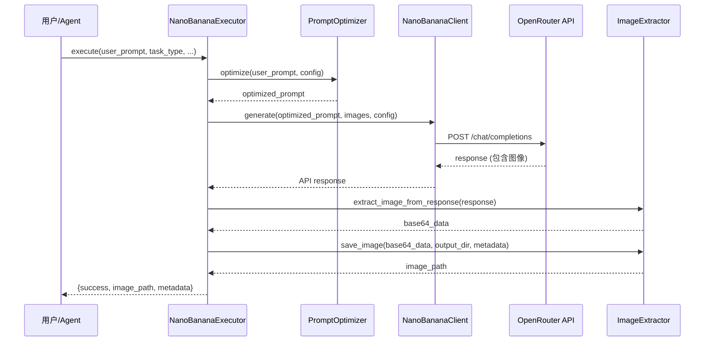

# Nano-Banana 扩展参考文档

> 深度技术文档和高级用法指南
> 本文档遵循渐进披露原则,提供超越 SKILL.md 的深度内容

## 📖 目录

1. [架构设计](#架构设计)
2. [API 详细说明](#api-详细说明)
3. [提示词优化引擎深度解析](#提示词优化引擎深度解析)
4. [批量处理系统](#批量处理系统)
5. [高级场景应用](#高级场景应用)
6. [性能优化指南](#性能优化指南)
7. [错误处理和调试](#错误处理和调试)
8. [扩展开发指南](#扩展开发指南)

---

## 架构设计

### 三层架构实现

本技能包严格遵循 ZTL 数智化作战中心的三层架构规范:

```
┌─────────────────────────────────────────┐
│  Layer 1: 规范层 (Knowledge Layer)       │
├─────────────────────────────────────────┤
│  SKILL.md          元数据 + 快速开始     │
│  reference.md      深度技术文档 (本文件) │
│  templates/        提示词模板库          │
└─────────────────────────────────────────┘
              ↓
┌─────────────────────────────────────────┐
│  Layer 2: 计划层 (Configuration Layer)   │
├─────────────────────────────────────────┤
│  JSON 执行计划     批量任务配置          │
│  output/.../plans/ 持久化计划文件        │
└─────────────────────────────────────────┘
              ↓
┌─────────────────────────────────────────┐
│  Layer 3: 执行层 (Execution Layer)       │
├─────────────────────────────────────────┤
│  core_engine.py    核心执行引擎          │
│  ├─ PromptOptimizer      提示词优化      │
│  ├─ NanoBananaClient     API 客户端      │
│  ├─ ImageExtractor       图像提取器      │
│  └─ NanoBananaExecutor   统一执行器      │
└─────────────────────────────────────────┘
```

### 核心组件交互流程



---

## API 详细说明

### NanoBananaClient 完整参数

#### 构造函数

```python
NanoBananaClient(api_key: Optional[str] = None)
```

**参数**:
- `api_key`: OpenRouter API Key
  - 如未提供,从环境变量 `OPENROUTER_API_KEY` 读取
  - 获取方式: https://openrouter.ai/keys

**异常**:
- `ValueError`: 未找到有效的 API Key

#### generate() 方法

```python
def generate(
    self,
    prompt: str,
    images: Optional[List[ImageInput]] = None,
    config: Optional[ImageConfig] = None
) -> Dict[str, Any]
```

**参数详解**:

| 参数 | 类型 | 必需 | 说明 |
|------|------|------|------|
| `prompt` | str | ✅ | 优化后的提示词 (建议通过 PromptOptimizer 生成) |
| `images` | List[ImageInput] | ❌ | 输入图像列表,支持最多 3 张 |
| `config` | ImageConfig | ❌ | 生成配置,未提供时使用默认值 |

**返回值**:

```python
{
    "id": "gen-abc123",
    "choices": [
        {
            "message": {
                "role": "assistant",
                "content": ""
            }
        }
    ],
    "usage": {
        "prompt_tokens": 150,
        "completion_tokens": 1290,  # 固定值 (每张图)
        "total_tokens": 1440
    }
}
```

**异常处理**:

```python
try:
    response = client.generate(prompt, images, config)
except requests.exceptions.HTTPError as e:
    if e.response.status_code == 401:
        print("API Key 无效")
    elif e.response.status_code == 429:
        print("请求频率超限")
    elif e.response.status_code == 500:
        print("API 服务异常")
except requests.exceptions.Timeout:
    print("请求超时 (120秒)")
```

### ImageInput 详细说明

支持三种图像输入方式:

#### 方式 1: 本地文件路径

```python
from scripts.core_engine import ImageInput

img = ImageInput(
    path="/path/to/image.jpg",
    description="可选的图像描述,用于多图合成时的语义理解"
)
```

**支持格式**: JPG, JPEG, PNG, GIF, WebP

#### 方式 2: 网络 URL

```python
img = ImageInput(
    url="https://example.com/image.jpg",
    description="网络图像"
)
```

**注意**: URL 必须公开可访问,不支持需要认证的图像

#### 方式 3: Base64 编码

```python
import base64

with open("image.jpg", "rb") as f:
    b64_data = base64.b64encode(f.read()).decode("utf-8")

img = ImageInput(
    base64_data=b64_data,
    description="Base64 编码的图像"
)
```

**优先级**: base64_data > path > url

### ImageConfig 高级配置

```python
from scripts.core_engine import ImageConfig

config = ImageConfig(
    aspect_ratio="16:9",
    max_tokens=8192,
    temperature=1.0,
    top_p=0.95,
    seed=42
)
```

#### aspect_ratio 详解

| 比例 | 分辨率 | 适用场景 | Token 消耗 |
|------|--------|---------|-----------|
| 1:1 | 1024x1024 | 社交媒体、头像、图标 | 1290 |
| 16:9 | 1820x1024 | 横版海报、屏幕壁纸 | 1290 |
| 4:3 | 1365x1024 | PPT、演示文稿 | 1290 |
| 3:2 | 1536x1024 | 摄影作品、打印照片 | 1290 |
| 2:3 | 683x1024 | 竖版海报、手机壁纸 | 1290 |
| 3:4 | 768x1024 | 竖版照片、门店展示 | 1290 |
| 9:16 | 576x1024 | 短视频封面、竖屏内容 | 1290 |
| 21:9 | 2389x1024 | 超宽屏、电影画幅 | 1290 |

**注意**: 所有比例统一消耗 1290 token ($0.039/张)

#### temperature 调优指南

| 温度值 | 特点 | 适用场景 |
|--------|------|---------|
| 0.3-0.5 | 保守、可预测、风格统一 | 产品摄影、品牌物料、需要高度一致性的设计 |
| 0.6-0.8 | 平衡、自然、细节丰富 | 通用场景摄影、菜品拍摄、门店实景 |
| 0.9-1.2 | 创意、多样、艺术化 | 海报设计、创意广告、艺术插画 |
| 1.3-2.0 | 实验性、高度随机、抽象 | 风格探索、艺术实验、非常规设计 |

**推荐值**:
- 餐饮海报设计: `0.9`
- 菜品摄影: `0.7`
- 品牌物料: `0.5`

#### seed 的作用

- **未设置 (None)**: 每次生成不同结果,增加多样性
- **固定值 (如 42)**: 相同提示词生成相同结果,用于:
  - 测试和调试
  - 批量生成时保持风格一致性
  - 复现特定生成结果

**示例**:

```python
# 生成 5 张风格一致的海报
for i in range(5):
    config = ImageConfig(seed=1234)
    result = executor.execute(
        f"火锅店海报 - 变体 {i+1}",
        config=config
    )
```

---

## 提示词优化引擎深度解析

### PromptOptimizer 架构

```python
PromptOptimizer
├── PHOTOGRAPHY_TERMS     # 摄影术语库
│   ├── lighting          # 光照术语 (8种)
│   ├── lens              # 镜头术语 (6种)
│   ├── shot_type         # 镜头类型 (7种)
│   └── depth             # 景深术语 (4种)
│
├── DESIGN_STYLES         # 设计风格库 (6种预设)
│
├── RESTAURANT_TEMPLATES  # 餐饮行业模板
│   ├── poster            # 海报模板
│   ├── menu              # 菜单模板
│   └── social_media      # 社交媒体模板
│
└── 优化策略方法
    ├── _optimize_text_to_image()
    ├── _optimize_editing()
    ├── _optimize_style_transfer()
    └── _optimize_multi_composition()
```

### 优化策略详解

#### 策略 1: 文生图优化 (_optimize_text_to_image)

**执行流程**:

1. **检测业务场景** → 匹配餐饮行业模板
2. **增强用户描述** → 提高具体性和细节
3. **添加风格术语** → 注入设计风格描述
4. **注入摄影术语** → 控制光照、镜头、构图
5. **添加特殊要求** → 附加用户自定义要求
6. **添加场景后缀** → 强调质量标准和输出规范

**代码示例**:

```python
optimizer = PromptOptimizer()

config = PromptOptimizationConfig(
    task_type="text-to-image",
    context="餐饮行业海报设计",
    target_style="摄影级",
    requirements=["300 DPI", "可打印质量"]
)

optimized = optimizer.optimize(
    user_prompt="火锅店开业海报,喜庆红色",
    config=config
)

# 输出示例:
# "Professional restaurant promotional poster design,
#  火锅店开业海报, 喜庆red色, ultra-realistic,
#  photographic quality, 8K resolution, golden hour light,
#  85mm portrait lens, close-up, 300 DPI, 可打印质量,
#  high-quality print resolution, attention-grabbing composition"
```

#### 策略 2: 图像编辑优化 (_optimize_editing)

**核心原则**: 明确的动作指令 + 保留语义

**动作映射表**:

| 中文动作 | 英文指令 | 示例 |
|---------|---------|------|
| 添加 | Add | Add a red lantern to the top left corner |
| 删除 | Remove | Remove the watermark |
| 替换 | Replace | Replace the background with a modern kitchen |
| 修改 | Modify | Modify the color scheme to warmer tones |
| 增强 | Enhance | Enhance the brightness of the food |
| 模糊 | Blur | Blur the background to focus on the dish |

**保留语义**:
- 自动添加: "preserve other elements unchanged"
- 自动添加: "maintain original lighting and perspective"

**示例**:

```python
# 用户输入: "删除左上角的水印"
# 优化后: "Remove the watermark from the top left corner,
#         preserve other elements unchanged,
#         maintain original lighting and perspective"
```

#### 策略 3: 风格迁移优化 (_optimize_style_transfer)

**风格库映射**:

| 中文风格 | 英文键 | 完整描述 |
|---------|-------|---------|
| 摄影级 | photorealistic | ultra-realistic, photographic quality, 8K resolution, high dynamic range |
| 卡通 | kawaii | cute kawaii style, bold outlines, pastel colors, chibi proportions |
| 简约 | minimalist | clean minimalist design, simple composition, negative space, modern aesthetic |
| 复古 | vintage | vintage aesthetic, film grain, retro color grading, nostalgic mood |
| 水彩 | watercolor | watercolor painting style, soft edges, flowing colors, artistic brush strokes |
| 商务 | corporate | professional corporate style, clean lines, trustworthy aesthetic, brand-focused |

**示例**:

```python
# 用户输入: "将这张照片转换为水彩画风格"
# 优化后: "Transform the image to watercolor painting style,
#         soft edges, flowing colors, artistic brush strokes,
#         将这张照片转换为水彩画风格,
#         preserve subject composition"
```

#### 策略 4: 多图合成优化 (_optimize_multi_composition)

**核心要素**:
- 无缝融合 (Seamlessly compose)
- 光照一致性 (consistent lighting)
- 透视自然 (natural perspective blending)
- 色彩和谐 (cohesive color harmony)

**示例**:

```python
# 用户输入: "将三张菜品图合成为一张宣传海报"
# 优化后: "Seamlessly compose multiple images:
#         将三张菜品图合成为一张宣传海报,
#         maintain consistent lighting across all elements,
#         natural perspective blending,
#         cohesive color harmony"
```

### 自定义优化器

如需扩展优化逻辑,可继承 `PromptOptimizer`:

```python
from scripts.core_engine import PromptOptimizer, PromptOptimizationConfig

class RestaurantChainOptimizer(PromptOptimizer):
    """针对连锁餐饮品牌的专用优化器"""

    BRAND_GUIDELINES = {
        "麦当劳": {
            "colors": "golden yellow, red, white",
            "style": "modern, family-friendly, energetic"
        },
        "星巴克": {
            "colors": "forest green, white, brown",
            "style": "cozy, premium, artisanal"
        }
    }

    def _optimize_text_to_image(self, user_prompt, config):
        # 调用父类优化
        base_optimized = super()._optimize_text_to_image(user_prompt, config)

        # 检测品牌名称
        for brand, guidelines in self.BRAND_GUIDELINES.items():
            if brand in user_prompt:
                # 添加品牌色彩指南
                base_optimized += f", brand colors: {guidelines['colors']}"
                # 添加品牌风格
                base_optimized += f", {guidelines['style']} aesthetic"
                break

        return base_optimized

# 使用自定义优化器
optimizer = RestaurantChainOptimizer()
executor = NanoBananaExecutor()
executor.optimizer = optimizer  # 替换默认优化器
```

---

## 批量处理系统

### JSON 执行计划规范

完整的 JSON 计划结构:

```json
{
  "plan_id": "batch_20250128_001",
  "project_name": "火锅店开业物料批量生成",
  "description": "生成海报、菜单、社交媒体图等全套开业物料",
  "created_at": "2025-01-28T10:30:00",
  "execution_config": {
    "max_concurrent": 3,
    "retry_attempts": 2,
    "output_base_dir": "output/火锅店开业物料批量生成/nano-banana"
  },
  "tasks": [
    {
      "task_id": "task_001",
      "description": "开业海报 - 主视觉",
      "user_prompt": "火锅店盛大开业,红色喜庆主色调,金色点缀,呈现热闹氛围",
      "task_type": "text-to-image",
      "context": "餐饮行业海报设计",
      "target_style": "摄影级",
      "requirements": ["300 DPI", "2:3竖版海报", "可打印质量"],
      "config": {
        "aspect_ratio": "2:3",
        "temperature": 0.9,
        "seed": null
      },
      "output_filename": "开业海报_主视觉.png"
    },
    {
      "task_id": "task_002",
      "description": "朋友圈宣传图 - 正方形",
      "user_prompt": "火锅店开业优惠活动,突出\"全场8折\",诱人的火锅特写",
      "task_type": "text-to-image",
      "context": "餐饮行业社交媒体",
      "target_style": "摄影级",
      "requirements": ["高清", "适合移动端"],
      "config": {
        "aspect_ratio": "1:1",
        "temperature": 0.8
      },
      "output_filename": "朋友圈_开业优惠.png"
    },
    {
      "task_id": "task_003",
      "description": "菜单摄影 - 招牌毛肚",
      "user_prompt": "新鲜毛肚特写,洁白质感,配红油底料,工作室光照,诱人食欲",
      "task_type": "text-to-image",
      "context": "餐饮行业菜单摄影",
      "target_style": "摄影级",
      "requirements": ["美食摄影标准", "高光泽度", "细节清晰"],
      "config": {
        "aspect_ratio": "4:3",
        "temperature": 0.7
      },
      "output_filename": "菜单_招牌毛肚.png"
    }
  ]
}
```

### 批处理执行器实现

创建 `scripts/batch_processor.py`:

```python
#!/usr/bin/env python3
"""批量处理执行器"""

import json
from pathlib import Path
from typing import Dict, Any, List
from concurrent.futures import ThreadPoolExecutor, as_completed
from datetime import datetime

from core_engine import (
    NanoBananaExecutor,
    ImageConfig,
    PromptOptimizationConfig
)


class BatchProcessor:
    """批量任务处理器"""

    def __init__(self, plan_path: str):
        """
        Args:
            plan_path: JSON 计划文件路径
        """
        self.plan_path = Path(plan_path)
        self.plan = self._load_plan()
        self.executor = NanoBananaExecutor()

    def _load_plan(self) -> Dict[str, Any]:
        """加载 JSON 计划"""
        with open(self.plan_path, "r", encoding="utf-8") as f:
            return json.load(f)

    def execute(self) -> List[Dict[str, Any]]:
        """执行批量任务"""
        tasks = self.plan["tasks"]
        exec_config = self.plan.get("execution_config", {})
        max_concurrent = exec_config.get("max_concurrent", 3)

        print(f"开始批量处理: {self.plan['project_name']}")
        print(f"任务总数: {len(tasks)}")
        print(f"最大并发: {max_concurrent}")
        print("-" * 60)

        results = []

        with ThreadPoolExecutor(max_workers=max_concurrent) as pool:
            future_to_task = {
                pool.submit(self._execute_task, task): task
                for task in tasks
            }

            for future in as_completed(future_to_task):
                task = future_to_task[future]
                try:
                    result = future.result()
                    results.append(result)
                    print(f"✅ [{task['task_id']}] {task['description']}")
                except Exception as e:
                    print(f"❌ [{task['task_id']}] 失败: {e}")
                    results.append({
                        "task_id": task["task_id"],
                        "success": False,
                        "error": str(e)
                    })

        # 保存批处理报告
        self._save_report(results)

        print("-" * 60)
        print(f"批处理完成! 成功: {sum(1 for r in results if r.get('success'))}/{len(results)}")

        return results

    def _execute_task(self, task: Dict[str, Any]) -> Dict[str, Any]:
        """执行单个任务"""
        # 构建配置
        config = ImageConfig(**task.get("config", {}))

        # 执行生成
        result = self.executor.execute(
            user_prompt=task["user_prompt"],
            task_type=task.get("task_type", "text-to-image"),
            context=task.get("context", ""),
            target_style=task.get("target_style"),
            requirements=task.get("requirements"),
            config=config,
            project_name=self.plan["project_name"]
        )

        # 添加任务 ID
        result["task_id"] = task["task_id"]
        result["description"] = task["description"]

        return result

    def _save_report(self, results: List[Dict[str, Any]]):
        """保存批处理报告"""
        report = {
            "plan_id": self.plan["plan_id"],
            "project_name": self.plan["project_name"],
            "executed_at": datetime.now().isoformat(),
            "total_tasks": len(results),
            "successful_tasks": sum(1 for r in results if r.get("success")),
            "failed_tasks": sum(1 for r in results if not r.get("success")),
            "results": results
        }

        # 保存到 output/[项目名]/nano-banana/logs/
        output_dir = Path("output") / self.plan["project_name"] / "nano-banana" / "logs"
        output_dir.mkdir(parents=True, exist_ok=True)

        report_path = output_dir / f"batch_report_{self.plan['plan_id']}.json"
        with open(report_path, "w", encoding="utf-8") as f:
            json.dumps(report, f, ensure_ascii=False, indent=2)

        print(f"📊 批处理报告已保存: {report_path}")


def main():
    """命令行入口"""
    import sys

    if len(sys.argv) < 2:
        print("用法: python batch_processor.py <plan.json>")
        sys.exit(1)

    plan_path = sys.argv[1]
    processor = BatchProcessor(plan_path)
    processor.execute()


if __name__ == "__main__":
    main()
```

### 使用方法

1. **创建计划文件**: 将上述 JSON 保存为 `plans/batch_001.json`

2. **执行批处理**:

```bash
cd plugins/创意组/skills/AIGC/nano-banana
python scripts/batch_processor.py plans/batch_001.json
```

3. **查看结果**:

```
output/火锅店开业物料批量生成/nano-banana/
├── results/
│   ├── 开业海报_主视觉.png
│   ├── 朋友圈_开业优惠.png
│   └── 菜单_招牌毛肚.png
└── logs/
    └── batch_report_batch_20250128_001.json
```

---

## 高级场景应用

### 场景 1: 品牌 IP 角色一致性设计

**需求**: 为火锅品牌设计吉祥物"火火",需要在多个场景保持角色一致性

**实现步骤**:

1. **生成基础设计**:

```python
# 第一步: 生成吉祥物基础形象
result_base = executor.execute(
    user_prompt="""
    设计一只可爱的卡通火锅吉祥物,名叫"火火":
    - 身体是一只圆形的小火锅
    - 头顶有欢快的小火苗
    - 大眼睛、微笑表情
    - 红色为主色调,金色点缀
    - Q版比例,萌趣风格
    """,
    task_type="text-to-image",
    context="品牌IP设计",
    target_style="卡通",
    config=ImageConfig(seed=9999),  # 固定种子保证一致性
    project_name="火火IP设计"
)
```

2. **生成不同场景的变体** (保持角色一致):

```python
# 使用生成的基础形象作为参考
base_image = ImageInput(
    path=result_base["image_path"],
    description="火火吉祥物基础形象"
)

# 场景 1: 火火在厨房
result_kitchen = executor.execute(
    user_prompt="火火在厨房准备食材,背景是现代化的厨房,保持角色特征不变",
    task_type="character-consistency",
    images=[base_image],
    config=ImageConfig(seed=9999),
    project_name="火火IP设计"
)

# 场景 2: 火火在门店
result_store = executor.execute(
    user_prompt="火火在门店门口欢迎顾客,背景是火锅店门头,保持角色特征不变",
    task_type="character-consistency",
    images=[base_image],
    config=ImageConfig(seed=9999),
    project_name="火火IP设计"
)
```

### 场景 2: 产品多角度展示

**需求**: 为新品"麻辣牛油锅底"生成多角度产品图

```python
# 主视角 - 俯拍
result_top = executor.execute(
    user_prompt="麻辣牛油锅底,俯拍视角,bird's eye view,红油沸腾,辣椒花椒浮动,工作室光照",
    task_type="text-to-image",
    context="餐饮行业产品摄影",
    target_style="摄影级",
    requirements=["商业摄影标准", "高光泽度", "细节清晰"],
    config=ImageConfig(aspect_ratio="1:1", temperature=0.6, seed=1111),
    project_name="牛油锅底产品图"
)

# 侧视角 - 平拍
result_side = executor.execute(
    user_prompt="麻辣牛油锅底,平拍视角,eye-level shot,展示红油厚度,辣椒细节,three-point lighting",
    task_type="text-to-image",
    context="餐饮行业产品摄影",
    target_style="摄影级",
    requirements=["商业摄影标准", "高光泽度", "细节清晰"],
    config=ImageConfig(aspect_ratio="4:3", temperature=0.6, seed=1111),
    project_name="牛油锅底产品图"
)

# 特写 - 微距
result_macro = executor.execute(
    user_prompt="麻辣牛油锅底,macro close-up,辣椒和花椒特写,油脂质感,shallow depth of field",
    task_type="text-to-image",
    context="餐饮行业产品摄影",
    target_style="摄影级",
    requirements=["商业摄影标准", "高光泽度", "细节清晰"],
    config=ImageConfig(aspect_ratio="16:9", temperature=0.6, seed=1111),
    project_name="牛油锅底产品图"
)
```

### 场景 3: 社交媒体内容矩阵

**需求**: 为火锅店生成一周的朋友圈内容

```python
# 周一: 新品推荐
monday = executor.execute(
    "周一新品尝鲜!麻辣牛油锅底,红油沸腾,辣味十足,配文:一周好心情,从辣开始",
    task_type="text-to-image",
    context="餐饮行业社交媒体",
    config=ImageConfig(aspect_ratio="1:1", temperature=0.8),
    project_name="一周朋友圈内容"
)

# 周三: 顾客好评
wednesday = executor.execute(
    "顾客5星好评截图 + 店内就餐场景,温馨氛围,配文:感谢每一位顾客的喜爱",
    task_type="multi-composition",
    context="餐饮行业社交媒体",
    config=ImageConfig(aspect_ratio="1:1"),
    project_name="一周朋友圈内容"
)

# 周五: 周末优惠
friday = executor.execute(
    "周末狂欢!满200减50优惠券,红色背景,金色文字,喜庆热闹",
    task_type="text-to-image",
    context="餐饮行业社交媒体",
    requirements=["醒目标题", "优惠信息突出"],
    config=ImageConfig(aspect_ratio="1:1", temperature=0.9),
    project_name="一周朋友圈内容"
)

# 周日: 幕后故事
sunday = executor.execute(
    "厨师长精心准备食材,后厨场景,真实感,配文:用心做好每一锅",
    task_type="text-to-image",
    context="餐饮行业社交媒体",
    target_style="摄影级",
    config=ImageConfig(aspect_ratio="1:1", temperature=0.7),
    project_name="一周朋友圈内容"
)
```

---

## 性能优化指南

### Token 优化策略

#### 1. 提示词长度控制

```python
# ❌ 低效: 冗长的提示词
bad_prompt = """
我需要一张非常专业的火锅店海报,这张海报要用于我们即将举办的盛大开业活动,
希望能体现出火锅的热闹氛围,使用红色作为主色调因为红色代表喜庆和热情,
同时希望有金色的点缀来提升档次感,整体风格要现代时尚,符合年轻消费群体的审美,
画面要清晰锐利,适合打印成大幅海报张贴在店门口...
"""

# ✅ 高效: 精炼的关键描述
good_prompt = "火锅店盛大开业海报,红色喜庆主色调,金色点缀,现代时尚,年轻活力"
```

**优化效果**: 减少 ~70% 输入 token,加快 API 响应

#### 2. 图像输入优化

```python
from PIL import Image

def optimize_input_image(image_path: str, max_size: int = 1024) -> str:
    """压缩输入图像以减少 token 消耗"""
    img = Image.open(image_path)

    # 计算压缩比例
    width, height = img.size
    if max(width, height) > max_size:
        ratio = max_size / max(width, height)
        new_size = (int(width * ratio), int(height * ratio))
        img = img.resize(new_size, Image.Resampling.LANCZOS)

    # 保存压缩后的图像
    output_path = f"temp_optimized_{Path(image_path).name}"
    img.save(output_path, quality=85, optimize=True)

    return output_path

# 使用示例
optimized_path = optimize_input_image("high_res_image.jpg")
img = ImageInput(path=optimized_path)
```

**优化效果**: 减少 ~50% 图像 token 消耗

### 并发执行优化

#### 批量任务并行化

```python
from concurrent.futures import ThreadPoolExecutor

def parallel_generate(prompts: List[str], max_workers: int = 3):
    """并行生成多个图像"""
    executor = NanoBananaExecutor()

    with ThreadPoolExecutor(max_workers=max_workers) as pool:
        futures = [
            pool.submit(executor.execute, prompt, project_name="批量生成")
            for prompt in prompts
        ]

        results = [future.result() for future in futures]

    return results

# 使用示例
prompts = [
    "火锅店海报 - 版本1",
    "火锅店海报 - 版本2",
    "火锅店海报 - 版本3"
]

results = parallel_generate(prompts, max_workers=3)
```

**优化效果**: 3倍加速 (相比串行执行)

### 成本控制策略

#### 1. 智能重试机制

```python
import time

def generate_with_retry(
    executor: NanoBananaExecutor,
    prompt: str,
    max_retries: int = 2
) -> Dict[str, Any]:
    """带重试的生成,避免因临时错误浪费 token"""
    for attempt in range(max_retries + 1):
        try:
            return executor.execute(prompt)
        except Exception as e:
            if attempt < max_retries:
                wait_time = 2 ** attempt  # 指数退避
                print(f"重试 {attempt + 1}/{max_retries}, 等待 {wait_time}秒...")
                time.sleep(wait_time)
            else:
                raise e
```

#### 2. 结果缓存

```python
import hashlib
import json
from pathlib import Path

class CachedExecutor(NanoBananaExecutor):
    """带缓存的执行器,避免重复生成相同内容"""

    def __init__(self, cache_dir: str = ".cache"):
        super().__init__()
        self.cache_dir = Path(cache_dir)
        self.cache_dir.mkdir(exist_ok=True)

    def execute(self, user_prompt: str, **kwargs):
        # 计算缓存键
        cache_key = self._compute_cache_key(user_prompt, kwargs)
        cache_file = self.cache_dir / f"{cache_key}.json"

        # 检查缓存
        if cache_file.exists():
            print(f"✨ 使用缓存结果")
            with open(cache_file, "r") as f:
                return json.load(f)

        # 生成新结果
        result = super().execute(user_prompt, **kwargs)

        # 保存到缓存
        with open(cache_file, "w") as f:
            json.dump(result, f)

        return result

    def _compute_cache_key(self, prompt: str, kwargs: dict) -> str:
        """计算缓存键"""
        content = f"{prompt}_{json.dumps(kwargs, sort_keys=True)}"
        return hashlib.md5(content.encode()).hexdigest()
```

---

## 错误处理和调试

### 常见错误和解决方案

#### 错误 1: API Key 无效

**错误信息**:
```
requests.exceptions.HTTPError: 401 Client Error: Unauthorized
```

**解决方案**:
1. 检查环境变量: `echo $OPENROUTER_API_KEY`
2. 验证 Key 格式: 必须以 `sk-or-v1-` 开头
3. 检查 Key 是否过期或被禁用
4. 重新生成 Key: https://openrouter.ai/keys

#### 错误 2: 图像提取失败

**错误信息**:
```
未能从响应中提取图像
```

**调试步骤**:

```python
import json

# 1. 打印完整 API 响应
response = client.generate(prompt)
print(json.dumps(response, indent=2))

# 2. 检查响应结构
if "choices" in response:
    content = response["choices"][0]["message"]["content"]
    print(f"Content type: {type(content)}")
    print(f"Content preview: {content[:200]}...")

# 3. 检查是否返回了错误
if "error" in response:
    print(f"API 错误: {response['error']}")
```

#### 错误 3: 请求超时

**错误信息**:
```
requests.exceptions.Timeout: HTTPSConnectionPool
```

**解决方案**:

```python
# 增加超时时间
client.generate(prompt, timeout=300)  # 5分钟

# 或使用重试机制
def generate_with_timeout(prompt, max_attempts=3):
    for attempt in range(max_attempts):
        try:
            return client.generate(prompt, timeout=180)
        except requests.exceptions.Timeout:
            if attempt < max_attempts - 1:
                print(f"超时,重试 {attempt + 1}/{max_attempts - 1}...")
            else:
                raise
```

### 调试模式

启用详细日志:

```python
import logging

logging.basicConfig(
    level=logging.DEBUG,
    format='%(asctime)s - %(name)s - %(levelname)s - %(message)s'
)

# 在 NanoBananaClient 中添加日志
class NanoBananaClient:
    def generate(self, prompt, images=None, config=None):
        logging.info(f"发送请求: prompt_length={len(prompt)}")
        logging.debug(f"完整提示词: {prompt}")

        response = requests.post(...)

        logging.info(f"收到响应: status_code={response.status_code}")
        logging.debug(f"响应内容: {response.json()}")

        return response.json()
```

---

## 扩展开发指南

### 添加新的提示词模板

1. **在 PromptOptimizer 中添加模板**:

```python
class PromptOptimizer:
    # 在 RESTAURANT_TEMPLATES 中添加新类型
    RESTAURANT_TEMPLATES = {
        "poster": {...},
        "menu": {...},
        "social_media": {...},
        "coupon": {  # 新增: 优惠券模板
            "prefix": "Eye-catching promotional coupon design,",
            "suffix": "clear discount information, limited-time urgency, action-oriented layout"
        }
    }
```

2. **更新检测逻辑**:

```python
def _detect_restaurant_type(self, prompt: str) -> Optional[str]:
    if any(kw in prompt for kw in ["优惠券", "coupon", "折扣"]):
        return "coupon"
    # ... 其他检测逻辑
```

### 集成新的 API 能力

如 Gemini 发布新功能 (如视频生成),可扩展:

```python
class NanoBananaClient:
    def generate_video(
        self,
        prompt: str,
        duration: int = 5,
        fps: int = 30
    ) -> Dict[str, Any]:
        """生成视频 (假设 API 支持)"""
        payload = {
            "model": self.MODEL,
            "messages": [...],
            "video_config": {
                "duration": duration,
                "fps": fps
            }
        }

        response = requests.post(...)
        return response.json()
```

### 创建插件系统

支持第三方扩展:

```python
# plugins/custom_optimizer.py
from scripts.core_engine import PromptOptimizer

class CustomOptimizer(PromptOptimizer):
    """自定义优化器插件"""
    pass

# 在 NanoBananaExecutor 中加载插件
class NanoBananaExecutor:
    def __init__(self, api_key=None, optimizer_plugin=None):
        self.client = NanoBananaClient(api_key)
        if optimizer_plugin:
            self.optimizer = optimizer_plugin()
        else:
            self.optimizer = PromptOptimizer()
```

---

## 附录

### A. 完整 API 参数速查表

| 参数 | 类型 | 默认值 | 说明 |
|------|------|--------|------|
| `prompt` | str | - | 提示词 (必需) |
| `images` | List[ImageInput] | None | 输入图像列表 |
| `aspect_ratio` | str | "1:1" | 图像比例 |
| `max_tokens` | int | 8192 | 最大 token 数 |
| `temperature` | float | 1.0 | 创意度 (0.0-2.0) |
| `top_p` | float | 0.95 | 采样策略 |
| `seed` | int | None | 随机种子 |

### B. 成本计算公式

```
总成本 = 输入成本 + 输出成本

输入成本 = (提示词 token 数 × $0.30 / 1M) + (输入图像数 × $1.238 / 1K)
输出成本 = 1290 token × $2.50 / 1M = $0.003225

平均每张图像: ~$0.039 USD
```

### C. 性能基准测试

| 场景 | 平均耗时 | Token 消耗 | 成本 |
|------|---------|-----------|------|
| 简单文生图 | 8-12秒 | 150 input + 1290 output | $0.039 |
| 复杂文生图 | 12-18秒 | 300 input + 1290 output | $0.040 |
| 图生图 | 15-25秒 | 500 input + 1290 output | $0.041 |
| 多图合成 | 20-35秒 | 1000 input + 1290 output | $0.045 |

---

**文档版本**: v1.0.0
**最后更新**: 2025-01-28
**维护者**: ZTL 数智化作战中心 - 创意组
