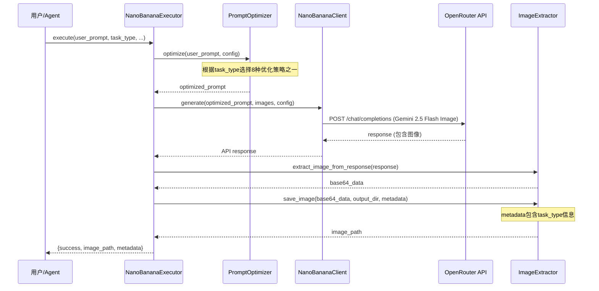

# Nano-Banana 扩展参考文档

> AIGC图片多工作流技能包 - 深度技术文档和高级用法指南
> 本文档遵循渐进披露原则,提供超越 SKILL.md 的深度内容

## 📖 目录

1. [架构设计](#架构设计)
2. [9种工作流详细说明](#9种工作流详细说明)
3. [提示词优化引擎深度解析](#提示词优化引擎深度解析)
4. [API 详细说明](#api-详细说明)
5. [批量处理系统](#批量处理系统)
6. [高级场景应用](#高级场景应用)
7. [性能优化指南](#性能优化指南)
8. [错误处理和调试](#错误处理和调试)
9. [扩展开发指南](#扩展开发指南)

---

## 架构设计

### 核心定位

**nano-banana** = AIGC图片多工作流技能包 (不是写实摄影技能包)

核心能力:
- ✅ 9种集成图片处理工作流
- ✅ 每种工作流专属提示词优化策略
- ✅ 自动检测餐饮行业场景并优化
- ✅ 任务类型特定的参数推荐 (temperature, aspect_ratio)
- ✅ 完整的元数据追溯系统

### 三层架构实现

本技能包严格遵循 ZTL 数智化作战中心的三层架构规范:

```
┌─────────────────────────────────────────┐
│  Layer 1: 规范层 (Knowledge Layer)       │
├─────────────────────────────────────────┤
│  SKILL.md          元数据 + 9种工作流快速开始 │
│  reference.md      深度技术文档 (本文件)     │
│  templates/        提示词模板库 (可选)       │
└─────────────────────────────────────────┘
              ↓
┌─────────────────────────────────────────┐
│  Layer 2: 计划层 (Configuration Layer)   │
├─────────────────────────────────────────┤
│  JSON 执行计划     批量任务配置            │
│  output/.../plans/ 持久化计划文件        │
└─────────────────────────────────────────┘
              ↓
┌─────────────────────────────────────────┐
│  Layer 3: 执行层 (Execution Layer)       │
├─────────────────────────────────────────┤
│  core_engine.py    核心执行引擎            │
│  ├─ PromptOptimizer (9种专属优化策略)     │
│  ├─ NanoBananaClient (API 客户端)        │
│  ├─ ImageExtractor (图像提取器)          │
│  └─ NanoBananaExecutor (统一执行器)      │
└─────────────────────────────────────────┘
```

### 核心组件交互流程



---

## 9种工作流详细说明

### 概览表

| 序号 | 工作流类型 | task_type | 推荐temperature | 推荐aspect_ratio |
|-----|-----------|-----------|----------------|-----------------|
| 1 | 文生图 | text-to-image | 1.0 | 16:9 |
| 2 | 风格参考生图 | style-reference | 0.8 | None (自适应) |
| 3 | 主体参考生图 | subject-reference | 0.7 | None (自适应) |
| 4 | 背景替换 | background-replace | 0.8 | None (自适应) |
| 5 | 主体替换 | subject-replace | 0.8 | None (自适应) |
| 6 | 局部修改 | local-edit | 0.6 | None (自适应) |
| 7 | 调整动作/角度/空间 | pose-angle-space | 0.7 | None (自适应) |
| 8 | 风格转绘 | style-transfer | 1.0 | None (自适应) |
| 9 | 提示词优化器 | - | - | - |

### 工作流 1: 文生图 (text-to-image)

**定义**: 从文本描述直接生成图片

**典型场景**:
- 创意海报设计
- 产品概念图
- 营销物料初稿
- 社交媒体内容

**推荐配置**:
```python
config = ImageConfig(
    aspect_ratio="16:9",  # 适合横版内容
    temperature=1.0       # 高创意度
)
```

**提示词优化策略**:
- 高质量描述词注入 ("ultra-realistic", "8K resolution")
- 摄影术语强化 (光照、镜头、构图)
- 餐饮行业场景自动检测和模板应用
- 细节增强 (材质、纹理、氛围)

**代码示例**:
```python
result = executor.execute(
    user_prompt="火锅店开业海报,喜庆红色配色,金色点缀,热闹氛围",
    task_type="text-to-image",
    context="餐饮行业海报设计",
    target_style="专业设计",
    project_name="火锅店开业筹备",
    config=ImageConfig(aspect_ratio="2:3", temperature=1.0)
)
```

### 工作流 2: 风格参考生图 (style-reference)

**定义**: 参考图片风格 + 文本描述 → 生成新图片

**典型场景**:
- 品牌风格统一
- 系列设计延续
- 风格迁移创作

**推荐配置**:
```python
config = ImageConfig(
    temperature=0.8  # 中等创意度,保持风格一致性
)
```

**提示词优化策略**:
- 强调风格一致性 ("consistent visual style")
- 参考图片风格特征提取
- 色彩、构图、质感的连贯性指令

**代码示例**:
```python
reference_image = ImageInput(
    path="brand_reference.jpg",
    description="品牌标准风格参考图"
)

result = executor.execute(
    user_prompt="新产品海报,保持品牌视觉风格不变",
    task_type="style-reference",
    images=[reference_image],
    context="品牌物料设计",
    project_name="新品发布",
    config=ImageConfig(temperature=0.8)
)
```

### 工作流 3: 主体参考生图 (subject-reference)

**定义**: 参考图片主体 + 文本描述 → 生成包含相同主体的新图片

**典型场景**:
- IP角色一致性设计
- 产品在不同场景展示
- 人物/物体保持不变更换背景

**推荐配置**:
```python
config = ImageConfig(
    temperature=0.7  # 较低温度,保持主体特征
)
```

**提示词优化策略**:
- 主体保持指令 ("preserve subject identity")
- 细节特征强调
- 边缘融合自然性

**代码示例**:
```python
subject_image = ImageInput(
    path="mascot.png",
    description="品牌吉祥物"
)

result = executor.execute(
    user_prompt="吉祥物在餐厅门口欢迎顾客,保持角色特征不变",
    task_type="subject-reference",
    images=[subject_image],
    context="品牌IP设计",
    project_name="吉祥物系列场景",
    config=ImageConfig(temperature=0.7)
)
```

### 工作流 4: 背景替换 (background-replace)

**定义**: 保持主体,更换背景

**典型场景**:
- 产品场景切换
- 环境氛围调整
- 背景美化升级

**推荐配置**:
```python
config = ImageConfig(
    temperature=0.8  # 平衡主体保持和背景创意
)
```

**提示词优化策略**:
- 主体保护策略 ("keep subject intact")
- 背景环境描述增强
- 边缘融合指令 ("natural edge blending")
- 光照一致性确保 ("consistent lighting")

**代码示例**:
```python
original_image = ImageInput(
    path="dish.jpg",
    description="原始菜品图片"
)

result = executor.execute(
    user_prompt="更换背景为中式餐厅环境,温馨木质装修,保持菜品完整",
    task_type="background-replace",
    images=[original_image],
    context="菜品图片优化",
    project_name="菜单升级",
    config=ImageConfig(temperature=0.8)
)
```

### 工作流 5: 主体替换 (subject-replace)

**定义**: 保持背景,更换主体

**典型场景**:
- 产品替换展示
- 角色替换设计
- A/B测试不同主体

**推荐配置**:
```python
config = ImageConfig(
    temperature=0.8
)
```

**提示词优化策略**:
- 背景保护策略 ("preserve background")
- 新主体详细描述
- 比例和透视匹配 ("scale and perspective matching")
- 光影协调 ("lighting harmony")

**代码示例**:
```python
background_image = ImageInput(
    path="restaurant_interior.jpg",
    description="餐厅场景背景"
)

result = executor.execute(
    user_prompt="将原主体替换为火锅餐桌场景,保持背景餐厅环境不变",
    task_type="subject-replace",
    images=[background_image],
    context="场景合成",
    project_name="餐厅场景设计",
    config=ImageConfig(temperature=0.8)
)
```

### 工作流 6: 局部修改 (local-edit)

**定义**: 针对图片特定区域进行精确修改

**典型场景**:
- 细节调整
- 小范围瑕疵修复
- 局部颜色/质感调整

**推荐配置**:
```python
config = ImageConfig(
    temperature=0.6  # 最低温度,确保精确性
)
```

**提示词优化策略**:
- 精确编辑指令 ("precisely edit only the specified area")
- 区域定位描述 (位置、范围)
- 其他区域保护 ("preserve all other areas unchanged")

**代码示例**:
```python
original_image = ImageInput(
    path="poster.png",
    description="需要修改的海报"
)

result = executor.execute(
    user_prompt="修改左上角文字颜色为金色,其他部分保持不变",
    task_type="local-edit",
    images=[original_image],
    context="海报细节调整",
    project_name="海报优化",
    config=ImageConfig(temperature=0.6)
)
```

### 工作流 7: 调整动作/角度/空间 (pose-angle-space)

**定义**: 修改主体姿势、相机角度或空间布局

**典型场景**:
- 人物/角色姿势调整
- 视角切换
- 物体空间位置调整
- 构图优化

**推荐配置**:
```python
config = ImageConfig(
    temperature=0.7
)
```

**提示词优化策略**:
- 空间关系clarification ("spatial relationship clarification")
- 姿势/角度详细描述
- 物理可信性保证 ("physically plausible")
- 透视一致性 ("consistent perspective")

**代码示例**:
```python
original_image = ImageInput(
    path="character.png",
    description="原始角色图"
)

result = executor.execute(
    user_prompt="将角色姿势调整为站立迎宾姿态,相机角度从正面改为15度仰拍",
    task_type="pose-angle-space",
    images=[original_image],
    context="角色设计",
    project_name="吉祥物姿势优化",
    config=ImageConfig(temperature=0.7)
)
```

### 工作流 8: 风格转绘 (style-transfer)

**定义**: 完全改变图片艺术风格,保持内容结构

**典型场景**:
- 照片转艺术画
- 风格统一化
- 创意风格探索

**推荐配置**:
```python
config = ImageConfig(
    temperature=1.0  # 高创意度,艺术化表达
)
```

**提示词优化策略**:
- 艺术风格关键词注入 (水彩、油画、卡通等)
- 风格特征详细描述
- 内容结构保持指令 ("preserve content structure")

**代码示例**:
```python
original_image = ImageInput(
    path="photo.jpg",
    description="原始照片"
)

result = executor.execute(
    user_prompt="转换为水彩画风格,柔和边缘,流动色彩,艺术笔触",
    task_type="style-transfer",
    images=[original_image],
    context="艺术化处理",
    project_name="照片艺术转换",
    config=ImageConfig(temperature=1.0)
)
```

### 工作流 9: 提示词优化器

**定义**: 为以上8种工作流提供专属提示词优化策略

**核心能力**:
- 每种workflow type有独立的优化方法
- 餐饮行业场景自动检测
- 根据task_type推荐temperature和aspect_ratio
- 高质量提示词生成

**调用方式**: 在execute()时自动调用,无需手动触发

---

## 提示词优化引擎深度解析

### PromptOptimizer 架构

```python
PromptOptimizer (v2.0 - 9-Workflow架构)
│
├── TASK_TYPE_CONFIGS       # 8种任务类型推荐配置
│   ├── text-to-image:      temperature=1.0, aspect_ratio="16:9"
│   ├── style-reference:    temperature=0.8
│   ├── subject-reference:  temperature=0.7
│   ├── background-replace: temperature=0.8
│   ├── subject-replace:    temperature=0.8
│   ├── local-edit:         temperature=0.6
│   ├── pose-angle-space:   temperature=0.7
│   └── style-transfer:     temperature=1.0
│
├── RESTAURANT_SCENARIOS    # 餐饮行业场景库
│   ├── hotpot (火锅)
│   ├── fine-dining (精致餐饮)
│   ├── fast-food (快餐)
│   └── cafe (咖啡厅)
│
└── 8种专属优化策略方法
    ├── _optimize_text_to_image()        # 工作流1
    ├── _optimize_style_reference()      # 工作流2
    ├── _optimize_subject_reference()    # 工作流3
    ├── _optimize_background_replace()   # 工作流4
    ├── _optimize_subject_replace()      # 工作流5
    ├── _optimize_local_edit()           # 工作流6
    ├── _optimize_pose_angle_space()     # 工作流7
    └── _optimize_style_transfer()       # 工作流8
```

### 优化策略详解

#### 策略 1: text-to-image 优化

**优化流程**:
1. 餐饮场景检测 → 应用行业模板
2. 高质量描述词注入 ("ultra-realistic", "8K resolution")
3. 摄影术语强化 (光照、镜头、构图)
4. 细节增强 (材质、纹理、氛围)

**优化前后对比**:
```python
# 用户输入
"火锅店开业海报"

# 优化后
"Professional restaurant grand opening poster design, 火锅店开业海报,
festive atmosphere, vibrant red and gold color scheme, steaming hotpot center stage,
ultra-realistic, photographic quality, 8K resolution, golden hour lighting,
85mm portrait lens, eye-level shot, shallow depth of field,
high-quality print resolution, attention-grabbing composition"
```

#### 策略 2: style-reference 优化

**优化流程**:
1. 强调风格一致性
2. 参考图片风格元素提取指令
3. 色彩/构图/质感连贯性

**优化示例**:
```python
# 用户输入
"新产品海报,保持品牌风格"

# 优化后
"Create new product poster maintaining consistent visual style from reference image,
preserve brand color palette, composition principles, and design aesthetic,
新产品海报, 保持品牌风格,
coherent style continuity, professional brand consistency"
```

#### 策略 3: subject-reference 优化

**优化流程**:
1. 主体保持指令强化
2. 细节特征描述
3. 边缘融合自然性

**优化示例**:
```python
# 用户输入
"吉祥物在餐厅场景"

# 优化后
"Generate new scene with the same subject character from reference image,
preserve subject identity, facial features, proportions, and distinctive characteristics,
吉祥物在餐厅场景,
natural edge integration, subject consistency maintained"
```

#### 策略 4: background-replace 优化

**优化流程**:
1. 主体保护策略
2. 背景环境详细描述
3. 边缘融合和光照一致性

**优化示例**:
```python
# 用户输入
"换成中式餐厅背景"

# 优化后
"Replace background with new environment while keeping subject completely intact,
换成中式餐厅背景, traditional Chinese restaurant interior, warm wooden decoration,
natural edge blending, consistent lighting between subject and new background,
seamless integration"
```

#### 策略 5: subject-replace 优化

**优化流程**:
1. 背景保护策略
2. 新主体详细描述
3. 比例和光影匹配

**优化示例**:
```python
# 用户输入
"主体替换为火锅餐桌"

# 优化后
"Replace subject with new element while preserving background environment,
主体替换为火锅餐桌, steaming hotpot on table setup,
scale and perspective matching with original composition,
lighting harmony with existing background"
```

#### 策略 6: local-edit 优化

**优化流程**:
1. 精确编辑区域定位
2. 其他区域保护指令
3. 细微调整描述

**优化示例**:
```python
# 用户输入
"修改左上角文字为金色"

# 优化后
"Precisely edit only the specified area: 修改左上角文字为金色,
change text color to gold in top-left corner,
preserve all other areas unchanged, minimal modification, surgical precision"
```

#### 策略 7: pose-angle-space 优化

**优化流程**:
1. 空间关系clarification
2. 姿势/角度详细描述
3. 物理可信性和透视一致性

**优化示例**:
```python
# 用户输入
"调整角色为站立姿态,15度仰拍"

# 优化后
"Adjust subject pose, camera angle, and spatial arrangement:
调整角色为站立姿态, standing welcoming posture, 15度仰拍, 15-degree low-angle shot,
spatial relationship clarification, physically plausible positioning,
consistent perspective transformation"
```

#### 策略 8: style-transfer 优化

**优化流程**:
1. 艺术风格关键词注入
2. 风格特征详细描述
3. 内容结构保持

**优化示例**:
```python
# 用户输入
"转为水彩画风格"

# 优化后
"Transform image to artistic style while preserving content structure:
转为水彩画风格, watercolor painting aesthetic,
soft flowing edges, artistic brush strokes, transparent layered colors,
painterly quality, preserve subject composition"
```

### 餐饮行业自动检测

```python
RESTAURANT_SCENARIOS = {
    "hotpot": {
        "keywords": ["火锅", "hotpot", "麻辣", "锅底"],
        "enhancements": "steaming broth, vibrant red chili oil, fresh ingredients arrangement"
    },
    "fine-dining": {
        "keywords": ["高端", "精致", "米其林", "fine-dining"],
        "enhancements": "elegant plating, refined presentation, premium quality"
    },
    "fast-food": {
        "keywords": ["快餐", "汉堡", "炸鸡", "fast-food"],
        "enhancements": "appetizing composition, golden crispy texture"
    },
    "cafe": {
        "keywords": ["咖啡", "cafe", "奶茶", "甜品"],
        "enhancements": "cozy atmosphere, artisanal presentation, Instagram-worthy"
    }
}
```

当用户prompt包含场景关键词时,自动应用增强描述。

---

## API 详细说明

### NanoBananaClient 完整参数

#### 构造函数

```python
NanoBananaClient(api_key: Optional[str] = None)
```

**参数**:
- `api_key`: OpenRouter API Key
  - 如未提供,从环境变量 `OPENROUTER_API_KEY` 读取
  - 获取方式: https://openrouter.ai/keys

**异常**:
- `ValueError`: 未找到有效的 API Key

#### generate() 方法

```python
def generate(
    self,
    prompt: str,
    images: Optional[List[ImageInput]] = None,
    config: Optional[ImageConfig] = None
) -> Dict[str, Any]
```

**参数详解**:

| 参数 | 类型 | 必需 | 说明 |
|------|------|------|------|
| `prompt` | str | ✅ | 优化后的提示词 (由 PromptOptimizer 生成) |
| `images` | List[ImageInput] | ❌ | 输入图像列表,支持最多 3 张 |
| `config` | ImageConfig | ❌ | 生成配置,未提供时使用默认值 |

**返回值**:

```python
{
    "id": "gen-abc123",
    "choices": [
        {
            "message": {
                "role": "assistant",
                "content": ""
            }
        }
    ],
    "usage": {
        "prompt_tokens": 150,
        "completion_tokens": 1290,
        "total_tokens": 1440
    }
}
```

### ImageInput 详细说明

支持三种图像输入方式:

#### 方式 1: 本地文件路径

```python
from scripts.core_engine import ImageInput

img = ImageInput(
    path="/path/to/image.jpg",
    description="图像语义描述,用于多图理解"
)
```

**支持格式**: JPG, JPEG, PNG, GIF, WebP

#### 方式 2: 网络 URL

```python
img = ImageInput(
    url="https://example.com/image.jpg",
    description="网络图像"
)
```

#### 方式 3: Base64 编码

```python
import base64

with open("image.jpg", "rb") as f:
    b64_data = base64.b64encode(f.read()).decode("utf-8")

img = ImageInput(
    base64_data=b64_data,
    description="Base64 图像"
)
```

**优先级**: base64_data > path > url

### ImageConfig 高级配置

```python
from scripts.core_engine import ImageConfig

config = ImageConfig(
    aspect_ratio="16:9",
    max_tokens=8192,
    temperature=1.0,
    top_p=0.95,
    seed=42
)
```

#### aspect_ratio 详解

| 比例 | 分辨率 | 适用场景 | Token 消耗 |
|------|--------|---------|-----------|
| 1:1 | 1024x1024 | 社交媒体、头像、图标 | 1290 |
| 16:9 | 1820x1024 | 横版海报、屏幕壁纸 | 1290 |
| 4:3 | 1365x1024 | PPT、演示文稿 | 1290 |
| 3:2 | 1536x1024 | 摄影作品、打印照片 | 1290 |
| 2:3 | 683x1024 | 竖版海报、手机壁纸 | 1290 |
| 3:4 | 768x1024 | 竖版照片、门店展示 | 1290 |
| 9:16 | 576x1024 | 短视频封面、竖屏内容 | 1290 |
| 21:9 | 2389x1024 | 超宽屏、电影画幅 | 1290 |

#### temperature 调优指南

| 温度值 | 特点 | 适用工作流 |
|--------|------|-----------|
| 0.6 | 精确、保守 | local-edit (局部修改) |
| 0.7 | 平衡、自然 | subject-reference, pose-angle-space |
| 0.8 | 创意、多样 | style-reference, background-replace, subject-replace |
| 1.0 | 高度创意、艺术化 | text-to-image, style-transfer |

---

## 批量处理系统

### JSON 执行计划规范

```json
{
  "plan_id": "batch_20250130_001",
  "project_name": "火锅店开业物料批量生成",
  "description": "9种工作流综合应用",
  "created_at": "2025-01-30T10:30:00",
  "execution_config": {
    "max_concurrent": 3,
    "retry_attempts": 2,
    "output_base_dir": "output/火锅店开业物料/nano-banana"
  },
  "tasks": [
    {
      "task_id": "task_001",
      "description": "文生图 - 开业海报",
      "user_prompt": "火锅店盛大开业,红色喜庆,金色点缀",
      "task_type": "text-to-image",
      "context": "餐饮行业海报设计",
      "target_style": "专业设计",
      "config": {
        "aspect_ratio": "2:3",
        "temperature": 1.0
      },
      "output_filename": "开业海报.png"
    },
    {
      "task_id": "task_002",
      "description": "背景替换 - 菜品场景优化",
      "user_prompt": "更换为中式餐厅环境,保持菜品完整",
      "task_type": "background-replace",
      "context": "菜品图片优化",
      "config": {
        "temperature": 0.8
      },
      "output_filename": "菜品_餐厅场景.png"
    }
  ]
}
```

### 批处理执行示例

参考 SKILL.md 中的批处理执行脚本。

---

## 高级场景应用

### 场景 1: 多工作流组合 - 品牌物料体系

```python
# Step 1: 文生图创建基础设计
base_design = executor.execute(
    user_prompt="火锅品牌主视觉,红色喜庆,金色点缀,现代简约",
    task_type="text-to-image",
    config=ImageConfig(aspect_ratio="16:9", temperature=1.0, seed=8888),
    project_name="品牌物料体系"
)

# Step 2: 风格参考生成系列物料
reference = ImageInput(path=base_design["image_path"], description="品牌主视觉")

poster = executor.execute(
    user_prompt="开业海报,保持品牌风格",
    task_type="style-reference",
    images=[reference],
    config=ImageConfig(aspect_ratio="2:3", seed=8888),
    project_name="品牌物料体系"
)

menu_cover = executor.execute(
    user_prompt="菜单封面,保持品牌风格",
    task_type="style-reference",
    images=[reference],
    config=ImageConfig(aspect_ratio="3:4", seed=8888),
    project_name="品牌物料体系"
)

# Step 3: 背景替换适配不同场景
social_media = executor.execute(
    user_prompt="更换为移动端优化背景,保持主视觉不变",
    task_type="background-replace",
    images=[reference],
    config=ImageConfig(aspect_ratio="1:1"),
    project_name="品牌物料体系"
)
```

### 场景 2: IP角色多场景一致性

```python
# Step 1: 主体参考生成基础角色
base_character = executor.execute(
    user_prompt="火锅品牌吉祥物,Q版风格,红色主色调",
    task_type="text-to-image",
    config=ImageConfig(seed=9999),
    project_name="品牌IP设计"
)

character_ref = ImageInput(path=base_character["image_path"], description="吉祥物基础形象")

# Step 2: 主体参考 + 不同场景
scenes = [
    "在厨房准备食材",
    "在门店欢迎顾客",
    "在餐桌享用火锅",
    "在配送路上"
]

for i, scene in enumerate(scenes):
    result = executor.execute(
        user_prompt=f"吉祥物{scene},保持角色特征不变",
        task_type="subject-reference",
        images=[character_ref],
        config=ImageConfig(seed=9999),
        project_name="品牌IP设计"
    )
```

### 场景 3: 图片质量渐进优化流程

```python
# Step 1: 初始生成
draft = executor.execute(
    user_prompt="火锅特写",
    task_type="text-to-image",
    config=ImageConfig(temperature=1.0),
    project_name="菜品摄影"
)

# Step 2: 背景替换优化环境
draft_img = ImageInput(path=draft["image_path"])
v2 = executor.execute(
    user_prompt="更换为专业摄影棚背景",
    task_type="background-replace",
    images=[draft_img],
    config=ImageConfig(temperature=0.8),
    project_name="菜品摄影"
)

# Step 3: 局部修改细节调整
v2_img = ImageInput(path=v2["image_path"])
v3 = executor.execute(
    user_prompt="增强食材光泽度,调整蒸汽效果更明显",
    task_type="local-edit",
    images=[v2_img],
    config=ImageConfig(temperature=0.6),
    project_name="菜品摄影"
)

# Step 4: 风格转绘艺术化 (可选)
v3_img = ImageInput(path=v3["image_path"])
artistic = executor.execute(
    user_prompt="转为水彩画风格,保持美食质感",
    task_type="style-transfer",
    images=[v3_img],
    config=ImageConfig(temperature=1.0),
    project_name="菜品摄影"
)
```

---

## 性能优化指南

### Token 优化策略

#### 1. 提示词精炼

```python
# ❌ 冗长
bad = "我需要一张非常专业的图片,这张图片要展示火锅的热闹氛围..."

# ✅ 精炼
good = "火锅店开业海报,红色喜庆,热闹氛围"
```

**优化效果**: 减少 ~70% 输入 token

#### 2. 图像输入压缩

```python
from PIL import Image

def optimize_image(path: str, max_size: int = 1024) -> str:
    img = Image.open(path)
    width, height = img.size
    if max(width, height) > max_size:
        ratio = max_size / max(width, height)
        new_size = (int(width * ratio), int(height * ratio))
        img = img.resize(new_size, Image.Resampling.LANCZOS)

    output = f"temp_{Path(path).name}"
    img.save(output, quality=85, optimize=True)
    return output
```

### 并发执行优化

```python
from concurrent.futures import ThreadPoolExecutor

def parallel_execute(tasks: List[Dict], max_workers: int = 3):
    executor = NanoBananaExecutor()

    with ThreadPoolExecutor(max_workers=max_workers) as pool:
        futures = [
            pool.submit(executor.execute, **task)
            for task in tasks
        ]
        results = [f.result() for f in futures]

    return results
```

**优化效果**: 3倍加速

### 成本控制

#### 1. 智能重试

```python
def execute_with_retry(executor, prompt, max_retries=2):
    for attempt in range(max_retries + 1):
        try:
            return executor.execute(prompt)
        except Exception as e:
            if attempt < max_retries:
                time.sleep(2 ** attempt)  # 指数退避
            else:
                raise
```

#### 2. 结果缓存

```python
import hashlib
import json

class CachedExecutor(NanoBananaExecutor):
    def __init__(self, cache_dir=".cache"):
        super().__init__()
        self.cache_dir = Path(cache_dir)
        self.cache_dir.mkdir(exist_ok=True)

    def execute(self, user_prompt, **kwargs):
        cache_key = hashlib.md5(
            f"{user_prompt}_{json.dumps(kwargs, sort_keys=True)}".encode()
        ).hexdigest()

        cache_file = self.cache_dir / f"{cache_key}.json"

        if cache_file.exists():
            with open(cache_file) as f:
                return json.load(f)

        result = super().execute(user_prompt, **kwargs)

        with open(cache_file, "w") as f:
            json.dump(result, f)

        return result
```

---

## 错误处理和调试

### 常见错误

#### 错误 1: task_type 无效

**错误信息**:
```
ValueError: 无效的task_type: xxx. 支持的类型: text-to-image, style-reference...
```

**解决方案**: 使用8种有效task_type之一,参考工作流表格

#### 错误 2: API Key 无效

**错误信息**:
```
requests.exceptions.HTTPError: 401 Unauthorized
```

**解决方案**:
1. 检查环境变量: `echo $OPENROUTER_API_KEY`
2. 验证格式: `sk-or-v1-...`
3. 重新生成: https://openrouter.ai/keys

#### 错误 3: 图像提取失败

**调试步骤**:

```python
import json

response = client.generate(prompt)
print(json.dumps(response, indent=2))

if "choices" in response:
    content = response["choices"][0]["message"]["content"]
    print(f"Content: {content[:200]}...")
```

### 调试模式

```python
import logging

logging.basicConfig(
    level=logging.DEBUG,
    format='%(asctime)s - %(name)s - %(levelname)s - %(message)s'
)

# 详细日志
executor = NanoBananaExecutor()
executor.execute(prompt)  # 查看完整执行流程
```

---

## 扩展开发指南

### 添加新工作流类型

1. **定义task_type**:

```python
TASK_TYPE_CONFIGS = {
    # ... 现有8种
    "new-workflow": {
        "temperature": 0.7,
        "aspect_ratio": "16:9"
    }
}
```

2. **添加优化方法**:

```python
class PromptOptimizer:
    def _optimize_new_workflow(self, user_prompt, config):
        """新工作流优化策略"""
        optimized = user_prompt
        # 添加优化逻辑
        return optimized
```

3. **更新validate和optimize逻辑**

### 自定义优化器插件

```python
from scripts.core_engine import PromptOptimizer

class BrandOptimizer(PromptOptimizer):
    """品牌定制优化器"""

    BRAND_GUIDELINES = {
        "麦当劳": {"colors": "yellow, red", "style": "modern"}
    }

    def _optimize_text_to_image(self, user_prompt, config):
        base = super()._optimize_text_to_image(user_prompt, config)

        for brand, guide in self.BRAND_GUIDELINES.items():
            if brand in user_prompt:
                base += f", {guide['colors']}, {guide['style']}"

        return base

# 使用
executor = NanoBananaExecutor()
executor.optimizer = BrandOptimizer()
```

---

## 附录

### A. 完整参数速查表

| 参数 | 类型 | 默认值 | 说明 |
|------|------|--------|------|
| `user_prompt` | str | - | 用户提示词 (必需) |
| `task_type` | str | "text-to-image" | 工作流类型 (8种) |
| `images` | List[ImageInput] | None | 输入图像列表 |
| `context` | str | "" | 任务上下文 |
| `target_style` | str | None | 目标风格 |
| `requirements` | List[str] | None | 特殊要求列表 |
| `aspect_ratio` | str | None | 图像比例 (auto-recommended) |
| `temperature` | float | None | 创意度 (auto-recommended) |
| `seed` | int | None | 随机种子 |

### B. 工作流类型速查

| task_type | 中文名 | 温度 | 比例 |
|-----------|-------|-----|-----|
| text-to-image | 文生图 | 1.0 | 16:9 |
| style-reference | 风格参考 | 0.8 | auto |
| subject-reference | 主体参考 | 0.7 | auto |
| background-replace | 背景替换 | 0.8 | auto |
| subject-replace | 主体替换 | 0.8 | auto |
| local-edit | 局部修改 | 0.6 | auto |
| pose-angle-space | 姿势/角度/空间 | 0.7 | auto |
| style-transfer | 风格转绘 | 1.0 | auto |

### C. 成本计算

```
总成本 = 输入成本 + 输出成本

输入成本 = (提示词token × $0.30/1M) + (输入图像数 × $1.238/1K)
输出成本 = 1290 token × $2.50/1M = $0.003225

平均每张: ~$0.039 USD
```

### D. 性能基准

| 场景 | 平均耗时 | Token消耗 | 成本 |
|------|---------|----------|------|
| text-to-image | 8-12秒 | 150+1290 | $0.039 |
| background-replace | 15-25秒 | 500+1290 | $0.041 |
| style-transfer | 12-18秒 | 300+1290 | $0.040 |

---

**文档版本**: v2.0.0 (9-Workflow架构)
**最后更新**: 2025-01-30
**维护者**: ZTL 数智化作战中心 - 创意组
