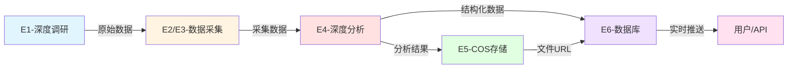

# 情报组工具配置报告

> **配置时间**: 2025-10-29
> **配置状态**: ✅ 已完成
> **智能体数量**: 6个核心智能体

---

## 📋 配置总览

| 智能体 | 工具配置 | 配置状态 | 核心能力 |
|--------|---------|---------|---------|
| **E1-深度调研员** | WebSearch, WebFetch, context7-mcp | ✅ 已配置 | AI驱动的全网深度调研 |
| **E2-Chrome网页采集** | chrome-mcp | ✅ 已配置 | 真实浏览器自动化采集 |
| **E3-深度爬虫** | playwright-mcp | ✅ 已配置 | 企业级大规模爬虫 |
| **E4-深度情报分析** | chart-generator, lark-mcp | ✅ 已配置 | 情报深度分析与可视化 |
| **E5-COS存储管理** | cos-mcp, lark-mcp | ✅ 已配置 | 腾讯云对象存储管理 |
| **E6-Supabase数据库管理** | supabase-mcp, lark-mcp | ✅ 已配置 | PostgreSQL数据库双向流 |

---

## 🔧 详细配置说明

### E1-深度调研员 (Deep Research Investigator)

**配置的工具集**:
```yaml
tools:
  - WebSearch           # AI驱动的全网搜索
  - WebFetch            # 网页内容深度提取
  - ReadMcpResourceTool # MCP历史数据读取
  - WriteMcpResourceTool # MCP数据写入
  - ListMcpResourcesTool # MCP资源列表
  - mcp__context7__*    # 实时库文档获取
  - Read/Write/Edit     # 文件操作
  - Bash                # 脚本执行
```

**工具用途**:
- **WebSearch**: 多维度并行搜索(学术/技术/商业/社交)
- **WebFetch**: 深度内容提取和质量评估
- **context7-mcp**: 获取最新的技术文档和最佳实践
- **MCP Resources**: 避免重复调研,积累历史知识

**典型工作流**:
```
1. 检查MCP历史数据 → 2. 设计多维搜索策略 →
3. 并行执行搜索 → 4. 深度内容提取 →
5. 质量评估打分 → 6. 生成结构化报告 →
7. 同步到MCP资源
```

---

### E2-Chrome网页采集 (Chrome Web Scraper)

**配置的工具集**:
```yaml
tools:
  - mcp__chrome-mcp__* # Chrome浏览器自动化全套工具
  - Read/Write/Edit    # 文件操作
  - Bash               # 数据预处理
  - Grep/Glob          # 日志分析
```

**Chrome MCP核心能力**:
- **导航**: `chrome_navigate`, `chrome_go_back_or_forward`
- **内容提取**: `chrome_get_web_content`, `chrome_screenshot`
- **交互**: `chrome_click_element`, `chrome_fill_or_select`, `chrome_keyboard`
- **高级**: `chrome_inject_script`, `chrome_network_debugger`

**适用场景**:
- 美团/大众点评餐厅数据采集
- 电商产品价格监控
- 新闻文章批量采集
- 社交媒体动态监控

**质量标准**:
- 数据完整度: >90%
- 采集成功率: >85%
- 响应时间: <5秒/页
- 去重准确率: >98%

---

### E3-深度爬虫 (Enterprise Deep Crawler)

**配置的工具集**:
```yaml
tools:
  - mcp__playwright-mcp__* # Playwright全套自动化工具
  - Read/Write/Edit        # 文件操作
  - Bash                   # Python脚本执行
  - Grep/Glob              # 日志分析
```

**Playwright MCP核心能力**:
- **浏览器管理**: `browser_navigate`, `browser_close`, `browser_resize`
- **元素交互**: `browser_click`, `browser_type`, `browser_hover`
- **表单操作**: `browser_fill_form`, `browser_select_option`
- **高级功能**: `browser_evaluate`, `browser_network_requests`, `browser_snapshot`

**双引擎架构**:
```
开发阶段 (1-50页):
  Playwright MCP → 快速原型验证 → 策略优化

生产阶段 (>100页):
  Crawlee-Python → 高性能批处理 → 分布式部署
```

**性能指标**:
- 采集速度: >100页/分钟 (Crawlee)
- 成功率: >95%
- 系统稳定性: >99.9%
- 支持24x7运行

---

### E4-深度情报分析 (Deep Intelligence Analyst)

**配置的工具集**:
```yaml
tools:
  - mcp__chart-generator__* # 15种图表生成
  - mcp__lark-mcp__*        # 飞书集成
  - mcp__context7__*        # 技术实体标准化
  - Read/Write/Edit         # 文件操作
  - Bash                    # 数据处理
  - Grep/Glob               # 日志分析
```

**chart-generator 可生成图表**:
- **基础图表**: 柱状图、折线图、饼图、散点图
- **高级图表**: 知识图谱、桑基图、漏斗图、树状图
- **专业图表**: 箱线图、小提琴图、热力图、词云

**五步分析流水线**:
```
1. 数据清洗(10min) → cleaned-data.json
2. 语义分析(15min) → entities.json, relations.json
3. 价值评估(5min)  → scoring-result.json
4. 知识图谱(15min) → graph.json, network.png
5. 洞察生成(5min)  → report.md, report.pdf
```

**输出目录结构**:
```
output/深度分析/[task-id]/
├── 1-cleaning/     # 清洗数据
├── 2-semantic/     # 语义分析
├── 3-scoring/      # 价值评估
├── 4-graph/        # 知识图谱
├── 5-insights/     # 最终报告
└── logs/           # 处理日志
```

---

### E5-COS存储管理 (COS Storage Manager)

**配置的工具集**:
```yaml
tools:
  - mcp__cos-mcp__*   # 腾讯云COS全套工具
  - mcp__lark-mcp__*  # 飞书通知
  - Read/Write/Edit   # 文件操作
  - Bash              # 脚本执行
```

**COS MCP核心能力**:
- **文件操作**: `putObject`, `getObject`, `getObjectUrl`, `getBucket`
- **AI图片处理**: `imageInfo`, `assessQuality`, `aiSuperResolution`, `aiPicMatting`
- **实用功能**: `waterMarkFont`, `aiQrcode`

**存储桶结构**:
```
intelligence-attachments/
├── charts/         # 可视化图表
├── reports/        # PDF报告
├── datasets/       # 数据文件
└── screenshots/    # 截图
```

**文件命名标准**:
```
格式: {intelligence_id}/{timestamp}_{uuid}.{ext}
示例: a1b2c3d4/20251020_103000_e5f6g7h8.png
```

**协作流程**:
```
E4生成附件 → E5上传COS → 生成访问URL →
通知E6 → E6更新数据库file_references字段
```

---

### E6-Supabase数据库管理 (Supabase Database Manager)

**配置的工具集**:
```yaml
tools:
  - mcp__supabase-mcp__* # Supabase全套工具
  - mcp__lark-mcp__*     # 飞书通知
  - Read/Write/Edit      # 文件操作
  - Bash                 # SQL脚本
  - Grep/Glob            # 日志分析
```

**Supabase MCP核心能力**:
- **数据操作**: `execute_sql` (SELECT/INSERT/UPDATE/DELETE)
- **监控**: `get_database_stats`, `list_tables`
- **迁移**: `apply_migration`

**双向数据流**:

**出站流 (Storage to Supabase)**:
```
处理后的情报 → 数据转换(数组/JSONB) →
批量INSERT → 关系映射 → 全文搜索索引 →
实时事件传播 → REST/GraphQL API
```

**入站流 (Collection from Supabase)**:
```
监控submissions表 → 解析raw_data →
数据清洗 → 创建intelligence记录 →
更新status → 触发E4分析 → 发送通知
```

**质量标准**:
- 写入成功率: 100%
- 查询响应时间: P95 ≤ 100ms
- 实时推送延迟: ≤ 1秒
- 全文搜索准确率: ≥ 90%

---

## 🔄 智能体协作流程

### 典型情报处理流程



### 数据流转说明

1. **E1调研阶段**:
   - 使用WebSearch多维度搜索
   - 用WebFetch深度提取
   - 用context7标准化技术术语

2. **E2/E3采集阶段**:
   - E2用chrome-mcp处理动态网页
   - E3用playwright-mcp大规模采集
   - 输出结构化JSON数据

3. **E4分析阶段**:
   - 五步流水线深度处理
   - 用chart-generator生成可视化
   - 用lark-mcp推送高价值情报

4. **E5存储阶段**:
   - 用cos-mcp上传附件到腾讯云
   - 生成临时签名URL或CDN链接
   - 协调E6更新数据库引用

5. **E6持久化阶段**:
   - 用supabase-mcp存储结构化数据
   - 配置全文搜索和实时订阅
   - 提供REST/GraphQL API访问

---

## ✅ 配置验证清单

### 工具访问验证

- [ ] E1可以访问WebSearch和WebFetch
- [ ] E1可以读写MCP resources
- [ ] E2可以控制Chrome浏览器
- [ ] E3可以使用Playwright自动化
- [ ] E4可以生成所有15种图表类型
- [ ] E5可以上传下载COS文件
- [ ] E5可以进行AI图片处理
- [ ] E6可以执行SQL查询
- [ ] E6可以监控数据库状态
- [ ] E4/E5/E6可以发送飞书通知

### 集成测试建议

**测试1: 端到端情报处理**
```
输入: "调研2025年AI Agent市场趋势"
预期输出:
  - E1生成调研报告
  - E4生成趋势图表
  - E5上传图表到COS
  - E6存储到数据库
  - 飞书收到高价值情报通知
```

**测试2: 网页数据采集与分析**
```
输入: "采集美团北京火锅店前20名数据"
预期输出:
  - E2采集店铺数据(名称/评分/价格)
  - E4分析价格分布和评分趋势
  - E4生成柱状图和散点图
  - E5存储图表
  - E6存储结构化数据
```

**测试3: 大规模爬虫任务**
```
输入: "爬取京东手机分类前100页"
预期输出:
  - E3使用Playwright验证策略(10页)
  - E3迁移到Crawlee批量采集(100页)
  - E4清洗和分析数据
  - E6批量导入数据库
  - 生成性能报告
```

---

## 🎯 使用建议

### 智能体选择策略

| 场景 | 推荐智能体 | 原因 |
|------|-----------|------|
| 公开信息调研 | E1 | WebSearch全网覆盖,context7技术文档 |
| 电商/新闻采集 | E2 | Chrome真实浏览器,处理JS渲染 |
| 大规模采集(>100页) | E3 | Playwright+Crawlee高性能 |
| 数据分析可视化 | E4 | 五步流水线+15种图表 |
| 文件云存储 | E5 | COS稳定+AI图片处理 |
| 数据持久化 | E6 | PostgreSQL+实时订阅 |

### 最佳实践

**调研任务**:
- ✅ 先用E1的MCP resource检查历史数据
- ✅ 设计多维度搜索策略(学术/技术/商业/社交)
- ✅ 用context7标准化技术术语

**数据采集**:
- ✅ <50页用E2 (快速原型)
- ✅ >100页用E3 (生产级性能)
- ✅ 先小规模验证再大规模采集

**情报分析**:
- ✅ 严格执行五步流水线
- ✅ 每步验证数据质量后再继续
- ✅ 高价值情报(>0.8)自动推送飞书

**存储管理**:
- ✅ 默认PRIVATE访问,需要时才PUBLIC
- ✅ 大文件(>100MB)使用分片上传
- ✅ 定期清理180天以上的文件

**数据库操作**:
- ✅ 批处理≤1000条/次
- ✅ 利用全文搜索tsvector
- ✅ 配置RLS策略保护数据

---

## 📚 相关文档

- **全局配置**: `~/.claude/CLAUDE.md`
- **项目配置**: `./CLAUDE.md`
- **Plugin配置**: `./.claude-plugin/plugin.json`
- **智能体定义**: `./agents/*.md`

---

## 🔄 下一步行动

1. ✅ 运行集成测试验证所有工具可访问
2. ✅ 测试端到端情报处理流程
3. ✅ 配置MCP服务器环境变量(如需)
4. ✅ 更新团队文档,告知新工具能力
5. ✅ 收集使用反馈,持续优化配置

---

**配置完成时间**: 2025-10-29 06:06
**配置人员**: Claude Code + ZTL团队
**状态**: ✅ 生产就绪
