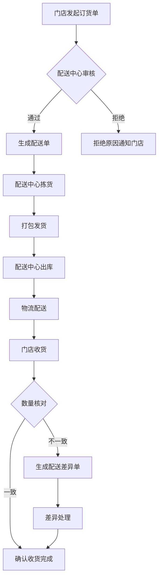
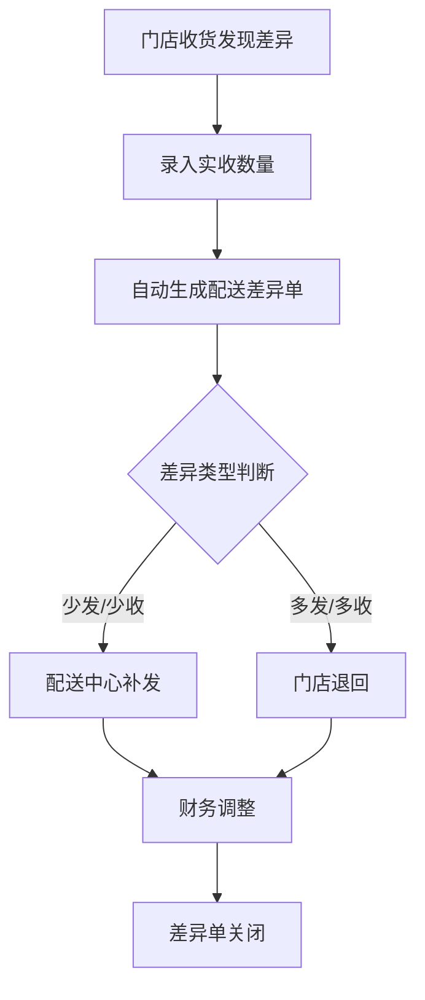
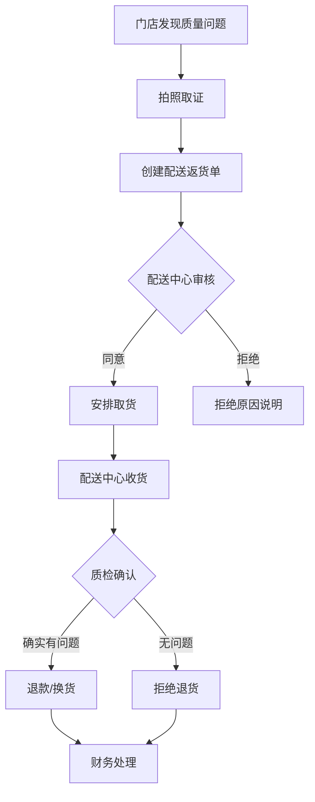

# 配送管理模块 - 详细文档

> **模块标识**: `#menucode_1887`
> **英文名称**: Delivery Management
> **核心定位**: 处理配送中心→门店的订货配送全流程

---

## 一、模块概述

### 1.1 业务价值
配送管理是供应链系统的核心模块,连接配送中心和门店,实现:
- 📦 门店便捷订货,无需电话/微信沟通
- 🚚 配送中心高效拣货发货,减少人工错误
- 💰 价格统一管控,避免线下定价混乱
- 📊 配送数据可追溯,支持经营分析

### 1.2 业务场景
**典型场景1**: 连锁餐饮门店每日食材配送
- 门店每天下午4点前提交次日订货单
- 配送中心当晚拣货打包
- 次日凌晨5点配送到店
- 门店早上6点收货确认

**典型场景2**: 周配送模式
- 门店每周一提交本周订货计划
- 配送中心按周配送2-3次
- 减少物流成本,适合冻品/干货

**典型场景3**: 紧急补货
- 门店当日发现缺货
- 紧急下单,配送中心加急配送
- 当日达/次日达

---

## 二、核心功能清单

### 2.1 订货管理

#### 功能1.1: 门店订货单
**CSS选择器**: (待实际操作确认)
**功能描述**: 门店发起订货申请

**关键字段**:
| 字段名 | 类型 | 必填 | 说明 |
|--------|------|------|------|
| 订货门店 | 下拉选择 | ✅ | 自动带出当前登录门店 |
| 配送中心 | 下拉选择 | ✅ | 根据业务关系自动匹配 |
| 期望送达日期 | 日期选择 | ✅ | 可选未来3-7天 |
| 订货物品 | 明细行 | ✅ | 可批量添加 |
| 订货数量 | 数字 | ✅ | 支持小数(如0.5箱) |
| 订货单价 | 金额 | ❌ | 自动带出配送价格 |
| 订货金额 | 金额 | ❌ | 数量×单价,自动计算 |
| 备注 | 文本 | ❌ | 特殊需求说明 |

**操作流程**:
```
1. 点击"门店订货单"菜单
2. 选择期望送达日期
3. 添加订货物品(支持搜索/扫码)
4. 输入订货数量
5. 系统自动计算金额
6. 提交订单(待配送中心审核)
```

**业务规则**:
- ✅ 仅能订购【配送范围】内的物品
- ✅ 订货价格自动取【配送价格】
- ✅ 支持保存草稿,未提交前可修改
- ✅ 提交后生成待审核订货单
- ⚠️ 配送中心可修改订货数量(如缺货)

**状态流转**:
```
草稿 → 待审核 → 已审核 → 拣货中 → 已发货 → 已收货 → 已完成
                    ↓
                  已拒绝
```

---

#### 功能1.2: 待接单订货单
**功能描述**: 配送中心查看待审核的订货单

**首页显示**: "待接单订货单 - 暂无数据"

**关键操作**:
- 查看订货明细
- 审核通过/拒绝
- 修改订货数量(如缺货调整)
- 批量审核

**业务规则**:
- 📌 配送中心需在X小时内审核(可配置)
- 📌 超时未审核自动提醒
- 📌 拒绝需填写拒绝原因

---

### 2.2 配送单管理

#### 功能2.1: 配送单生成
**功能描述**: 将审核通过的订货单转为配送单

**生成方式**:
1. **自动生成**: 订货单审核通过后自动生成
2. **手动生成**: 配送中心合并多个订货单生成
3. **拆分生成**: 一个订货单拆分多次配送

**关键字段**:
| 字段名 | 类型 | 说明 |
|--------|------|------|
| 配送单号 | 文本 | 系统自动生成,唯一 |
| 配送中心 | 文本 | 发货方 |
| 目标门店 | 文本 | 收货方 |
| 配送日期 | 日期 | 实际发货日期 |
| 关联订货单 | 文本 | 可关联多个订货单 |
| 配送物品 | 明细 | 配送清单 |
| 配送数量 | 数字 | 实际发货数量 |
| 配送单价 | 金额 | 配送价格 |
| 配送金额 | 金额 | 总金额 |
| 配送员 | 文本 | 可选 |
| 车牌号 | 文本 | 可选 |

---

#### 功能2.2: 配送单发货
**功能描述**: 配送中心拣货打包并发货

**首页显示**: "待发货配送单 - 暂无数据"

**操作流程**:
```
1. 查看待发货配送单
2. 打印配送单(拣货清单)
3. 仓库拣货
4. 打包装箱
5. 扫码出库
6. 点击"确认发货"
7. 可填写配送员、车牌号、发货时间
8. 状态变更为"已发货"
```

**业务规则**:
- 发货后库存自动扣减
- 生成出库单
- 可打印配送单随货附送

---

#### 功能2.3: 门店收货确认
**功能描述**: 门店收到货物后确认收货

**操作流程**:
```
1. 门店查看"已发货"配送单
2. 核对实收数量
3. 如有差异,录入实收数量
4. 点击"确认收货"
5. 如有差异,自动生成配送差异单
```

**关键字段**:
| 字段名 | 类型 | 说明 |
|--------|------|------|
| 应收数量 | 数字 | 配送单数量 |
| 实收数量 | 数字 | 门店实际收到数量 |
| 差异数量 | 数字 | 应收-实收 |
| 差异金额 | 金额 | 差异数量×单价 |
| 收货人 | 文本 | 门店收货人员 |
| 收货时间 | 日期时间 | 实际收货时间 |

---

### 2.3 配送差异处理

#### 功能3.1: 配送差异单
**功能描述**: 处理应收与实收不符的情况

**差异类型**:
1. **少发**: 配送中心发货数量 < 订货数量
2. **多发**: 配送中心发货数量 > 订货数量
3. **少收**: 门店实收数量 < 配送数量
4. **多收**: 门店实收数量 > 配送数量

**处理方式**:
- **少发**: 补发/退款/抵扣下次订货
- **多发**: 门店退回/补付款/抵扣下次订货
- **少收**: 配送中心补发/退款
- **多收**: 门店退回多收部分

**业务规则**:
- 差异需双方确认
- 超过X天未处理自动按实收数量结算
- 差异金额自动调整对账单

---

### 2.4 配送返货管理

#### 功能4.1: 配送返货单
**功能描述**: 门店退回不合格/多余物品

**返货原因**:
- 质量问题(破损/过期/变质)
- 送错物品
- 多送物品
- 其他原因

**操作流程**:
```
1. 门店发起配送返货单
2. 填写返货物品、数量、原因
3. 上传照片(可选)
4. 提交返货申请
5. 配送中心审核
6. 安排上门取货/门店自送
7. 配送中心收货确认
8. 财务退款/抵扣
```

**关键字段**:
| 字段名 | 类型 | 必填 | 说明 |
|--------|------|------|------|
| 原配送单号 | 文本 | ✅ | 关联原配送单 |
| 返货物品 | 明细 | ✅ | 退货清单 |
| 返货数量 | 数字 | ✅ | 退货数量 |
| 返货原因 | 下拉 | ✅ | 从【退货原因】档案选择 |
| 照片附件 | 图片 | ❌ | 质量问题需上传 |
| 处理方式 | 下拉 | ✅ | 退款/换货/抵扣 |

---

### 2.5 配送规则管理

#### 功能5.1: 配送方式设置
**功能描述**: 配置配送中心支持的配送方式

**支持4种配送方式**:
1. **配送中心配送**: 配送中心自有车辆配送
2. **门店自提**: 门店到配送中心自提
3. **第三方物流**: 委托第三方物流配送
4. **直送**: 供应商直送门店(跨过配送中心)

**配置项**:
- 配送方式名称
- 是否启用
- 适用门店范围
- 配送时效(如次日达)
- 运费规则(起送金额/运费计算)

---

#### 功能5.2: 配送价格管理
**功能描述**: 设置配送中心向门店的配送价格

**价格类型**:
1. **统一价**: 所有门店相同价格
2. **分级价**: 不同门店不同价格(如VIP门店/普通门店)
3. **分时价**: 不同时间段不同价格(如促销期)

**价格设置方式**:
- 单品价格维护
- 批量导入价格
- 基于采购价加价(如加价率20%)

**关键字段**:
| 字段名 | 类型 | 说明 |
|--------|------|------|
| 物品 | 下拉 | 从物品档案选择 |
| 配送中心 | 下拉 | 发货方 |
| 适用门店 | 多选 | 可选全部/部分门店 |
| 配送价格 | 金额 | 单位:元 |
| 生效日期 | 日期 | 价格生效起始日期 |
| 失效日期 | 日期 | 可选,价格失效日期 |

**业务规则**:
- 📌 同一物品、同一门店、同一时间只能有一个价格
- 📌 新价格覆盖旧价格
- 📌 支持价格历史查询

---

#### 功能5.3: 配送范围设置
**功能描述**: 设置配送中心可向门店配送的物品范围

**设置方式**:
1. **全品类**: 所有物品都可配送
2. **白名单**: 仅指定物品可配送
3. **黑名单**: 指定物品不可配送

**配置维度**:
- 配送中心 + 门店 + 物品
- 配送中心 + 门店 + 物品类别
- 配送中心 + 门店组 + 物品类别

**业务场景**:
- 某些冻品仅A配送中心有,其他配送中心不可配送
- 某些门店因区域限制,部分物品不可配送
- 新品上市,逐步放开配送范围

**业务规则**:
- ❌ 不在配送范围内的物品,门店订货时不可见
- ✅ 配送范围可按生效日期控制

---

## 三、数据看板

### 3.1 首页数据看板

**配送发货金额**: 0.00
- 统计范围: 当日/本周/本月
- 计算规则: sum(配送单金额) where 状态='已发货'

**未提交订货门店数**: 3
- 统计范围: 当日
- 计算规则: count(门店) where 未提交订货单

---

## 四、业务流程图

### 4.1 标准配送流程


### 4.2 配送差异处理流程


### 4.3 配送返货流程


---

## 五、操作指南

### 5.1 门店端操作

#### 如何下订单?
```
1. 登录美团管家
2. 点击"供应链" → "配送管理" → "门店订货单"
3. 点击"新增订货单"
4. 选择期望送达日期
5. 点击"添加物品",搜索或扫码添加
6. 输入订货数量
7. 检查订货金额
8. 点击"提交订单"
9. 等待配送中心审核
```

#### 如何查看订单状态?
```
1. 点击"配送管理" → "门店订货单"
2. 查看订单列表
3. 状态说明:
   - 草稿: 未提交
   - 待审核: 已提交,等待配送中心审核
   - 已审核: 配送中心已接单
   - 拣货中: 配送中心正在拣货
   - 已发货: 配送中心已发货
   - 已收货: 门店已确认收货
   - 已完成: 订单完成
   - 已拒绝: 配送中心拒绝
```

#### 如何确认收货?
```
1. 点击"配送管理" → "配送单"
2. 筛选状态="已发货"
3. 点击配送单查看明细
4. 核对实收数量
5. 如数量一致,点击"确认收货"
6. 如数量不一致:
   a. 逐行录入实收数量
   b. 系统自动计算差异
   c. 点击"确认收货"
   d. 自动生成配送差异单
```

---

### 5.2 配送中心端操作

#### 如何审核订货单?
```
1. 查看"待接单订货单"列表
2. 点击订货单查看明细
3. 检查:
   - 订货物品是否在配送范围内
   - 库存是否充足
   - 订货数量是否合理
4. 如需调整数量,修改订货数量
5. 点击"审核通过" 或 "拒绝"
6. 拒绝需填写拒绝原因
```

#### 如何发货?
```
1. 查看"待发货配送单"列表
2. 点击"批量打印配送单"(拣货清单)
3. 仓库人员按拣货清单拣货
4. 打包装箱
5. 扫码出库(可选,如有WMS系统)
6. 回到系统,点击"确认发货"
7. 填写配送员、车牌号(可选)
8. 点击"保存"
9. 状态变更为"已发货"
10. 通知门店(可选,系统自动通知)
```

#### 如何处理配送差异?
```
1. 查看"配送差异单"列表
2. 点击差异单查看详情
3. 联系门店确认差异原因
4. 选择处理方式:
   - 少发: 补发 / 退款 / 抵扣
   - 多发: 要求退回 / 补付款 / 抵扣
5. 点击"处理完成"
6. 差异单关闭
```

---

## 六、常见问题FAQ

### Q1: 门店订货时为什么看不到某些物品?
**A**: 可能原因:
1. 该物品不在【配送范围】内
2. 该物品已停用
3. 该物品未设置【配送价格】
4. 权限不足

### Q2: 配送中心审核订货单后还能修改吗?
**A**: 审核后不可直接修改,但可以:
1. 撤销审核,修改后重新审核
2. 在生成配送单时调整数量
3. 发货时调整实发数量(会产生配送差异)

### Q3: 配送差异单必须处理吗?
**A**: 建议及时处理,原因:
1. 影响库存准确性
2. 影响财务对账
3. 超过X天未处理,系统自动按实收数量结算

### Q4: 配送返货一定会退款吗?
**A**: 不一定,处理方式有:
1. 退款(最常见)
2. 换货(质量问题)
3. 抵扣下次订货(双方协商)

### Q5: 配送价格多久调整一次?
**A**: 根据业务需要:
- 原料价格波动较大的物品:1-2周调整一次
- 稳定的物品:1-3个月调整一次
- 促销活动:临时调整

### Q6: 门店可以向多个配送中心订货吗?
**A**: 可以,前提是:
1. 系统中配置了多个配送中心的业务关系
2. 每个配送中心设置了配送范围和价格
3. 门店需分别向各配送中心下单

---

## 七、最佳实践

### 7.1 门店订货建议
1. ✅ 每天固定时间下单(如下午4点前)
2. ✅ 根据销售预测合理订货,避免积压
3. ✅ 关注库存预警,及时补货
4. ✅ 收货时仔细核对数量和质量
5. ✅ 发现问题及时拍照,便于后续处理

### 7.2 配送中心管理建议
1. ✅ 设置合理的订单截止时间
2. ✅ 及时审核订单,避免延误
3. ✅ 拣货前复核库存,避免缺货
4. ✅ 打包时做好标识,避免送错
5. ✅ 定期分析配送差异,优化流程

### 7.3 价格管理建议
1. ✅ 建立价格调整审批流程
2. ✅ 价格调整提前通知门店
3. ✅ 保留价格历史,便于追溯
4. ✅ 定期分析配送毛利率
5. ✅ 根据门店等级设置差异化价格

---

## 八、数据字典

### 8.1 关键字段说明

| 字段名 | 数据类型 | 长度 | 说明 | 示例 |
|--------|---------|------|------|------|
| 订货单号 | VARCHAR | 32 | 系统自动生成,格式:DH+日期+流水号 | DH20251103001 |
| 配送单号 | VARCHAR | 32 | 系统自动生成,格式:PS+日期+流水号 | PS20251103001 |
| 差异单号 | VARCHAR | 32 | 系统自动生成,格式:CY+日期+流水号 | CY20251103001 |
| 返货单号 | VARCHAR | 32 | 系统自动生成,格式:FH+日期+流水号 | FH20251103001 |
| 物品编码 | VARCHAR | 20 | 物品唯一标识 | WP001 |
| 门店编码 | VARCHAR | 20 | 门店唯一标识 | MD001 |
| 配送中心编码 | VARCHAR | 20 | 配送中心唯一标识 | PS001 |
| 数量 | DECIMAL | (10,3) | 支持3位小数,单位:基本单位 | 10.500 |
| 单价 | DECIMAL | (10,2) | 单位:元 | 25.50 |
| 金额 | DECIMAL | (12,2) | 数量×单价 | 267.75 |

---

## 九、系统集成

### 9.1 与其他模块的关联

**→ 采购管理**:
- 配送中心库存不足时,触发采购需求

**→ 库存管理**:
- 配送发货时扣减配送中心库存
- 门店收货时增加门店库存
- 配送差异调整库存

**→ 财务管理**:
- 生成配送对账单
- 应收账款管理
- 差异金额调整

**→ 档案管理**:
- 读取物品档案
- 读取配送价格
- 读取配送范围
- 读取退货原因

**→ 报表管理**:
- 配送报表
- 配送差异分析
- 门店订货排行

---

## 十、权限配置建议

### 10.1 门店角色权限
| 功能 | 查看 | 新增 | 修改 | 删除 | 审核 |
|------|------|------|------|------|------|
| 门店订货单 | ✅ | ✅ | ✅ | ✅ | ❌ |
| 配送单 | ✅ | ❌ | ❌ | ❌ | ❌ |
| 配送差异单 | ✅ | ❌ | ❌ | ❌ | ❌ |
| 配送返货单 | ✅ | ✅ | ✅ | ✅ | ❌ |

### 10.2 配送中心角色权限
| 功能 | 查看 | 新增 | 修改 | 删除 | 审核 |
|------|------|------|------|------|------|
| 门店订货单 | ✅ | ❌ | ✅ | ❌ | ✅ |
| 配送单 | ✅ | ✅ | ✅ | ✅ | ✅ |
| 配送差异单 | ✅ | ✅ | ✅ | ✅ | ✅ |
| 配送返货单 | ✅ | ❌ | ❌ | ❌ | ✅ |
| 配送价格 | ✅ | ✅ | ✅ | ✅ | ❌ |
| 配送范围 | ✅ | ✅ | ✅ | ✅ | ❌ |

### 10.3 总部角色权限
| 功能 | 查看 | 新增 | 修改 | 删除 | 审核 |
|------|------|------|------|------|------|
| 所有配送单据 | ✅ | ❌ | ❌ | ❌ | ❌ |
| 配送价格 | ✅ | ✅ | ✅ | ✅ | ✅ |
| 配送范围 | ✅ | ✅ | ✅ | ✅ | ✅ |
| 配送方式 | ✅ | ✅ | ✅ | ✅ | ✅ |
| 配送报表 | ✅ | ❌ | ❌ | ❌ | ❌ |

---

**文档版本**: v1.0
**最后更新**: 2025-11-03
**文档状态**: 基于业务逻辑推断,待实际操作验证
**下一步**: 实际登录系统,逐一验证各功能点,补充截图和实际操作步骤
