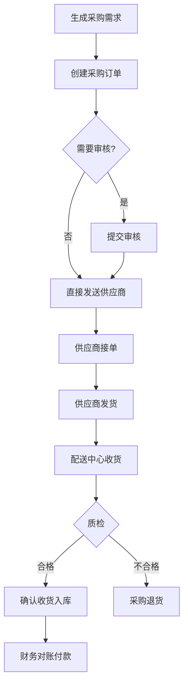

# 采购管理模块 - 详细文档

> **模块标识**: `#menucode_1866`
> **英文名称**: Procurement Management  
> **核心定位**: 处理配送中心/总部向供应商的采购全流程

---

## 一、模块概述

### 1.1 业务价值
- 💰 集中采购,降低采购成本
- 📋 采购模板,提升下单效率
- 🤝 供应商管理,优化供应链
- 📊 采购数据分析,支持议价决策

### 1.2 核心功能
1. **采购订单管理** - 向供应商下采购订单
2. **采购收货单** - 采购到货验收入库
3. **采购定价** - 与供应商约定采购价格
4. **采购模板** - 常用采购单快速下单
5. **采购退货** - 质量问题退货处理
6. **供应商管理** - 供应商档案和评价

---

## 二、关键功能详解

### 2.1 采购订单
**功能**: 向供应商下达采购需求

**关键字段**:
- 供应商、采购日期、交货日期
- 物品清单、采购数量、采购单价、采购金额
- 收货地址、联系人、备注

**状态流转**:
```
草稿 → 待审核 → 已审核 → 待收货 → 部分收货 → 已收货 → 已完成
```

**业务规则**:
- 采购价格自动带出【采购定价】
- 支持按采购模板快速下单
- 审核通过后不可修改(需撤销后重新提交)
- 可分批收货

---

### 2.2 采购收货单
**功能**: 采购到货验收入库

**关键字段**:
- 关联采购订单、收货日期、实收数量、收货仓库
- 质检结果、不合格数量、收货人

**操作流程**:
```
1. 供应商送货到达
2. 仓库收货人员核对采购订单
3. 清点实收数量
4. 质量检验
5. 录入实收数量和质检结果
6. 确认收货,库存增加
7. 如有差异,生成采购差异单
```

**业务规则**:
- 实收数量不能超过采购数量(可配置允许超收比例)
- 质检不合格部分不入库
- 收货后自动更新采购订单收货进度

---

### 2.3 采购定价
**功能**: 与供应商约定采购价格

**定价方式**:
1. **协议价**: 长期合作协议价
2. **临时价**: 临时议价
3. **阶梯价**: 采购量越大价格越低
4. **浮动价**: 按原料市场价浮动

**价格维护**:
- 供应商 + 物品 + 生效日期 + 采购价格
- 支持批量导入价格
- 价格历史可追溯

---

### 2.4 采购模板
**功能**: 常用采购单快速下单

**使用场景**:
- 每周固定采购同样的物品
- 门店新开业的初始化采购
- 节假日备货采购

**模板包含**:
- 模板名称、供应商、物品清单、参考数量
- 使用时可修改数量,快速生成采购订单

---

### 2.5 采购退货
**功能**: 质量问题退货给供应商

**退货原因**:
- 质量不合格、破损、过期、送错物品

**操作流程**:
```
1. 收货时发现问题,拍照取证
2. 创建采购退货单
3. 供应商上门取货
4. 财务退款/抵扣
```

---

## 三、业务流程图



---

## 四、最佳实践

### 4.1 采购计划建议
- 根据门店订货量预测采购需求
- 结合库存上下限自动生成采购建议
- 考虑供应商起订量和交货周期

### 4.2 供应商管理建议
- 建立供应商评价体系(价格/质量/及时性)
- 定期分析供应商履约率
- 同一物品至少2个备选供应商

### 4.3 价格管理建议
- 建立价格调整审批流程
- 价格异常波动需风险预警
- 定期对比市场价,优化采购成本

---

## 五、与其他模块关联

**→ 库存管理**: 采购收货增加库存
**→ 财务管理**: 生成应付账款
**→ 档案管理**: 读取供应商档案、采购定价
**→ 配送管理**: 库存充足后可配送门店
**→ 质量管理**: 质检不合格触发退货

---

**文档版本**: v1.0  
**最后更新**: 2025-11-03
