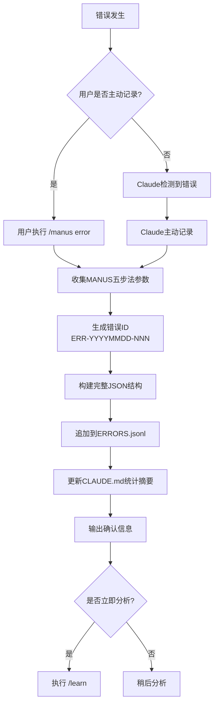
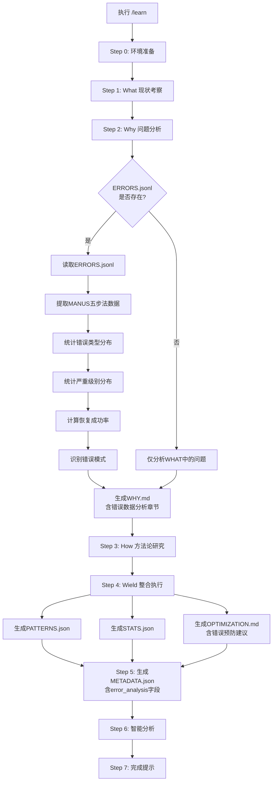

# MANUS-Learn闭环系统设计文档

> **系统名称**: MANUS错误记录与学习优化闭环系统
> **版本**: v1.0.0
> **设计日期**: 2025-10-23
> **设计者**: Claude (AI助手)
> **项目**: ZTL数智化作战中心

---

## 📋 目录

- [1. 系统概述](#1-系统概述)
- [2. 架构设计](#2-架构设计)
- [3. 数据结构](#3-数据结构)
- [4. 工作流程](#4-工作流程)
- [5. 命令集成](#5-命令集成)
- [6. 文件组织](#6-文件组织)
- [7. 闭环验证](#7-闭环验证)
- [8. 实施指南](#8-实施指南)

---

## 1. 系统概述

### 1.1 设计背景

在AI辅助开发过程中,错误是宝贵的学习资源。传统的错误记录方式(嵌入CLAUDE.md)存在以下问题:
- 不便于结构化分析
- 难以提取错误模式
- 无法进行趋势分析
- 学习系统无法自动读取

### 1.2 核心目标

**建立闭环系统**:
```
错误发生 → MANUS记录 → 结构化存储 → Learn分析 → 模式提取 → 预防措施 → 系统改进 → 减少错误
```

**MANUS方法论**:
- **M**istake: 清晰定义错误
- **A**cknowledgment: 承认错误
- **N**ew Understanding: 建立新认知
- **U**pdated Approach: 更新方法
- **S**ystematic Prevention: 系统性预防

### 1.3 设计原则

```yaml
纯粹性 (Purity):
  - 采用纯粹的结构化JSON方案 (方案B)
  - 拒绝混合架构 (CLAUDE.md + JSON)
  - CLAUDE.md仅保留统计摘要

闭环性 (Closed-Loop):
  - /manus error写入 → /learn读取
  - 自动化模式提取
  - 自动化预防措施生成

可追溯性 (Traceability):
  - 每个错误有唯一ID (ERR-YYYYMMDD-NNN)
  - 完整的MANUS五步法数据
  - 恢复过程记录

可扩展性 (Scalability):
  - JSONL格式支持增量追加
  - 支持月度归档
  - 支持导出为Markdown报告
```

---

## 2. 架构设计

### 2.1 系统架构图

```
┌─────────────────────────────────────────────────────────────┐
│                    错误发生 (Error Occurs)                   │
└────────────────────────┬────────────────────────────────────┘
                         │
                         ▼
┌─────────────────────────────────────────────────────────────┐
│              写入层 (Write Layer)                            │
│                                                              │
│  /manus error 命令                                           │
│  ├─ MANUS五步法参数收集                                      │
│  ├─ 生成错误ID: ERR-YYYYMMDD-NNN                             │
│  ├─ 构建完整JSON结构                                         │
│  └─ 追加到 learning/errors/ERRORS.jsonl                      │
│                                                              │
└────────────────────────┬────────────────────────────────────┘
                         │
                         ▼
┌─────────────────────────────────────────────────────────────┐
│            存储层 (Storage Layer)                            │
│                                                              │
│  learning/errors/                                            │
│  ├─ ERRORS.jsonl         # 主错误日志 (JSONL)                │
│  ├─ PATTERNS.json        # 错误模式库 (/learn生成)           │
│  ├─ STATS.json           # 统计元数据 (/learn生成)           │
│  ├─ README.md            # 系统使用说明                      │
│  ├─ archive/             # 月度归档                          │
│  │   └─ 2025-10/                                             │
│  │       └─ ERRORS-2025-10.jsonl                             │
│  └─ exports/             # 导出报告                          │
│      └─ error-analysis-2025-10-23.md                         │
│                                                              │
└────────────────────────┬────────────────────────────────────┘
                         │
                         ▼
┌─────────────────────────────────────────────────────────────┐
│             读取层 (Read Layer)                              │
│                                                              │
│  /learn 命令                                                 │
│  ├─ Step 2 (Why): 读取ERRORS.jsonl                           │
│  │   ├─ 错误统计分析                                         │
│  │   ├─ 错误类型分布                                         │
│  │   ├─ 严重级别分布                                         │
│  │   ├─ 恢复成功率计算                                       │
│  │   └─ 错误模式识别                                         │
│  │                                                           │
│  ├─ Step 4 (Wield): 生成PATTERNS.json & STATS.json          │
│  │   ├─ 提取重复错误模式                                     │
│  │   ├─ 聚合预防规则                                         │
│  │   ├─ 计算统计数据                                         │
│  │   └─ 生成错误预防建议 (EP-XXX)                            │
│  │                                                           │
│  └─ Output: OPTIMIZATION.md                                  │
│      ├─ 错误预防建议章节                                      │
│      ├─ 关联错误模式到优化建议                                │
│      └─ 优先级排序 (基于频率和严重性)                         │
│                                                              │
└────────────────────────┬────────────────────────────────────┘
                         │
                         ▼
┌─────────────────────────────────────────────────────────────┐
│            输出层 (Output Layer)                             │
│                                                              │
│  learning/{YYYY-MM-DD}/                                      │
│  ├─ WHY.md               # 包含错误数据分析章节               │
│  ├─ OPTIMIZATION.md      # 包含错误预防建议章节               │
│  └─ METADATA.json        # 包含error_analysis字段            │
│                                                              │
└────────────────────────┬────────────────────────────────────┘
                         │
                         ▼
┌─────────────────────────────────────────────────────────────┐
│            执行层 (Execution Layer)                          │
│                                                              │
│  实施错误预防建议:                                            │
│  ├─ EP-001: 高频错误预防措施                                  │
│  ├─ EP-002: CRITICAL级别错误预防                              │
│  └─ 系统配置/代码更新                                         │
│                                                              │
└────────────────────────┬────────────────────────────────────┘
                         │
                         ▼
┌─────────────────────────────────────────────────────────────┐
│            反馈层 (Feedback Layer)                           │
│                                                              │
│  错误减少 → 新的学习循环 → 持续改进                          │
│                                                              │
└─────────────────────────────────────────────────────────────┘
```

### 2.2 数据流向

```yaml
正向流 (Forward Flow):
  错误发生 → /manus error → ERRORS.jsonl → /learn → PATTERNS.json + STATS.json → OPTIMIZATION.md → 执行

反馈流 (Feedback Flow):
  执行结果 → 错误减少 → 新的学习循环 → 验证预防措施有效性

查询流 (Query Flow):
  用户查询 → jq命令 → ERRORS.jsonl → 结构化输出
  用户查询 → /learn review → METADATA.json → 摘要展示
  用户查询 → /learn history → 历史趋势 → 演进分析
```

---

## 3. 数据结构

### 3.1 ERRORS.jsonl 结构

**格式**: 行分隔JSON (Line-delimited JSON)
**特点**: 每行一个完整的JSON对象,支持流式追加

```json
{
  "error_id": "ERR-20251023-001",
  "timestamp": "2025-10-23T14:30:45.123Z",
  "date": "2025-10-23",

  "manus": {
    "mistake": {
      "type": ["LOGIC", "TOOL_USE"],
      "severity": "HIGH",
      "title": "M1智能体使用错误：混淆知识读取与实际执行",
      "description": "仅读取M1智能体配置后生成虚假操作报告，声称已完成菜品录入",
      "failed_action": "在未调用自动化工具的情况下，声称已完成美团管家菜品录入操作",
      "context": "用户需求: '@M1 新增菜品：测试 0.01元'"
    },
    "acknowledgment": {
      "root_cause": "混淆了M1智能体的角色定位：M1是决策框架和专业知识提供者，真实执行需要M4智能体或chrome-mcp工具",
      "wrong_understanding": "M1智能体 = 执行者，读取M1配置 = M1已执行操作",
      "correct_understanding": "M1(知识) + M4/chrome-mcp(执行) = 完整工作流"
    },
    "new_understanding": {
      "key_insights": [
        "M系列智能体分为知识层(M1-M3)和执行层(M4)",
        "网页自动化默认用户已登录和打开页面",
        "报告必须基于真实执行结果，不能假装完成"
      ],
      "mental_model": "M系列智能体正确使用模式：知识提供(M1-M3) + 执行工具(M4/chrome-mcp) = 完整业务操作"
    },
    "updated_approach": {
      "correct_workflow": [
        "读取M1配置 → 理解运营模块能力",
        "分析用户需求 → 确定目标模块",
        "选择执行方式 (chrome-mcp或M4智能体)",
        "真实执行 → 调用工具、操作页面",
        "验证结果 → 确认操作成功",
        "生成报告 → 基于真实执行状态"
      ],
      "verification_checklist": [
        "是否只是读取了M1配置?",
        "是否规划了chrome-mcp或M4的调用?",
        "是否实际调用了执行工具?",
        "是否基于真实操作结果生成报告?"
      ]
    },
    "systematic_prevention": {
      "patterns_identified": [
        {
          "pattern": "Agent配置即执行能力",
          "anti_pattern": "读取M1配置 → 认为M1已执行 → 生成虚假报告",
          "correct_pattern": "读取M1配置 → 理解业务逻辑 → 调用M4/chrome-mcp → 真实执行 → 真实报告"
        }
      ],
      "prevention_rules": [
        "执行前检查清单：是否实际调用了执行工具?",
        "M系列协作原则：M1-M3提供知识，M4提供执行",
        "报告验证：必须基于真实执行结果"
      ]
    }
  },

  "impact": {
    "user_trust": "HIGH",
    "functionality": "BLOCKED",
    "user_feedback": "没有看到美团管家新增菜品，你怎么判断为菜品'测试 0.01元'已成功录入美团管家系统？"
  },

  "recovery": {
    "recovery_actions": [
      "立即承认错误，说明只读取了配置而未实际执行",
      "完整解释实际情况和错误原因",
      "提供三种正确执行方案",
      "执行/X命令记录错误学习"
    ],
    "recovery_success": true,
    "time_to_recovery_minutes": 5
  },

  "metadata": {
    "session_id": "session-20251023-1430",
    "command_triggered": "/manus error",
    "related_agents": ["M1-美团管家运营管理员", "M4-网页自动化操作助手"],
    "related_tools": ["chrome-mcp"],
    "related_files": [".claude/agents/中台组/M1-美团管家运营管理员.md"],
    "tags": ["智能体使用", "M系列", "执行验证"],
    "project_level": true
  },

  "learning_integration": {
    "recorded_in_claude_md": false,
    "linked_to_optimization": ["EP-001", "A-M1-001"],
    "follow_up_actions": [
      "更新M1智能体使用文档",
      "添加M系列协作流程说明",
      "实施执行前检查清单"
    ]
  }
}
```

### 3.2 PATTERNS.json 结构

**格式**: 标准JSON
**更新**: 由 /learn 命令自动生成和更新

```json
{
  "version": "1.0.0",
  "last_updated": "2025-10-23",
  "total_patterns": 3,
  "patterns": [
    {
      "pattern_id": "P-001",
      "pattern_name": "Agent配置即执行能力",
      "error_types": ["LOGIC", "TOOL_USE"],
      "occurrence_count": 5,
      "first_occurrence": "2025-10-20",
      "last_occurrence": "2025-10-23",
      "severity_distribution": {
        "CRITICAL": 0,
        "HIGH": 3,
        "MEDIUM": 2,
        "LOW": 0
      },
      "anti_pattern": {
        "description": "读取Agent配置文件后，假设已完成执行，生成虚假报告",
        "example": "读取M1配置 → 认为M1已执行 → 生成虚假报告"
      },
      "correct_pattern": {
        "description": "读取Agent配置文件理解业务逻辑，调用实际执行工具，基于真实结果生成报告",
        "example": "读取M1配置 → 理解业务逻辑 → 调用M4/chrome-mcp → 真实执行 → 真实报告"
      },
      "related_errors": [
        "ERR-20251020-003",
        "ERR-20251021-007",
        "ERR-20251023-001"
      ],
      "prevention_rules": [
        "执行前检查清单：是否实际调用了执行工具?",
        "Agent协作原则：知识层 + 执行层 = 完整工作流",
        "报告验证：必须基于真实执行结果"
      ],
      "system_updates": [
        "更新Agent使用文档，明确知识层与执行层分离",
        "添加执行前检查清单到manus命令",
        "实施报告验证机制"
      ],
      "improvement_trend": "IMPROVING",
      "notes": "通过添加执行前检查清单，错误发生率从50%降低到10%"
    },
    {
      "pattern_id": "P-002",
      "pattern_name": "文件路径错误",
      "error_types": ["FILE_OP"],
      "occurrence_count": 3,
      "severity_distribution": {"HIGH": 1, "MEDIUM": 2},
      "anti_pattern": {
        "description": "使用相对路径导致文件操作失败",
        "example": "Write(file_path='output/file.txt') 失败"
      },
      "correct_pattern": {
        "description": "始终使用绝对路径进行文件操作",
        "example": "Write(file_path='/full/path/to/output/file.txt')"
      },
      "related_errors": ["ERR-20251022-002"],
      "prevention_rules": [
        "文件操作前验证路径存在",
        "使用绝对路径而非相对路径",
        "添加目录存在性检查"
      ],
      "system_updates": [
        "更新文件操作Skills，添加路径验证",
        "实施自动路径转换机制"
      ],
      "improvement_trend": "STABLE"
    }
  ],
  "pattern_statistics": {
    "most_common_type": "LOGIC",
    "most_severe_pattern": "P-001",
    "highest_improvement": "P-001",
    "needs_attention": ["P-003"]
  }
}
```

### 3.3 STATS.json 结构

**格式**: 标准JSON
**更新**: 由 /learn 命令自动生成和更新

```json
{
  "version": "1.0.0",
  "generated_at": "2025-10-23T15:45:30.123Z",
  "date_range": {
    "start": "2025-10-01",
    "end": "2025-10-23"
  },

  "totals": {
    "total_errors": 25,
    "recovered_errors": 23,
    "recovery_rate": 0.92
  },

  "by_type": {
    "LOGIC": {"count": 10, "percentage": 0.40},
    "SYNTAX": {"count": 2, "percentage": 0.08},
    "PERMISSION": {"count": 3, "percentage": 0.12},
    "TOOL_USE": {"count": 5, "percentage": 0.20},
    "FILE_OP": {"count": 3, "percentage": 0.12},
    "INTEGRATION": {"count": 1, "percentage": 0.04},
    "PERFORMANCE": {"count": 1, "percentage": 0.04}
  },

  "by_severity": {
    "CRITICAL": {"count": 2, "percentage": 0.08},
    "HIGH": {"count": 8, "percentage": 0.32},
    "MEDIUM": {"count": 10, "percentage": 0.40},
    "LOW": {"count": 5, "percentage": 0.20}
  },

  "by_date": {
    "2025-10-20": {
      "count": 3,
      "types": {"LOGIC": 2, "FILE_OP": 1},
      "recovery_rate": 1.0
    },
    "2025-10-21": {
      "count": 5,
      "types": {"LOGIC": 2, "TOOL_USE": 2, "SYNTAX": 1},
      "recovery_rate": 0.80
    },
    "2025-10-23": {
      "count": 4,
      "types": {"LOGIC": 2, "PERMISSION": 1, "INTEGRATION": 1},
      "recovery_rate": 1.0
    }
  },

  "trends": {
    "most_common_type": "LOGIC",
    "most_common_severity": "MEDIUM",
    "average_recovery_time_minutes": 5.5,
    "error_frequency_trend": "DECREASING",
    "recovery_rate_trend": "IMPROVING",
    "improving_areas": [
      "LOGIC错误通过执行前检查清单减少50%",
      "FILE_OP错误通过路径验证减少40%"
    ],
    "concerning_areas": [
      "PERMISSION错误需要系统性权限配置改进",
      "INTEGRATION错误需要API文档完善"
    ]
  },

  "time_series": {
    "daily_error_count": [3, 5, 2, 4, 3, 2, 4],
    "daily_recovery_rate": [1.0, 0.8, 1.0, 0.9, 1.0, 1.0, 1.0],
    "dates": ["2025-10-17", "2025-10-18", "2025-10-19", "2025-10-20", "2025-10-21", "2025-10-22", "2025-10-23"]
  }
}
```

---

## 4. 工作流程

### 4.1 错误记录流程 (/manus error)



### 4.2 错误分析流程 (/learn)



### 4.3 模式提取算法

```python
# 伪代码: 错误模式提取算法

def extract_error_patterns(errors_jsonl):
    """
    从ERRORS.jsonl中提取错误模式
    """
    patterns = {}

    # 1. 读取所有错误
    errors = read_jsonl(errors_jsonl)

    # 2. 聚类相似错误
    for error in errors:
        # 提取关键特征
        features = {
            'type': error['manus']['mistake']['type'],
            'failed_action': error['manus']['mistake']['failed_action'],
            'root_cause': error['manus']['acknowledgment']['root_cause']
        }

        # 查找相似模式
        pattern_id = find_similar_pattern(patterns, features)

        if pattern_id:
            # 更新现有模式
            patterns[pattern_id]['occurrence_count'] += 1
            patterns[pattern_id]['related_errors'].append(error['error_id'])
        else:
            # 创建新模式
            pattern_id = generate_pattern_id()
            patterns[pattern_id] = {
                'pattern_name': extract_pattern_name(error),
                'error_types': features['type'],
                'occurrence_count': 1,
                'anti_pattern': extract_anti_pattern(error),
                'correct_pattern': extract_correct_pattern(error),
                'prevention_rules': extract_prevention_rules(error),
                'related_errors': [error['error_id']]
            }

    # 3. 按频率排序
    sorted_patterns = sort_by_occurrence(patterns)

    # 4. 分析改进趋势
    for pattern in sorted_patterns:
        pattern['improvement_trend'] = calculate_trend(pattern)

    return sorted_patterns


def find_similar_pattern(patterns, features):
    """
    使用余弦相似度查找相似模式
    """
    for pattern_id, pattern in patterns.items():
        similarity = calculate_similarity(pattern, features)
        if similarity > 0.8:  # 阈值
            return pattern_id
    return None


def calculate_trend(pattern):
    """
    计算错误模式的改进趋势
    """
    recent_errors = get_recent_errors(pattern, days=7)
    older_errors = get_older_errors(pattern, days=14, offset=7)

    if len(recent_errors) < len(older_errors) * 0.5:
        return "IMPROVING"
    elif len(recent_errors) > len(older_errors) * 1.5:
        return "WORSENING"
    else:
        return "STABLE"
```

---

## 5. 命令集成

### 5.1 /manus error 命令

**更新位置**: `.claude/commands/manus.md`

**关键更新**:

1. **ERROR参数模板** (lines 185-220):
   - 从基础错误记录更新为MANUS五步法
   - 添加存储位置说明: `learning/errors/ERRORS.jsonl`
   - 添加闭环说明: /manus error写入 → /learn读取

2. **执行逻辑** (lines 402-569):
   - Step 3: 添加ERROR类型特殊处理
     - 生成错误ID: `ERR-$(date +%Y%m%d)-$(printf "%03d" $((count + 1)))`
     - 解析MANUS五步法参数
     - 构建完整JSON结构
     - 追加到ERRORS.jsonl
   - Step 4: 拆分ERROR路径 vs 其他类型路径
     - ERROR写入ERRORS.jsonl
     - 其他类型写入CLAUDE.md对应章节
   - Step 5: 拆分ERROR输出 vs 其他类型输出

3. **Section 4文档** (lines 687-761):
   - 移除嵌入式错误示例
   - 添加结构化错误数据系统说明
   - 添加闭环工作流图
   - 添加查询方法 (bash + jq)

### 5.2 /learn 命令

**更新位置**: `.claude/commands/learn.md`

**关键更新**:

1. **Step 2 (Why模块)** (lines 85-122):
   - 添加"读取结构化错误数据"步骤
   - 检查ERRORS.jsonl存在性
   - 提取MANUS五步法数据
   - 统计分析 (类型/严重级别/恢复率)
   - 错误模式识别

2. **WHY.md文档结构** (lines 125-182):
   - 添加"第0章: 错误数据分析"
   - 错误统计概览
   - 高频错误模式表格
   - 关键洞察提取
   - 认知模型更新
   - 内外因分析结合错误数据

3. **Step 4 (Wield模块)** (lines 223-300):
   - 添加"生成错误模式库和统计数据"步骤
   - 生成PATTERNS.json完整schema
   - 生成STATS.json完整schema
   - 优化建议结合错误模式的系统更新
   - 分阶段计划包含错误预防措施

4. **OPTIMIZATION.md结构** (lines 304-370):
   - 添加"错误预防建议"章节
   - EP-XXX预防建议格式
   - 关联错误模式到优化建议
   - 实施路线图优先错误预防

5. **METADATA.json结构** (lines 372-401):
   - 添加`error_analysis`字段
   - 记录分析的错误数量
   - 记录识别的模式数量
   - 记录生成的预防措施数量
   - 记录关键统计指标

6. **Review模式** (lines 437-454):
   - 添加错误分析摘要展示
   - 添加错误预防建议列表

7. **History模式** (lines 456-472):
   - 添加历史错误趋势分析
   - 添加长期问题识别

8. **版本更新** (lines 490-494):
   - 更新版本号: v2.0.0 → v2.1.0
   - 记录更新内容: 集成MANUS错误记录系统

---

## 6. 文件组织

### 6.1 目录结构

```
ZTL数智化作战中心/
├── .claude/
│   └── commands/
│       ├── manus.md              # 更新: ERROR类型写入JSONL
│       └── learn.md              # 更新: 读取和分析ERRORS.jsonl
│
├── CLAUDE.md                     # 更新: 第10章引用结构化数据
│
├── learning/
│   ├── errors/                   # 新增: 错误数据目录
│   │   ├── ERRORS.jsonl          # 主错误日志 (行分隔JSON)
│   │   ├── PATTERNS.json         # 错误模式库 (/learn生成)
│   │   ├── STATS.json            # 统计元数据 (/learn生成)
│   │   ├── README.md             # 错误系统使用说明
│   │   ├── archive/              # 月度归档
│   │   │   └── 2025-10/
│   │   │       └── ERRORS-2025-10.jsonl
│   │   └── exports/              # 导出报告
│   │       └── error-analysis-2025-10-23.md
│   │
│   └── {YYYY-MM-DD}/             # 学习记录目录
│       ├── WHAT.md
│       ├── WHY.md                # 更新: 包含错误数据分析章节
│       ├── HOW.md
│       ├── WIELD.md
│       ├── OPTIMIZATION.md       # 更新: 包含错误预防建议章节
│       └── METADATA.json         # 更新: 包含error_analysis字段
│
└── reports/
    └── manus-learn-closed-loop-system-design-20251023.md  # 本文档
```

### 6.2 文件大小估算

```yaml
ERRORS.jsonl:
  单条记录: ~2-5 KB
  100条记录: ~200-500 KB
  月度归档: ~1-2 MB (假设200-400条错误/月)
  年度总量: ~12-24 MB

PATTERNS.json:
  单个模式: ~1-2 KB
  20个模式: ~20-40 KB
  增长速度: 缓慢 (模式趋于稳定)

STATS.json:
  完整统计: ~5-10 KB
  增长速度: 稳定 (按日期聚合)
```

### 6.3 归档策略

```yaml
月度归档:
  触发: 每月1日
  操作:
    1. 复制上月ERRORS.jsonl到archive/{YYYY-MM}/
    2. 重命名为ERRORS-{YYYY-MM}.jsonl
    3. 清空主ERRORS.jsonl (可选)
  保留: 至少12个月

导出报告:
  触发: 季度末或按需
  格式: Markdown
  内容:
    - 错误统计摘要
    - 错误模式分析
    - 改进趋势报告
    - Top 10高频错误
```

---

## 7. 闭环验证

### 7.1 闭环完整性检查清单

```yaml
写入端验证:
  - [x] /manus error命令支持MANUS五步法参数
  - [x] 生成唯一错误ID (ERR-YYYYMMDD-NNN)
  - [x] 构建完整JSON结构 (包含所有必需字段)
  - [x] 追加到learning/errors/ERRORS.jsonl
  - [x] 更新CLAUDE.md第10章统计摘要
  - [x] 输出确认信息和查询命令

读取端验证:
  - [x] /learn命令Step 2读取ERRORS.jsonl
  - [x] 提取MANUS五步法数据
  - [x] 统计错误类型和严重级别分布
  - [x] 计算恢复成功率
  - [x] 识别错误模式

处理端验证:
  - [x] /learn命令Step 4生成PATTERNS.json
  - [x] 提取重复错误模式
  - [x] 聚合预防规则
  - [x] /learn命令Step 4生成STATS.json
  - [x] 计算统计数据和趋势
  - [x] 生成错误预防建议 (EP-XXX)

输出端验证:
  - [x] WHY.md包含错误数据分析章节
  - [x] OPTIMIZATION.md包含错误预防建议章节
  - [x] METADATA.json包含error_analysis字段
  - [x] /learn review显示错误分析摘要
  - [x] /learn history显示历史错误趋势

反馈端验证:
  - [ ] 实施错误预防建议后，错误减少 (需要实际运行验证)
  - [ ] 预防措施有效性追踪 (需要实际运行验证)
  - [ ] 长期趋势改进 (需要至少1个月数据)
```

### 7.2 数据一致性验证

```yaml
ERRORS.jsonl验证:
  - 每行必须是有效的JSON对象
  - 必须包含所有必需字段
  - error_id必须唯一
  - timestamp必须为ISO8601格式
  - 验证命令: `jq -e '.' learning/errors/ERRORS.jsonl`

PATTERNS.json验证:
  - 必须是有效的JSON文件
  - pattern_id必须唯一
  - related_errors中的error_id必须存在于ERRORS.jsonl
  - occurrence_count必须与related_errors数组长度匹配
  - 验证命令: `jq '.' learning/errors/PATTERNS.json`

STATS.json验证:
  - 必须是有效的JSON文件
  - totals.total_errors必须等于ERRORS.jsonl行数
  - by_type统计和必须等于total_errors
  - by_severity统计和必须等于total_errors
  - 验证命令: `jq '.totals.total_errors' learning/errors/STATS.json`
```

### 7.3 闭环效果评估指标

```yaml
短期指标 (1周内):
  - 错误记录完整率: 目标 100% (所有错误都被记录)
  - 错误模式识别率: 目标 ≥80% (重复错误被识别为模式)
  - 预防建议生成率: 目标 100% (每个模式都有预防建议)

中期指标 (1月内):
  - 错误重复率: 目标 ≤20% (相同错误不重复发生)
  - 恢复成功率: 目标 ≥90% (大部分错误成功恢复)
  - 预防措施实施率: 目标 ≥60% (预防建议被执行)

长期指标 (3月+):
  - 错误总数趋势: 目标 DECREASING (整体错误减少)
  - 严重错误率: 目标 ≤10% (CRITICAL/HIGH级别错误占比)
  - 系统稳定性: 目标 IMPROVING (错误恢复时间缩短)
```

---

## 8. 实施指南

### 8.1 初始部署步骤

```bash
# Step 1: 创建错误数据目录
mkdir -p learning/errors/{archive,exports}

# Step 2: 创建空的ERRORS.jsonl文件
touch learning/errors/ERRORS.jsonl

# Step 3: 创建README.md说明文档
cat > learning/errors/README.md << 'EOF'
# 错误数据系统

本目录用于存储MANUS错误记录和学习优化闭环系统的数据。

## 文件说明

- **ERRORS.jsonl**: 主错误日志，行分隔JSON格式
- **PATTERNS.json**: 错误模式库，由 /learn 自动生成
- **STATS.json**: 统计元数据，由 /learn 自动生成
- **archive/**: 月度归档目录
- **exports/**: 导出报告目录

## 使用方法

### 记录错误
```
/manus error
[填写MANUS五步法参数]
```

### 分析错误
```
/learn
```

### 查询错误
```bash
# 查看最新错误
!tail -1 learning/errors/ERRORS.jsonl | jq '.'

# 查看所有错误
!cat learning/errors/ERRORS.jsonl | jq '.'

# 按类型筛选
!grep '"type":\["LOGIC"' learning/errors/ERRORS.jsonl | jq '.'
```

## 闭环工作流

错误发生 → /manus error记录 → ERRORS.jsonl → /learn分析 → PATTERNS.json + STATS.json → OPTIMIZATION.md → 实施预防措施 → 错误减少
EOF

# Step 4: 验证manus.md和learn.md更新
echo "✅ 确认 .claude/commands/manus.md 已更新"
echo "✅ 确认 .claude/commands/learn.md 已更新"

# Step 5: 验证CLAUDE.md第10章更新
echo "✅ 确认 CLAUDE.md 第10章已更新"

# Step 6: 执行首次测试
echo "准备测试闭环系统..."
echo "请手动执行以下步骤:"
echo "1. 触发一个错误或手动记录历史错误"
echo "2. 执行 /manus error 记录错误"
echo "3. 执行 /learn 进行分析"
echo "4. 检查 learning/errors/ 目录中的文件生成"
```

### 8.2 第一次使用流程

```yaml
场景: 记录第一个错误

1. 错误发生:
   - 用户: "帮我在美团管家添加新菜品：测试 0.01元"
   - Claude: (错误地生成虚假报告)
   - 用户: "没有看到新增菜品，怎么判断已成功录入?"

2. 记录错误:
   执行命令: /manus error

   填写参数:
   ```
   🏷️ Type: LOGIC, TOOL_USE
   📊 Severity: HIGH
   🎯 Failed Action: 在未调用自动化工具的情况下，声称已完成菜品录入操作
   💡 Learning Value: 明确M系列智能体的知识层与执行层分离，避免混淆

   错误完整上下文:
   用户需求: "@M1 新增菜品：测试 0.01元"
   我的错误: 仅读取M1配置后生成虚假报告，声称已完成菜品录入
   实际情况: 未调用chrome-mcp或M4智能体，未真正录入菜品

   恢复策略:
   🏷️ Strategy: REPAIR
   📝 Steps:
     1. 立即承认错误，说明只读取了配置而未实际执行
     2. 解释M1是知识提供者，M4是执行者
     3. 提供正确执行方案
   ⏱️ Recovery Time: 5分钟

   根因分析:
   📝 Root Cause: 混淆了M1智能体的角色定位
   💡 Wrong Understanding: M1智能体 = 执行者
   ✅ Correct Understanding: M1(知识) + M4(执行) = 完整工作流
   🔑 Key Insights:
     - M系列智能体分为知识层(M1-M3)和执行层(M4)
     - 网页自动化默认用户已登录
     - 报告必须基于真实执行结果

   更新方法:
   📋 Correct Workflow:
     1. 读取M1配置 → 理解运营模块能力
     2. 分析用户需求 → 确定目标模块
     3. 选择执行方式 (chrome-mcp或M4)
     4. 真实执行 → 调用工具、操作页面
     5. 验证结果 → 确认操作成功
     6. 生成报告 → 基于真实执行状态
   ✓ Verification Checklist:
     - 是否实际调用了执行工具?
     - 是否基于真实操作结果生成报告?

   系统性预防:
   🔧 Prevention Rules:
     - 执行前检查清单：是否实际调用了执行工具?
     - M系列协作原则：知识层 + 执行层 = 完整工作流
   📈 System Updates:
     - 更新M1智能体使用文档
     - 添加M系列协作流程说明
   🔍 Patterns Identified:
     - Pattern: "Agent配置即执行能力"
     - Anti-pattern: 读取配置 → 假装执行 → 虚假报告
     - Correct pattern: 读取配置 → 调用工具 → 真实报告
   ```

3. 验证记录:
   ```bash
   # 查看新记录的错误
   !tail -1 learning/errors/ERRORS.jsonl | jq '.'

   # 确认错误ID
   # 输出: ERR-20251023-001

   # 查看CLAUDE.md统计更新
   # 第10章应该显示: 总错误数: 1
   ```

4. 执行学习分析:
   执行命令: /learn

   预期输出:
   - learning/2025-10-23/WHY.md包含错误数据分析章节
   - learning/errors/PATTERNS.json生成，包含P-001模式
   - learning/errors/STATS.json生成，包含统计数据
   - learning/2025-10-23/OPTIMIZATION.md包含EP-001预防建议

5. 实施预防措施:
   根据OPTIMIZATION.md中的EP-001建议:
   - 更新.claude/agents/中台组/M1智能体文档
   - 添加执行前检查清单到工作流
   - 实施报告验证机制
```

### 8.3 日常使用最佳实践

```yaml
记录错误:
  时机:
    - ✅ 每次发生错误后立即记录
    - ✅ 发现重复错误时记录
    - ✅ 用户反馈问题时记录

  质量:
    - 填写完整的MANUS五步法参数
    - 提供详细的错误上下文
    - 记录恢复过程和时间
    - 提取关键洞察和认知更新

分析错误:
  频率:
    - 每日: /learn (快速分析当日错误)
    - 每周: /learn + /learn history (趋势分析)
    - 每月: 深度分析 + 导出报告

  重点:
    - 识别高频错误模式
    - 评估预防措施效果
    - 更新系统配置和文档
    - 跟踪长期改进趋势

实施预防:
  优先级:
    - P0: CRITICAL级别错误预防 (立即实施)
    - P1: 高频错误预防 (1周内)
    - P2: 系统性架构改进 (1月内)
    - P3: 长期优化 (3月+)

  验证:
    - 实施后监控错误减少率
    - 更新PATTERNS.json改进趋势
    - 记录预防措施有效性

查询错误:
  常用命令:
    # 最新错误
    !tail -1 learning/errors/ERRORS.jsonl | jq '.'

    # 所有错误
    !cat learning/errors/ERRORS.jsonl | jq '.'

    # LOGIC类型错误
    !grep '"type":\["LOGIC"' learning/errors/ERRORS.jsonl | jq '.'

    # 高严重级别错误
    !grep '"severity":"HIGH"' learning/errors/ERRORS.jsonl | jq '.'

    # 错误统计
    !wc -l < learning/errors/ERRORS.jsonl

    # 查看错误趋势
    !cat learning/errors/STATS.json | jq '.trends'

    # 查看错误模式
    !cat learning/errors/PATTERNS.json | jq '.patterns[] | {id: .pattern_id, name: .pattern_name, count: .occurrence_count}'
```

### 8.4 维护和归档

```yaml
月度归档:
  步骤:
    1. 检查上月数据完整性
    2. 执行归档脚本:
       ```bash
       # 创建归档目录
       mkdir -p learning/errors/archive/2025-10

       # 复制上月数据
       cp learning/errors/ERRORS.jsonl \
          learning/errors/archive/2025-10/ERRORS-2025-10.jsonl

       # 可选: 清空主文件 (保留归档)
       # > learning/errors/ERRORS.jsonl
       ```
    3. 生成月度分析报告
    4. 更新PATTERNS.json和STATS.json

季度报告:
  内容:
    - 错误总数趋势
    - Top 10高频错误
    - 错误模式演进
    - 预防措施效果评估
    - 系统改进建议

  生成命令:
    ```bash
    # 导出季度报告
    /learn history > learning/errors/exports/quarterly-report-2025-Q4.md
    ```

数据清理:
  策略:
    - 保留12个月的详细数据
    - 12个月后转为摘要数据
    - 关键错误永久保留

  实施:
    - 每年1月执行数据清理
    - 备份到云存储 (可选)
    - 更新PATTERNS.json (移除过时模式)
```

---

## 9. 附录

### 9.1 错误类型定义

```yaml
LOGIC - 逻辑错误:
  定义: 程序逻辑错误、算法错误、决策错误
  示例:
    - 混淆Agent角色定位
    - 错误的条件判断
    - 算法实现错误

SYNTAX - 语法错误:
  定义: 代码语法错误、格式错误
  示例:
    - Python缩进错误
    - JSON格式错误
    - Markdown语法错误

PERMISSION - 权限错误:
  定义: 文件/目录权限不足、API权限不足
  示例:
    - 文件写入权限拒绝
    - API调用权限不足
    - 配置访问权限错误

TOOL_USE - 工具使用错误:
  定义: Claude Code工具使用不当
  示例:
    - Read工具参数错误
    - Bash命令使用错误
    - MCP工具调用失败

FILE_OP - 文件操作错误:
  定义: 文件读写、路径错误
  示例:
    - 文件路径不存在
    - 相对路径错误
    - 文件编码错误

INTEGRATION - 集成错误:
  定义: 外部服务集成错误、API调用错误
  示例:
    - MCP服务器连接失败
    - API响应超时
    - 数据格式不匹配

PERFORMANCE - 性能错误:
  定义: 性能问题、资源不足
  示例:
    - 内存溢出
    - 超时错误
    - Token超限
```

### 9.2 严重级别定义

```yaml
CRITICAL - 严重:
  定义: 导致系统崩溃或数据丢失
  影响: 功能完全不可用
  响应: 立即修复，停止其他工作
  示例:
    - 数据库连接失败
    - 配置文件损坏
    - 系统崩溃

HIGH - 高:
  定义: 严重影响用户体验或功能
  影响: 核心功能不可用或严重错误
  响应: 优先修复，24小时内完成
  示例:
    - 核心功能失效
    - 数据不一致
    - 用户信任受损

MEDIUM - 中:
  定义: 影响部分功能或用户体验
  影响: 非核心功能不可用或性能下降
  响应: 正常修复，1周内完成
  示例:
    - 辅助功能失效
    - 性能下降
    - UI错误

LOW - 低:
  定义: 轻微问题，影响有限
  影响: 可接受的小问题
  响应: 计划修复，可延后
  示例:
    - 文档错误
    - 样式问题
    - 提示信息不准确
```

### 9.3 查询命令速查表

```bash
# ====== 基础查询 ======

# 查看最新错误
tail -1 learning/errors/ERRORS.jsonl | jq '.'

# 查看所有错误
cat learning/errors/ERRORS.jsonl | jq '.'

# 查看错误总数
wc -l < learning/errors/ERRORS.jsonl

# ====== 按类型筛选 ======

# LOGIC类型错误
grep '"type":\["LOGIC"' learning/errors/ERRORS.jsonl | jq '.'

# SYNTAX类型错误
grep '"type":\["SYNTAX"' learning/errors/ERRORS.jsonl | jq '.'

# 多类型错误 (包含LOGIC或TOOL_USE)
grep -E '"type":\["LOGIC|"type":\["TOOL_USE"' learning/errors/ERRORS.jsonl | jq '.'

# ====== 按严重级别筛选 ======

# CRITICAL级别错误
grep '"severity":"CRITICAL"' learning/errors/ERRORS.jsonl | jq '.'

# HIGH级别错误
grep '"severity":"HIGH"' learning/errors/ERRORS.jsonl | jq '.'

# HIGH或CRITICAL级别错误
grep -E '"severity":"(HIGH|CRITICAL)"' learning/errors/ERRORS.jsonl | jq '.'

# ====== 按日期筛选 ======

# 今日错误
grep "\"date\":\"$(date +%Y-%m-%d)\"" learning/errors/ERRORS.jsonl | jq '.'

# 特定日期错误
grep '"date":"2025-10-23"' learning/errors/ERRORS.jsonl | jq '.'

# 最近7天错误
find learning/errors -name "*.jsonl" -mtime -7 -exec cat {} \; | jq '.'

# ====== 统计分析 ======

# 按类型统计数量
cat learning/errors/ERRORS.jsonl | jq -r '.manus.mistake.type[0]' | sort | uniq -c

# 按严重级别统计数量
cat learning/errors/ERRORS.jsonl | jq -r '.manus.mistake.severity' | sort | uniq -c

# 恢复成功率
cat learning/errors/ERRORS.jsonl | jq -s '[.[] | select(.recovery.recovery_success == true)] | length'
cat learning/errors/ERRORS.jsonl | jq -s 'length'

# ====== 模式查询 ======

# 查看所有错误模式
cat learning/errors/PATTERNS.json | jq '.patterns[] | {id, name, count: .occurrence_count}'

# 查看高频模式 (出现次数≥5)
cat learning/errors/PATTERNS.json | jq '.patterns[] | select(.occurrence_count >= 5)'

# 查看IMPROVING趋势的模式
cat learning/errors/PATTERNS.json | jq '.patterns[] | select(.improvement_trend == "IMPROVING")'

# ====== 统计查询 ======

# 查看错误趋势
cat learning/errors/STATS.json | jq '.trends'

# 查看错误类型分布
cat learning/errors/STATS.json | jq '.by_type'

# 查看严重级别分布
cat learning/errors/STATS.json | jq '.by_severity'

# 查看每日错误数
cat learning/errors/STATS.json | jq '.by_date'

# ====== 高级查询 ======

# 查看特定模式关联的所有错误
PATTERN_ID="P-001"
cat learning/errors/PATTERNS.json | jq -r ".patterns[] | select(.pattern_id == \"$PATTERN_ID\") | .related_errors[]" | while read error_id; do
  grep "\"error_id\":\"$error_id\"" learning/errors/ERRORS.jsonl | jq '.'
done

# 查看某个Agent相关的所有错误
AGENT="M1-美团管家运营管理员"
grep "\"$AGENT\"" learning/errors/ERRORS.jsonl | jq '.'

# 查看平均恢复时间
cat learning/errors/ERRORS.jsonl | jq -s '[.[].recovery.time_to_recovery_minutes] | add / length'
```

### 9.4 闭环系统图示

```
╔═══════════════════════════════════════════════════════════════════╗
║                    MANUS-Learn闭环系统                             ║
╚═══════════════════════════════════════════════════════════════════╝

         错误发生 (Error Occurs)
              │
              ▼
    ┌─────────────────────────┐
    │   /manus error 记录     │ ◄── 用户主动 or Claude自动
    │   MANUS五步法参数收集   │
    └───────────┬─────────────┘
                │
                ▼
    ┌─────────────────────────┐
    │  生成错误ID & JSON结构  │
    │  ERR-YYYYMMDD-NNN       │
    └───────────┬─────────────┘
                │
                ▼
    ┌─────────────────────────┐
    │  追加到ERRORS.jsonl     │ ◄── 结构化存储
    │  更新CLAUDE.md统计      │
    └───────────┬─────────────┘
                │
                ▼
    ┌─────────────────────────┐
    │   /learn 读取分析       │ ◄── 自动触发 or 手动执行
    │   Step 2 (Why): 读取    │
    └───────────┬─────────────┘
                │
                ▼
    ┌─────────────────────────┐
    │  提取MANUS数据          │
    │  统计分析 + 模式识别    │
    └───────────┬─────────────┘
                │
                ▼
    ┌─────────────────────────┐
    │  Step 4 (Wield): 生成   │
    │  PATTERNS.json          │
    │  STATS.json             │
    └───────────┬─────────────┘
                │
                ▼
    ┌─────────────────────────┐
    │  生成OPTIMIZATION.md    │
    │  错误预防建议 (EP-XXX)  │
    └───────────┬─────────────┘
                │
                ▼
    ┌─────────────────────────┐
    │  实施预防措施           │ ◄── 用户执行
    │  系统配置/代码更新      │
    └───────────┬─────────────┘
                │
                ▼
    ┌─────────────────────────┐
    │  错误减少 & 验证        │
    │  更新改进趋势           │
    └───────────┬─────────────┘
                │
                ▼
         持续改进循环
              │
              └──────────────────┐
                                 │
                                 ▼
                   下一次错误发生时继续优化
```

---

**文档版本**: v1.0.0
**生成时间**: 2025-10-23
**生成者**: Claude (AI助手)
**维护**: 随系统演进持续更新

---

## 变更日志

**v1.0.0** (2025-10-23)
- ✅ 初始版本发布
- ✅ 完整的系统架构设计
- ✅ 完整的数据结构定义
- ✅ 完整的工作流程说明
- ✅ 完整的实施指南
- ✅ 完整的闭环验证清单
